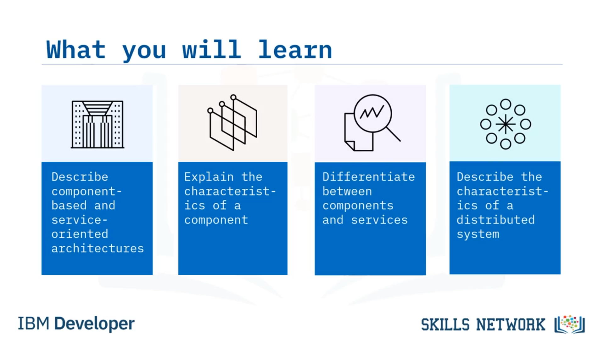
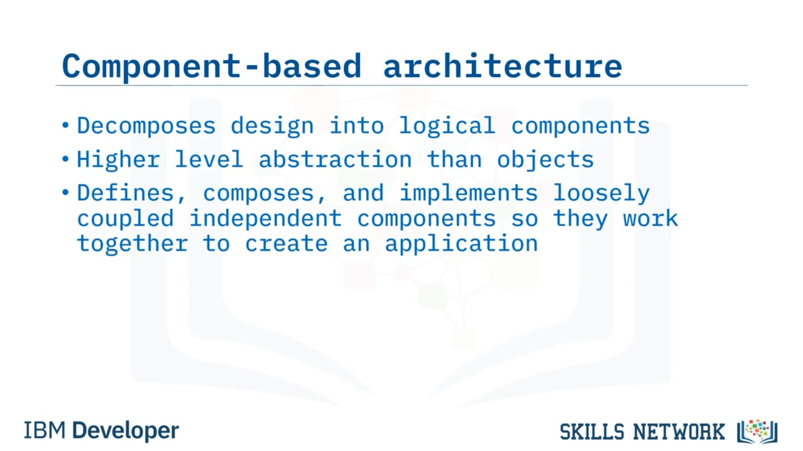

## 🧱 Uygulama Mimarisi Yaklaşımları

## 🎯 Video Hedefleri ve Bileşen Kavramı

Uygulama Mimarisi Yaklaşımları’na hoş geldiniz. Bu videoyu izledikten sonra şunları yapabileceksiniz: Bileşen tabanlı mimarileri ve servis odaklı mimariyi tanımlamak. Bir bileşenin özelliklerini açıklamak. Bileşenler ile servisler arasındaki farkı ayırt etmek. Ve dağıtık sistemlerin özelliklerini tanımlamak. Bir bileşen, diğer bileşenlerle birlikte bir uygulamanın parçası olarak görev yapan, kapsüllenmiş işlevselliğin bireysel bir birimidir. Bileşenlerin altı özelliği vardır. Bileşenler yeniden kullanılabilir, değiştirilebilir, bağımsız, genişletilebilir, kapsüllenmiş ve bağlamdan bağımsız olmalıdır. Bu ilkelerin her birini kısaca ele alalım.

## 🧩 Bileşen Örnekleri ve Denetleyiciler

Şimdi bazı bileşen örneklerine bakalım. Bir API, birden fazla sistem ve uygulamada yeniden kullanılabiliyorsa bir bileşen olarak paketlenebilir. Örneğin, bir bileşen, bir sistemi belirli bir veritabanına bağlayan açık kaynaklı bir API olabilir. Bir bileşen ayrıca, veri erişim nesnesi (data access object) olarak adlandırılan ve uygulamanın bu değişikliği bilmesine gerek kalmadan kullanıcıyı farklı bir veritabanına geçirebilen bir veritabanı arayüzü de olabilir. Ve denetleyici (controller), belirli bir olay için hangi diğer bileşenlerin çağrılması gerektiğini belirleyen bir bileşen türüdür. İki başka bileşen arasındaki veri akışını kontrol eder. Bileşen tabanlı mimari de tasarımın bu mantıksal bileşenlere ayrıştırılmasına odaklanır.

## 🏗️ Bileşen Tabanlı Mimari ve Servis Tanımı

Bileşen tabanlı mimari, nesne yönelimli tasarımlardan daha yüksek bir soyutlama düzeyi sağlar. Bileşen tabanlı bir mimari, gevşek bağlı bağımsız bileşenleri tanımlamalı, birleştirmeli ve uygulamalıdır ki bu bileşenler birlikte çalışarak bir uygulama oluştursun. Bir servis, aynı zamanda bir işlevsellik birimi olan bir bileşene benzer, ancak bağımsız olarak dağıtılacak ve birden çok sistem tarafından yeniden kullanılacak şekilde tasarlanır. Bir servis, bir iş ihtiyacına yönelik çözüme odaklanır. Bir bileşen ile bir servis arasındaki temel fark, bir servisin, birden çok istemcinin iletişim kurduğu, tek, benzersiz ve sürekli çalışan bir örneğe sahip olmasıdır. Bu diyagram, katmanlı bir mimaride nesneler, bileşenler ve servisler arasındaki ilişkiyi gösterir. Servisler bileşenlerden oluşur ve bileşenler nesnelerden oluşur.

## ⚙️ Servisler ve Servis Odaklı Mimari (SOA)

Bir servis, bir bileşen türüdür. Sistemin tamamından bağımsız olarak dağıtılmak üzere tasarlanmıştır. Servislere örnek olarak bir müşterinin kredi durumunun kontrol edilmesi, aylık kredi taksidinin hesaplanması veya bir konut kredisi başvurusunun işlenmesi verilebilir. Servis odaklı bir mimaride (Service-Oriented Architecture – SOA) servisler gevşek bağlıdır ve ağ üzerinden bir iletişim protokolü aracılığıyla birbirleriyle etkileşime girer. SOA, iletişim protokolü aracılığıyla diğer uygulamalara servisler sunan dağıtık sistemlerin kurulmasını destekler. Şimdi dağıtık sistemleri tartışalım. Dağıtık bir sistem, farklı makinelerde bulunan birden çok servisin, HTTP (Hypertext Transfer Protocol) olarak da bilinen köprü metni aktarım protokolü gibi bir iletişim protokolü aracılığıyla birbirlerine mesaj ileterek etkileşimleri koordine ettiği bir sistemdir. Dağıtık bir sistemdeki servisler birden çok makinede çalışsa da dağıtık sistem, son kullanıcıya tek ve tutarlı bir sistem olarak görünür.

## 🌐 Dağıtık Sistemlerin Temel Özellikleri

Dağıtık bir sistem, donanım, yazılım ve veri gibi kaynakları paylaşır. Hata toleranslıdır; yani bir düğüm veya bir servis arızalansa bile sistem çalışmaya devam eder, bu da sistemin, hizmet kesintisi olmadan çalışma sırasında değişebileceği anlamına gelir. Dağıtık bir sistemde birden çok etkinlik eşzamanlı olarak yürütülür, bu da gecikmeyi azaltır ve iş hacmini (throughput) artırır. Dağıtık sistemlerin bir diğer özelliği, kullanıcı sayısı arttıkça ölçeklenebilir olmalarıdır. Dağıtık sistemi çalıştıran bilgisayarların aynı tür donanımı veya işletim sistemlerini kullanması gerekmez. Dağıtık bir sistem, farklı türde bilgisayarlar ve programlama dillerinden oluşabilir. Şimdi, düğümün (node) ağ üzerindeki diğer düğümlere veri tanıyabilen, işleyebilen ve iletebilen herhangi bir aygıt olduğunu belirtelim.

## 📚 Özet: Düğümler, Mimariler ve Öğrenilenler

Dağıtık bir sistem, düğümlerin SOA içinde bir veya daha fazla servis çalıştırdığı, birbirine bağlı birden çok düğümden oluşur. Dağıtık sistemler genellikle şu temel mimari türlerinden birini veya birkaçını kullanır: istemci-sunucu (client-server), üç katmanlı (three-tier), eşler arası (peer-to-peer) veya mikro servisler (microservices). Bu uygulama mimarileri ve özellikleri başka bir videoda ele alınacaktır. Bu videoda şunları öğrendiniz: Bileşenler yeniden kullanılabilir, bağımsız, değiştirilebilir, genişletilebilir, kapsüllenmiş ve bağlamdan bağımsızdır. Bileşen tabanlı mimari, sistemin mantıksal, bağımsız bileşenlere ayrıştırılmasıdır. Servisler bileşenlerden oluşur ve bileşenler nesnelerden oluşur. Servisler, bağımsız olarak dağıtılır ve birden çok sistem tarafından yeniden kullanılabilir. Servis odaklı bir mimaride (SOA) servisler gevşek bağlıdır ve ağ üzerinden bir iletişim protokolü aracılığıyla birbirleriyle etkileşime girer. Ve son olarak, dağıtık sistemler farklı makinelerde çalışan birden çok servis üzerinde çalışır ve son kullanıcıya tek bir tutarlı sistem olarak görünür.

