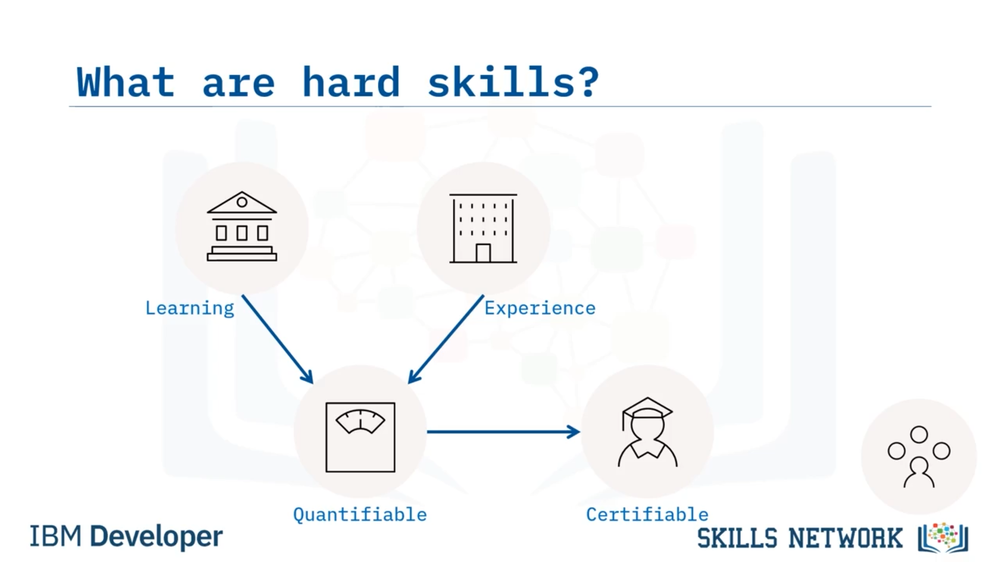
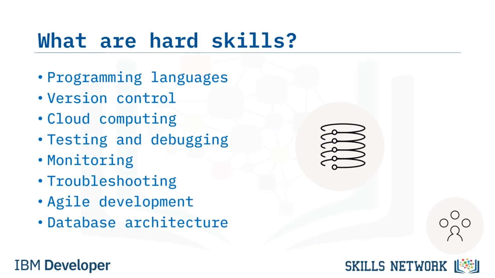
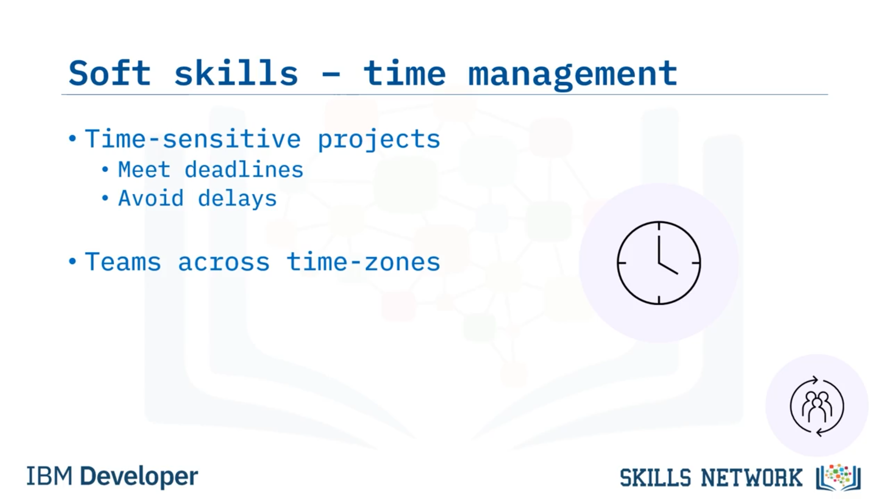
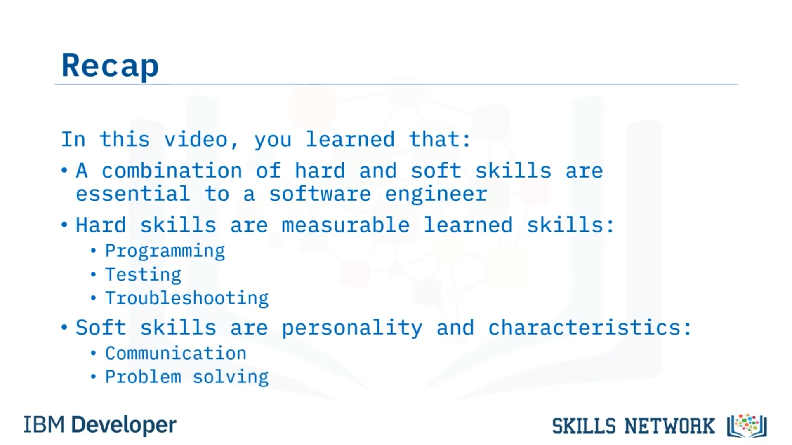

# Yazılım Mühendisliği İçin Gerekli Beceriler

## 🎯 Video Hedefleri ve Hard Skill Tanımı

Yazılım Mühendisliği İçin Gerekli Beceriler'e hoş geldiniz. Bu videoyu izledikten sonra, hard ve soft skill'ler arasındaki farkı ayırt edebilecek, bir yazılım mühendisi için gerekli hard skill'leri ve bir yazılım mühendisi için gerekli soft skill'leri açıklayabileceksiniz. Hard skill'ler, belirli bir rolü yerine getirmek için gereken pratik becerilerdir; dolayısıyla bir yazılım mühendisi için bunlar, yazılım çözümlerini tasarlamak, inşa etmek, bakımını yapmak ve onarmak için ihtiyaç duyduğu teknik beceriler olacaktır. Hard skill'ler öğrenilen becerilerdir. Yazılım mühendisliği söz konusu olduğunda, bunlar genellikle okul, kolej veya üniversite ortamında ya da çevrimiçi kurslar, diplomalar veya sertifikalar üzerinden çalışarak öğrenilir. Alternatif olarak, yıllarca sahada çalışarak da kazanılabilirler. Hard skill'ler ölçülebilirdir; bu yüzden bir kişinin belirli bir beceriyi gösterip gösteremediğini ölçmek ve o beceride onu sertifikalandırmak kolaydır.

## 🧱 Hard ve Soft Skill'lerin Karşılaştırılması

Yazılım mühendisliği alanında yaygın olarak talep edilen hard skill'ler arasında programming languages, version control, cloud computing, testing ve debugging, monitoring, troubleshooting, Agile development ve database architecture bulunur. Şimdi, öte yandan soft skill'ler daha az somuttur. Bunlar, kişisel özellikleriniz ve kişilerarası becerilerinizdir. Kişiliğinizin bir parçası olan, teknik olmayan becerilerdir ve bu nedenle hard skill'lere kıyasla tanımlanmaları, ölçülmeleri veya belgelendirilmeleri daha zordur. Bununla birlikte, belirli bir işe bağlı olmadıkları için roller ve sektörler arasında kolayca transfer edilebilirler. Herhangi bir rol için iş gereksinimleri, hard skill'ler ve soft skill'lerin bir kombinasyonu olacaktır. Öyleyse, bir yazılım mühendisiyle ilgili bazı hard skill'lere bakalım.

## 🧠 Analiz, Tasarım ve Kodlama Becerileri

Yazılım analizi ve tasarım becerileri bir yazılım mühendisi için vazgeçilmezdir. Kullanıcılarınızın ihtiyaçlarını çeşitli yöntemler aracılığıyla analiz edebilmeli ve ardından bu ihtiyaçları karşılayan etkili çözümler tasarlayabilmelisiniz. Ayrıca bu çözümleri geliştirebilmeniz gerekir. Computer programming ve coding temel geliştirme becerileridir. Bazı iş rolleri belirli bir dil ve/veya araç seti gerektirse de, işverenler bazen herhangi bir dilde deneyime sahip olmanızı memnuniyetle karşılar ancak tercih ettikleri dile geçiş yapmanızı beklerler. Coding bootcamp sitesi Coding Dojo, şu anda en çok talep gören dillerden bazılarının Java, Python, C# ve Ruby olduğunu belirtmektedir. Çeşitli framework'leri ve object-oriented prensipleri anlamak da bir yazılım mühendisi için temel becerilerdendir.

<pre class="vditor-reset" placeholder="" contenteditable="true" spellcheck="false">

</pre>

## 🧪 Testing, Debugging ve Deployment

Her zaman kusursuz çözümler üretmeyi umsanız da, zaman zaman kodunuzun hiç çalışmaması ya da amaçladığınız şekilde çalışmaması muhtemeldir. Kodunuzun çözümün fonksiyonel gereksinimlerini karşılayıp karşılamadığını ve kullanışlı olup olmadığını belirlemek için testing becerilerine ihtiyaç duyarsınız. Ve kodunuz beklediğiniz gibi çalışmadığında, bunun nedenini bulmak için debugging becerilerine ihtiyaç duyarsınız. Çözümünüz tamamlandığında ise, onu kullanıcılarınıza dağıtmak için deployment becerilerine ihtiyaç duyarsınız. Bunlar, shell scripting, containers ve continuous integration ve continuous delivery (veya CI/CD) araçlarını içerebilir. Ayrıca çözümlerinizin performansını gözden geçirmek için monitoring becerilerine ve ortaya çıkabilecek sorunları çözmek için troubleshooting becerilerine de ihtiyacınız olacaktır. Şimdi bir yazılım mühendisinin soft skill'lerine bakalım.

## 🤝 Teamwork ve İletişim

Teamwork önemli bir soft skill'dir. Yazılım mühendisleri, bir kısmı üzerinde çalıştıkları projeye, bir kısmı da kendi spesifik rollerine dayanan çeşitli takımlarda çalışırlar. Agile development uyguluyorsanız, squads olarak bilinen küçük takımlarda da çalışabilirsiniz. Ayrıca pair programming ile başka bir geliştiriciyle yakın şekilde birlikte çalışabilirsiniz. Takımlarda çalışmak, hem her bireyin güçlü yanlarından yararlanmanızı sağlar hem de yeni bilgi ve beceriler kazanmanız için fırsatlar sunar. Projede, teknik meslektaşlardan teknik olmayan personele kadar geniş bir yelpazedeki paydaşlarla iletişim kurabilmeniz gerekir. Örneğin, şu kişilere şunları sormanız gerekebilir: destek ve fikir için ekip arkadaşlarınıza, rehberlik ve yönlendirme için yöneticinize, ihtiyaçlarının netleştirilmesi için müşterinize ve çözümünüzle en iyi nasıl etkileşime geçeceklerini öğrenmek için kullanıcılarınıza.

## ⏱️ Zaman Yönetimi ve Problem-Solving

Yazılım çözümleri çoğu zaman zamana duyarlı projelerdir ve bu nedenle yöneticiniz, son teslim tarihlerine uymanıza büyük önem verecektir. Kendi zamanınızı yönetmeniz, işinizi bekleyen başkalarına gecikme yaşatmamanız açısından zorunludur. Ve giderek daha fazla sayıda ekibin farklı zaman dilimlerinde çalışmasıyla, daha önce yalnızca küçük bir yerel gecikme gibi görünen bir durum, dünyanın başka bir yerinde bulunan biri için tüm günün kaybedilmesine yol açabilir. Yazılım mühendislerinin başarılı olabilmeleri için güçlü problem-solving becerilerine ihtiyaçları vardır. Şu alanlarda onlara ihtiyaç duyarsınız: uygun bir yazılım çözümünü nasıl oluşturacağınızı bulmak için design aşamasında, gereken görevi yerine getirecek kodu ortaya koymak için development aşamasında, hataları tespit edip gidermek için testing ve debugging aşamasında ve yazılımın yaşam döngüsü boyunca ortaya çıkabilecek sorunları yönetmek için. Ve bu sorunlar ortaya çıktığında, projenin değişen ihtiyaçlarını karşılamak için uyum sağlayabilir olmanız gerekir. Değişiklik örnekleri şunları içerebilir: müşterinizin işlevsellikte bir değişiklik veya ekleme talep etmesi, yöneticinizin yaklaşan bir son teslim tarihini karşılamak için sizin farklı bir alana geçmenizi istemesi ya da kullanıcınızın belirli bir görevi gerçekleştirmek için alternatif bir yöntem talep etmesi.

## 🔁 Geri Bildirim ve Özet

Ve son olarak, yaptığınız iş hakkındaki geri bildirime açık olmanız gerekir. Çoğu yazılım ekibi, ekip arkadaşlarının birbirlerinin kodlarını gözden geçirdiği bir tür peer review sistemi kullanır. Bu, kurumsal standartların uygulanmasına yardımcı olur ve kodu iyileştirir. Junior bir rolde, size geri bildirim verecek ve nerelerde gelişebileceğinize dair işaretler sunacak bir mentor'unuz olması da muhtemeldir. Ayrıca paydaşlarınız, çözümünüzün ön sürüm ve nihai sürümleri hakkında geri bildirim sağlayacaktır. Tüm bu geri bildirimi açık ve olumlu bir şekilde kabul etmeniz, çözümünüzün olabilecek en iyi hale gelmesini ve rolünüzde ilerlemenizi sağlar. 

Bu videoda şunu öğrendiniz: bir yazılım mühendisi için hard ve soft skill'lerin bir kombinasyonu gereklidir. Hard skill'ler, programming, testing ve troubleshooting gibi ölçülebilir, öğrenilmiş becerilerdir ve soft skill'ler ise iletişim ve problem-solving gibi kişiliğiniz ve karakter özelliklerinizdir.

