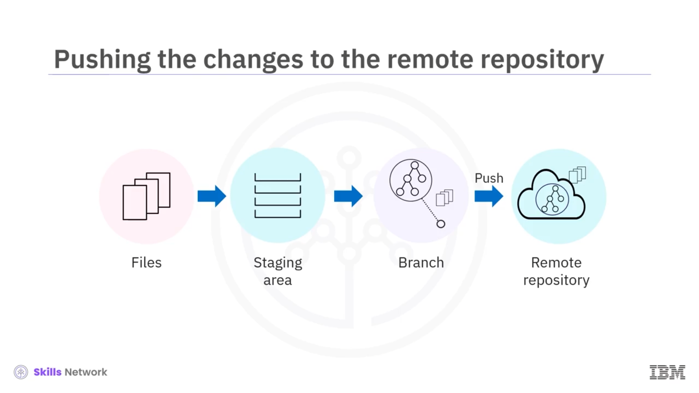
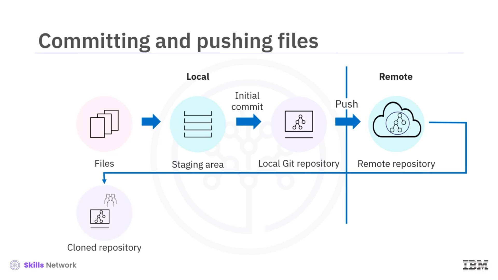
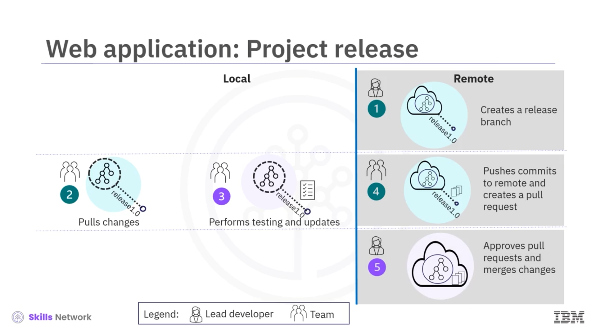
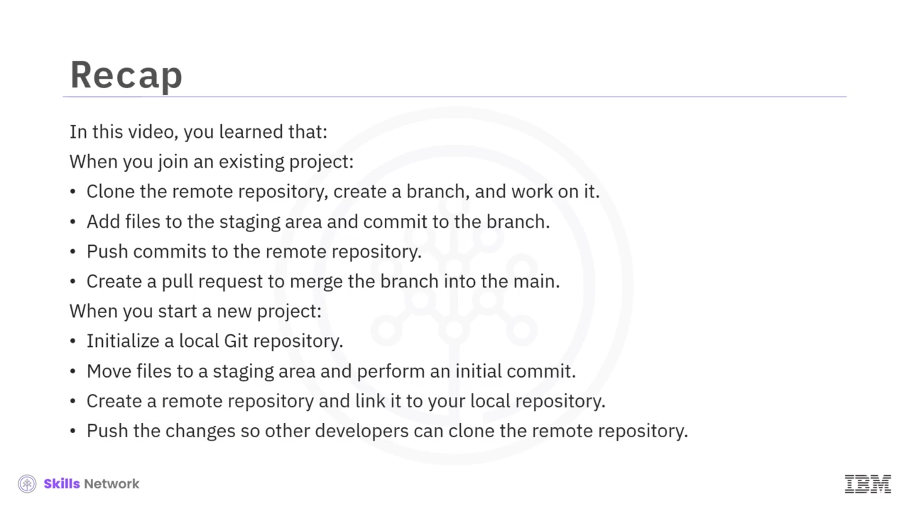

# Git Workflows’a Genel Bakış 🧩

## Git Workflow’un Amacı ve Senaryo 🎯

Git workflows’a genel bakışa hoş geldiniz. Bu videoyu izledikten sonra, bir Git workflow’undaki adımları açıklayabilecek ve workflow’u gerçek hayat senaryosunda açıklayabileceksiniz.

Kendinizi bir e-commerce platformu için feature’lar geliştiren bir ekibe katılmış olarak hayal edin. Sizin göreviniz, bir product recommendation feature’ı eklemek. Ekip, version control ve iş birliği için git ve GitHub kullanıyor. Peki git ve GitHub kullanarak ekiple nasıl etkili bir şekilde iş birliği yapacaksınız?

Git workflows’u net bir şekilde anlamak, git’i version control ve iş birliği için etkili biçimde kullanabilmenizi sağlar. Bu bilgi, code conflicts gibi sorunlardan ve yanlışlıkla bir ekip üyesinin çalışmasını override etmekten kaçınmanıza yardımcı olur.

## Mevcut Bir Projeye Katılırken İlk Adımlar: Clone, Pull, Push 🧑‍💻

İlk adım, ekibinizin GitHub’da host ettiği bir repository’yi clone etmektir. Clone işlemi, projenin kodunun ve remote repository’den local bilgisayarınıza tam version history’sinin bir kopyasını oluşturur.

Clone sırasında kurulan bağlantı, code değişikliklerini remote repository’ye push etmenizi sağlar. Ayrıca remote repository’den local repository’nize herhangi bir değişikliği pull ederek onu update edebilirsiniz.

## Feature Geliştirirken Branch Kullanımı 🌿

Product recommendation feature’ını, local repository’nizdeki project file’larını update ederek implement edebilirsiniz. Bir developer olarak, feature’ı code’lamak için birden fazla yol deneyebilirsiniz.

Kod hazır olana kadar değişikliklerin main branch’i etkilemesini istemeyebilirsiniz. En iyi uygulama, main branch’ten bir branch oluşturmak ve çalışmanızı yeni oluşturduğunuz branch üzerinde yürütmektir.

Git’te bir branch, main branch’e dayanan ve değişiklik yapabildiğiniz izole bir development space’tir. Bu durumda, ana code base’e müdahale etmeden bir feature ekleyebilirsiniz.

## Staging Area ve Commit Süreci 📂✅

Feature’ı geliştirdikten sonra, bir sonraki adım değişen dosyaları seçmek ve bunları staging area’ya taşımaktır. Staging area, git’ten bunları local repository’ye kaydetmesini istemeden önce seçilen dosyaları topladığınız geçici bir storage space’tir.

Artık dosyaları yeni oluşturduğununuz branch’e commit edebilirsiniz. Dosyaları commit etmek, değişiklikleri kaydetmenizi ve yeni feature’ınızın branch’in bir parçası olmasını sağlar.

Dosyaları commit ettiğinizde, bir commit message eklemek, değişikliği sizin ve ekip üyelerinizin anlaması için context sağlar. Örneğin, “implemented product recommendation feature” gibi bir commit message ekleyebilirsiniz.

## Remote’a Push Etme ve Pull Request Oluşturma 🚀

Sonraki adım, branch’teki değişiklikleri remote repository’ye push etmektir. Çoğu zaman, kod, main branch’e merge edilmeden önce repository’yi yönetmekten sorumlu bir maintainer tarafından review edilir.

Branch’i merge etmek için bir pull request oluşturursunuz. Bu, maintainer’dan branch’teki değişiklikleri review etmesini ve approve etmesini isteyen bir request’tir.

Maintainer pull request’i merge ettikten sonra, branch’teki değişiklikler main branch’te yansıtılmış olacaktır. Benzer şekilde, eğer maintainer access’iniz varsa, ekip üyelerinizden pull request’ler alırsınız ve onların request’lerini review edip approve edersiniz.

## Yeni Bir Proje Başlatırken Git Workflow’u 🆕

Bir software development projesindeki tipik workflow’u öğrendiniz. Projeye sıfırdan başladığınız ve başkalarıyla iş birliği yapmayı planladığınız durumlar olabilir.

Local project directory’nizi bir git repository olarak initialize edebilirsiniz; böylece git, project directory’nizdeki değişiklikleri track etmeye başlar. Sonraki adım, git’in track etmesini istediğiniz tüm project file’larını seçmek, bunları staging area’ya taşımak ve ardından initial commit yapmaktır.

Bundan sonra, blank bir repository oluşturacak ve local git repository’nizi remote repository’ye linkleyeceksiniz. Ardından tüm project file’larını local repository’nizden remote repository’ye push edeceksiniz.

Diğer developer’lar remote repository’yi clone edebilir ve project file’larını update etmek için normal workflow’u takip edebilir.

## Ekip Senaryosu: Anne ve John’un Çalışma Şekli 👩‍💻👨‍💻

Workflow’u bir use case ile daha iyi anlayalım. Bir şirket, yeni bir web application development projesi için bir developer, tester ve product manager ekibi görevlendirir.

Lead developer olan Anne, working directory’sinde bir git repository initialize eder. Project file’ları oluşturur, bunları staging area’ya taşır ve initial commit yapar. Ardından, oluşturduğu blank remote repository’ye commit’i push eder.

Tüm developer’lar remote repository’yi clone eder ve branch’ler oluşturarak üzerinde çalışmaya başlar. Developer’lardan biri olan John, bir user authentication feature’ını implement etmekten sorumludur. John, main branch’ten “User Auth” adlı yeni bir branch oluşturur.

John, feature development’ı tamamlar ve User Auth branch’ine commit’ler. Kapsamlı testing’den sonra, branch’i remote repository’ye push eder ve bir pull request oluşturur. Anne, pull request’i review eder ve John’un yaptığı değişikliklerin main branch’e merge edilmesini approve eder; böylece diğer developer’lar John’un yaptığı değişikliklere erişebilir.

Benzer şekilde, diğer developer’lar da çalıştıkları feature’lar için remote repository’ye commit’ler push ederler.

## Release Branch, Testing ve Yayına Hazırlık 🚢

Bu aşamada, feature development tamamlanmıştır ve proje release edilmeye hazırdır. Anne, remote repository’de main branch’ten “Release 1.0” adlı bir release branch oluşturur.

Ekip, local repository’lerinin up to date olması için remote repository’den değişiklikleri pull eder. Release 1.0 branch’inde final testing, bug fixes ve documentation update’leri yaparlar.

Testing’den sonra, değişiklikleri commit eder, commit’leri remote repository’ye push eder ve bir pull request oluştururlar. Anne, değişiklikleri main branch’e merge eder ve release’i “Release 1.0” olarak tag’ler.

## Özet: Git Workflow Adımlarının Tekrarı 🔁

Şimdi öğrendiklerinizi tekrar edelim.

Bu videoda, bir git workflow’undaki adımları öğrendiniz. Mevcut bir projeye katıldığınızda, önce remote repository’yi clone edin. Ardından main repository’den bir branch oluşturun ve branch üzerinde çalışın. Update edilen dosyaları staging area’ya ekleyin ve branch’e commit edin. Commit’leri remote repository’ye push edin.

Branch’i main branch’e merge etmek için bir pull request oluşturun; bu, maintainer tarafından review edilip approve edilecektir.

Yeni bir projeye başladığınızda, local bir git repository initialize edin. Ardından Git’in track etmesini istediğiniz dosyaları select select, staging area’ya taşıyın ve initial commit gerçekleştirin. Blank bir remote repository oluşturun ve local repository’nizle bir link establish edin.

Değişiklikleri push edin ki diğer developer’lar bu remote repository’yi clone edebilsin ve project file’larını update etmek için normal workflow’u takip edebilsinler.

