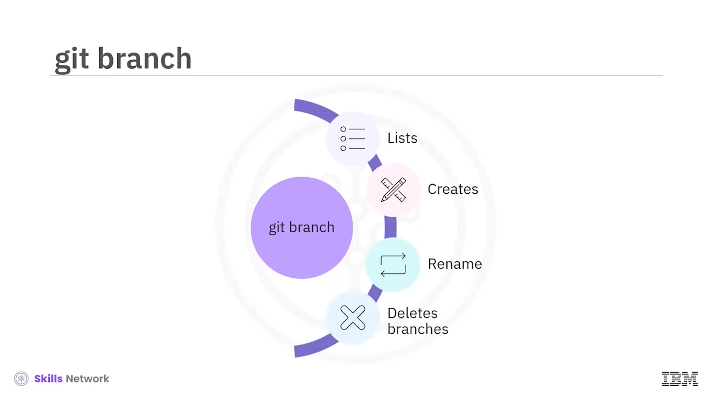
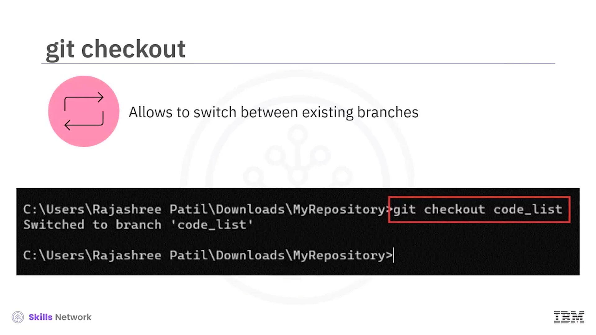
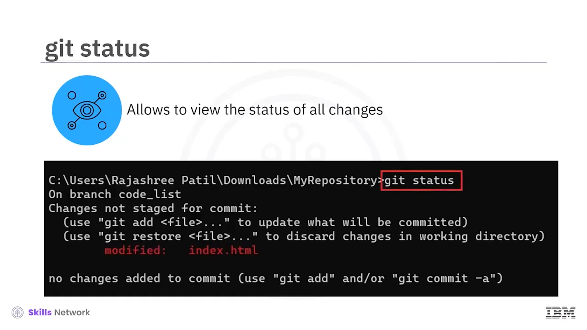

# 🧾 Git Komutlarına Genel Bakış

Git Commands Genel Bakış'a hoş geldiniz. Bu videoda, bazı temel Git Commands ve temel Git Commands'in işlevlerini ve kullanım alanlarını inceleyeceksiniz. Git Commands; değişiklikleri izleme ve kaydetme ve değişikliklerinizi başkalarıyla paylaşma gibi çeşitli amaçlar için kullanılır. Genellikle bu faaliyetlerin çoğu web interface üzerinden gerçekleştirilir. Command Line Interface veya CLI, bu faaliyetleri gerçekleştirmek için başka bir seçenektir. Projenin sorunsuz bir şekilde yürümesine yardımcı olabilecek mkdir, cd gibi bazı genel komut satırı komutlarını anlamak için bir senaryo ele alalım. Ayrıca 

* mkdir
* git init,
* git add,
* git commit,
* git log,
* git branch,
* git checkout,
* git merge ve
* git status gibi bazı temel Git Commands'i de tartışacağız.

---

## 💻 Senaryo ve Temel CLI Komutları

Bir web uygulamasının özelliklerini geliştirmek için yeni bir HTML dosyası eklemek isteyen bir web developer ekibinin parçası olduğunuzu düşünün. Bu senaryoda, ana code'u bozmadan code'larınızla denemeler yapmak istiyorsunuz. Adımları inceleyelim.

mkdir komutunu kullanarak MyRepository adlı yeni bir dizin oluşturarak başlayalım. mkdir komutu, make directory anlamına gelir. Dizin oluşturduktan sonra, CD, MyRepository komutunu kullanarak dizine gidin. Bu komut, belirli bir dizine gitmek için kullanılır.

---

## 📁 Yeni Repository, HTML Dosyası ve İlk Commit

Şimdi git init komutunu kullanarak bu dizinde yeni bir repository oluşturalım. Bu komut, Git'in projenizin version control yönetimine başlaması için gerekli dosyaları ve veri yapısını ayarlar. Gerekli içeriğe sahip yeni bir HTML dosyası oluşturabilirsiniz. Diyelim ki index.html dosyasını oluşturuyorsunuz.

Şimdi bu yeni oluşturulan dosyayı staging area'ya eklemek için git add komutunu kullanın. Bu komut, working directory'deki değişiklikleri staging area'ya taşır. Şimdi, yeni HTML dosyasının eklenmesini bir mesajla commit etmeye karar veriyorsunuz.

Bunun için, git commit-m komutunu kullanırsınız; bu komut, staging'deki değişiklik anlık görüntüsünü alır ve açıklayıcı bir mesajla projeye kaydeder. Bu mesaj, git commit'in amacını açıklar. Bu durumda, created a new HTML file commit mesajınız olabilir. Commit'in kaydedildiğinden emin olmak için commit history'yi gözden geçirmek isterseniz, git log komutunu çalıştırın. Bu, projede yapılan önceki değişiklikleri incelemenizi sağlar. Burada commit history'niz created a new HTML file ifadesini yansıtacaktır.

---

## 🌿 Branch Oluşturma ve İzole Çalışma

Peki, code'unuzla denemeler yapmak isteyip de mevcut akışı bozmak istemezseniz ne olur? git branch komutunu kullanarak nasıl branch oluşturulacağını öğrenelim. İzole bir şekilde çalışmak için, bir Git repository içindeki branch'leri listeleyen, oluşturan, yeniden adlandıran ve hatta silen git branch komutunu kullanabilirsiniz.

Örneğin, Codelist adlı bir branch oluşturmak istediğinizi varsayalım. Bunun için git branch komutunu kullanabilirsiniz. Geliştirmeye başlamak için yeni oluşturulan branch'e geçmek üzere `git checkout` komutunu kullanın. `git checkout` komutu, mevcut branch'ler arasında geçiş yapmanızı sağlar. Artık code_list branch'inde index.html dosyasında değişiklikler yapabilirsiniz.

---

## 🔁 Değişiklikleri Commit Etme, Durumu Görüntüleme ve Branch’leri Birleştirme

İşiniz bittiğinde, dosyanızda yeni yaptığınız değişiklikleri staging area'ya eklemek için `git add` komutunu çalıştırın. Daha önce belirtildiği gibi, şimdi code_list branch'inde yapılan yeni değişiklikleri updated index.html file in branch gibi descript bir mesajla commit edelim.` git commit -m`

Şimdi` git log` komutunu kullanarak code_list branch'indeki `commit log`'u inceleyelim. Çıktınız artık updated index.html file in branch ifadesini gösterecektir. Git working directory'nizde yaptığınız tüm değişikliklerin durumunu görmek için `git status` komutunu çalıştıralım. Bu git komutu, dosyalarınızın repository ile ilişkili durumuna dair bilgi sağlar.

Son olarak, `git merge` her şeyi yeniden bir araya getirmenize ve feature branch'i main branch ile birleştirmenize olanak tanır. Bu örnekte, önce main branch'e gitmek için git checkout komutunu kullanacağız, ardından git merge komutunu branch adıyla birlikte kullanacağız; bu örnekte branch adı code_list'tir.

Şimdi öğrendiklerinizi özetleyelim. Bu videoda, çeşitli aktiviteleri gerçekleştirmek için kullanabileceğiniz CLI komutlarını öğrendiniz. Bu komutlar; 

* yeni bir dizin oluşturmak için `mkdir`,
* belirli bir dizine gitmek için `cd`,
* bir Git repository başlatmak için `git init`,
* working directory'deki değişiklikleri staging area'ya taşımak için` git add`,
* değişiklikleri projeye commit etmek için `git commit`,
* önceki değişiklikleri gözden geçirmek için `git log`,
* yeni bir branch oluşturmak için `git branch`,
* mevcut branch'ler arasında geçiş yapmak için `git checkout`,
* branch'leri main branch ile güncellemek için `git merge` ve
* working directory'nizin durumunu görmek için` git status'`tür.

