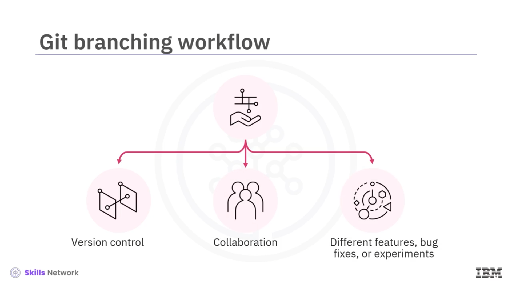
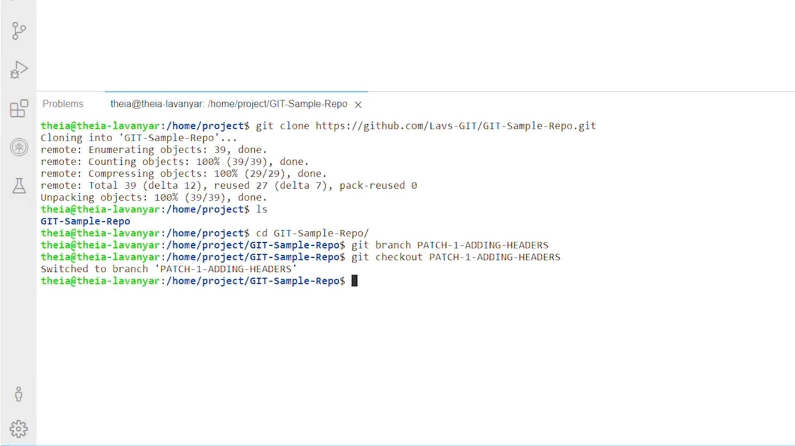

# 🌿 Git Commands Kullanarak Branch'lerle Çalışma Demosu

## 🎬 Videoya Giriş ve Branch Kavramı

Demo: Working with Branches using Git Commands videosuna hoş geldiniz. Bu videoda, çeşitli git commands'in işlevlerini ve git branches'i komutlar kullanarak nasıl yöneteceğinizi inceleyeceksiniz.

Branches, özellikler, denemeler veya fixes üzerinde yapılandırılmış ve organize bir şekilde, bağımsız olarak çalışmanıza olanak tanır. Software development projelerinde çalışırken git branching workflow, version control ve iş birliği için kritik öneme sahiptir.

# 🌿 Git Commands Kullanarak Branch'lerle Çalışma Demosu

## 🎬 Videoya Giriş ve Branch Kavramı

Demo: Working with Branches using Git Commands videosuna hoş geldiniz. Bu videoda, çeşitli git commands'in işlevlerini ve git branches'i komutlar kullanarak nasıl yöneteceğinizi inceleyeceksiniz.

Branches, özellikler, denemeler veya fixes üzerinde yapılandırılmış ve organize bir şekilde, bağımsız olarak çalışmanıza olanak tanır. Software development projelerinde çalışırken git branching workflow, version control ve iş birliği için kritik öneme sahiptir.

Bu workflow, ekiplerin birbirlerinin code'unu bozmadan, farklı features, bug fixes veya denemeler üzerinde izole şekilde çalışmasına imkân tanır. Şimdi, branching workflow sürecini kolaylaştırmak için git commands'i nasıl verimli şekilde kullanacağımıza odaklanalım.

Bunu yapmak için önce repository'yi clone edelim, böylece local machine'inizde bu repository'nin bir kopyası olur.

---

## 🌀 Repository'yi Clone Etme ve Yeni Branch Oluşturma

GitHub repository'ye gidin, ardından Code'a tıklayın ve HTTPS bölümünün altındaki URL'yi kopyalayın; terminal penceresinde target directory'ye geçin.

Repository'nin bir kopyasını oluşturmak istediğinizde, git clone komutunu repository URL'si ile çalıştırın. Kopyaya sahip olduktan sonra, branches oluşturabilir, changes yapabilir ve bu changes'i sync edebilirsiniz.

Clone edilen directory'ye geçtiniz. Şimdi git branch komutuna odaklanalım. Main code'u etkilemeden üzerinde çalışabilmek için yeni bir branch oluşturmak amacıyla, git branch komutunu istediğiniz branch adıyla birlikte çalıştırın.

Örneğin, PATCH-1-ADDING-HEADERS adlı bir branch oluşturmak için git branch PATCH-1-ADDING-HEADERS komutunu çalıştırırsınız. Oluşturulan yeni branch, şu anda bulunduğunuz branch'in bir kopyası olacaktır.

---

## ✏️ PATCH-1-ADDING-HEADERS Branch'inde Değişiklik Yapma

Otomatik olarak yeni oluşturulan branch'e geçirilmediğinizi unutmayın. PATCH-1-ADDING-HEADERS branch'ine geçmek için git checkout PATCH-1-ADDING-HEADERS komutunu kullanın.

Artık PATCH-1-ADDING-HEADERS branch'indesiniz, changes'inizi yapabilirsiniz. PATCH-1-ADDING-HEADERS branch'indeyken, diyelim ki index.html dosyanıza welcome to KIV gibi bir header ekliyorsunuz.

Sonraki adımda, working directory'nizin durumunu kontrol etmek için `git status` komutunu çalıştırın. Bu, index.html dosyanızda yapılan modifications'ı vurgulayacaktır.

PATCH-1-ADDING-HEADERS branch'inizdeki changes'i stage etmek için git add index.html komutunu çalıştırın.

---

## 🧩 Değişiklikleri Commit Etme ve Branch’leri Birleştirme

Bu komut, changes'in artık commit edilmeye hazır olduğunu belirtir. Son olarak, changes'inizi kaydetmek için Added header mesajıyla `git commit -m `komutunu çalıştırabilirsiniz.

git commit komutundaki -m, changes'inize bir message ekler. Artık index.html dosyasındaki changes, PATCH-1-ADDING-HEADERS branch'inizin history'sinin bir parçasıdır.

Şimdi PATCH-1-ADDING-HEADERS branch'ini main branch ile merge etmeye odaklanalım. Bunu yapmak için önce git checkout main komutunu çalıştırarak main branch'e geri dönün. Böylece artık PATCH-1-ADDING-HEADERS branch'inde değilsiniz.

Şimdi ***git merge*** PATCH-1-ADDING-HEADERS komutunu çalıştırın. Bu komut, PATCH-1-ADDING-HEADERS branch'indeki changes'i main branch'e entegre edecektir.

PATCH-1-ADDING-HEADERS branch'inden gelen header değişikliği artık main branch'te bulunan index.html dosyasına eklenmiştir. Bu changes'i remote repository'nizde erişilebilir kılmak için ***git push -u origin main* **komutunu kullanın.

Bu komut, PATCH-1-ADDING-HEADERS branch'inden merge edilen changes'i de içeren main branch'i remote repository'nize push edecektir. Son olarak, changes'in yapıldığından ve branch'in up to date olduğundan emin olmak için git status komutunu çalıştırın. Hepsi bu kadar.

---

## ✅ Özet: Branch Workflow’unu Git Commands ile Kullanma

Bu videonun sonuna geldiniz. Bu videoda, git commands kullanarak branches ile nasıl etkili şekilde çalışacağınızı öğrendiniz.

Önce git branch komutuyla branches'i listeleyerek başladınız, ardından git branch PATCH-1-ADDING-HEADERS komutunu kullanarak PATCH-1-ADDING-HEADERS branch'ini oluşturdunuz.

Sonra git checkout PATCH-1-ADDING-HEADERS komutunu kullanarak yeni branch'e geçtiniz; git status, git add index.html, git commit -m komutlarını kullanarak changes yaptınız ve stage ettiniz.

Ve son olarak, git checkout main ve git merge PATCH-1-ADDING-HEADERS komutlarını kullanarak PATCH-1-ADDING-HEADERS'ı main branch ile merge ettiniz. Bu alıştırmayı, git push -u origin main komutunu kullanarak main branch'i remote repository'nize push ederek tamamladınız.

Bu workflow, ekiplerin birbirlerinin code'unu bozmadan, farklı features, bug fixes veya denemeler üzerinde izole şekilde çalışmasına imkân tanır. Şimdi, branching workflow sürecini kolaylaştırmak için git commands'i nasıl verimli şekilde kullanacağımıza odaklanalım.

Bunu yapmak için önce repository'yi clone edelim, böylece local machine'inizde bu repository'nin bir kopyası olur.

---
