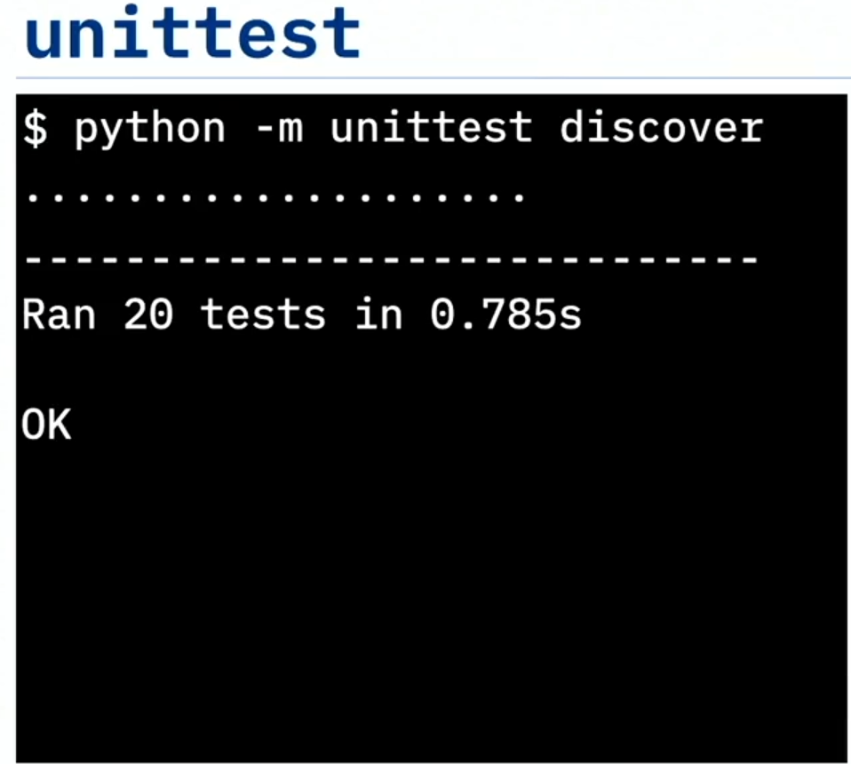

# 🧪 Running Tests with Nose

Bu videoyu izledikten sonra şunları yapabileceksiniz:

* `unittest` kullanarak birim testleri çalıştırmak
* Nose modülünü kullanarak birim testleri çalıştırmak
* `unittest` ve Nose’un sağladığı birim test raporlarını karşılaştırmak

Python birim testlerini çalıştırmak için iki yöntemden bahsedelim: Python’ın varsayılan test çalıştırıcısı olan `unittest` ve kodunuzdaki hataları “koklayıp bulan” Nose adlı bir araç.



---

## 🧰 `unittest` ile Test Çalıştırma

Önce `unittest` kullanacağız; daha genel adıyla PyUnit. Komut satırından başlayacağız.

Python’ı `unittest` modülüyle çalıştırırız ve `unittest`’ten testleri keşfetmesini isteriz. Dosyayı işaret ederek tek bir testi de çalıştırabiliriz, ancak `tests` klasörümüzde bulunan tüm testleri çalıştırmasını istediğimiz için keşif (discover) modunu kullanacağız.

Testler çalışırken, her başarılı test senaryosu için ekranda noktalar görürüz. Eğer herhangi biri başarısız olursa, o konumda nokta yerine “F” harfini görürüz.

Ardından yalnızca kaç test çalıştırdığımızı ve ne kadar sürdüğünü söyleyen bir rapor alırız: 0.785 saniyede 20 test çalıştırdık. 20 test senaryosunu manuel olarak yürütmek zorunda olsaydınız muhtemelen bir saniyeden çok daha uzun sürerdi. İşte bu yüzden otomatik test vakaları yazmanız gerektiğini söylüyorum: uzun vadede inanılmaz zaman kazandırır.

Benim için bu rapor çok ilham verici değil ve çok bilgilendirici de değil. Nose çok daha ayrıntılı ve faydalı bir rapor sağlar; bu yüzden varsayılan `unittest` çalıştırıcısı yerine onu kullanmayı seviyorum.

---

## 🐽 Nose ile Test Çalıştırma ve Pinocchio ile Renklendirme

Pinocchio adlı, test çıktısına renk ekleyen bir eklentiyle Nose’u çalıştırmaya bakalım. Nose’u çalıştırma komutu `nosetests`’tir.

Nose’u çalıştırmak için komut:

```bash
nosetests
```

Pinocchio’nun renk eklemesini söylemek için bazı ek parametreler de geçiriyorum. Bunun yerine bu parametreleri bir yapılandırma dosyasına ekleyebilirsiniz; böylece her çalıştırdığınızda tekrar tekrar yazmanız gerekmez.

Testi çalıştırdığımızda, başarısız testleri kırmızı, geçenleri yeşil gösteren hoş, renklendirilmiş bir çıktı elde ederiz. Ayrıca her bir testin güzel metinsel açıklamalarını da görürüz. Bunlar test vakalarındaki docstring’lerden gelir.

Hem varsayılan `unittest` çalıştırıcısı hem de `nosetest` bu daha ayrıntılı çıktıyı üretebilir; ancak yalnızca `nosetests` bunları renklendirerek kırmızı-yeşil çıktıyı sağlayabilir.


---

## 📈 Kod Kapsamı ve Eksik Test Satırları Raporu

Ayrıca Nose’u, testler tamamlandıktan sonra coverage çalıştıracak şekilde yapılandırdık; böylece güzel bir kapsam (coverage) raporu elde ediyoruz.

Projemdeki her bir Python modülü için, test vakalarım tarafından kodun yüzde kaçının çalıştırıldığını görebiliriz. Yeni kod yazarken iyi kod kapsamını korumak çok önemlidir.

Son olarak, eksik test vakalarına sahip tüm kod satırlarının bir raporunu alırız. Bu bilgiyle, o satır numaralarındaki kodu inceleyebilir ve hangi testleri yazabileceğimizi çıkarabiliriz. O kod yolunu kullanacak ve o satırların çalışmasını sağlayacak bir test vakası hakkında ne düşünebiliriz?

Hangi kod satırlarının test vakalarından yoksun olduğunu bilmek inanılmaz derecede faydalıdır. Kod kapsamınızı artırmak için test çabalarınızı nereye odaklamanız gerektiğini anlamanıza yardımcı olur.

Çünkü dediğim gibi: “Eğer test edilmediyse, çalışacağına güvenilmemelidir.”

---

## ✅ Özet

Bu videoda şunları öğrendiniz:

* `unittest` basit bir birim test raporu sağlar
* Nose daha ayrıntılı bir rapor sağlar
* Nose test sonuçlarını renklendirebilir
* Nose kod kapsamını raporlayabilir ve eksik test vakalarını listeleyebilir
