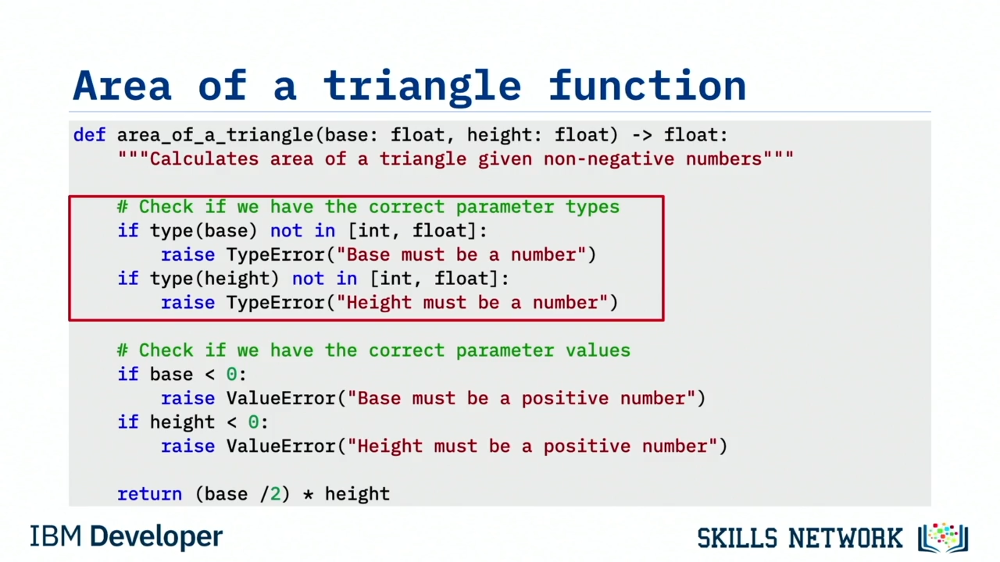

# 🧪 Test İfadeleri Yazma

Bu videoyu izledikten sonra şunları yapabileceksiniz:  **İfadelerin (assertions) amacını açıklamak** , **yaygın PyUnit ifadelerini tanımlamak** ve  **testlerde mutlu yol (happy path) ile üzgün yolun (sad path) rolünü özetlemek** .

Bir  **test ifadesi (assertion)** , sonucu **True** ya da **False** olan bir ifadedir. Testlerimizin **geçip geçmediğini** kontrol etmek için ifadeleri kullanırız:  **True = geçti** ,  **False = kaldı** . İfadelerin güzel yanı, **False** değerlendirilirse bir **exception** fırlatmaları ve testin **başarısız** olarak işaretlenmesidir.

## 🧩 Python’da Assertion Kullanımı

İfadeler Python’da yerleşik olarak vardır ve `assert()` fonksiyon çağrısı ile oluşturabilirsiniz. Şu örneği düşünün: Burada iki sayının toplamını hesaplayacak `sum()` adlı bir fonksiyon var ve argüman olarak 2 ve 3 veriyoruz. Sonraki ifade bir assertion’dır.

Ve bu durumda `sum()` fonksiyonunun 5 döndüreceğini assert ederiz.

Tüm testlerinizde `assert()` fonksiyonunu kullanabilirsiniz ve gayet iyi çalışır. Ancak Python’da assertion yapmak için daha güzel bir yol vardır: `TestCase` sınıfının sağladığı ek assert’leri kullanmak. Test case sınıfımız `unittest.TestCase`’den miras alındığı için, kodunuzu daha temiz hale getirecek birçok assertion’a erişimimiz olur. Bu assertion’lar `assert()` fonksiyonunun üzerinde yalnızca birer  **“syntactic sugar”** ’dır, ama bence daha hoş ve biraz daha okunması kolaydır.

## 🧷 PyUnit’te Yaygın Assertion’lar

PyUnit’te sık karşılaşacağınız daha yaygın assertion’lara bakalım.

* `assert()`
  Tüm diğer assertion’ların temelidir.
* `assertEqual(a, b)`
  Adından anlaşılacağı gibi “a”nın “b”ye eşit olduğunu doğrular. `assert(a == b)` kullanmaktan daha temiz bir sözdizimidir. Daha iyi okunur ve okunması kolay kod, anlaması da kolay koddur.
* `assertNotEqual(a, b)`
  “a”nın “b”ye eşit olmadığını doğrular. Yine `a != b` gibi bir formüle göre daha hoş görünür.
* `assertIn(a, b)` ve `assertNotIn(a, b)`
  “a”nın “b” adlı koleksiyonun içinde olup olmadığını kontrol eder. Bir şeyin bir sonuç kümesinde olup olmadığını anlamak için çok kullanışlıdır.
* `assertTrue()` ve `assertFalse()`
  Bir değerin True ya da False olduğunu belirler.
* `assertIsInstance(a, TYPE)`
  Bir tür (type) vererek “a” olarak gönderdiğimiz şeyin beklediğimiz Python türü olduğundan emin oluruz. Bir fonksiyon çağrısından dönen değişkenin ya da nesnenin doğru türde olup olmadığını kontrol etmek için kullanışlıdır.
* `assertRaises()`
  Bunu özellikle hata yakalayıcıları (error handlers) test ederken çok kullanırım. Kullanmak için bir exception sınıf adı, çağrılacak fonksiyonun adı ve o fonksiyonun ihtiyaç duyabileceği parametreleri verirsiniz. Bir error handler’ı test etmek için bilerek hata koşulları oluşturmanız gerekir. Hataların neden olduğu exception’ların testlerinizi durdurmasını istemezsiniz ama hata yakalayıcıların çalıştığını bilmek için bunların oluşmasına neden olmanız gerekir. `assertRaises()` exception, fonksiyonun çalıştırılmasında yakalanırsa **True** döndürür. Exception’ı sizin yerinize yakalar ve testlerinizi tek satırla çok daha temiz hale getirir.

Bunlar günlük testlerde kullanacağımız daha yaygın test assertion’larından bazılarıdır. Dokümantasyonda bakabileceğiniz daha fazlası da vardır.

## 📐 `area_of_a_triangle()` Fonksiyonu Hatırlatma

Önceki derste ele aldığımız `area_of_a_triangle()` fonksiyonuna bakalım. Hatırlatma olarak, nihai kod burada. İki parametre base ve height’tır ve ikisi de floating point sayılardır.

Önce base ve height’ın **integer** ya da **float** olarak geçilip geçilmediğini kontrol eder. Değilse, veri türü yanlış olduğu için fonksiyon **TypeError** fırlatır.

Sonra base ve height’ın negatif sayı olmadığını kontrol eder çünkü üçgenlerin negatif tabanı ya da yüksekliği olamaz. Eğer ikisinden biri negatifse, tür doğru olsa bile negatif değerler kabul edilemeyeceği için fonksiyon **ValueError** fırlatır.

Son olarak fonksiyon, “tabanın yarısı çarpı yükseklik” formülünü kullanarak üçgenin alanını hesaplar.

## ✅ Davranışı Test Etmek İçin Test Case’ler

Şimdi `area_of_a_triangle()` fonksiyonunun davranışını test eden test case’lere bakalım.

Önce `unittest` paketinden `TestCase` import ederiz. Sonra test edeceğimiz fonksiyonu import ederiz: `area_of_a_triangle`. Sonra test sınıfımızı oluştururuz; buna `TestAreaofTriangle` deriz ve `TestCase`’den türetiriz.

Şimdi bazı test case’ler yazmamız gerekiyor.

🙂 Mutlu Yol Testleri

İlk yazdığımız test case “mutlu yolları (happy paths)” test eder. Bunlar her şeyin planlandığı gibi gitmesi gereken senaryolardır.

Burada daha önce karşılaşmadığımız yeni bir assertion kullanırız: `assertAlmostEqual()`. Bu assertion floating point sayıların sonuçlarını kontrol ederken kullanışlıdır. Float’ların ondalık basamak sayısı çok olabilir ve ondalık basamak sayısı arttıkça yuvarlamadan dolayı doğruluk azalır. Bu yüzden `assertAlmostEqual` doğruluk için yalnızca yedi ondalık basamağı kontrol eder. Bu genellikle iki floating point sayının eşit olup olmadığını belirlemek için yeterlidir.

* Tabanı 3.4556 ve yüksekliği 8.3567 olan üçgenin alanının 14.43870626’ya neredeyse eşit olduğunu kontrol ederiz. (Bu arada bunu hesaplamak için bir hesap makinesi kullandım.)
* Tabanı 2 ve yüksekliği 5 olan üçgenin alanının 5.0’a eşit olduğunu kontrol ederiz.
* Tabanı 0 ve yüksekliği 5 olan üçgenin alanının 0.0’a eşit olduğunu kontrol ederiz.

Bunların hepsi kontrol etmek istediğimiz mutlu yollardır.

### 🙁 Üzgün Yol Testleri

Sonra ilk “üzgün yolu (sad path)” kontrol ederiz. Üzgün yollar, bir şeylerin ters gitmesini beklediğimiz senaryolardır.

Bu üzgün yol için `assertRaises()` kullanırız ve `area_of_a_triangle` fonksiyonunu taban -2 ve yükseklik 5 ile çağırırsak fonksiyonun **ValueError** fırlatacağını assert ederiz.

Eğer fırlatırsa test case geçer; fırlatmazsa test case kalır. Kodumuzdan negatif sayıları kontrol edip ValueError exception’ları fırlattığını biliyoruz, dolayısıyla umarım bu test case geçer.

Ters durumu da kontrol etmek isteyebiliriz: taban pozitif ama yükseklik negatifse ne olur? O zaman taban 2 ve yükseklik -5 veririz. Böylece taban ya da yükseklikten herhangi biri negatifse ValueError fırlatıldığını görürüz.

Son test seti de bir üzgün yoldur ve yine `assertRaises()` kullanırız. Eğer `area_of_a_triangle` fonksiyonunu bir Boolean olan ve sayı olmayan `True` değeriyle çağırırsak, fonksiyonun yalnızca geçerli sayıları kabul etmesi gerektiği için **TypeError** fırlatacağını assert ederiz.

Tamlık için, bir sonraki satırda değerleri ters sırada test ederiz. Başka bir `assertRaises()` kullanırız ve `area_of_a_triangle` fonksiyonunu tabanı string, yüksekliği 5 olan bir çağrıyla çalıştırırsak fonksiyonun **TypeError** fırlattığını assert ederiz.

Yine tamlık için bu değerleri ters sırada da test ederiz; böylece taban ya da yükseklikten herhangi biri geçerli sayı değilse hatanın yakalanacağından emin oluruz.

Bu son iki test case’te her test, exception fırlatılırsa geçer. Bu yaklaşım, hem iyi koşulları (mutlu yol) hem de kötü koşulları (üzgün yol) test etmemizi sağlar; böylece tüm kod satırlarının test edildiğinden emin oluruz.

## 📌 Bu Videoda Öğrendikleriniz

* Assertion’lar testlerin geçip geçmediğini belirlemek için kullanılan kontrollerdir.
* Python’da assertion oluşturmak için geliştiriciler `assert()` fonksiyonunu veya ek PyUnit assert’lerinden herhangi birini kullanabilir.
* Mutlu yollar, bir fonksiyonun beklenildiğinde olumlu sonuçlar döndürdüğünü doğrular.
* Üzgün yollar, bir fonksiyonun exception’lara uygun şekilde yanıt verdiğini ve bozulmadan çalıştığını doğrular.
