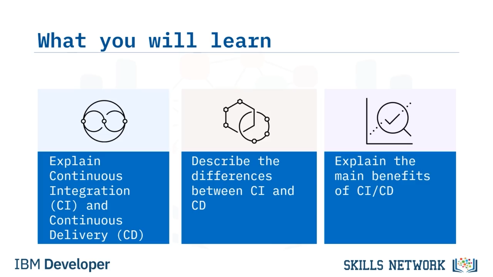

# 🔄 What Is CI/CD?

“CI/CD Nedir?” bölümüne hoş geldiniz. Bu videoyu izledikten sonra şunları yapabileceksiniz: *Sürekli Entegrasyon (Continuous Integration)* ve *Sürekli Teslimat (Continuous Delivery)* kavramlarının ne olduğunu açıklamak, *Sürekli Entegrasyon* ile *Sürekli Teslimat* arasındaki temel farkları tanımlamak ve CI/CD’nin başlıca faydalarını açıklamak.

*Sürekli Entegrasyon* ile *Sürekli Teslimat* arasındaki farkı anlamak önemlidir; çünkü çoğu zaman insanlar “CI/CD” derken sanki tek bir süreçmiş gibi konuşur, ancak öyle değildir. Bu, birbirinin hemen ardından gerçekleşen iki ayrı ve farklı süreçtir.

 *Sürekli Entegrasyon* , kodunuzu ana ya da *master* ya da *trunk* dalına sürekli olarak entegre etmektir; yani ana dala geri birleştirmeden önce çok fazla ayrışmaması gerekir ki ana dala değişiklikleri birleştirdiğinizde çalıştığından emin olabilesiniz. Kodunuzu ana kod tabanıyla sürekli olarak entegre edersiniz. *Sürekli Teslimat* ise bu entegre edilmiş kodu alıp bir yere dağıtma (deploy) sürecidir.

---

## 🔁 Sürekli Entegrasyon ve Sürekli Teslimatın Akışı

Her entegrasyon yaptığınızda dağıtım yapabilirsiniz ya da her entegrasyonda dağıtım yapmayabilirsiniz. Bir döngüde dalları ve  *pull request* ’leri test eden bir *Sürekli Entegrasyon* süreciniz olabilir. Ardından, en sonunda  *main* ’e birleştirdiğinizde *Sürekli Teslimat* kısmını başlatırsınız.

 *Sürekli Entegrasyon* ’u tanımlarken, CI’nin işinizi depoya entegre etmenize olanak sağlayan bir otomasyon süreci olduğunu söyleriz. Uygulamanızın geliştirilmesi için ekip olarak da çalışabilirsiniz ve uygulamanızdaki hataları ve kusurları çok hızlı bir şekilde kolayca tespit edebilirsiniz. Ekibiniz uygulamanın farklı alanlarında küçük parçalar halinde çalışabilir ve ardından kodu ana dala kolayca ve düzenli biçimde birleştirebilir.

 *Sürekli Teslimat* ,  *Sürekli Entegrasyon* ’dan sonraki aşamadır. Uygulamanızın sürümü için kodu hazırlar ve uygulamanızı dağıtmak ve derlemek için gereken süreci otomatikleştirir.

---

## 🧭 CI ve CD’nin Aşamaları

*Sürekli Entegrasyon* ve *Sürekli Teslimat* birkaç ayrı aşamaya bölünür.

*Sürekli Entegrasyon* şu aşamalardan oluşur:

* Plan
* Code
* Build
* Test

Bu, geliştiricilerin çözümü planladığı, sonra kodladığı ve ardından tamamlanana kadar birkaç tekrarlayan döngü içinde derleyip test ettiği bölümdür. Ardından çözüm teslim edilmeye hazır hâle gelir.

*Sürekli Teslimat* ise şu aşamalardan oluşur:

* Release
* Deploy
* Operate

Burada çözüm yayımlanır,  *binary* ’ler belirli bir ortama tekrarlayan döngüler halinde dağıtılır ve çözüm o noktadan itibaren canlı olarak çalışır.

CI/CD’yi tartışırken bunları birbirinden ayırmak önemlidir; çünkü çok farklı aşamaları kapsayan iki oldukça farklı süreçtir.

---

## 🚀 Sürekli Dağıtım Kavramı

Bir de *Sürekli Dağıtım (Continuous Deployment)* diye üçüncü bir kavram vardır; mevcut CI/CD terminolojisi nedeniyle daha az kafa karıştırıcı olması için belki “ *Continuous Release* ” gibi bir adla anılmalıydı. Fark çok ince olduğu için birisi “ *Continuous Delivery* ” dediğinde genellikle ne demek istediğini anlarsınız. Ancak biri “ *Continuous Deployment* ” dediğinde, “gerçekten üretime dağıtmayı mı kastediyorsun?” diye sormanız gerekir. Çünkü bu terimi kullandığınızda çoğu insanın aklına gelen şey üretime dağıtımdır.

Karışıklığı önlemek için şunu hatırlayın:  *Continuous Delivery* , bir geliştirme sunucusu, bir *staging* sunucusu, bir test sunucusu veya bir *pre-production* sunucusu gibi bir yere dağıttığınız zamandır. *Continuous Deployment* ise gerçekten sürekli olarak üretime ( *production* ) ittiğiniz (push) durumlar için kullanılır.

Bu yüzden bu iki terimi, “ *Continuous Delivery* ” ve “ *Continuous Deployment* ” ifadelerini duyacaksınız ve aynı anlama gelmediklerini anlamak önemlidir. *Continuous Delivery* üretim dışındaki bir yere teslim etmektir; *Continuous Deployment* ise üretime teslim etmektir.

---

## 🧩 CI/CD’nin DevOps Pipeline’daki Yeri

CI/CD’nin, *DevOps pipeline* açısından nerede konumlandığını anlamak da önemlidir. DevOps pipeline; Plan, Develop, Build, Test ve Deploy aşamalarından oluşur. Bu nedenle CI/CD’den bahsettiğimizde, DevOps pipeline’ın *Build* ve *Test* aşamalarında yer alırız.

---

## ✅ CI/CD’nin Temel Faydaları

CI/CD’nin birkaç temel faydası vardır.

İlk fayda, kod değişikliklerine daha hızlı tepki süreleridir. Artık bir değişikliğin etkilerini görmek için beklemezsiniz. Kod otomatik olarak derlenir, test edilir ve dağıtılır.

Ayrıca, kod entegrasyonu riskinin azalması faydasını elde edersiniz. Ne kadar sık entegre ederseniz, değişim için o kadar az zaman vardır. Bu yüzden daha sık entegre etmek, bir şeyin bozulma riskini azaltır.

Bir diğer fayda, CI/CD ile daha yüksek kod kalitesidir; çünkü her şey sürekli gözden geçirilir ve sürekli test edilir ve her *pull request* bir kod incelemesi için bir fırsattır.

Ayrıca, sürüm kontrolündeki ( *version control* ) kodun çalıştığını bilirsiniz. *Main* ya da *master* daldaki kodun her zaman dağıtılabilir olması, yaygın bir uygulamadır.

Son olarak, CI/CD daha az dağıtım süresi gerektirir; çünkü her şey zaten test edilmiştir ve dağıtımlar otomatik olduğu için daha hızlı ve daha yüksek tekrarlanabilirlikle gerçekleşir.

---

## 🧾 Bu Videoda Öğrendikleriniz

Bu videoda şunları öğrendiniz:

* CI/CD tek bir süreç değildir; sıralı biçimde gerçekleşen iki ayrı ve farklı süreçtir.
* *Sürekli Entegrasyon* , geliştiricilerin kodlarını ana ya da *master* dala sürekli olarak entegre etmelerini sağlayan bir otomasyon sürecidir.
* *Sürekli Teslimat* , CI’dan sonraki aşamadır; entegre edilmiş kodu  *staging* , test veya *preproduction* gibi bir yere dağıtır.
* *Sürekli Dağıtım* ( *Continuous Deployment* ), kodu üretime ( *production* ) teslim etmektir.
* CI; Plan, Code, Build ve Test aşamalarından oluşur.
* CD; Release, Deploy ve Operate aşamalarından oluşur.
* CI/CD, DevOps pipeline’ın Build ve Test aşamalarında yer alır.
* CI/CD’nin birçok faydası vardır.

