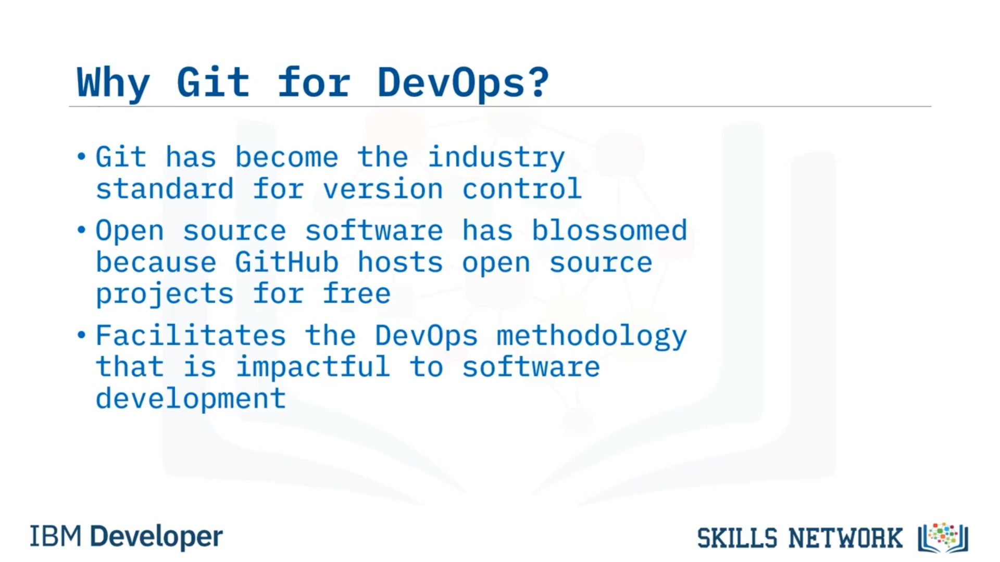
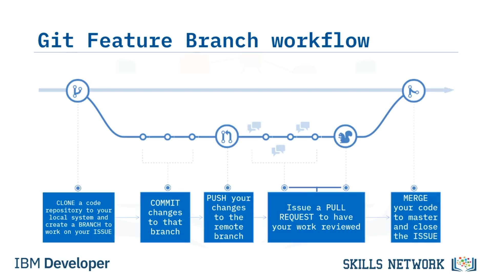

# 🌿 Git Feature Branch Workflow: Branch’lerde Çalışma

Git Feature Branch Workflow – Branch’lerde Çalışma videosuna hoş geldiniz. Bu videoyu izledikten sonra, Git’in ne olduğunu ve DevOps için neden kullanıldığını açıklayabilecek, Git ile çalışma iş akışını ve Git Feature Branch iş akışını analiz edebilecek ve geliştiricilerin yeni bir özellik oluştururken Git branch’leri içinde nasıl çalıştığını anlayabileceksiniz.


Git, dünya çapında geliştiriciler tarafından kullanılan dağıtık bir kaynak kodu yönetim aracıdır. Linus Torvalds tarafından 2005 yılında Linux çekirdeği geliştirmek için icat edilmiştir ve günümüzde en yaygın kullanılan sürüm kontrol sistemidir. Kod tamamen yerel olabilir ya da geliştiricilerin birlikte çalışabilmesi için uzak bir repoda tutulabilir. Her geliştiricinin ayrıca kodun tam bir kopyası da bulunur. Bu, diğer bazı sürüm kontrol sistemlerinden farklıdır; çünkü bu sistemlerde geliştiriciler yalnızca üzerinde çalıştıkları kısmı check out edebilir.

Bu, geliştiricilerin yerelde çalışabileceği ve her seferinde merkezi bir repoyla iletişime geçmeden değişiklikleri takip edebileceği anlamına gelir. Merkezi repoya bir şey olursa, yerelde hâlâ yeniden oluşturmak için kullanabileceğiniz eksiksiz bir kopyanız olur.

Git’i pratikte kullanmanın birçok yolu vardır. En popüler repo barındırma hizmetlerinden bazıları GitHub, GitLab ve BitBucket’tır. Git, sürüm kontrol yazılımlarında güncel standarttır. Geliştiricilerin iş yapma biçimini tamamen değiştirmiştir; kod üzerinde daha fazla kontrol ve gerekirse değişiklikleri tam olarak geri alabilme (rollback) imkânı sağlamıştır.


GitHub, geliştiricilerin iş akışlarında Git’i uygulamak için kullanabileceği en büyük platformlardan biridir; çünkü GitHub açık kaynak projeleri ücretsiz olarak barındırır.

Bu, daha önce bunu uygulamak için iyi bir yolu olmayan Developer Operations (veya DevOps) metodolojilerini mümkün kılmıştır. DevOps, Git’ten fayda sağlar; çünkü her ölçekteki projeyi yönetebilir, doğrusal olmayan iş birliğini mümkün kılar ve kod kalitesini güvence altına almak için sürüm kontrolünü takip eder.



---

## 🧭 Git’in Pratikte Kullanımı ve Temel Komutlar

Git’in pratikte nasıl kullanıldığına bakalım. Burada, örnek bir Git iş akışında en önemli adımlardan ve komutlardan bazılarını göstereceğiz. Takımlar farklı iş akışlarını da uyarlamakta özgürdür.

Bir geliştirici, kod deposunun yerel klonunda değişiklikler yaptıktan sonra bu değişiklikleri bir staging area’ya taşımak için `git add` komutunu çalıştırabilir. Staging area, geliştiricilerin commit etmek istedikleri değişiklikleri net biçimde ayırmalarına olanak tanır; bu değişiklikler, yaptıkları tüm değişiklikler olmayabilir.

Bunu bir alışveriş listesi gibi düşünmeyi seviyorum. Mağazaya bir sonraki gidişimde ne almam gerekiyor? Staging area sizin commit listenizdir. Bir commit yaptığımda hangi dosya değişikliklerini kalıcı hâle getirmek istiyorum? Bu, geliştiricilere push etmeye hazır olarak tam olarak neyi değiştirmek istediklerini iki kez kontrol edebilecekleri bir alan sağlar.

Ardından `git commit` komutunu çalıştırarak bu değişiklikleri yerel reponun sürüm geçmişine commit edebilirler. Bu kimseyi etkilemez.

Sadece yerel repoyu değiştirir. Buradan sonra geliştirici çalışmaya devam edebilir ya da son olarak değişikliklerini herkesin görebileceği ve erişebileceği uzak repoya `git push` ile gönderebilir.

Başka bir geliştiricinin bu değişiklikleri yerelde alması için, uzak reponun en güncel metadata’sını fetch etmek üzere `git fetch` komutunu çalıştırabilir. Bu metadata, tüm sürüm geçmişini ve branch bilgilerini tanımlar; ancak en yeni kod değişikliklerini gerçekten çekmez. Geliştiricilerin, herhangi bir değişikliği gerçekten çekmeden önce değişiklik olup olmadığını kontrol etmelerine izin verir. Bu sayede geliştiriciler olası merge conflict’lerinden kaçınabilir.

Gerçek değişiklikleri almak, yani en yeni sürüm metadata’sını ve değişiklikleri indirip kendi çalışma alanlarına merge etmek için `git pull` komutunu çalıştırabilirler.

Bir geliştirici yerelde kodun belirli bir branch’inde çalışmak isterse, çalışma alanını bir branch’ten diğerine geçirmek için `git checkout` komutunu çalıştırabilir.

Git metadata’ya bakar ve yerel deponuzda değişiklikler yaparak size tam olarak o branch’in kodunu gösterir. `git checkout` komutunu önceki bir commit’e dönmek için de kullanabilirsiniz. Yani bu, eğer bir yola girdiyseniz, bazı değişiklikler yaptıysanız ve sonra “bu benim için çalışmıyor, en son commit ettiğim şeye geri dönmek istiyorum” derseniz harikadır. Sadece `git checkout period` yapın ve bu sizi son commit’inize geri götürür.

Bir geliştirici bir commit yaptıktan sonra değişikliklerinin eksik veya hatalı olduğunu fark ederse, o commit’i geri almak ama değişiklikleri staging area’da tutmak için `git reset --soft` komutunu çalıştırabilir. Gerekli düzeltmeleri yaptıktan sonra bu değişiklikleri yeniden commit edebilir.

Son komut `git reset --hard` komutudur.

Bu çok güçlü ve tehlikeli bir komuttur. Belirli bir commit’e kadar yerelde yapılan tüm değişiklikleri silecektir. Bu komutu kullanırken dikkatli olun.

Bu slayt, Git’in gücünü ve bir geliştirme sürecinde nasıl kullanılabileceğini gösterir.


---

## 🧩 Social Coding’de Git Feature Branch İş Akışı

Artık Git komut iş akışını anladığınıza göre, Git Feature Branch iş akışının social coding’de görsel olarak nasıl kullanıldığına bakabiliriz.

Repo’yu klonlayarak başlarsınız (yerel bilgisayarınızda yoksa) ve ardından bir branch oluşturursunuz. Üzerinde çalıştığınız her yeni özellik için yeni bir branch oluşturduğunuzdan emin olmak istersiniz.

Sonra kodunuz üzerinde çalışırken değişiklikler yaparsınız ve bu değişiklikleri commit edersiniz. Bir commit, geri dönebileceğiniz bir kontrol noktası (checkpoint) sağlar; bu yüzden ihtiyacınız olduğu kadar commit yapmaktan çekinmeyin.

Bir noktada bu değişiklikleri uzak bir branch’e push etmek isteyeceksiniz. Bu, uzak bir yedek (remote backup) gibidir; bu nedenle gerektiği kadar sık uzak branch’e push etmeniz önerilir; en azından günde bir kez.

Sonra bir pull request açarsınız. Bu, bitirdiğinizde olabileceği gibi geliştirme sürecinin ortasında da olabilir; çünkü insanlara kodunuzu göstermeniz ve sorular sormanız gerekebilir. Burada tartışma (discuss) ve inceleme (review) devreye girer.

Bunların hepsi social coding’in bir parçasıdır. Değişiklikleriniz gözden geçirildikten sonra test ortamına deploy edilir. Ve tüm testler geçtikten sonra kodu main veya master branch’e merge edebilirsiniz.



---

## 🧪 Yeni Bir Özellik Geliştirmeye Başlarken Örnek Akış

Geliştiricilerin yeni bir özellik üzerinde çalışmaya başlarken izleyebileceği örnek bir iş akışı şöyledir.

Git kullanırken, her zaman en güncel kodla başladığınızdan emin olun. Main branch’i check out edin ve yeni değişiklikleri yerel çalışma alanınıza pull edin.

Yeni bir özellik üzerinde çalışırken, çalışmak için yeni bir branch oluşturduğunuzdan emin olun.

Bu, geliştiricinin o yeni özelliği geliştirmeye başlamak için hazır olduğu andır. Değişikliklerinizi bitirdiğinizde, değişikliklerinizi `git add filename` veya `git add period` komutunu kullanarak staging area’ya almalısınız ve iyi, açıklayıcı bir mesajla commit etmelisiniz.

`git add period` konusunda dikkatli olun. İyi bir `.gitignore` dosyanız olduğundan emin olun; aksi hâlde istemediğiniz dosyaları check in edebilirsiniz. Ne commit edileceğini görmek için her zaman `git status` kullanabilirsiniz.

Ancak bundan sonra değişikliklerinizi uzak repoya push edebilir ve değişikliklerinizin hangi branch üzerinde olduğunu takip edebilirsiniz. “dash u” seçeneği ve ardından uzak branch adı yalnızca ilk seferde uzak branch’i oluşturmak için gereklidir; sonraki commit’ler bunlar olmadan push edilebilir.


Tüm süreç üç temel bileşenden oluşur. Mevcut en güncel koddan çalışmak isteriz, değişikliklerimizi saklamak için yeni bir branch oluştururuz ve değişikliklerimizi push etmek için bir uzak branch ayarlarız.

Diyelim ki ertesi gün biraz daha çalıştınız ve şimdi push edilecek yeni değişiklikleriniz var. Daha öncekiyle aynı süreci uygularsınız. Kodunuzu staging area’ya ekleyin, açıklayıcı bir mesajla commit edin ve bu kodu uzak repoya push edin.


---

## ✅ Video Özeti

Bu videoda, Git’in DevOps’u mümkün kılan ve temel işlevsellik sağlayan birçok komutu olan vazgeçilmez bir araç olduğunu, Git Feature Branch iş akışının birçok geliştiricinin işinde temiz, öz, ve yüksek kaliteli kod geliştirmek için kullandığı bir süreç olduğunu ve bir geliştirici olarak Git’in sağladığı tüm avantajlardan yararlanmak istiyorsanız Git Feature Branch iş akışını kullanmanın gerekli olduğunu öğrendiniz.


---

## 💻 Komutlar ve Teknik İfadeler

```bash
git add
git commit
git push
git fetch
git pull
git checkout
git reset --soft
git reset --hard
git add filename
git add .
git status
```

*technical terms:*  *distributed source code management* ,  *version control system* ,  *remote repository* ,  *local clone* ,  *staging area* ,  *pull request* ,  *merge conflicts* ,  *metadata* ,  *main/master branch* , *checkpoint*
