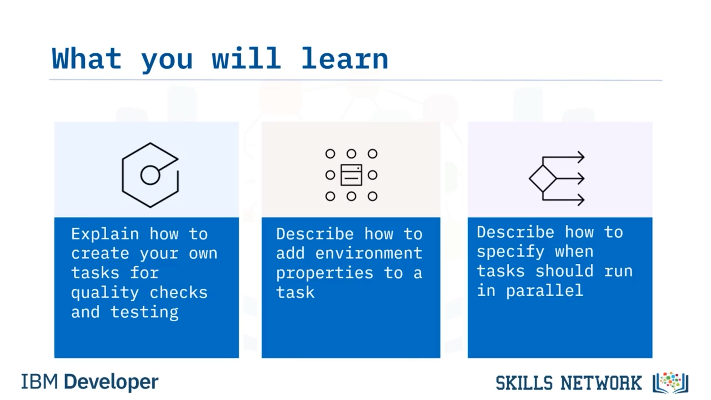
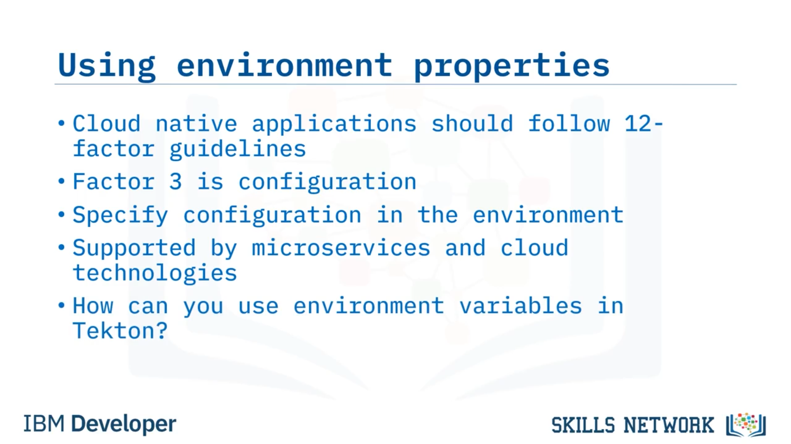

# 🧪 Görev Oluşturma: Kalite Kontrolleri ve Testler

**Kalite Kontrolleri ve Testler İçin Görevler Oluşturma** eğitimine hoş geldiniz. Bu videoyu izledikten sonra, kalite kontrolleri ve testler için kendi görevlerinizi nasıl oluşturacağınızı açıklayabilecek, bir göreve ortam özellikleri eklemeyi tanımlayabilecek ve görevlerin ne zaman paralel çalıştırılacağını belirtmeyi açıklayabileceksiniz.

Tekton kullanarak eksiksiz bir pipeline oluşturma sürecinde nerede olduğunuza bakalım. Önceki videolarda, bir pipeline’ın *checkout* aşamasını oluşturmanın iki yolunu gördünüz; yani bu kısmı tamamladınız. Şimdi diğer aşamaları oluşturma zamanı.

Bu pipeline’ı görselleştirmek için,  *checkout* ,  *lint* ,  *test* , *build* ve *deploy* görevlerinden oluşan doğrusal bir görev ilerleyişi gibi düşünebilirsiniz. Ancak gerçekte, *lint çalıştırma* ve *unit testing* gibi kalite kontrolleri tamamen bağımsızdır.

Bu nedenle pipeline, kalite kontrolleri ve unit testlerin paralel çalıştığı şekilde görünebilir. Bunlardan herhangi biri başarısız olursa pipeline durur, ancak çalışma sırası aslında önemli değildir. Bu sayede Tekton’un paralel işlem yeteneklerinden yararlanarak pipeline çalıştırma süresini hızlandırabilirsiniz.

---

## 🧪 Testlere Yakından Bakış

Önce testlere bakalım. Test etmek, herhangi bir CI/CD pipeline için kritik derecede önemlidir. CI pipeline’ında *unit testing* yapılır ve CD pipeline’ında *integration testing* yapılır. Hangi test türü olursa olsun, test senaryoları kodunuzun amaçlandığı gibi davrandığından emin olmanızı sağlar.

Bir CD pipeline için bu, kod deploy edilmeden önce herhangi bir problemi kontrol etmek için son fırsattır.

Tekton katalogunda seçebileceğiniz birçok test aracı vardır; ancak kullandığınız araç katalogda yoksa ne olur? Bu durumda, halihazırda kullandığınız aracı testlerinizi otomatikleştirmek için çalıştıracak kendi görevlerinizi kolayca oluşturabilirsiniz.

---

## 🧩 Mevcut Script’i Tekton Görevine Taşıma

Kendi görevinizi oluşturmak oldukça basittir. Muhtemelen zaten sahip olduğunuz bir script ile başlarsınız.

Bu script önce *pip* ve  *wheel* ’i yükselterek en güncel sürümleri kullanmanızı sağlar. Ardından Python paket yöneticisi olan *pip* ile gerekli Python paket bağımlılıklarını kurar. Son olarak, *nosetests* adlı Python test çalıştırıcısını çalıştırır ve çıktıyı renkli yapmak için bazı parametreler geçirir.

Bu script’i Tekton görevinizde aynen kullanabilirsiniz; bu da geliştiricilerinizin kodlarını yerelde test etmek için kullandığı komutların pipeline içinde de kullanılabileceği anlamına gelir.

---

## 🧱 “nose” Görevini Yazma

Bu script’i kullanan kendi görevinizi yazabilirsiniz. Tekton API sürümünü belirterek başlarsınız ve Kubernetes’e bu kaynağın türünün bir *task* olduğunu söylersiniz. Ardından bir isim verirsiniz. *nose* adlı bir araç çalıştıracağınız için, ileride kolay tanımlanabilmesi adına göreve *nose* adını verirsiniz.

Şimdi spesifikasyonları yazmaya başlayabilirsiniz.

Test senaryolarını kodunuza karşı çalıştırmak istediğiniz için, pipeline’daki önceki görevlerin kodu yerleştirebileceği bir  *workspace* ’e ihtiyacınız vardır. Kod için birçok görevin kullandığı yaygın workspace adı *source* olduğundan, tutarlılık için workspace adını *source* olarak belirlersiniz.

Artık adımları yazmaya hazırsınız.

---

## 🧷 “nosetests” Adımı ve Image Seçimi

Bir adım oluşturur ve buna *nosetests* adını verirsiniz; çünkü kullanacağınız komutun gerçek adı budur. Bu aynı zamanda bu görev çalıştığında loglarda görünecek isimdir.

Tüm adımlar bir container içinde çalıştığından, container’ın hangi image’dan oluşturulacağını belirtmeniz gerekir. Python kodunu test ettiğiniz için *python:3.9-slim* image’ını belirtirsiniz; bu aynı zamanda geliştiricilerinizin geliştirme için kullandığı image ile de aynıdır.

Bu, testlerde sürprizleri en aza indirmelidir.

Test komutunuz çalıştığında, kod ile aynı dizinde olduğundan emin olmak istersiniz. Bunun için *workingDir* seçeneğini kullanarak workspace’in kök yolunu belirtirsiniz. Bunu yapmak için *workspaces.* kelimesini, ardından workspace adı olan  *source* ’u ve sonra *.path* ifadesini kullanırsınız. Bu da `"$(workspaces.source.path)"` referansını oluşturur.

Geriye kalan tek şey script’i eklemektir. Script’i satır içi tanımlamak için dikey çizgi ile birlikte *script* parametresini kullanır ve script’inizi altına yapıştırırsınız.

Bu, script’inizi ekledikten sonraki tam adım uygulamasıdır. Mevcut script’leri alıp Tekton pipeline’ınıza dahil etmenin ne kadar kolay olduğu işte böyle.

---

## 🔐 Ortam Değişkenleri ile Konfigürasyon Sağlama

Bu yöntem, test senaryolarınızın bir veritabanı gerektirdiğini fark edene kadar harika çalışır ve veritabanı URI’si normalde bir ortam değişkeni olarak belirtilir. Bunu nasıl ele alacağımıza bakalım.

Cloud native uygulamalar, bir hizmet olarak yazılım uygulamalarının nasıl teslim edileceğini tanımlayan *12-factor* yönergelerini izlemelidir. Üçüncü faktör tamamen konfigürasyonla ilgilidir. Özellikle, konfigürasyonun ortamda belirtilmesi gerektiğini söyler.

Sonuç olarak bu yaklaşım mikroservis mimarisi tarafından yaygın şekilde benimsenmiştir ve her cloud sağlayıcısında veritabanı URI’leri gibi değerleri çalışma zamanına enjekte etmenin bir yolu vardır; böylece uygulamanız veritabanına nasıl bağlanacağını bilir.

Şimdi Tekton’da testleriniz için bir veritabanı URI’sini sağlamak üzere ortam değişkenlerini nasıl kullanabileceğinize bakalım.

---

## 🗝️ Kubernetes Secret’tan DATABASE_URI Enjekte Etme

Diyelim ki Kubernetes cluster’ınızda `"redis-creds"` adlı bir secret tanımlı. Bu secret içinde, veritabanı bağlantısını yapmak için base64 kodlanmış kimlik bilgilerini ve URL’yi içeren `"database_uri"` adlı bir *data* değeri var.

Test senaryolarınız bunun, tamamı büyük harf olan `DATABASE_URI` adlı bir ortam değişkeni olarak mevcut olmasını bekliyor ki test veritabanına bağlanabilsinler. Şimdi bunu nasıl tanımlayacağımıza bakalım.

Tekton adımlarında *nosetests* görevi içinde, bu değişkeni görevinize kullanılabilir hale getirmek için bir *environment definition* oluşturabilirsiniz.

Ad ( *name* ), test senaryolarınızın beklediği ortam değişkeninin adı olmalıdır. Bu örnekte, tamamı büyük harf olacak şekilde `DATABASE_URI`’dir.

Değerin bir secret’tan geldiğini tanımlarsınız. Secret adı `"redis-creds"`’tir ve veri anahtarı `"database_uri"` olarak adlandırılır. Bu, secret içindeki anahtarın değerini testlerin gördüğü ortam değişkeninin değerine eşleyen kısımdır.

Şimdi bunu Tekton görevinize nasıl ekleyeceğinizi görelim.

---

## 🧩 Ortam Tanımını Göreve Ekleme

Bu, mevcut görevinizdir.

Ortam tanımını adımın herhangi bir yerine ekleyebilirsiniz; bu yüzden script’in hemen üstüne eklersiniz. Biraz yer açmak için script’i aşağı kaydırır ve önceki örnekten gelen kodu yapıştırırsınız.

Ve bitti. Bu kadar basit.

Artık bu test senaryoları çalıştığında, veritabanına bağlanmak için testlerin kullanabileceği `DATABASE_URI` adlı ortam değişkeni kullanılabilir olacaktır.

Daha önce bahsedildiği gibi, tüm cloud sağlayıcılarının çalışma zamanlarına ortam özelliklerini enjekte etmenin bir yolu vardır. Dolayısıyla bu teknik, Tekton pipeline’larını bir cloud ortamında çalıştırırken de kullanılabilir.

---

## 🧹 Lint İçin Görev Oluşturma

Linting gibi kalite kontrolleri için kendi görevinizi oluştururken de aynı yöntemi kullanırsınız. Zaten sahip olduğunuz bir script ile başlarsınız.

Test script’inde olduğu gibi, bu script de *pip* ve  *wheel* ’i yükselterek en güncel sürümü kullanmanızı sağlar. Ardından, gerekli Python paket bağımlılıklarını kurmak için *pip* kullanır. Son olarak kalite sorunlarını kontrol etmek için *flake8* komutunu çalıştırır.

Bir kez daha, bu script’i Tekton görevinizde aynen kullanabilirsiniz; yani geliştiricilerin kodlarını yerelde lint etmek için kullandıkları komutlar Tekton pipeline’ınızda da kullanılabilir.

Bunu daha genel hale getirip argümanları parametre olarak geçirmeniz de mümkündür. Ne kadar esnek yapmak istediğinize siz karar verebilirsiniz.

---

## 🧩 Pipeline’a “tests” ve “lint” Görevlerini Ekleme

Şimdi bu iki yeni adımı pipeline’a nasıl ekleyebileceğinize bakalım.

Yeni bir pipeline görevi tanımlar ve bir isim verirsiniz. Bu örnekte, adını `'tests'` koyarsınız. Önceki görevlerden kodu paylaşmak için gereken workspace’leri belirtirsiniz. Ardından, az önce yazdığınız `'nose'` adlı göreve referans verirsiniz. Bu, Tekton’a `'nose'` görevini çalıştırmasını söyler.

Son olarak, bu pipeline görevinin ne zaman çalışacağını söylersiniz ve `clone` görevinden sonra çalışmasını belirtirsiniz; çünkü GitHub’dan kodu klonlamadan testleri çalıştıramazsınız.

Lint görevi de büyük ölçüde aynıdır; sadece `'lint'` adını kullanır ve oluşturduğunuz `'flake8'` görevine referans verir.

Bu iki görev paralel çalışır çünkü ikisi de `clone` görevinden sonra çalışacak şekilde belirtilmiştir. Yani `clone` görevi tamamlandıktan sonra her iki görev de çalışır.

---

## ✅ Video Özeti

Bu videoda şunları öğrendiniz: Tekton kataloğunda bir görev yoksa kendi görevinizi yazabilirsiniz; bu görevler zaten sahip olduğunuz mevcut shell script’lerini kullanabilir. Bir göreve konfigürasyon bilgisi geçirmek için ortam değişkenleri tanımlayabilirsiniz ve testler ile kalite kontrolleri gibi görevler ihtiyaçlarınıza bağlı olarak seri veya paralel çalıştırılabilir.

 
