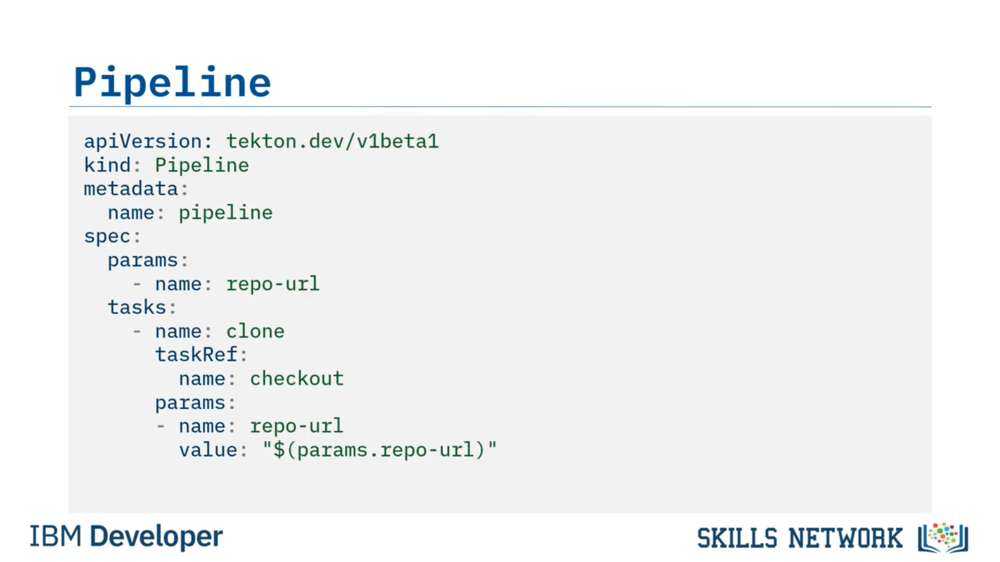

# 🧩 Tekton Pipeline Oluşturma

‘Tekton Pipeline Oluşturma’ eğitimine hoş geldiniz. Bu videoyu izledikten sonra, Tekton  *task* ’leri oluşturabilecek, bir Tekton  *task* ’ine parametrelerin nasıl geçirileceğini açıklayabilecek ve  *task* ’leri bir Tekton  *pipeline* ’ında organize edebileceksiniz.  *Event* ’ler,  *trigger* ’lar,  *pipeline* ’lar,  *task* ’ler ve  *step* ’lerden oluşan kavramsal yapı taşlarına atıfta bulunarak, artık sağdan sola doğru çalışacak ve  *step* ’lerinizi ve  *task* ’lerinizi tanımlayacaksınız.

Sürekli Teslimat ( *Continuous Delivery* )  *pipeline* ’ınızda neye ihtiyacınız olduğunu düşünün. Önce kodla başlamak zorundasınız. Bu yüzden, bir sürüm kontrol sisteminden kodu *check out* edecek bir şeye ihtiyacınız var. Ardından, muhtemelen kalite kontrollerini çalıştırmak istersiniz.

Bunlar,  *linter* ’lar ve çeşitli kalite sorunlarını kontrol eden diğer araçlar gibi kontrollerdir. Kesinlikle  *unit test* ’leri çalıştırmak istersiniz; böylece tüm kodun beklendiği gibi çalıştığından emin olursunuz. Ve tüm  *unit test* ’ler geçtikten sonra, artık  *artifact* ’ınızı oluşturmaya hazırsınız. Bu örnekte bu bir  *container image* ’dır. Son olarak, bir ortama dağıtım yapmak istersiniz—geliştirme, test veya staging. Bunların hepsi, Tekton’da birbiri ardına çalışan  *task* ’lere dönüşür. Hepsini bir araya getirdiğinizde buna bir *pipeline* denir.

Şimdi bu  *pipeline* ’ı nasıl oluşturmaya başlayabileceğinize bakalım.

---

## 🧾 Checkout Task’ini Yazma

 *Checkout task* ’ini yazarak başlarsınız. Bu tanımların tamamı, Kubernetes  *manifest* ’leri adı verilen YAML dosyalarında tanımlanır. Her  *manifest* , kullanılacak bir API sürümü tanımlamak zorundadır. Bu örnekte API sürümü ‘ *tekton.dev/v1beta1* ’dir. Tekton, Kubernetes içinde yeni  *custom resource definition* ’lar tanımlar. Kubernetes’e hangi tür kaynağı kullanacağını söylemeniz gerekir; bu örnekte bu bir ‘ *task* ’ kaynağıdır.

Sonra, metadata bölümünde bir *name* parametresi oluşturarak task’e bir ad vermeniz gerekir; bu örnekte bu ad ‘checkout’ olarak geçer. Şimdi manifest’in *specification* bölümü başlar. Bir  *task* ,  *step* ’lerden oluşan bir koleksiyondur; bu nedenle ‘steps’ anahtar sözcüğünü eklersiniz, sonra bir *step* tanımlayıp ona bir ad verirsiniz. Bu örnekte bunun adı da ‘checkout’tur.

Bir  *step* ’in bir *task* içinde yer aldığını ve bu  *task* ’in bir *pod* üzerinde çalıştığını unutmayın. Her  *step* , bu *pod* içinde yeni bir  *container* ’da çalışır. Bu nedenle, bir sonraki tanımlamanız gereken şey, o  *container* ’ı oluşturmak için hangi imajın kullanılacağıdır.

‘image’ anahtar sözcüğünü kullanıp ardından ‘ *bitnami/git:latest* ’ yazarsınız. Git istemcisi yüklü olan herhangi bir imajı kullanabilirdiniz. Bitnami, CI/CD  *pipeline* ’ları oluşturmak için harika olan çeşitli imajlar bakımını yapar ve bu Git imajı işinizi görür.

Sonra, o *container* içinde çalıştırılacak komutu tanımlamanız gerekir ve  *repository* ’yi klonlamak için ‘git’ komutunu kullanacaksınız. Son olarak, git komutuna ne yapacağını söylemeniz gerekir; bu yüzden ilk argüman olarak ‘clone’ geçirirsiniz, ancak bir sorun var. İki argümana ihtiyacınız var. Klonlanacak  *repository* ’nin URL’sine de ihtiyacınız var.

Görünüşe göre şu anda sahip olmadığınız ikinci bir argümanı geçirmeniz gerekecek. O halde gidip bir tane tanımlayalım.

---

## 🧷 Task Parametresi Tanımlama ve Kullanma

Önce, bir parametre tanımlamak için yer açmak amacıyla ‘steps’ bölümünü aşağıya taşırsınız. Parametreler ‘params’ anahtar sözcüğüyle tanımlanır. Parametreye ‘repo-url’ adını verirsiniz. Ayrıca insanların parametrenin ne için olduğunu bilmesi için bir açıklama ( *description* ) ve bir string olarak geçileceğini bilmeleri için bir tür ( *type* ) de verebilirsiniz.

Şimdi argümanlara geri dönüp mesajı geçebilirsiniz.

Peki, bunu nasıl referanslayacağınızı nereden bileceksiniz? *Spec* bölümündeki alt bölüm ‘params’tır ve parametrenin adı ‘repo-url’dür. Bu yüzden argümanı, istediğiniz parametre adına uyması için ’ *$(params.repo-url)* ’ şeklinde referanslayacak şekilde değiştirirsiniz.

Tahmin edebileceğiniz gibi, istediğiniz sayıda parametreye sahip olabilirsiniz ve bunlara *params nokta parametre_adı* biçiminde referans verebilirsiniz.

Bu, *task* tanımınızı tamamlar.

---

## 🧱 Pipeline Tanımı Oluşturma

Artık ilk  *task* ’inizi oluşturduğunuza göre, dikkatimizi bir *pipeline* tanımlamaya çevirelim. Tıpkı *task* tanımı gibi, bir *pipeline* tanımı da bir Kubernetes  *manifest* ’idir.

Bu nedenle API sürümünü belirterek başlarsınız. Ardından bunun ne tür bir kaynak olduğunu söylersiniz; bu bir *pipeline* kaynağıdır. Bir ad vermek istersiniz ve bu da yine metadata bölümünde yapılır. Ona ‘pipeline’ adını verirsiniz.

Şimdi *specifications* ile başlayabilirsiniz. Kullanacağınız  *task* ’in ‘repo-url’ adlı bir parametresi olduğunu zaten bildiğiniz için, bu parametreyi şimdi tanımlarsınız ve ‘repo-url’ adlı bir parametre bildirirsiniz.

Şimdi  *pipeline* ’a *task* eklemeye başlayabilirsiniz. Şimdilik yalnızca bir *task* eklersiniz, ancak tire bunun bir liste olduğunu ve birden fazla *task* olabileceğini gösterir. İlk  *task* ’inize ‘clone’ adını verirsiniz.

Sonra daha önce yazdığınız  *task* ’e referans vermeniz gerekir; bu yüzden ‘taskRef’ anahtar sözcüğünü ekler ve ardından ‘checkout’ adlı  *task* ’in adını referans gösterirsiniz.

 *Checkout task* ’inin bir parametre gerektirdiğini bildiğiniz için, bunu burada bildirirsiniz. Ele almak istediğiniz parametrenin adı ‘repo-url’dür ve bu  *repo-url* ’ün değeri ‘params.repo-url’ değerinden gelecektir. Bu,  *pipeline* ’a hangi *repo-url* parametresini geçirirseniz, bunun gerektiren tüm  *task* ’lere aktarılacağı anlamına gelir.

Artık en az bir *task* ve bir *pipeline* tanımladığınıza göre,  *pipeline* ’ı çalıştırmaya hazırsınız.

---

## 🛠️ Tanımları Kubernetes’e Uygulama

Önce, ‘tasks.yaml’ dosyasında tanımlanmış olan  *task* ’inizi uygulamak için *kube control* komutunu ( *kubectl* ) kullanırsınız. Kubernetes, checkout  *task* ’inin oluşturulduğunu söyleyerek yanıt verir.

Sonra, ‘pipeline.yaml’ dosyasını işaret edecek şekilde ‘kube control apply’ komutunu tekrar kullanırsınız. Ve yine,  *pipeline* ’ın oluşturulduğunu görürsünüz.

Şunu anlamak önemlidir: Bu noktada aslında bir *task* veya *pipeline* oluşturmadınız. Oluşturduğunuz şey bir *task definition* ve bir  *pipeline definition* ’dır. Gerçek *task* ve  *pipeline* , sırasıyla ‘TaskRun’ ve ‘PipelineRun’ adı verilen diğer kaynaklar tarafından oluşturulur.

Tekton kaynakları Kubernetes kaynakları olduğundan,  *pipeline definition* ’ın oluşturulduğunu ‘kubectl get pipelines’ komutunu kullanarak kontrol edebilirsiniz. Bu, o  *pipeline definition* ’ın ne kadar önce oluşturulduğunu gösterir; bu örnekte bir dakika önce.

---

## ▶️ Pipeline’ı Tekton CLI ile Çalıştırma

Son olarak,  *pipeline* ’ınızı çalıştırmaya hazırsınız. Bunu Tekton komut satırı arayüzünü ( *CLI* ) kullanarak yaparsınız. Komut, ‘tkn pipeline start’ ve ardından basitçe ‘pipeline’ olarak adlandırdığınız *pipeline* adıdır.

Konsolda log’ları beklemesi ve görüntülemesi için ‘—showlog’ parametresini eklersiniz.  *Pipeline* ’ın ihtiyaç duyduğunu bildiğiniz tüm parametreleri ‘-p’ bayrağıyla geçersiniz.

Bu durumda  *pipeline* , ‘repo-url’ parametresine ihtiyaç duyar; bu nedenle GitHub  *repository* ’lerinizden birinin URL’sini geçirirsiniz. Tekton CLI, perde arkasında ‘PipelineRun’ ve ‘TaskRun’ kaynaklarını oluşturur. Bunlar, gerçekte çalışan  *pipeline* ’ı ve  *task* ’leri oluşturan kaynaklardır.

Bunu manuel olarak da yapıp aynı sonucu elde edebilirdiniz, ancak Tekton CLI tüm bunları sizin için otomatikleştirir; o halde neden kullanmayasınız?

Sonra log’ların geri gelmesini beklersiniz ve en sonunda, clone  *task* ’inin checkout  *step* ’inin klonlama yaptığını belirten git mesajını döndürdüğünü görürsünüz; mesajdaki repo adı da URL’de verdiğiniz repo adıyla eşleşir. Başarılı bir *pipeline run* elde ettiniz.

Bu  *pipeline* ’ı, daha fazla *task* oluşturarak ve bunları  *pipeline definition* ’a ekleyerek geliştirmeye devam edebilirsiniz.

---

## ✅ Öğrenilenler

Bu videoda şunları öğrendiniz: Tekton  *task* ’leri herhangi bir *container* içinde çalışacak ve herhangi bir komutu çağıracak şekilde yazılabilir,  *task* ’ler dış parametreleri kabul edebilir ve Tekton  *pipeline* ’ları,  *task* ’lere referans verilerek ve gerekli parametreler onlara geçirilerek oluşturulabilir.

