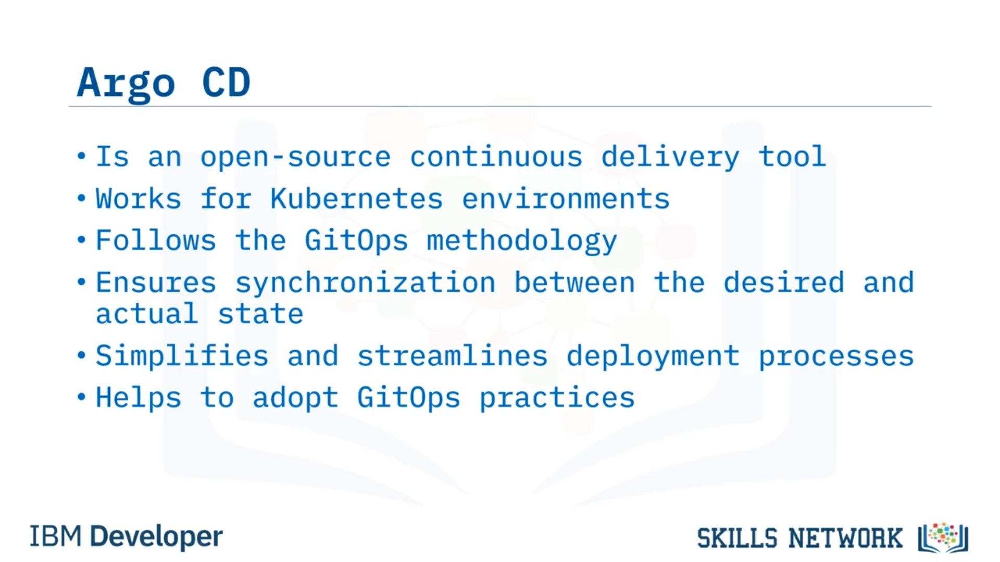
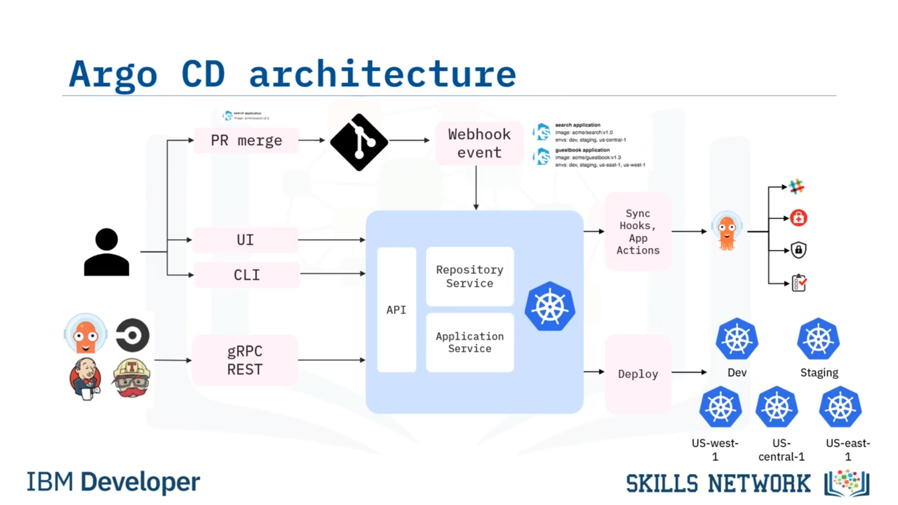
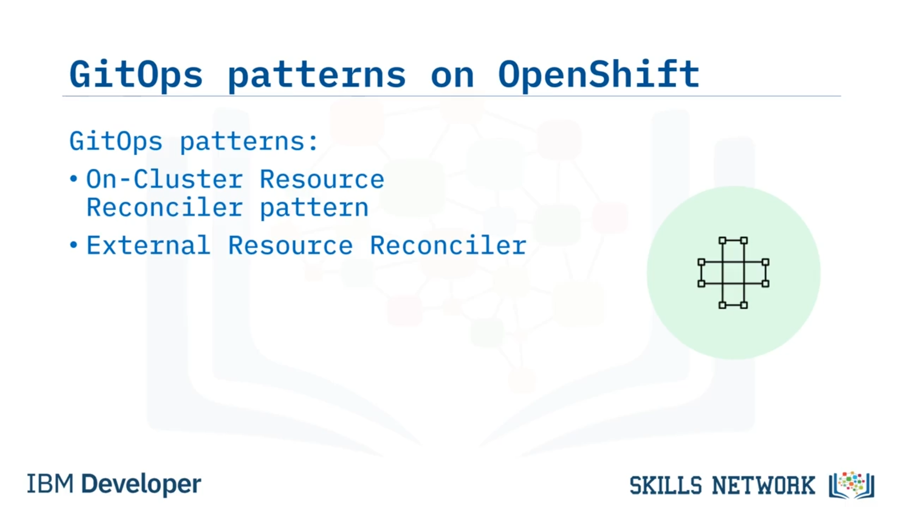

# 🚀 GitOps ve ArgoCD

“Argo CD ile GitOps” videosuna hoş geldiniz. Bu videoyu izledikten sonra, Argo CD’yi ve temel özelliklerini açıklayabilecek, Argo CD mimarisini tanımlayabilecek, OpenShift üzerindeki iki önemli GitOps desenini tartışabilecek ve OpenShift GitOps üzerinde Argo CD kullanma adımlarını belirleyebileceksiniz. 

Argo CD, özellikle Kubernetes ortamları için tasarlanmış güçlü bir açık kaynak *continuous delivery* aracıdır. Git’in tek bir doğruluk kaynağı ( *single source of truth* ) olarak hareket ettiği GitOps metodolojisini izler ve uygulamaların ve altyapının istenen durumunu ( *desired state* ) tanımlar ve yönetir. Argo CD, bir Git deposunda saklanan istenen durum ile uygulamaların ve kümelerin ( *clusters* ) gerçek durumu arasında sürekli senkronizasyon sağlar.

Bunu yaparak dağıtım sürecini basitleştirir ve akıcı hale getirir. Bu, geliştiricilerin verimli ve güvenilir uygulama teslimi için GitOps uygulamalarını benimsemesine olanak tanır.

---

## ✨ Argo CD’nin Temel Özellikleri

Argo CD, Kubernetes ortamlarında verimli, güvenli ve tutarlı uygulama teslimini teşvik eden güçlü özellikler sunar. Şimdi bu özelliklere bakalım. Aşağıda Argo CD’nin bazı dinamik özellikleri yer almaktadır. Uygulamalarınızın istenen durumunu beyan etmenizi sağlar ve kümenin bu durumla mükemmel şekilde hizalanmasını garanti eder. Git depolarıyla otomatik olarak senkronize olur ve karşılığında uygulamalarınızın istenen durumunu korumak için değişiklikleri uygular.

Git deposunu sürekli olarak değişiklikler için izler; böylece kümeyi en son sürümler ve güncellemelerle senkron tutar. OAuth 2, LDAP, SAML 2, GitHub ve Microsoft dahil olmak üzere çeşitli *single sign-on* veya *SSO* entegrasyonu sunar. Önceki sürümlere geri dönmenize veya kontrollü *rollout* işlemleri gerçekleştirmenize olanak tanır.

Bu, dağıtım sırasında riski en aza indirir. Yeniden kullanılabilir uygulama yapılandırma desenlerini tanımlamak için şablonlar kullanır. Son olarak, güçlü *Role-Based Access Control* veya *RBAC* mekanizmaları sağlar. Bu mekanizmalar, dağıtımlarınızın güvenliğini sağlayan kullanıcı erişimi ve izinleri üzerinde ayrıntılı kontrol sağlar.

---

## 🧩 Dağıtım, Otomasyon, Denetim ve Entegrasyon Yetkinlikleri

Şimdi Argo CD’nin dağıtım, otomasyon, denetim ve entegrasyonlarda yardımcı olan özellikleri nasıl sağladığını tartışalım. Argo CD, birden çok ortamda sorunsuz dağıtımları kolaylaştırır ve geliştirmeden üretime tutarlı teslimatı garanti eder. Argo CD’nin kullanıcı dostu, web tabanlı arayüzü üzerinden dağıtımları yönetir ve değişiklikleri takip eder.

Otomasyon, betikleme ve CI/CD pipeline’larıyla entegrasyon için bir *Command Line Interface* veya *CLI* sunar. Kapsamlı bir denetim izi ( *audit trail* ) ve ayrıntılı dağıtım geçmişi tutar; böylece uygulama teslim yaşam döngünüz boyunca şeffaflık ve hesap verebilirlik sağlar. Son olarak, oldukça genişletilebilirdir; diğer araçlarla entegre etmenize ve özel gereksinimlerinize göre özelleştirmenize olanak tanır.

---

## 🔄 Out-of-Sync Durumu ve Senkronizasyon

Tipik bir GitOps operasyonunda, uygulamaların mevcut durumu ve dağıtım, hedeflenen amaçlanan durumdan ( *intended target state* ) saparsa, bu *out-of-sync* kategorisine girer. Argo CD bu tutarsızlıkları algılar ve görüntüler; ayrıca canlı formu istenen hedef durumla yeniden hizaya getirme yeteneği sunar.

Bu senkronizasyon sürecini otomatik ya da manuel olarak başlatabilirsiniz. Git deposunda istenen durumda yapılan herhangi bir değişiklik otomatik olarak uygulanır ve belirlenen hedef ortamlara yansıtılır.

---

## 🏗️ Argo CD Bileşenleri ve GitOps İş Akışı

Şimdi bu GitOps iş akışında yer alan Argo CD’nin çeşitli bileşenlerini inceleyelim. Kaynak kod deposu ( *SCM* ), uygulamanın manifest’ini yapılandırma dosyalarında saklar. Git, GitHub veya desteklenen başka bir SCM sistemi olabilir. SCM’de uygulama manifest’inde değişiklik yaptıktan sonra, geliştiriciler değişikliklerini önermek için bir *pull request* oluşturur.

Argo CD,  *webhook* ’lar aracılığıyla SCM ile entegre olur. *Webhook* olayı, bir *pull request* birleştirildiğinde veya branch oluşturma, tag oluşturma gibi diğer olaylar gerçekleştiğinde Argo CD’yi senkronize etmeye tetikler. Argo CD’nin API bileşeni, Argo CD sistemiyle etkileşim için programatik bir arayüz sağlar. Kullanıcıların uygulamaları yönetme, erişim kontrolünü yapılandırma ve dağıtım bilgilerini alma gibi çeşitli işlemleri gerçekleştirmesine olanak tanır.

Argo CD’de  *sync hooks* , senkronizasyondan önce veya sonra çalıştırabileceğiniz betikler veya hook’lardır. Bu hook’lar, bir uygulamayı dağıtmadan önce veya sonra, örneğin bir veritabanı migrasyonu çalıştırma, testleri tamamlama veya bildirim gönderme gibi özel eylemleri gerçekleştirmenizi sağlar. İstenen uygulama durumlarının dağıtımını otomatikleştirmek için Argo CD, bir Git commit’inde manifest’lerin branch, tag veya belirli sürümlerindeki güncellemeleri takip eder.

Bu, belirtilen hedef ortamlarda uygulama dağıtımları üzerinde hassas kontrol sağlar. *Deploy* bileşeni, uygulamanın bir Kubernetes kümesine gerçek dağıtımını temsil eder. İstenen uygulama durumuna ulaşmak için Argo CD, pod’lar, servisler, deployment’lar ve ConfigMap’ler gibi gerekli kaynakları oluşturmak ve güncellemek üzere Kubernetes API’sini kullanır.

---

## 🧭 OpenShift Üzerindeki GitOps Desenleri

Şimdi OpenShift üzerindeki GitOps desenlerini inceleyeceğiz. OpenShift üzerinde GitOps desenlerini benimseyerek, kuruluşlar uygulama dağıtım iş akışlarını geliştirebilir. OpenShift, uygulama dağıtımını ve yönetimini kolaylaştırmak için çeşitli GitOps desenlerini destekler. Bu desenlerden ikisi *on-cluster resource reconciler pattern* ve  *external resource reconciler* ’dır.

Bu desenleri tartışalım.

---

## 🧷 On-Cluster Resource Reconciler Pattern

Önce *on-cluster resource reconciler pattern* ile başlayalım. Bu desende, küme içindeki bir controller, Git deposundaki YAML dosyaları gibi Kubernetes kaynaklarını karşılaştırmaktan sorumludur. Bir tutarsızlık belirlendiğinde, controller bildirimleri tetikler ve potansiyel olarak Kubernetes üzerindeki kaynakları bir Git deposunda saklananlarla uzlaştırmak ( *reconcile* ) için eylemler gerçekleştirir. Ortak ortamları dağıtmak için kullanılan *Anthos Config Management* ve sürekli ve aşamalı teslim çözümleri sağlayan  *Weaveworks Flux* , GitOps uygulamasında bu deseni kullanır.

---

## 🌐 External Resource Reconciler Pattern

Bir sonraki desen  *external resource reconciler* ’dır. Harici kaynak uzlaştırıcı desenini benimseyerek Argo CD, kullanıcıların birden fazla Git deposu ve Kubernetes kümesi genelinde kaynakları yönetmesine ve senkronize etmesine olanak tanır. Bu desende, senkronizasyon süreci, uzlaştırılacak Git depolarını ve Kubernetes kümelerini tanımlayan *Custom Resource Definitions* veya  *CRD* ’ler kullanılarak gerçekleşir. Controller’lar, bu CRD’de belirtilen Git deposunu, aynı CRD’de belirtilen Kubernetes kümesinde bulunan kaynaklarla karşılaştırır. Karşılaştırma sonucuna göre controller’lar, herhangi bir tutarsızlığı uzlaştırmak için uygun aksiyonu alır. Argo CD, GitOps uygulaması için  *external resource reconciler pattern* ’ı benimseyen önemli bir çözümdür.

---

## 🧰 OpenShift GitOps ve Başlangıç Adımları

Şimdi OpenShift GitOps’u inceleyelim.  *OpenShift GitOps* , OpenShift için özel olarak tasarlanmış paketlenmiş bir Argo CD sürümüdür ve OpenShift platformu içinde sorunsuz bir GitOps deneyimi sağlar. İşte OpenShift GitOps ile başlamanız için adım adım bir kılavuz.

 **Adım 1’de** , OpenShift kümeniz içindeki  *OperatorHub* ’dan OpenShift GitOps’u kurun. Operator, HUD, OpenShift üzerinde kolayca dağıtılabilen ön paketlenmiş uygulamalar ve servisler kataloğu sağlar. Kurulumdan sonra, OpenShift GitOps’u OpenShift konsolundan başlatabilirsiniz. Konsol, kurulu uygulamalara erişmek ve onları yönetmek için kullanıcı dostu bir arayüz sağlar. GitOps OpenShift’e erişmek için OpenShift kimlik bilgilerinizle oturum açın. Bu, Git depolarını, Kubernetes kümelerini ve ilişkili kaynakları yönetmek için uygun kimlik doğrulama ve yetkilendirmeyi sağlar. OpenShift GitOps çalışır durumda olduğunda, artık Argo CD’nin yeteneklerini kullanabilirsiniz.

---

## ✅ Video Özeti

Bu videoda, Argo CD’nin Kubernetes uygulamaları için bildirime dayalı ( *declarative* ), sürekli teslimi kolaylaştıran açık kaynak bir araç olduğunu öğrendiniz. Birden fazla ortamı destekleyerek geliştirmeden üretime tutarlı ve güvenilir uygulama teslimine olanak tanır. Ayrıca bildirime dayalı yaklaşımı, GitOps metodolojisi, sezgisel arayüzleri ve genişletilebilirliği, onu modern *continuous delivery* uygulamaları için değerli bir araç haline getirir.

