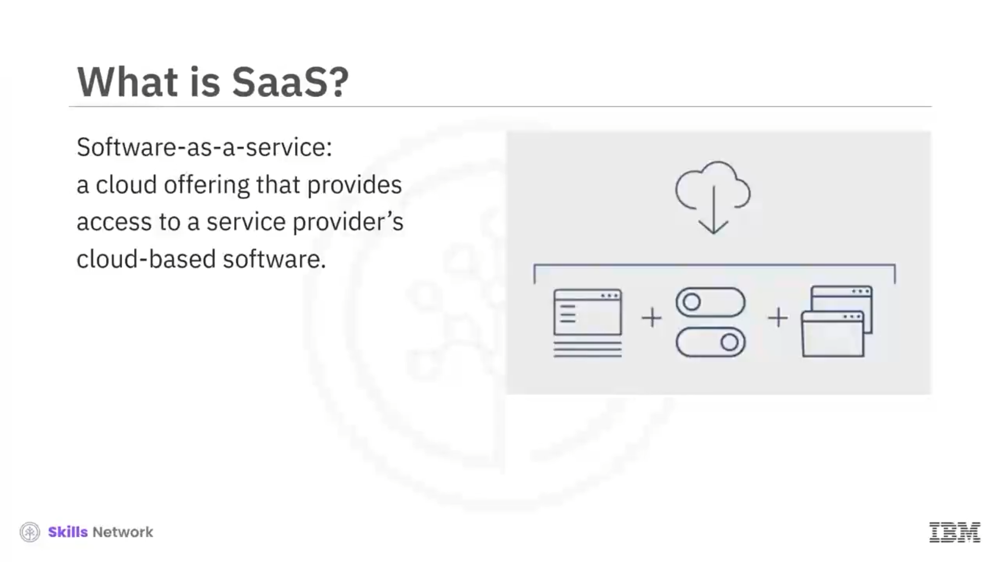
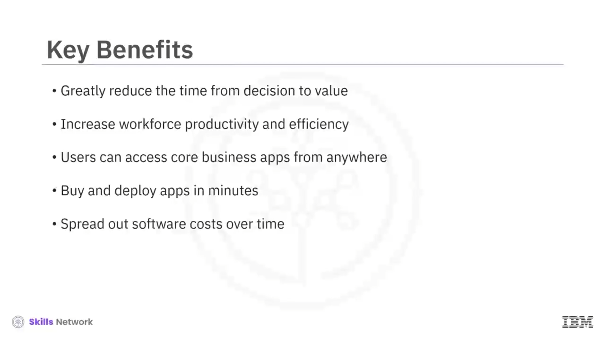

# 🧩 SaaS - Hizmet Olarak Yazılım

*Software-as-a-Service* ya da “ *SaaS* ”, kullanıcılara bir hizmet sağlayıcının bulut tabanlı yazılımına erişim sunan bir bulut çözümüdür. SaaS sağlayıcıları, bir uygulamayı oluşturan sunucuları, veritabanlarını ve kodu yönetir. Ayrıca güvenlik, kullanılabilirlik ve performans dahil olmak üzere uygulamaya erişimi de yönetir. Uygulamalar uzaktaki bir bulut ağında bulunur ve kullanıcılar altyapıyı bakımını yapmak ve güncellemek zorunda kalmadan bu uygulamaları kullanır.

Günümüzde SaaS tarafından desteklenen temel iş süreçleri arasında Microsoft’un Office 365’i ve Google’ın Gmail’i gibi çözümlerle e-posta ve iş birliği, NetSuite CRM ve Salesforce gibi hizmetlerle *Customer Relationship Management* ( *CRM* ), Workday ve SAP SuccessFactors gibi hizmetlerle *Human Resource Management* ve finansal yönetim, faturalama ve iş birliği gibi daha birçok süreç yer alır. Forrester Research’e göre SaaS;  *human capital management (HCM)* , *customer relationship management (CRM)* ve iş birliği gibi kategorilerde şirket içi ( *on-premises* ) çözümleri geride bırakmıştır.

Bir zamanlar birden fazla dağıtım seçeneğiyle sunulan çözümler artık yalnızca SaaS’tır:

## 🔑 SaaS’ın Temel Özellikleri

SaaS bulutları *multitenant* bir mimariye sahiptir. Altyapı ve kod merkezi olarak korunur ve tüm kullanıcılar tarafından erişilir. SaaS, kullanıcıların ayrıcalıkları yönetmesini, veri kullanımını izlemesini ve herkesin aynı anda aynı bilgiyi görmesini kolaylaştırır.

Güvenlik, uyumluluk ve bakım teklifin bir parçasıdır. SaaS’ta özelleştirmeler çoğu zaman sınırlıdır; ancak bazı SaaS uygulamaları marka kullanımı gibi belirli türde özelleştirmelere izin verebilir; veri alanlarını değiştirebilir ve iş süreci içinde özellikleri etkinleştirebilir ya da devre dışı bırakabilir. Bu özelleştirmeler yükseltmeler boyunca korunur.

Kullanıcılar hizmetlerin kullanım bedelini abonelik modeliyle öder. Kaynak kullanımı, hizmet ihtiyaçlarına bağlı olarak kolayca ölçeklenebilir.

## ✅ SaaS’ı Benimsemenin Temel Faydaları

İşletmeler, peşin sermaye ve BT’den yardım almadan çözümleri doğrudan tedarik edebilir; bu da karar anından değere ulaşma süresini aylardan günlere indirerek önemli ölçüde azaltır. SaaS, iş gücü verimliliğini ve etkinliğini büyük ölçüde artırır.

Kullanıcılar temel iş uygulamalarına her yerden erişebilir; ayrıca uygulamaları dakikalar içinde satın alıp devreye alabilirler; bu da işletmelerin kullanabilecekleri ürünleri test ederken karşılaştıkları tipik engelleri azaltır. SaaS uygulamalarını kullanarak bireyler ve küçük işletmeler yazılım maliyetlerini zamana yayabilir.

## 🧠 SaaS için Bazı Kullanım Senaryoları

Kuruluşlar, şirket içi BT altyapısını azaltmak ve sermaye harcamalarını düşürmek amacıyla stratejik dönüşümlerinin bir parçası olarak temel iş ihtiyaçları için SaaS’a geçmektedir.

Kuruluşlar, geleneksel olarak iç BT kaynakları tarafından yapılan sürekli yükseltme, bakım ve yama ( *patching* ) ihtiyacından kaçınmak için SaaS’tan yararlanmaktadır; uygulamalar güvenilir şekilde, minimum girdilerle çalışır; örneğin e-posta sunucuları ile ofis iş birliği ve üretkenlik araçları.

Kuruluşlar, web sitelerini, pazarlamayı, satışları ve operasyonları yönetmek için giderek daha fazla SaaS e-ticaret platformlarını tercih etmektedir.

SaaS ile kuruluşlar, bulut sağlayıcısının dayanıklılığından ve iş sürekliliğinden faydalanabilir.

Kuruluşlar artık ek SaaS uygulamaları oluşturmak için SaaS entegrasyon platformları ( *SIPs* ) geliştirmekte; böylece SaaS’ı bağımsız yazılım işlevselliğinin ötesine taşıyarak görev açısından kritik uygulamalar için bir platform haline getirmektedir.

## ⚠️ SaaS ile İlgili Endişeler

SaaS bazı endişeleri de beraberinde getirir.

Bunların başında veri sahipliği ve veri güvenliği gelir. İş açısından kritik verilerin üçüncü bir tarafça tutulmasına izin verirken güvenlik önemli bir husustur. Ayrıca uygulama erişimi iyi bir ağ bağlantısına dayanır.

Ancak faydalar endişelerden çok daha ağır basar; SaaS günümüzde bulut pazarının en büyük segmentini oluşturur.

