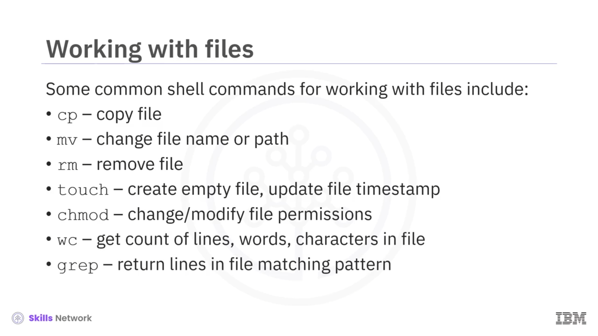
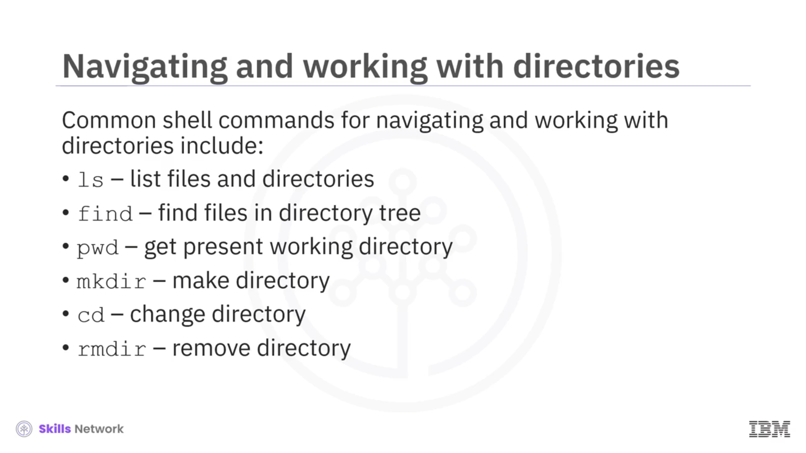
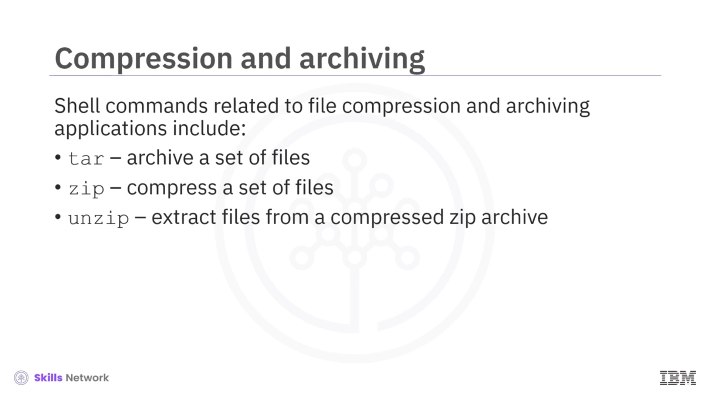
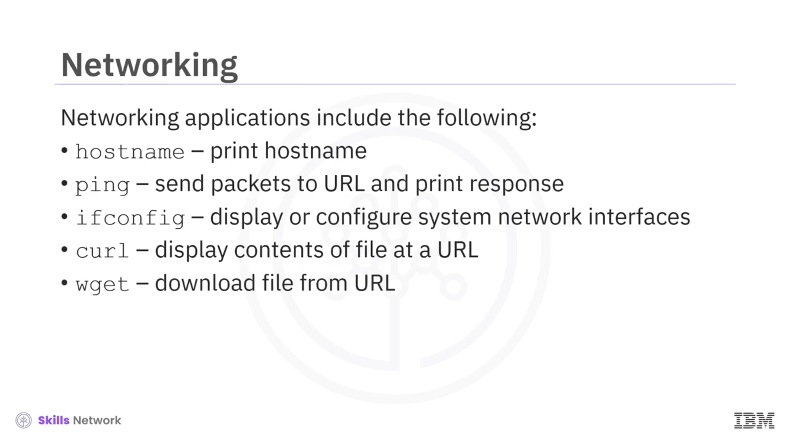
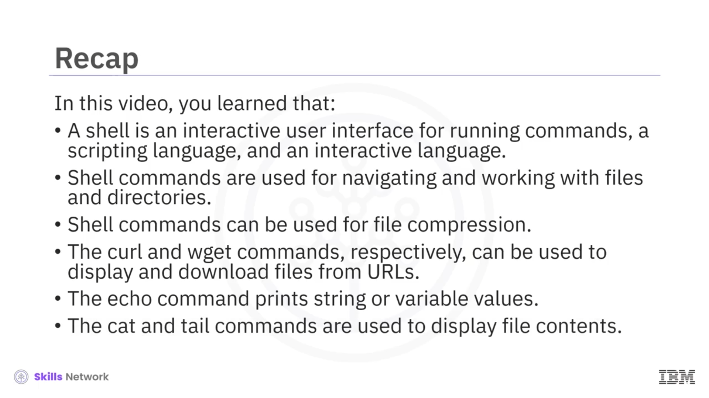

# 🐚 Yaygın Linux Kabuk Komutlarına Genel Bakış

## 🎬 Giriş

“Overview of Common Linux Shell Commands” (Yaygın Linux Kabuk Komutlarına Genel Bakış) bölümüne hoş geldiniz.

Bu videoyu izledikten sonra şunları yapabileceksiniz:

* Bir  *shell* ’in ne olduğunu tanımlamak,
* Shell komutlarının uygulama alanlarını listelemek,
* Ve yaygın shell komutlarını hatırlamak.

Bir  *shell* , Unix benzeri işletim sistemleri için güçlü bir kullanıcı arayüzüdür. Komutları yorumlayabilir ve diğer programları çalıştırabilir.

Dosyalara, yardımcı programlara ( *utilities* ) ve uygulamalara erişim sağlayan bir shell aynı zamanda etkileşimli bir dildir. Bir shell aynı zamanda bir betik ( *scripting* ) dilidir ve görevleri otomatikleştirmek için de kullanılabilir.

---

## 🐧 Bash ve Diğer Kabuklar

Linux sistemlerinde varsayılan shell genellikle  **Bash** ’tir. Diğer shell’lere şunlar dahildir:  **Bourne shell** , `sh`;  **Korn shell** , `ksh`;  **T C shell** ; **Z shell** ve  **fish** .

Bu derste yalnızca  **Bash shell** ’i kullanacağız; Bash, “ *bourne again shell* ” ifadesinin kısaltmasıdır.

Varsayılan shell’in ne olduğunu öğrenmek için komut satırına şu komutu girin:

```bash
printenv SHELL
```

Bu komut, varsayılan shell programının yolunu döndürür; bu durumda shell `bash`’tir.

Eğer varsayılan shell’iniz Bash değilse, komut satırına sadece şu komutu girerek her zaman Bash’e geçebilirsiniz:

```bash
bash
```

Bu ders boyunca komut istemini temsil etmek için dolar işaretini (`$`) kullanacağız. Bu dersin dışında, aynı amaçla kullanılan *büyüktür* (`>`) sembolüyle de karşılaşabilirsiniz.

---

## 🧭 Shell Komutlarının Uygulama Alanları

Shell komutlarının uygulama alanları şunları içerir:

* Bilgi edinme,
* Dosyalar ve dizinlerle gezinme ve çalışma,
* Dosya ve *string* içeriklerini yazdırma,
* Dosya sıkıştırma ve arşivleme,
* Ağ işlemlerini gerçekleştirme,
* Sistemin, bileşenlerinin ve uygulamaların performansını ve durumunu izleme,
* ETL işlemleri gibi toplu işler ( *batch jobs* ) çalıştırma.

---

## ℹ️ Bilgi Alma Komutları

Bilgi almak için yaygın shell komutlarından bazıları şunlardır:

* `whoami` – kullanıcının kullanıcı adını döndürür,
* `id` – geçerli kullanıcı ve grup kimliklerini (ID’lerini) döndürür,
* `uname` – işletim sistemi adını döndürür,
* `ps` – çalışan süreçleri ve bunların kimliklerini görüntüler,
* `top` – çalışan süreçleri ve bellek, CPU ve I/O dâhil kaynak kullanımını görüntüler,
* `df` – bağlanmış ( *mounted* ) dosya sistemleri hakkında bilgi gösterir,
* `man` – herhangi bir shell komutu için başvuru ( *reference* ) kılavuzunu getirir,
* `date` – bugünün tarihini yazdırır.


---

## 📁 Dosyalarla Çalışma Komutları

Dosyalarla çalışmak için yaygın shell komutlarından bazıları şunlardır:

* `cp` – dosya kopyalar,
* `mv` – dosya adını veya yolunu değiştirir,
* `rm` – dosya siler,
* `touch` – boş dosya oluşturur veya dosya zaman damgasını günceller,
* `changemod` – dosya izinlerini değiştirmek veya düzenlemek için kullanılır,
* `wc` – bir dosyadaki satır, kelime ve karakter sayısını verir,
* `grep` – bir dosyada bir desenle eşleşen satırları döndürür.



---

## 📂 Dizinlerle Çalışma Komutları

Dizinlerde gezinmek ve dizinlerle çalışmak için çok yaygın shell komutları şunlardır:

* `LS` – geçerli dizindeki dosya ve dizinleri listeler,
* `find` – geçerli dizin ağacında bir desenle eşleşen dosyaları bulmak için kullanılır,
* `pwd` – geçerli, yani *present working* dizini yazdırır,
* `mkdir` – yeni bir dizin oluşturur,
* `cd` – geçerli dizini başka bir dizine değiştirir,
* `rmdir` – bir dizini tamamen kaldırır.



---

## 📄 Dosya İçeriği ve String Yazdırma Komutları

Dosya içeriklerini veya  *string* ’leri yazdırmak için yaygın komutlar şunlardır:

* `cat` – bir dosyanın tüm içeriğini yazdırır,
* `more` – dosya içeriğini her seferinde bir sayfa olacak şekilde yazdırmak için kullanılır,
* `head` – bir dosyanın yalnızca ilk **N** satırını yazdırmak için kullanılır,
* `tail` – bir dosyanın son **N** satırını yazdırmak için kullanılır,
* Ve çok yaygın `echo` komutu – bir giriş  *string* ’ini yazdırarak “yankılar”.

`echo` komutu ayrıca bir değişkenin değerini de “yankılayabilir” (yani yazdırabilir).


---

## 📦 Dosya Sıkıştırma ve Arşivleme Komutları

Dosya sıkıştırma ve arşivleme uygulamalarıyla ilişkili shell komutları şunlardır:

* `tar` – bir dizi dosyayı arşivlemek için kullanılır,
* `zip` – bir dizi dosyayı sıkıştırır,
* `unzip` – sıkıştırılmış veya *zipped* bir arşivden dosyaları çıkarır.



---

## 🌐 Ağ (Networking) Komutları

Ağ ile ilgili uygulamalar için kullanılan komutlar şunlardır:

* `hostname` – ana makine adını yazdırır,
* `ping` – bir URL’ye paket gönderir ve yanıtı yazdırır,
* `ifconfig` – sistemdeki ağ arayüzlerini görüntüler veya yapılandırır,
* `curl` – bir URL’de bulunan bir dosyanın içeriğini görüntüler,
* `wget` komutu – bir URL’den dosya indirmek için kullanılabilir.



---

## 🪟 Windows Üzerinde Linux Çalıştırma Yöntemleri

Eğer bir Windows makine kullanıyorsanız ve üzerinde Linux çalıştırmak istiyorsanız, bunu çeşitli yollarla yapabilirsiniz.

Linux ayrı bir disk bölümüne ( *drive partition* ) kurulabilir. İki işletim sistemi arasında geçiş yapmak, yeniden başlatma gerektirir.

Alternatif olarak Linux’u bir sanal makineye kurabilirsiniz ya da CygWin gibi bir Linux öykünücüsü ( *emulator* ) yükleyebilirsiniz.

Ayrıca, Linux ikili yürütülebilirlerini ( *binary executables* ) Windows üzerinde yerel olarak çalıştırmak için bir uyumluluk katmanı olan  **Windows Subsystem for Linux** ’u da kullanabilirsiniz.


---

## ✅ Özet

Bu videoda şunları öğrendiniz:

* Bir shell, komutları çalıştırmak için etkileşimli bir kullanıcı arayüzü, bir betik dili ve etkileşimli bir dildir.
* Shell komutları, dosyalar ve dizinlerle gezinmek ve onlarla çalışmak için kullanılır.
* Shell komutları dosya sıkıştırma için kullanılabilir.
* `curl` ve `wget` komutları sırasıyla bir URL’den dosya içeriğini görüntülemek ve dosya indirmek için kullanılabilir.
* `echo` komutu, *string* veya değişken değerlerini yazdırır.
* `cat` ve `tail` komutları, dosya içeriklerini görüntülemek için kullanılır.


