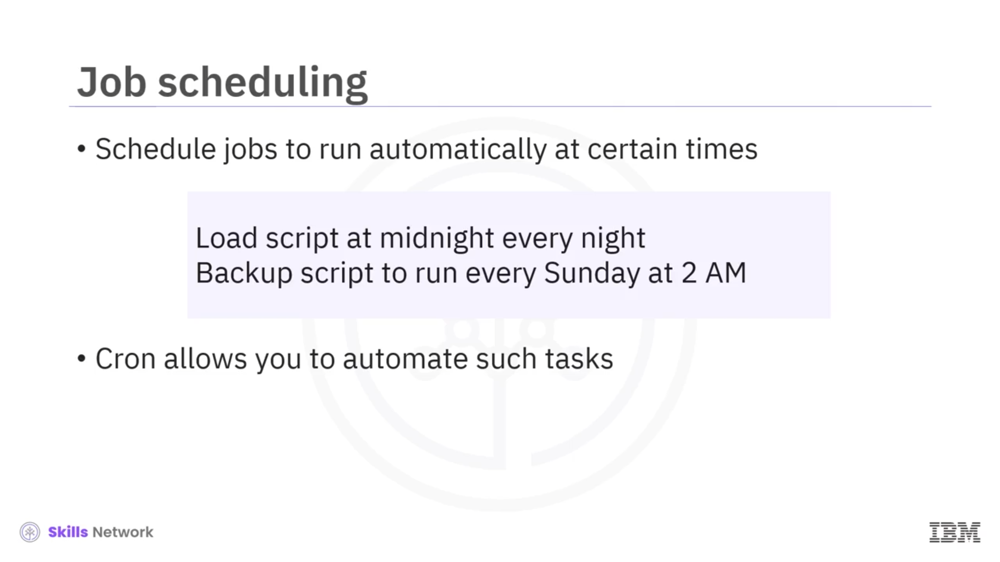
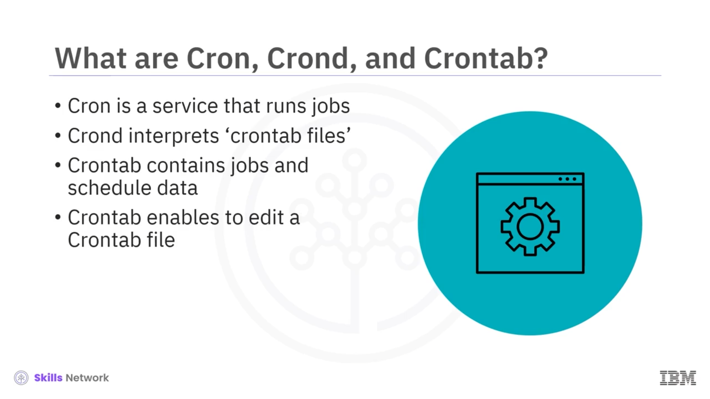
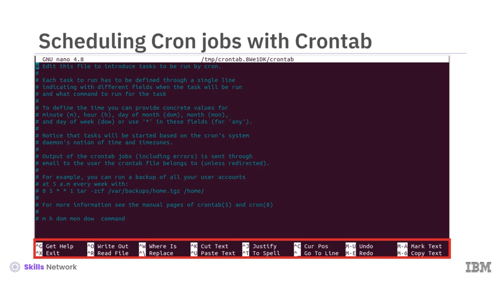
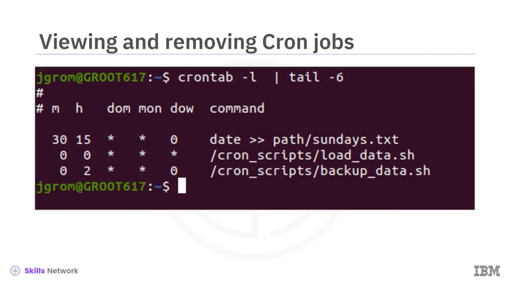

# ⏰ Cron Kullanarak İş Zamanlama

## 🎬 Cron ile İş Zamanlamaya Giriş

 **Scheduling Jobs Using Cron** ’a hoş geldiniz.

Bu videoyu izledikten sonra şunları yapabileceksiniz:

* `crontab` ile cron işleri zamanlamak
* Cron söz dizimini ( *cron syntax* ) açıklamak
* Cron işlerini uygulamak ( *apply* ) ve kaldırmak ( *remove* )


İster sistem yöneticisi, ister veri mühendisi, ister bir geliştirici olun, bazı işlerin belirli zamanlarda otomatik olarak çalışmasını isteyeceğiniz durumlar olabilir.

Örneğin, her gün gece yarısı çalışacak bir *load script* zamanlamak veya her pazar sabah 2’de çalışacak bir *backup* betiği ayarlamak isteyebilirsiniz.

Linux ve Unix benzeri işletim sistemlerindeki **cron** aracı, tam olarak bunu yapmanızı sağlar.



---

## 🧩 Cron, Crond ve Crontab Nedir?

 **Cron** , kabuk komutlarından veya kabuk betiklerinden oluşan zamanlanmış işleri çalıştıran aracın genel adıdır.

 **Crond** , her dakika **crontab dosyalarını** yorumlayan ve ilgili işleri zamanlanan saatlerde cron’a gönderen arka plan süreci (*daemon* veya servis) tir.

Bir **crontab** ( *“cron table”* ifadesinin kısaltması), işler ve zamanlama verileri içeren bir dosyadır.

 **Crontab** , aynı zamanda bir metin düzenleyicisini çağırarak bir crontab dosyasını düzenlemenizi sağlayan komutun da adıdır.

Komut satırına `crontab -e` (crontab “eksi e”) yazmak, varsayılan metin düzenleyicisini açar.



---

## ⌚ Cron Söz Dizimi ve Zamanlama

Düzenleyiciyi kullanarak, yeni bir zamanlama ve komut belirleyebilirsiniz; bu, aşağıdaki sözdizimine sahiptir.

*Command* ( *"command"* ) herhangi bir kabuk komutu olabilir; bir kabuk betiğini çağıran komut da buna dahildir.

Semboller, sırasıyla:

* dakika ( *minute* ),
* saat ( *hour* ),
* ayın günü ( *day of month* ),
* ay ( *month* ),
* haftanın günü ( *day of week* )

için kullanılır.

Bu beş konumun her birinde ya sayısal bir giriş ya da “herhangi birini” ifade eden joker karakter `*` ( *asterisk* ) bulunmalıdır.

Örneğin, aşağıdaki sözdizimi, her pazar 15:30’da geçerli tarihi `sundays.txt` dosyasının sonuna eklemek anlamına gelir.

Düzenleyiciyi kapatmak ve değişiklikleri kaydetmek, işi cron tablosuna ekler.


---

## 📝 `crontab -e` ile Crontab Dosyasını Düzenleme

Şimdi bu adımların her birine daha yakından bakalım.

Komut satırına `crontab -e` (crontab “eksi e”) yazmak, varsayılan metin düzenleyicisini açar. Bu örnekte varsayılan düzenleyici  **GNU nano** ’dur.

Kullanışlı bir şekilde, cron işleri ayarlamaya yönelik talimatlar burada yorum satırları olarak yer alır. Düzenleyiciyi kullanmaya yönelik talimatlar da dahildir; ancak bu bağlamda muhtemelen yalnızca `control x` (Ctrl+X) kombinasyonuna ihtiyacınız olacaktır.

Burada üç örnek cron işi girdim.

Fazladan boşlukların yok sayıldığına dikkat edin; bu nedenle okunabilirliği artırmak için girişlerinizi başlığın altında sütunlar halinde hizalayabilirsiniz.

* İlk satır, cron’a her pazar 15:30’da geçerli tarihi `sundays.txt` dosyasının sonuna eklemesini söyler.
* Sonraki satır, her gün gece yarısı çalışacak bir **“load data”** kabuk betiğini belirtir.
* Son satır ise cron’un, pazar günleri sabah 2’de **“backup”** veri kabuk betiğini çalıştırmasına neden olur.



---

## 💾 Cron İşlerini Kaydetme, Listeleme ve Silme

İşi kaydetmek için önce `control x` (Ctrl+X) yazarak düzenleyiciden çıkın ve ardından değişikliklerinizi kaydetmek için `y` girin.

Artık işler üretimde ( *in production* )!

`crontab` komutunu `-l` seçeneğiyle çalıştırmak, tüm cron işlerinin ve zamanlamalarının bir listesini döndürür:

```bash
crontab -l
```

Burada, crontab dosyasındaki tüm yorumların dönmesini engellemek için `tail` komutunu kullandım.

Bir işi kaldırmak için, sadece crontab düzenleyicisini çağırın, crontab dosyasındaki ilgili satırı silin ve değişiklikleri kaydedin.




---

## ✅ Özet

Bu videoda şunları öğrendiniz:

* **Cron işlerinin** , seçilmiş zamanlarda periyodik olarak çalışacak şekilde zamanlanabileceğini
* **Cron** , **Crond** ve  **Crontab** ’ın farklı işlevlere sahip olduğunu
* Komut satırına `crontab -e` (crontab “eksi e”) yazmanın varsayılan metin düzenleyicisini açtığını
* `crontab -l` komutunu çalıştırmanın, tüm cron işleri ve zamanlamalarının bir listesini döndürdüğünü


