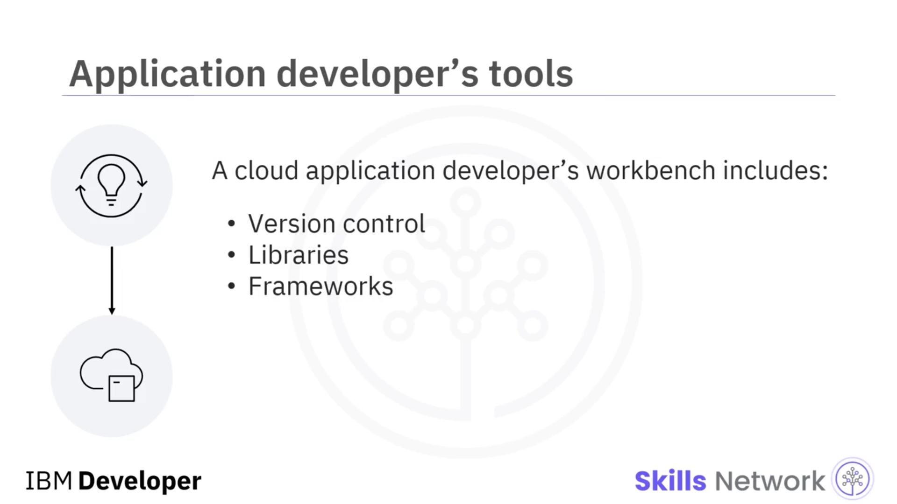
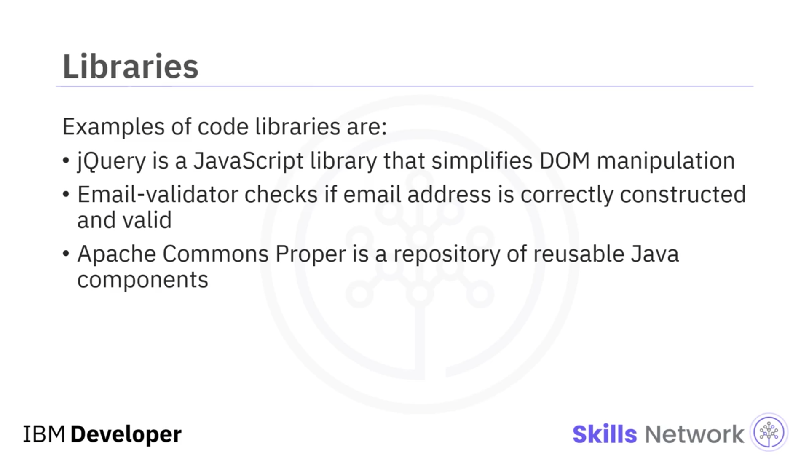
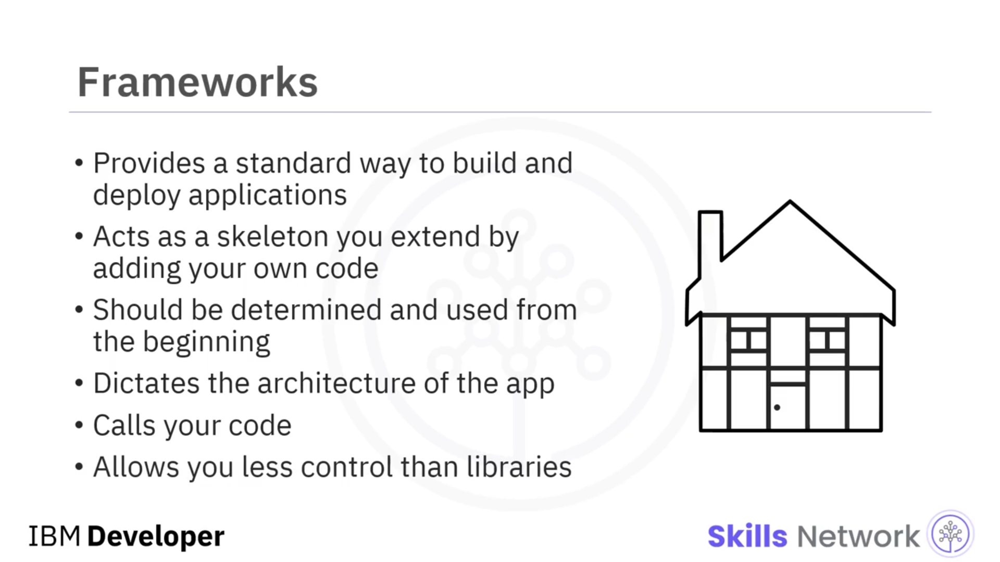
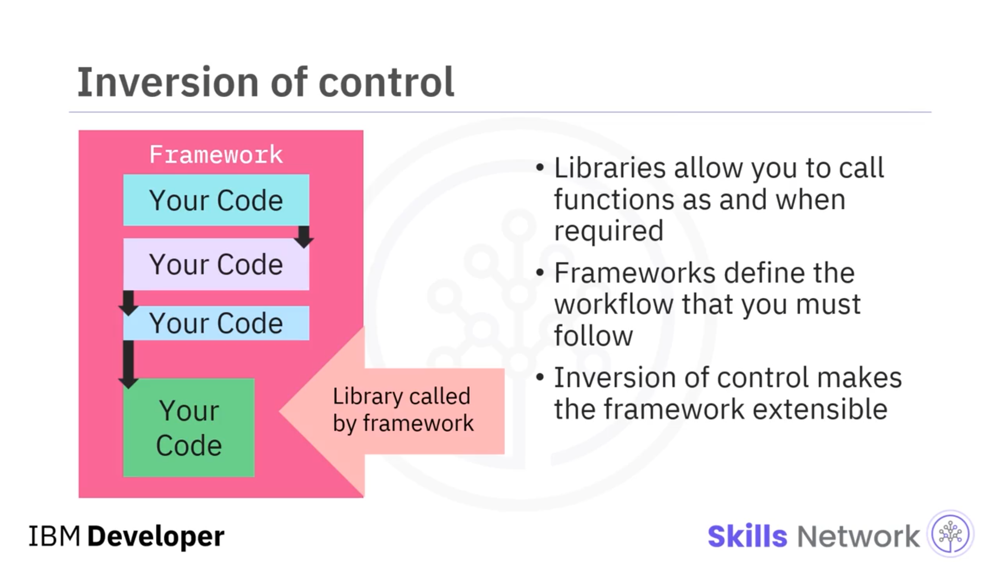
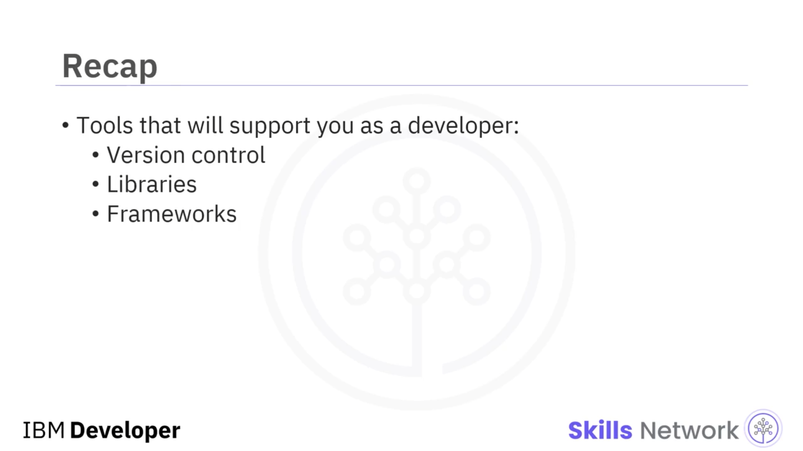

## 🧰 Uygulama Geliştirme Araçlarına Giriş

Uygulama Geliştirme Araçlarına Giriş dersine hoş geldiniz. Bulut uygulamanızı fikir aşamasından tamamen oluşturulmuş, yazılmış ve dağıtılmış hale getirmek uzun bir süreçtir, ancak yol boyunca size yardımcı olacak birçok araç vardır.

Bir bulut uygulaması geliştiricisinin çalışma tezgâhı şunları içerir:  **Sürüm Kontrolü** , **Kütüphaneler** ve  **Framework’ler** .

## 🗂️ Sürüm Kontrolü

Birçok geliştirici aynı proje üzerinde çalıştığında, değişikliklerin hangi sırayla yapıldığını bilmek ve böylece kaynak kodun yeni bir sürümünü oluşturmak son derece önemli hale gelir. Sürüm kontrol sistemleri, hangi değişikliklerin ne zaman ve kim tarafından yapıldığını takip eder ve değişiklikler arasındaki çatışmaları çözer.

Kodunuzu geliştirirken sürüm kontrolü, projede tek katkıda bulunan kişi olsanız bile faydalı olabilir. Doğru kullanıldığında, bir şeyler ters giderse kodunuzun daha eski bir sürümüne geri dönmenizi sağlar ve kodun zaman içinde nasıl geliştiğine dair bazı temel bilgiler verir.

Sürüm kontrol işlevi genellikle kullandığınız depolama sistemiyle bağlantılıdır; bu nedenle, yeni başlayanlar için bile bir kod deposu ( *code repository* ) önerilir.

**Git** ve  **GitHub** , kaynak kod depolama ve yönetimi için son derece popülerdir. Git, dosyaları değişiklikleri takip edebileceğiniz depolarda ( *repositories* ) saklar, daha odaklı geliştirme için kodu farklı dallara ( *branches* ) ayırmanıza ve ardından bunları ana kod gövdesine geri birleştirmenize ( *merge* ) olanak tanır.

## 📚 Kütüphaneler

Kütüphaneler, kodunuz içinde kullanabileceğiniz standart programlar ve alt yordamlar gibi kod koleksiyonlarıdır. Örneğin, bir gezinti özelliği, bir *carousel* gibi, eklemek isteyebilirsiniz — bir kod kütüphanesi size bunun kodunu sağlayabilir, böylece sıfırdan bir tane oluşturmak için zaman ve enerji harcamak zorunda kalmazsınız.

Bu şekilde kodu yeniden kullanabilmek, uygulamanızı geliştirmeyi çok daha hızlı ve kolay hale getirir. Birden fazla kod kütüphanesi mevcut projenize entegre edilebilir.

Belirli bir işlev ya da özelliğe ihtiyaç duyduğunuzu fark ettiğinizde, uygun bir kütüphaneyi araştırabilirsiniz. Gerekli yöntemi ( *method* ) ihtiyaç duyduğunuzda ne zaman çağıracağınıza siz karar verirsiniz. Alt yordam ( *subroutine* ) tamamlandığında kontrol program akışına geri döner. Bir kod kütüphanesi kullandığınızda kontrol sizdedir.

Kod kütüphaneleri genellikle belirli bir problemi çözmek veya belirli bir özellik seti eklemek için kullanılır. Her iki durumda da seçebileceğiniz çok sayıda seçenek vardır; bu yüzden araştırmanızı yapın.

İşte bazı kod kütüphanesi örnekleri:

* **jQuery** , DOM manipülasyonunu basitleştiren bir JavaScript kütüphanesidir.
* **Email-validator** , bir e-posta adresinin doğru şekilde oluşturulup oluşturulmadığını ve geçerli olup olmadığını kontrol eden küçük bir kütüphanedir.
* **Apache Commons Proper** , yeniden kullanılabilir Java bileşenlerinin bir deposudur.
  

## 🧱 Framework’ler

Framework’ler, uygulamaları oluşturmak ve dağıtmak için standart bir yol sağlar. Bir framework’ü, kendi kodunuzu ekleyerek genişletebileceğiniz bir iskelet gibi düşünebilirsiniz; uygulamalarınızı inşa etmek için bir iskele ( *scaffold* ) sağlar.

Kullanmayı planladığınız framework, geliştirme planlamanızın erken aşamalarında belirlenmeli ve en başından itibaren kullanılmalıdır. Yeni framework’ler mevcut bir projeye sonradan dahil edilemez.

Seçtiğiniz framework, programınızın mimarisini belirler ve program akışını kontrol eder. Framework, hangi alt yordamların ve yöntemlerin ne zaman çağrılacağını belirler. Bir framework ile çalışırken, uymanız gereken belirli bir yapı vardır. Framework sizin kodunuzu çağırır; sizin framework’ü çağırmanız yerine.

Framework’ler kütüphanelere göre daha az esnektir; size daha az kontrol sağlar, ancak iyi bir standardizasyon sunarlar ve verimli kod oluşturmanıza yardımcı olabilirler.

Bir benzetme yapmak gerekirse, eğer bir marangoz olarak bir ev inşa ediyorsanız, framework; üzerine eklemeler yaptığınız iskelettir — dışarıya tuğlalar, içeriye alçıpan ve benzeri. İskelet, evin nasıl inşa edileceğine dair bir rehber görevi görür.

İşte bazı framework örnekleri:

* **AngularJS** , dinamik web uygulamaları için JavaScript tabanlı bir framework’tür.
* **Vue.js** , kullanıcı arayüzüne odaklanan bir JavaScript framework’üdür.
* **Django** , web geliştirme için Python kullanan bir framework’tür.

Framework’ler, kütüphanelerin aksine, uymanız gereken iş akışını ( *workflow* ) tanımlar; kütüphaneler ise işlevleri ihtiyaç duyduğunuz anda çağırmanıza izin verir.

## 🔁 Kontrolün Tersine Çevrilmesi ( *Inversion of Control* )

Bir framework kullanırken, bazen siz geliştirici olarak geliştirme süreci üzerinde tam kontrole sahip değilmişsiniz gibi hissedebilirsiniz. Framework’ün ve onun önceden tanımlanmış iş akışının geliştirme sürecini kontrol etmesi hissine **kontrolün tersine çevrilmesi ( *inversion of control* )** denir.

Kontrolü çok fazla olan framework’lere **opinionated** denir — iş akışlarının nasıl kullanılacağı konusunda “görüşleri” vardır ve aksi halde kodun nasıl yazılacağı, dosyaların konumu ve hatta dosya adları hakkında vermeniz gereken birçok kararı ortadan kaldırırlar.

Framework’ler genellikle kendi kütüphanelerini içerir ve ihtiyaç duyduklarında bunları çağırırlar.

Kontrolün tersine çevrilmesi, standartlaştırılmış uygulamalar oluşturmanıza olanak tanır ve sıkıcı yapılandırma işlerinin büyük bir kısmını ortadan kaldırır; böylece uygulamanızın koduna odaklanabilirsiniz.

## ✅ Bu Videoda Öğrendikleriniz

Bu videoda, bir geliştirici olarak kariyerinizde kullanacağınız bazı araçlar hakkında bilgi edindiniz; bunlar arasında:  **sürüm kontrolü** , **kütüphaneler** ve **framework’ler** yer alır.

