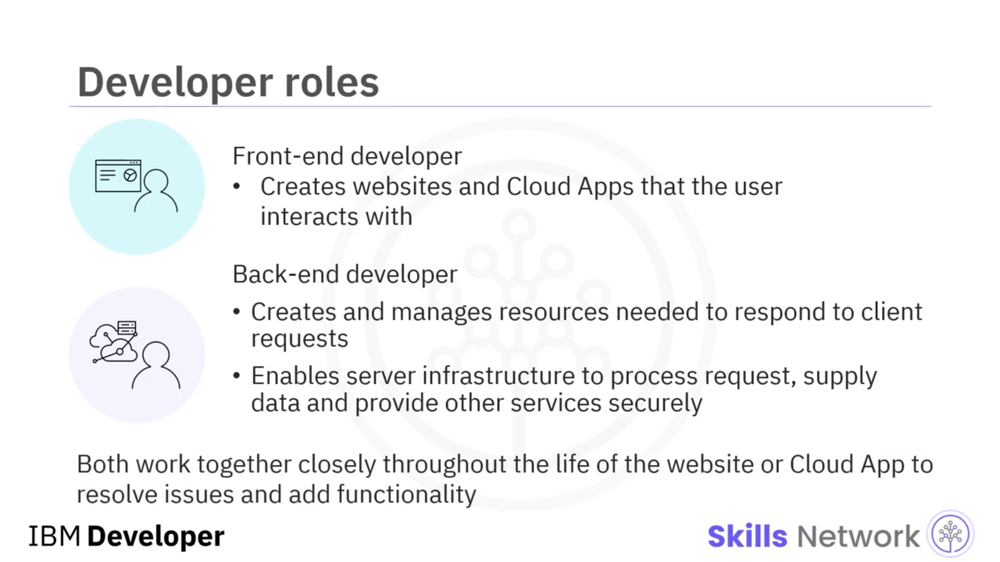
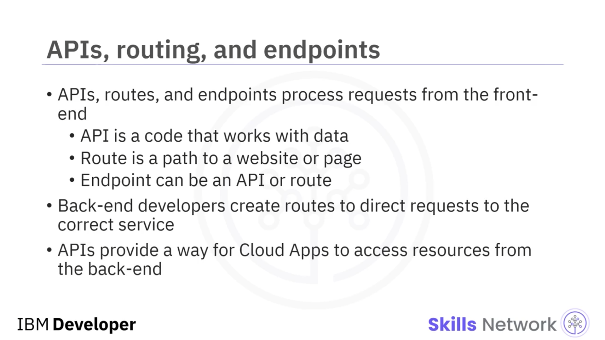
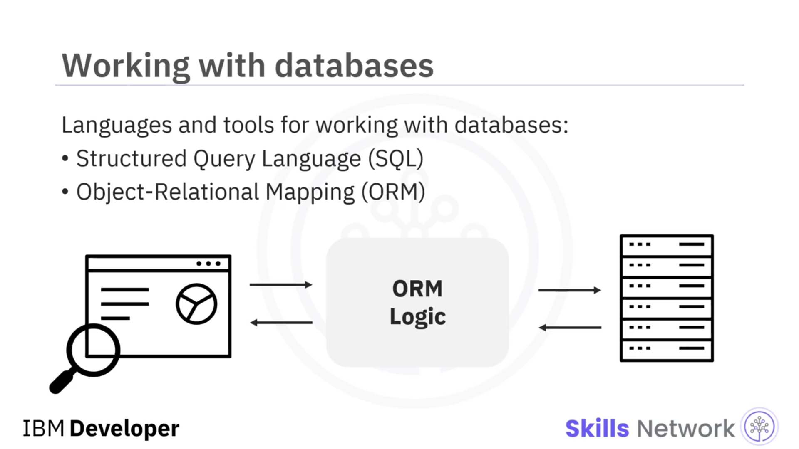
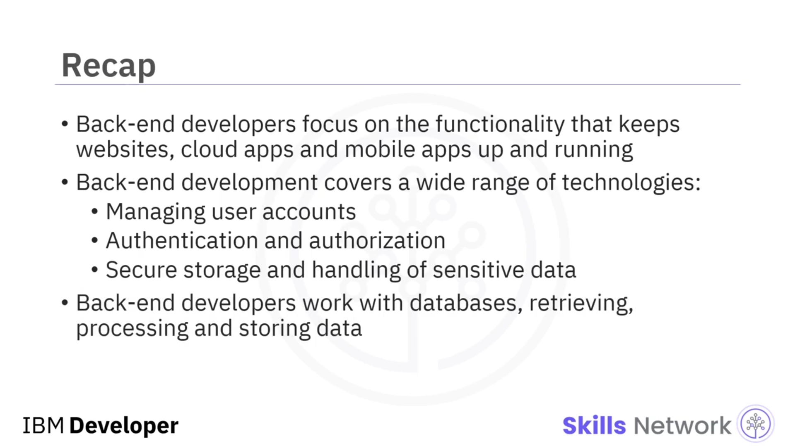

## 🧩 Back-End Geliştirmenin Önemi

Back-end Geliştirmenin Önemi dersine hoş geldiniz. Bir front-end geliştirici, kullanıcıların istemci yazılımında gördüğü ve etkileşim kurduğu şeyi oluşturmak için  **HTML** , **CSS** ve **JavaScript** kullanarak web siteleri ve Bulut uygulamaları oluşturur.

Bir back-end geliştirici ise, kullanıcının istemci üzerinden yaptığı isteklere yanıt vermek için gereken tüm kaynakları oluşturur ve yönetir. Back-end geliştiricinin görevleri, sunucu altyapısının ( *server infrastructure* ) veya back-end’in; istekleri işlemesini, veri sağlamasını ve diğer servisleri güvenli bir şekilde sunmasını mümkün kılmaya odaklanır.

Front-end ve back-end geliştiriciler çok yakın çalışmak zorundadır. Geliştirme süreci başlamadan önce, her birinin çözümün gereksinimlerini ve kendi parçalarının nasıl etkileşime gireceğini anlaması gerekir. Web sitesi veya Bulut uygulamasının yaşam döngüsü boyunca, front-end ve back-end geliştiriciler sorunları çözmek ve işlevsellik eklemek için birlikte çalışır.

## 🛒 İnternette Gezinirken Back-End Sizi Nasıl Etkiler?

Bir back-end geliştiricinin işi, internette gezinirken veya bir Bulut uygulaması kullanırken sizi nasıl etkiler?

Bunu şöyle düşünün: çevrimiçi alışveriş yaparken girdiğiniz verilere ne olur? Giriş bilgileriniz, ürün aramalarınız, ödeme bilgileriniz?

Back-end tüm bunları işler ve back-end geliştiriciler bu girdileri işleyen uygulama parçalarını yazar ve sürdürür.

Çevrimiçi bir alışveriş sitesini keşfederken ve bir satın alma işlemi yaparken yaşadığınız deneyimi düşünelim. Ürün aradığınızda, arama isteğiniz bir web uygulamasına gönderilir; bu uygulama daha sonra veriyi ayrı bir veritabanından alır ve görüntülenmek üzere istemciye geri gönderir.

Bunu mümkün kılmak için, bir back-end geliştiricinin web uygulamasının kullandığı dili, veritabanından doğru veriyi nasıl sorgulayacağını ve bu ikisini nasıl bir araya getireceğini anlaması gerekir.

## 🔐 Hesap Yönetimi, Kimlik Doğrulama ve Güvenlik

Site içinde gezinmek gibi basit bir görev bile bir back-end geliştiricinin becerilerini gerektirebilir. Birçok sitede yalnızca hesabı olan ve giriş yapmış kullanıcıların erişebildiği kısıtlı alanlar vardır. Kullanıcı hesabı yönetimi, kimlik doğrulama ( *authentication* ) ve yetkilendirme ( *authorization* ) da back-end geliştiricinin sorumluluğu olabilir.

Neyi satın almak istediğinize karar verdikten sonra, bunu sepetinize eklemeniz ve ödeme yapmanız gerekir. Satın alma süreci; adresiniz ve kredi kartı numaranız gibi hassas bilgileri göndermenizi gerektirir ve back-end geliştiricinin bu verilerin güvenli bir şekilde işlendiğinden ve saklandığından emin olması gerekir.

Front-end istemci etkileşimleri; bir görsel gibi veri istemek, bir form dolduran kullanıcıdan girdi almak ya da kredi kartı numarası gibi hassas bilgileri güvence altına almak gibi durumların her biri, back-end sunucudan farklı servisler gerektirir. Her istek, back-end ile farklı bir şekilde etkileşime girmek zorundadır.

## 🛣️ API’ler, Routes ve Endpoints

Back-end geliştiriciler gelen istekleri işlemek için  **API’ler** , **routes** ve **endpoints** kullanır:

* Bir  **API** , genellikle **JSON** veya **XML** kullanarak verilerle çalışan koddur. API’lerin belirli kuralları ve yapısı vardır.
* Bir  **route** , kullanıcının etkileşim kurduğu bir web sitesi veya sayfaya giden yoldur. Routes genellikle kullanıcı girdisini alır ve girdiye göre sonuçları gösterir.
* Bir  **endpoint** , bir API olabilir ya da yalnızca bir yol ( *path* ) olabilir.

Front-end’den gelen bir istek back-end’e ulaştığında, doğru servise yönlendirilir. Eğer back-end, routing kullanarak istek için tanımlanmış bir endpoint’e sahipse, istek ele alınır ve yanıtlanır.

## ❌ Endpoint Eksikse: 404

Eğer endpoint eksikse, sunucu **404** hatası döndürür. Back-end geliştiriciler bu sunucu tarafı yönlendirmeyi ( *server-side routing* ) oluşturmalı ve sürdürmelidir.

Back-end API’leriyle birlikte routes, front-end istemcinin back-end’de doğru sokete bağlanmasını etkili biçimde sağlar. API’ler, Bulut uygulamalarının, mobil uygulamaların ve diğer yazılım türlerinin back-end kaynaklarına erişmesi için bir mekanizma sağlar.

## 🧑‍💻 Popüler Back-End Dilleri ve Framework’leri

Tüm bu back-end geliştirmeyi yapmak için, en az bir back-end dili ve onunla ilişkili framework’lere aşina olmanız gerekir.

Bugün en popüler dillerden biri  **JavaScript** ’tir; başlangıçta web tarayıcılarında çalışacak şekilde tasarlanmış, web sayfalarına ekstra etkileşim ve dinamik içerik ekleyen bir dildi. JavaScript, yeni sürümlerin sunucu tarafı işlevsellik eklemesiyle birlikte back-end’de de kullanılmaktadır.

JavaScript’in birçok framework’ü vardır, ancak en iyi bilinen ikisi **Node.js** ve  **Express** ’tir.

Bir diğer popüler dil  **Python** ’dır; çok esnektir ve öğrenmesi kolaydır. Python geniş bir işlevselliğe sahiptir — web sayfaları oluşturmaktan veritabanına bağlanmaya ve veri analizi yapmaya kadar her şeyde kullanılabilir.

İyi bilinen iki Python framework’ü **Django** ve  **Flask** ’tır.

## 🗄️ Veritabanları, SQL ve ORM

Back-end geliştiriciler sık sık veri ve veritabanlarıyla çalışır, bu yüzden biraz **SQL** öğrenmek de size fayda sağlar.

Veritabanlarından gelen istekleri yönetmeye yardımcı olmak için back-end geliştiriciler, veritabanına bağlanmak ve doğru veriyi almak üzere **object-relational mapping (ORM)** araçlarını kullanabilir.

Bir ORM, veritabanlarını sorgulamanın bazı karmaşıklıklarını gizleyebilse de, ortaya çıkabilecek sorunları giderebilmek için veritabanlarının temellerini anlamak faydalıdır.

## 🧠 Back-End Geliştiricinin Günlük İşleri

Bir back-end geliştiricinin günlük işleri, web sitelerini, bulut uygulamalarını ve mobil uygulamaları çalışır halde tutan perde arkası işlevselliğe odaklanır.

Back-end geliştirme; kullanıcı hesaplarını yönetmekten, kimlik doğrulama ve yetkilendirmeye; hassas verilerin güvenli şekilde saklanıp aktarılmasını sağlamaya kadar geniş bir teknoloji yelpazesini kapsar. Back-end geliştiriciler ayrıca veritabanlarıyla çalışır; gerektiğinde veriyi alır, işler ve depolar.

Bir back-end geliştiricinin hayatı çeşitlidir, zorludur ve sürekli değişir.

