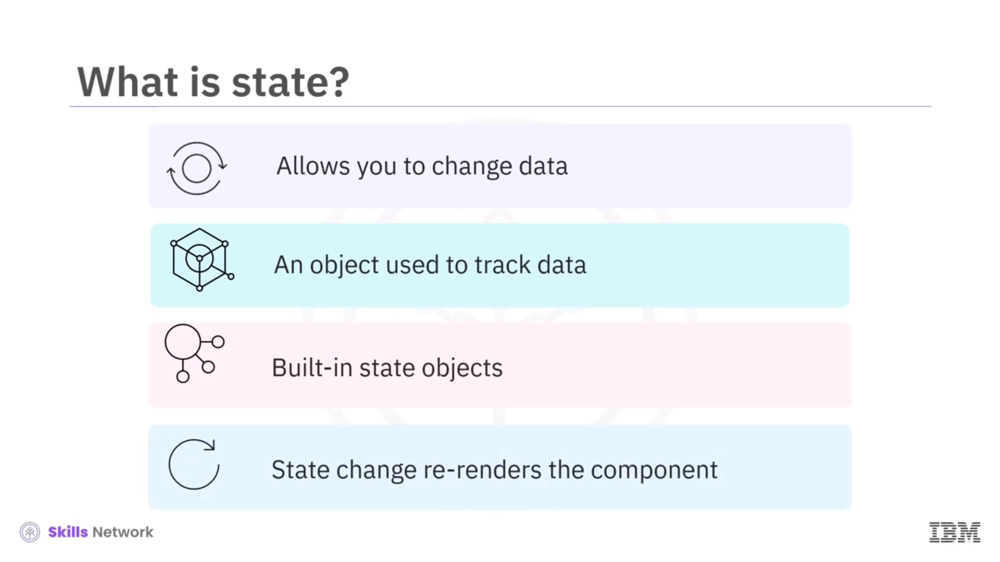
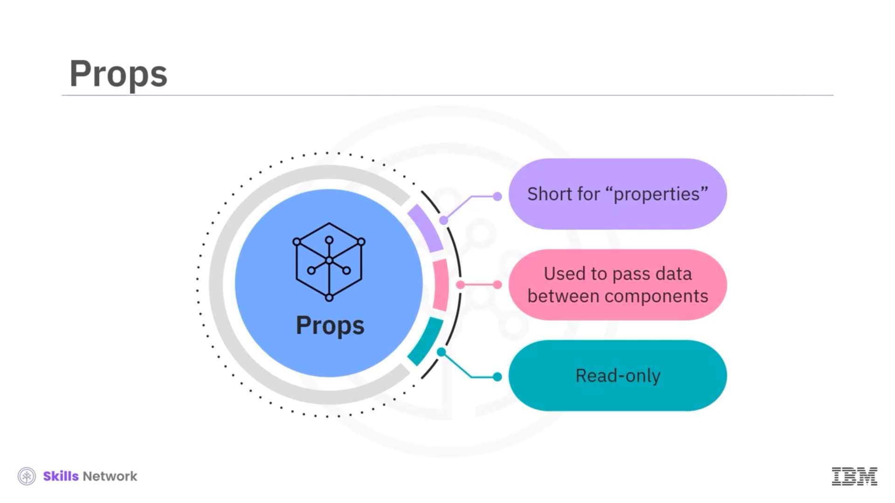
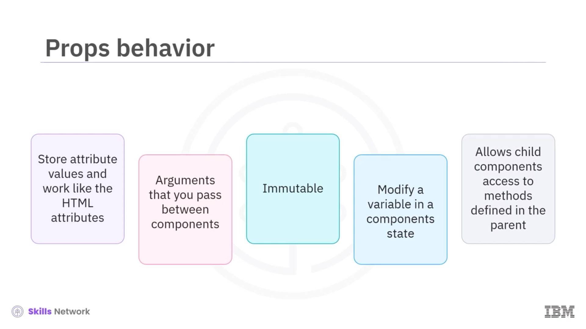

## 🎵 Introduction to States

State’lere Giriş videosuna hoş geldiniz. Bu videoyu izledikten sonra sınıf bileşenlerinde state’lerin kullanımını açıklayabilecek, sınıf bileşenlerinde props’un kullanımını açıklayabilecek, state ve props’u karşılaştırıp zıt yönlerini ortaya koyabileceksiniz.

State’ler bir uygulamada veriyi değiştirmenize olanak tanır. Sınıf bileşenlerinde state nesnesi, uygulamada takip etmek istediğiniz farklı veri türlerini belirten anahtar-değer çiftlerini içerir. React sınıf bileşenlerinde yerleşik bir state nesnesi vardır. Bileşene ait property değerlerini state nesnesinde saklayabilirsiniz. State nesnesindeki bir değişiklik bileşeni yeniden render eder.

---

## 🧠 Local ve Shared State

React bileşenlerinde bir uygulamada iki tür state vardır: local ve shared.

Local state’ler tek bir bileşen içinde yaşar ve diğer bileşenler tarafından erişilemez. Bilgiyi gösterip gizleyen bir bileşen local state kullanır.

Shared state ise birden fazla bileşen tarafından erişilebilir ve değiştirilebilir. Bir sipariş uygulamasındaki sipariş listesi büyük olasılıkla shared state olur.

Sınıf bileşeninin state’i, React’in bileşenin mevcut durumuna dair bilgiyi temsil etmek için kullandığı, sade (plain) bir JavaScript nesnesidir. Her React bileşeninin kalbi state’idir.

---

## ⚙️ State’in Bileşen Davranışına Etkisi

State’ler bir bileşenin nasıl render edildiğini ve nasıl davrandığını belirler. State, dinamik ve etkileşimli bileşenler oluşturmanızı sağlar.

Sınıf bileşenlerinde state, bileşen sınıfının bir instance’ı olup gözlemlenebilir özellikler kümesine sahiptir. Bu özellikler bileşenin davranışını kontrol eder. State’i React bileşeninde yönetir ve korursunuz. Başka bir deyişle, state’i bileşenin yaşam döngüsü boyunca değişebilecek bilgileri içeren bir nesne ile kontrol edersiniz. Bileşeniniz kullanıcı etkileşimi sırasında değişiyorsa veya değişmesi gerekiyorsa, state’ini kullanırsınız.

State, bileşendeki değişimi izlemenize olanak tanır. Buna formlardaki, düğmelerdeki ve zamanlayıcılardaki güncellemeler dahildir.

Örneğin, bir düğme ve sayaç içeren basit bir uygulama düşünün. Kullanıcı düğmeye bastığında sayaç değişkeni bir artar. Sayım değiştikçe bu değeri state’te tutarsınız.

Bu kod örneği, `ID`, `name` ve `age` gibi attribute’lara sahip state içeren bir test bileşenini nasıl oluşturabileceğinizi gösterir. Bileşenin `render` fonksiyonu state attribute’ları olan `name` ve `age` değerlerini döndürür.

---

## 📦 Props Nedir

Props, properties’in kısaltmasıdır. Props’u bileşenler arasında veri aktarmak için kullanırsınız. React’te bileşenler arasındaki veri akışı yalnızca parent’tan child’a doğrudur.

Props, salt okunur (read-only) bileşenlerdir. Prop nesneleri bir tag’in attribute değerlerini saklar ve HTML attribute’ları gibi çalışır. Bir bileşenden diğerine aktarabileceğiniz, fonksiyonlara verilen argümanlar gibi davranırlar. Props immutable’dır ve bileşenin içinden değiştirilemez.

Bir değişken bir süreç boyunca değiştiriliyorsa, bileşenin state’ine ait olmalıdır. Ayrıca props’u, child bileşenlerin parent bileşende tanımlanan metotlara erişmesini sağlamak için de kullanabilirsiniz.

State’i parent bileşende yönetmelisiniz. Child bileşenin kendine ait bir state’i yoktur.

---

## 🧪 Props Örneği

Props ile bir örneğe bakalım. Bu kod, React component’ini genişleten `TestComponent` adlı bir sınıf oluşturur. `name` attribute’unu kabul eden props’ları render eder.

Ardından test bileşenine, `John` ve `Jill` gibi farklı isimler kabul edecek props’lar geçebilirsiniz.

---

## 🔄 State ve Props Karşılaştırması

Bir bileşenin state’ine bileşenin dışından erişemez veya onu değiştiremezsiniz.

Buna karşılık props, child bileşenin parent’ından veri almasına izin vererek bileşenleri yeniden kullanılabilir hâle getirir. Bileşenler kendi verilerini state ile oluşturur ve yönetir; dışarıdan gelen veriyi ise props ile alırlar.

State’i veriyi yönetmek için, props’u ise bileşenler arasında veri taşımak için kullanırsınız. State verisini bileşen içinde değiştirebilirsiniz, ancak bileşenin dışından erişemezsiniz.

Props’tan gelen veri salt okunurdur; başka bir bileşen kullanarak onu değiştiremezsiniz. State’i `setState` metodu ile değiştirebilirsiniz; buna karşılık props’u yalnızca parent bileşenden child bileşene tek yönlü (unidirectional) bir akışla aktarabilirsiniz.

---

## ✅ Video Özeti

Bu videoda state’in, bileşenin mevcut durumuna dair bilgiyi temsil eden bir JavaScript nesnesi olduğunu öğrendiniz. State, etkileşimli bileşenler oluşturmanıza olanak tanır. State verisindeki herhangi bir değişiklik bileşenin yeniden render edilmesine neden olur.

Props’u, bileşenler arasında parent’tan child’a doğru tek yönlü bir akışla veri aktarmak için kullanırsınız. Bileşenler kendi verilerini state ile oluşturur ve yönetir; dışarıdan gelen veriyi ise props kullanarak alırlar.

