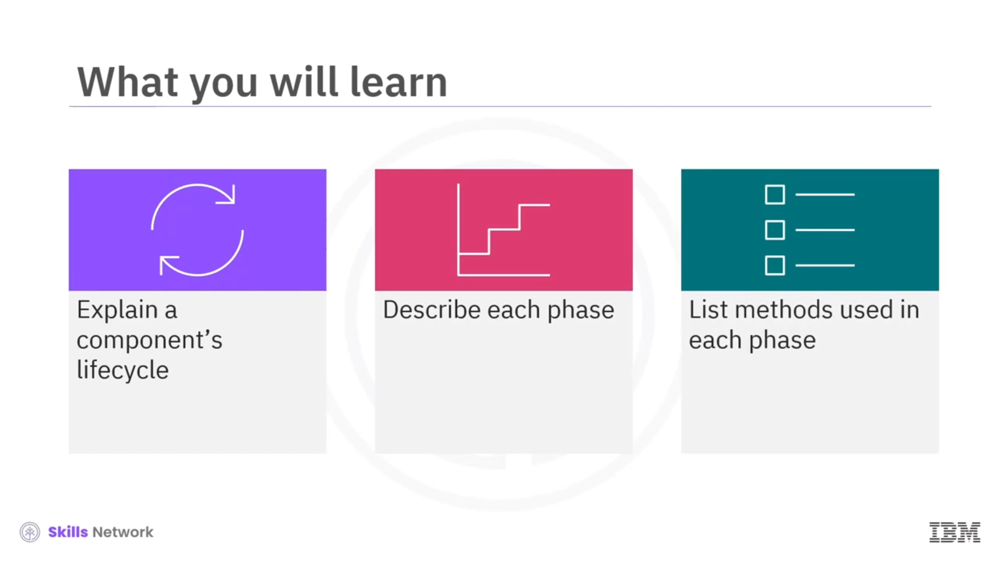
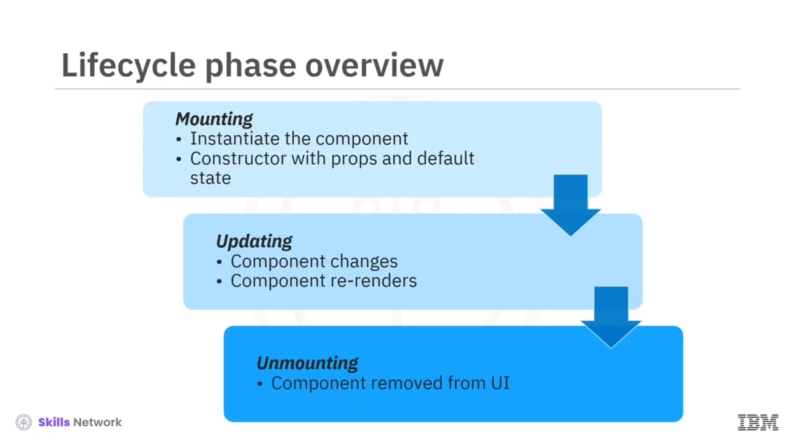
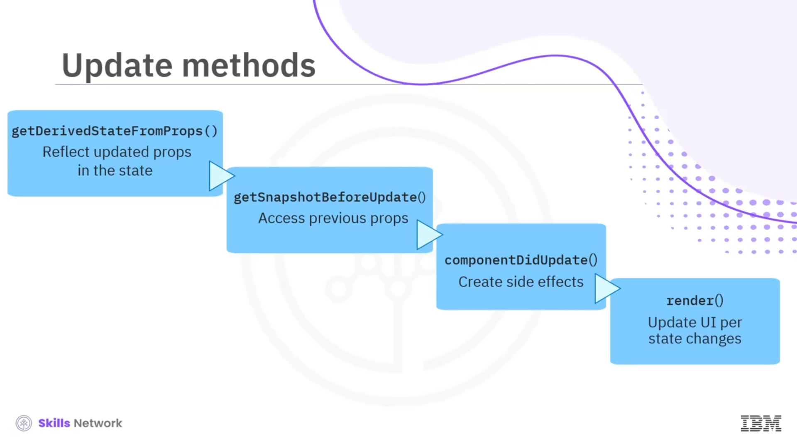

# 🔄 Class Component Lifecycle

Sınıf Bileşeni Yaşam Döngüsü videosuna hoş geldiniz. Bu videoyu izledikten sonra bir bileşenin yaşam döngüsünü açıklayabilecek, her fazı tanımlayabilecek ve her fazda kullanılan metotları listeleyebileceksiniz.

React sınıf bileşenlerinin yaşam döngüleri vardır; yani ömürleri boyunca üç fazdan geçerler. Her faz sırasında React, erişebileceğiniz yaşam döngüsü metotları sağlar.

---

## 🧱 Yaşam Döngüsü Fazları

Bir bileşenin yaşam döngüsünün üç ana fazı vardır. Bu fazlar  *mounting* , *updating* ve  *unmounting* ’dir.

### 🛠️ Mounting

Mounting fazında, nesneyi component sınıfı `constructor`’ını kullanarak oluşturursunuz ve ona varsayılan bir state atarsınız.

### 🔁 Updating

Update fazında, bir bileşenin state’i ve props’ları kullanıcı olayları nedeniyle değişir. Değişiklikler, back end’deki bir değişiklik nedeniyle bileşenin içinde de gerçekleşebilir. Bileşen bu fazda yeniden render edilir.

### 🧹 Unmounting

Son olarak unmounting vardır. Adından da anlaşılacağı gibi bileşen sayfadan kaldırılır.

---

## 🧩 Yaşam Döngüsü ve DOM İlişkisi

Bileşen yaşam döngüsü, bileşenin DOM ile olan ilişkisini ifade eder. Yaşam döngüsü, bileşenler oluşturulup DOM’a mount edildiğinde başlar.

Mount edildikten sonra React, bileşen mantığına göre DOM’u günceller. Sonra da sistem bileşenleri DOM’dan unmount ettiğinde bileşenler ölür.

React, fazına göre ilgili metodu otomatik olarak çağırır. React bu metotları otomatik olarak çalıştırsa da, bileşen davranışı üzerinde daha fazla kontrol elde etmek için bu metotları manipüle edebilirsiniz.

---

## 🧷 Mounting Fazı Metotları

Bileşen mount edilirken kullanılan metotlardan ikisi `componentWillMount` ve `componentDidMount`’tir. `render` metodu da ilk kez bu fazda çağrılır.

Sistem, `render` fonksiyonunun ilk çalıştırılmasından önce `componentWillMount` metodunu çağırır.

Sistem, `render` fonksiyonu ilk kez çalıştıktan hemen sonra `componentDidMount` metodunu çağırır.

---

## 🔧 Updating Fazı Metotları

Update fazına özgü metotlar şunlardır:

* `getDerivedStateFromProps`
* `getSnapshotBeforeUpdate`
* `componentDidUpdate`

Güncellenmiş props’larınız varsa ve bunu bileşen state’ine yansıtmak istiyorsanız `getDerivedStateFromProps` metodunu kullanırsınız.

Bir diğer metot olan `getSnapshotBeforeUpdate`, güncellemeden önce bileşenin önceki props ve state’ine erişmenizi sağlar.

Bu fazda çağrılan son metot `componentDidUpdate`’tir. Bu metot, ağ istekleri göndermek veya `this.SetState` metodunu çağırmak gibi yan etkiler (side effects) oluşturmanıza olanak tanır.

`render` metodunu da çağırırsınız, ancak bu metot yalnızca bu faza ait değildir. Bu fazdaki `render` metodu, bileşeni UI içinde günceller.

---

## 🧼 Unmounting Fazı Metodu

Unmounting fazında yalnızca bir yaşam döngüsü metodu vardır: `componentWillUnmount`.

Sistem bu fonksiyonu bileşeni sayfadan kaldırmadan önce çağırır ve bu, bileşenin yaşam döngüsünün sona erdiğini gösterir.

Bu metot, ağ isteklerini iptal etmek veya listener’ları kaldırmak gibi gerekli temizliği gerçekleştirir.

---

## ✅ Video Özeti

Bu videoda, bir bileşenin yaşam döngüsünün DOM ile olan ilişkisini ifade ettiğini öğrendiniz. Yaşam döngüsündeki üç faz  *mount* , *update* ve  *unmount* ’tur.

*Mount* fazında metotlar `componentWillMount` ve `componentDidMount`’tir.

*Update* fazında çağrılan metotlar `getDerivedStateFromProps`, `getSnapshotBeforeUpdate` ve `componentDidUpdate`’tir.

Son *unmount* fazında React `componentWillUnmount` metodunu çağırır.

`render` metodu hem *mount* hem de *update* fazlarında çağrılır.

