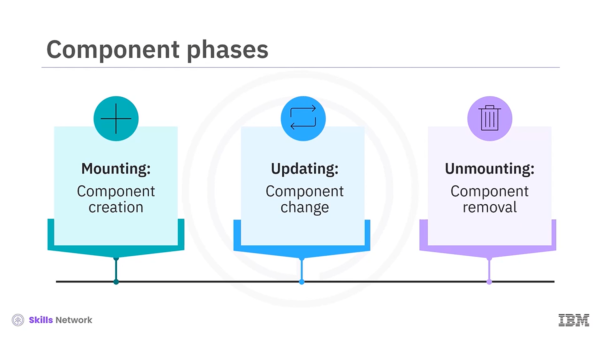
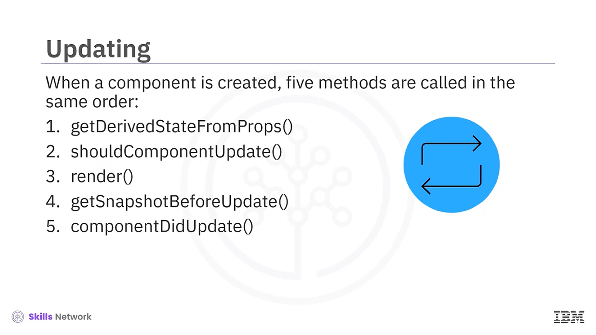
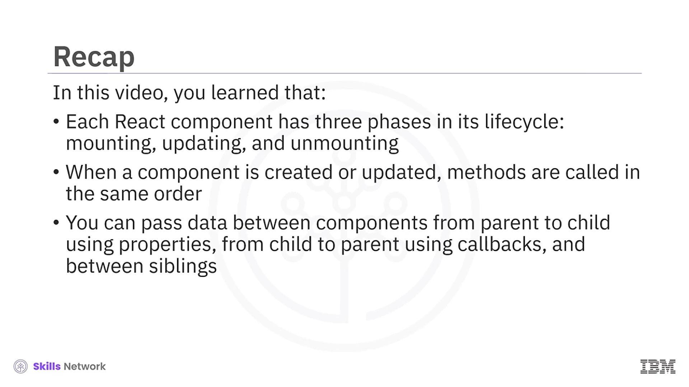

## 🔁 Passing Data and States between Components

Bileşenler Arasında Veri ve State Aktarma videosuna hoş geldiniz. Bu videoyu izledikten sonra React bileşenlerinin yaşam döngüsünü tanımlayabilecek ve bileşenlere veri ile state’in nasıl aktarılacağını açıklayabileceksiniz.

Her React bileşeninin yaşam döngüsünde üç faz vardır.  *Mounting* , bileşenin ilk kez oluşturulduğu zamandır.  *Updating* , state veya properties (props) değişimiyle bileşenin yeniden render edildiği zamandır ve *unmounting* ise bileşenin document object model (DOM)’dan kaldırıldığı zamandır.

---

## 🧱 Mounting Fazı Metotları

Mounting aşamasında dört metot şu sırayla çağrılır.

`constructor` metodu nesneyi oluşturur. Bu metot, belirli props’lar ayarlanıyorsa `props` nesnesi ile `superconstructor`’ı çağırabilir.

`getDerivedStateFromProps` metodu yalnızca state’in props’taki değişikliklere bağlı olduğu durumlarda kullanılır.

`render` metodu React bileşeninde zorunludur. Bu metot bileşenin görünmesini sağlar. Bir DOM elemanı döndürmelidir ve yalnızca tek bir root eleman döndürebilir; bu root eleman çok sayıda iç içe child eleman barındırabilir veya barındırmayabilir.

`componentDidMount` metodu, bir bileşen mount edildiğinde veya DOM ağacına eklendiğinde hemen çağrılır.

Uygulama (App) bileşeni oluşturulduğunda `constructor` çağrılır. `constructor` önce `super` çağırır ve sonra console’a log yazar. Ardından `render` metodu çağrılır. Bu metot console’a log yazar ve sonra bileşeni render eder. Son olarak `componentDidMount` çağrılır. Bunu, render edilen sayfadaki console log sırasından görebilirsiniz.

---

## 🔧 Updating Fazı Metotları

Updating aşamasında beş metot şu sırayla çağrılır.

`getDerivedStateFromProps` metodu yalnızca state’in props’taki değişikliklere bağlı olduğu durumlarda kullanılır.

`shouldComponentUpdate` metodu varsayılan olarak `true` döndürür. State’te her değişiklik olduğunda, bileşenin güncellenip güncellenmemesi gerektiğini kontrol etmek için bu metot çağrılır. Bileşenin ilk oluşturulması sırasında çağrılmaz. State’teki değişiklikleri render etmek istemiyorsanız bu metodun `false` döndürmesini sağlayın.

`render` metodu mounting’de kullanılan render metodunun aynısıdır, ancak burada bileşeni günceller.

`getSnapshotBeforeUpdate` metodu değişiklikler render edilmeden hemen önce çağrılır. Nelerin değiştiğini takip etmeye yardımcı olur.

Bu yaşam döngüsünün döndürdüğü herhangi bir değer, `componentDidUpdate` metoduna parametre olarak iletilir ve `componentDidUpdate`, güncelleme gerçekleştikten hemen sonra çağrılır.

App bileşeninin state’i değiştirildiğinde bileşen güncellenir. State olarak tutulan bir click counter bulunan bir App bileşenini düşünün. Düğmeye tıklandığında `increment counter` çağrılır ve counter state’i bir artar. State her değiştiğinde bileşen yeniden render edilir, ancak bu kontrol edilebilir.

`shouldComponentUpdate` metodu varsayılan olarak `true` döndürür. Bu metot nadiren override edilir; yani davranışı nadiren değiştirilir. Genellikle super-class’tan miras alınır ve `true` döndürür.

`render` metodu console’a log yazar ve ardından bileşeni render eder. Son olarak `componentDidUpdate` çağrılır. Bunu, render edilen sayfadaki console log sırasından görebilirsiniz.

---

## 🧹 Unmounting Fazı Metodu

Bir bileşen unmount edildiğinde veya DOM ağacından kaldırıldığında `componentWillUnmount` metodu çağrılır.

Bu örnekte iki bileşen vardır: `AppInner` ve `app`. `AppInner`, bir state ile `app` içinde render edilir.

`app` bileşeninin mounting fazındaki `componentDidMount` ele alınır ve beş saniyelik bir timer başlatılır. Beş saniye sonra bir callback çağrılır ve inner bileşenin state’i `AppInner` bileşeni yerine bir `div` elemanına çevrilir; bu da bileşenin kaldırılmasına (unmount edilmesine) neden olur.

Sonrasında `AppInner`’ın `componentWillUnmount` metodu çağrılır. Bunu, render edilen sayfadaki console log sırasından görebilirsiniz.

---

## 🔗 React Bileşenleri Arasında Veri Aktarma İlişkileri

React bileşenleri arasında veri aktarabilirsiniz. Bileşenler arasındaki ilişkiyi düşünün. Üç tür ilişki vardır:

* Parent’tan child’a props kullanarak
* Child’dan parent’a callback’ler kullanarak
* Kardeş bileşenler (siblings) arasında Redux kullanarak

Redux bu modülün kapsamı içinde değildir.

Burada iki sınıf vardır: `AppInner` ve `app`. `app` bileşeni, `AppInner` bileşenini içerir. `App` parent’tır ve `AppInner` child’dır.

`App`, `AppInner` için `color` ve `name` property’lerini ayarlar. Parent’taki input kutularına her yeni değer girildiğinde veri child’a aktarılır.

Tarayıcıda bileşen yüklendiğinde varsayılan olarak `John` adı ve `green` rengi görünür. Parent bileşendeki `color` ve `name` değerleri değiştirildiğinde bunlar child bileşene aktarılır ve child yeniden render edilir.

---

## 🔁 Child’dan Parent’a Callback ile Veri Aktarma

Burada veriyi child’dan parent’a aktaracaksınız. Child’a bir callback’i property olarak geçirir, ardından callback üzerinden veriyi parent’a iletirsiniz.

Callback normal bir metottur, ancak bir koşul sağlandığında daha sonra çağrılır.

Bu örnekte `app` parent bileşendir ve bir child bileşen olan `AppInner`’ı içerir. Parent içinde callback `func1`, child’a bir property olarak aktarılır.

`func1`, string argümanı alan bir parent bileşen fonksiyonudur.

`AppInner`’ın `componentDidMount`’unda `sendData` metodunu çağırırsınız. Bu metot, bir saniyelik aralıkla `setInterval` çağırır.

`setInterval`, ilk parametre olarak bir callback ve ikinci parametre olarak callback’in çağrılacağı aralığı alır. Bu durumda her bir saniyede mevcut zaman alınır ve `parentCallback` olarak ayarlanmış metot, zaman değeri geçirilerek çağrılır.

`parentCallback` olarak ayarlanan metot, parent sınıfın state’ini ayarlayan metottur; böylece parent bileşen yeniden render edilir.

Mevcut zamanın, callback aracılığıyla child’dan parent’a aktarıldığını görebilirsiniz. Parent her saniye yeniden render edilir.

---

## ✅ Video Özeti

Bu videoda her React bileşeninin yaşam döngüsünde üç faz olduğunu öğrendiniz:  *mounting* , *updating* ve  *unmounting* .

Bir bileşen oluşturulduğunda veya güncellendiğinde metotlar aynı sırada çağrılır ve bileşenler arasında veri aktarımı yapılabilir: parent’tan child’a properties ile, child’dan parent’a callbacks ile ve kardeş bileşenler arasında.

