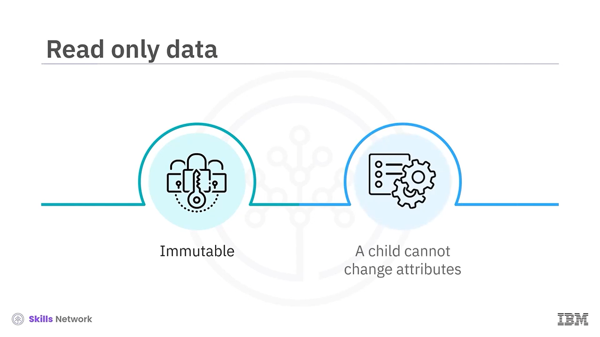
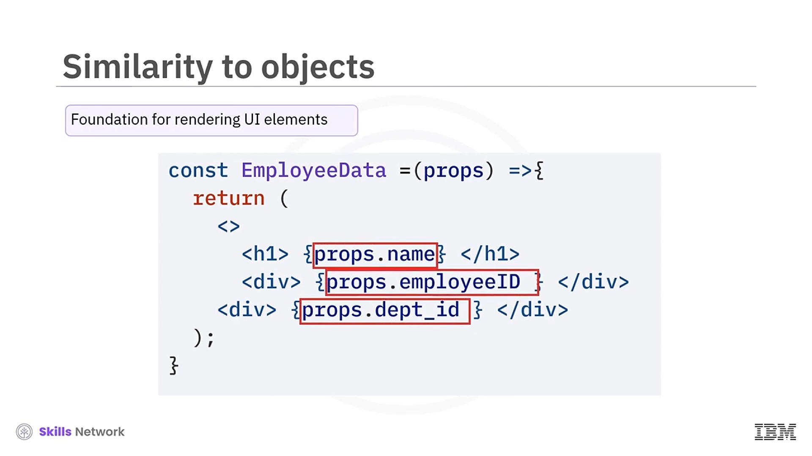
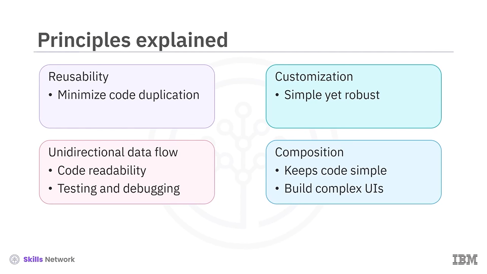

## 🧩 Working with Function Components: Props and Event Handling

Working with Function Components – Props and Event Handling bölümüne hoş geldiniz. Bu videoyu izledikten sonra şunları yapabileceksiniz:

* Bileşenlerde *props* ve *default props* değerinin önemini açıklamak
* *Props* kullanarak bileşenler arasında veri aktarmayı özetlemek
* *Props* ilkelerini açıklamak
* Olayların ( *events* ) *props* ile birlikte nasıl çalıştığını tartışmak

Function Components içinde, özelliklere *props* denir. Temel olarak  *props* , veriyi bir bileşenden başka bir bileşene aktarmanızı sağlar. Esasen bir  *prop* , bir nesneye benzer şekilde çalışır. Bir  *prop* , bir bileşenin niteliklerini saklar ve bu nitelikleri bir üst ( *parent* ) bileşenden alt ( *child* ) bileşenine aktarmanıza olanak tanır. Ancak, bu nitelikleri değiştiremeyeceğinizi unutmayın.

*Props* değiştirilemez ( *immutable* ) yapıdadır; yani veri salt okunurdur ( *read-only* ) ve bir alt bileşenin içinde bunları değiştiremezsiniz.

---

## 🧱 Props ile Veri Aktarma Mantığı

Bu örnekte, **App** bileşeni projenin birincil bileşeni olarak işlev görür. **App** Function component içinde, veri **EmployeeData** adlı bir alt bileşene aktarılır. **App** bileşeninin *return* ifadesi, **EmployeeData** bileşeninin *name* niteliğini **John** olarak atar. Bu örneklerin *import* veya *export* ifadeleri içermediğine dikkat edin.

Şimdi burada gösterilen **EmployeeData** bileşenini inceleyin. Bileşene aktarılan *Props* parametresini görebilirsiniz.

*Props* yerine herhangi bir nesne adını da kullanabilirsiniz. Ancak okunabilirliği artırmak için geleneksel olarak *props* kullanmalısınız. *Return* ifadesi içindeki **H1** öğesinde, nokta operatörü ile *name* değerini kullanırsınız.

*Props* nesnesi, bir bileşene aktarılan tüm özellikleri içerir. Bir bileşeni kullanıp ona `name = John` gibi bir nitelik aktardığınızda, bu nitelik bileşen içinde *Props* nesnesinin bir özelliği haline gelir.

Veriyi başka formatlarda da aktarabilirsiniz. Bu örnekte, **App** bileşeninin *return* ifadesini değiştirin.

Bu sürümde, **EmployeeID** adlı bir `const` tanımladığınızı ve değeri **111** olarak atadığınızı fark edin. Bu  *prop* ’u **EmployeeData** bileşenine süslü parantezler kullanarak dinamik biçimde aktarabilirsiniz. Ayrıca **KeyDepartmentID** prop’u, *return* ifadesinde doğrudan statik **567** değeri olarak ayarlanır. Bunu yapmak için **567** prop değerinin etrafında süslü parantez kullanın.

Bu yapı, React uygulaması içinde UI öğelerini render etmek ve veri aktarmak için temel oluşturur. Ardından bu ayrıntılara *Props* nesnesi ile erişebilir ve bu nitelikleri nokta operatörü kullanarak ön yüzde render edebilirsiniz.

---

## 🧷 Default Props Kullanımı

Bir bileşenin *props* değerleri için varsayılan ( *default* ) değerler tanımlayabilirsiniz.

Üst ( *Parent* ) bileşen belirli bir *prop* için değer sağlamazsa, alt ( *Child* ) bileşen, alt bileşenin **DefaultProps** nesnesinde belirtilen varsayılan değeri kullanır. Bu ifade, **Export** ifadesinden hemen önce görünür.

**EmployeeData** bileşeninin varsayılan değeri, üst bileşende bu değerleri açıkça sağlamasanız bile tutarlı bir render edilmesini garanti eder. Bu durumda, üst bileşen `dept_name` niteliğini aktarmıyorsa, bileşen **DepartmentName** prop’una varsayılan değer olarak **HumanResources** değerini sağlar.

---

## 🧠 Props ve Function Components İlkeleri

*Props* ve function components’in faydalı olmasının arkasındaki ilkeler;  **yeniden kullanılabilirlik (reusability)** ,  **tek yönlü veri akışı (unidirectional data flow)** , **özelleştirme (customization)** ve **bileşim (composition)** kavramlarını içerir. Şimdi bunların her birini tartışalım.

Yeniden kullanılabilirlik açısından, farklı *props* değerleri aktarmak, kodu tekrar etmeden aynı bileşenin farklı varyasyonlarını oluşturmanızı sağlar.

Farklı koşullara veya verilere göre bileşenlerinizin davranışını ve görünümünü özelleştirebilirsiniz.

Verinin tek yönlü akışı, verinin uygulama boyunca nasıl aktarıldığını ve güncellendiğini görmeyi kolaylaştırır; bu da hataların kolayca fark edilmesini sağlar.

 *Props* , özelleştirmeyi mümkün kılar. Basit ama sağlam ( *robust* ) bir kod yazabilirsiniz. Aynı bileşenleri kullanabilirsiniz, ancak *props* esneklik sağlar.

 *Props* , daha karmaşık UI’lar oluşturmak için bu daha basit bileşenler arasındaki iletişim boyunca bileşen bileşimini kolaylaştırır.

---

## 🖱️ Props ile Event Handling Örneği

Event handling’i *props* ile birlikte kullanmayı da bir örnek üzerinden ele alalım.

Bu uygulama örneğinde, `Increase` adlı bir nitelik, **$10,000** değeriyle aktarılır. **Props** adlı bu bileşende, *UseState* hook’u `ShowIncrease` değerinin durumunu ( *state* ) yönetir. Artışın gösterilmesi, yıllık maaş artışı bilgisinin görüntülenip görüntülenmeyeceğini belirler.

Hook’lar ve state’ler, React function component’lerinin önemli parçalarıdır. *UseState* hook’unun ve tıklama ( *click* ) olayının bileşende nasıl çalıştığı şöyledir:

*UseState* hook’u state değişkenleri oluşturur. Bu durumda, `ShowIncreaseState` değişkeni, uygulamanın yıllık maaş artışı verisini gösterip göstermeyeceğini belirten bir boolean değer tutar.

Kullanıcı **Display Annual Salary Increase** düğmesini seçtiğinde, `OnClick` event handler içinde tanımlanmış bir ok fonksiyonunu ( *arrow function* ) tetikler; bu ok fonksiyonun içinde `SetShowIncreaseTrue` çağrılır. Bu fonksiyon, `ShowIncrease` state değerini **true** yaparak UI’ın yıllık maaş artışını göstermesi gerektiğini belirtir.

Bileşen, koşullu render için koşullu çift ve ifadesini ( *conditional double and expression* ) kullanır. `ShowIncrease` **true** ise, yıllık artış bilgisi bir `div` öğesi içinde görüntülenir. Aksi halde, bileşen bu değeri göstermez.

Bu görsel, bu kodun çıktısını gösterir. `ShowIncrease` boolean değeri **false** olduğunda, artış miktarının görüntülenmediğini görebilirsiniz.

Kullanıcı düğmeye tıkladığında, düğme etiketi değişir ve UI, `increase` niteliğinin değerini görüntüler.

---

## ✅ Video Özeti

Bu videoda şunları öğrendiniz:

* Bir  *prop* , bir bileşenin niteliklerini saklar ve bu nitelikleri üst bileşenden alt bileşene aktarmanıza olanak tanır.
* Bir bileşene parametre olarak bir *prop* nesnesi aktarırsınız.
* Veriyi nokta operatörü ile `props.nitelikAdı` formatında tanımlarsınız.
* *Props* ilkeleri:  **reusability** ,  **unidirectional data flow** ,  **customization** ,  **composition** .
* Bir alt bileşeni kontrol etmek için bir event ile birlikte *UseState* hook’unu kullanabilirsiniz.

