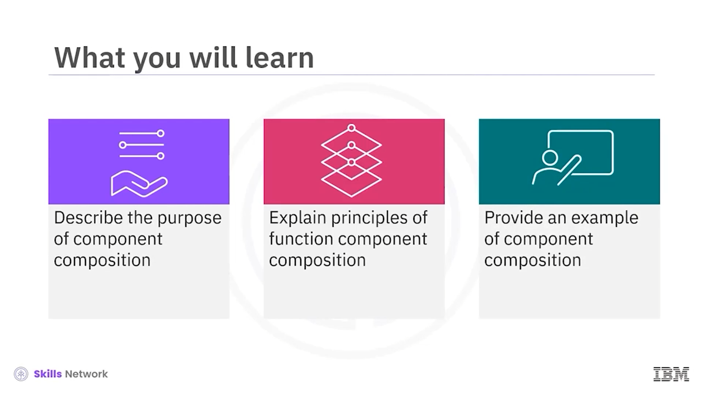
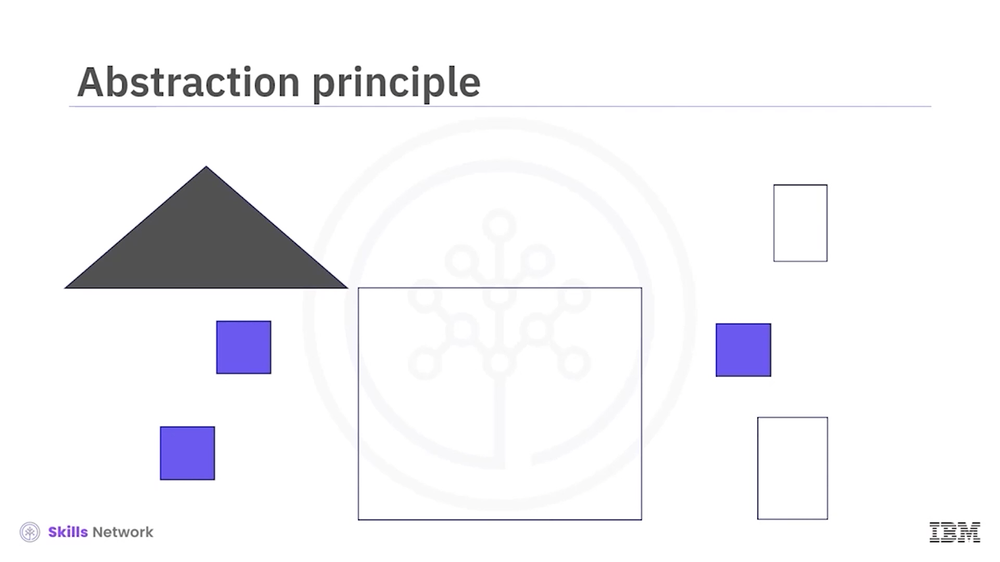
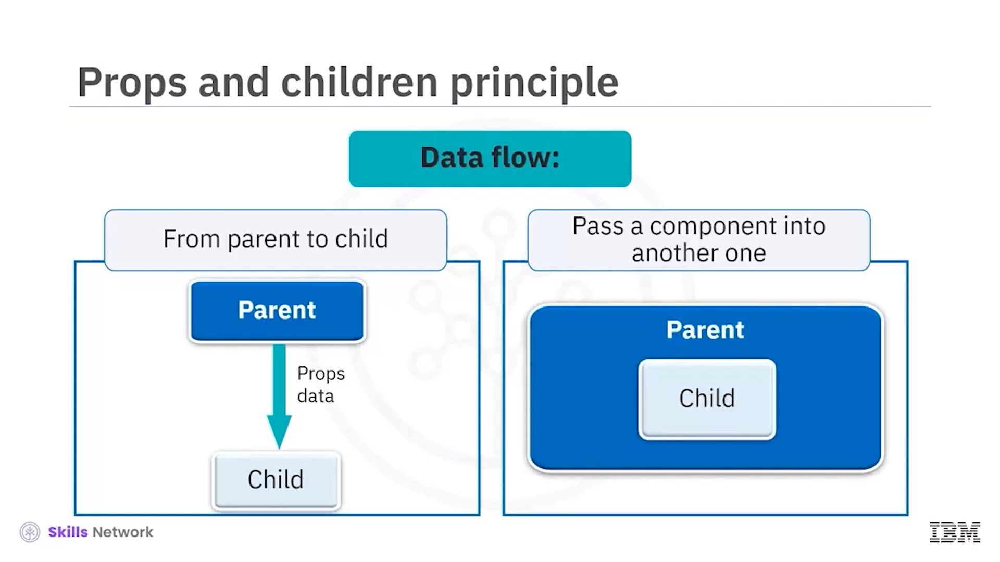
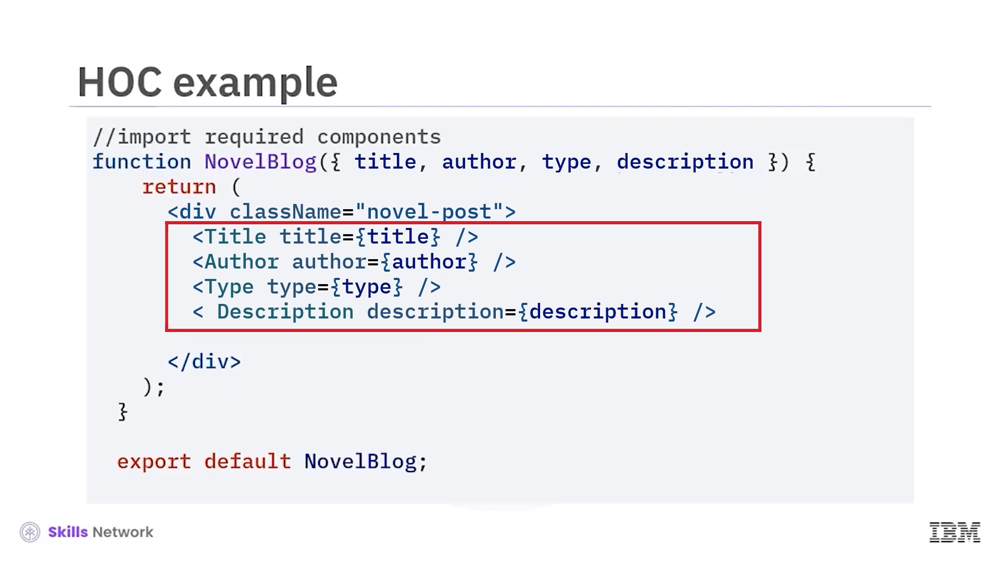
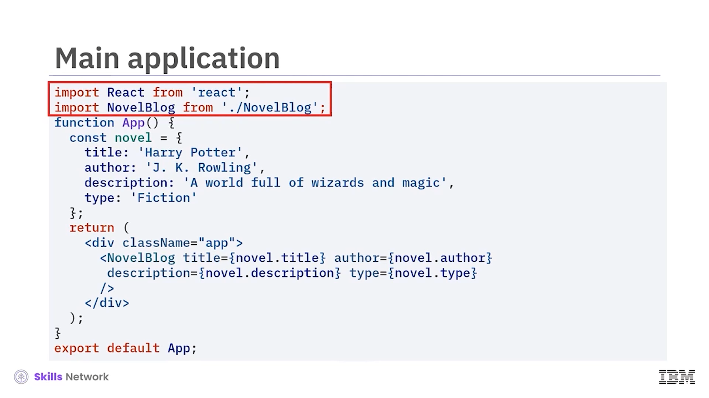

## 🧩 Component Composition

Component Composition bölümüne hoş geldiniz. Bu videoyu izledikten sonra şunları yapabileceksiniz:

* Bileşen bileşiminin ( *component composition* ) amacını açıklamak
* Function component composition ilkelerini açıklamak
* Component composition için bir örnek vermek

Birden fazla bileşeni bileşim ( *composition* ) kullanarak birleştirebilirsiniz. Function components ile, daha küçük birden fazla bileşeni birleştirerek daha karmaşık işlevsellik oluşturursunuz. Küçük yapı taşları kullanarak daha büyük bir UI yapısı inşa edebilirsiniz.

---

## 🧠 Function Component Composition İlkeleri

Function component composition’ın birkaç ilkesini tartışalım:  **abstraction** ,  **reusability** ,  **hierarchy** , **props and children** ve **higher-order components** (HOC’lar olarak da adlandırılır).

### 🧱 Abstraction

Abstraction ilkesi, UI özelliklerini kapsülleyen yeniden kullanılabilir bileşenler oluşturabileceğiniz anlamına gelir. Büyük ve soyut bir UI’ı daha küçük kod parçalarına bölmek için bir yol sağlar.

Component composition, bu kod parçalarını yeniden kullanmanıza olanak tanır; böylece düzenlemeyi ve bakım yapmayı kolaylaştırır. Aynı kodu tekrar etmeyi önlersiniz.

### ♻️ Reusability

Component composition, bu kod parçalarını yeniden kullanmanıza izin vererek organizasyonu ve sürdürülebilirliği kolaylaştırır. Aynı kodu çoğaltmaktan kaçınırsınız.

### 🏗️ Hierarchy

Hierarchy ilkesi, bileşenleri üst ( *parent* ) ve alt ( *child* ) bileşenler şeklinde bir hiyerarşi içinde düzenlemenizi sağlar. Bu hiyerarşik yapı aynı zamanda organizasyona ve modüler tasarıma yardımcı olur.

### 🧷 Props and Children

Component composition, veriyi bir bileşenden diğerine kolayca aktarmanızı sağlar.  *Props* , veriyi bir üst bileşenden alt bileşenine aktarmanıza olanak tanır.

Bileşenler, tüm bileşeni başka bileşenlerin içine aktarmanıza da olanak tanır.

### 🧰 Higher-Order Components (HOCs)

Bileşenleri girdi olarak kabul eden veya geliştirilmiş işlevselliğe sahip bir bileşen döndüren, *higher-order components* adı verilen fonksiyonlar yazabilirsiniz.

Higher-order components, bir bileşenin uygulamasını ( *implementation* ) değiştirmeden, *state management* veya mantık ( *logic* ) gibi özellikleri eklemenize olanak tanır.

---

## 📝 Örnek: Component Composition Kullanım Senaryosu

Bu composition ilkelerinin kullanım senaryosunu gösteren bir örneği inceleyelim.

Romanlar hakkında yazmak için bir blog düşünün. Aşağıdaki kod örnekleri, romanlar için başlık, yazar, tür ve açıklama gibi belirli özellikleri kapsülleyerek genel bir roman blog yazısı oluşturur.

Gerçek bir uygulamada, daha iyi kod organizasyonu ve sürdürülebilirlik için bu bileşenleri ayrı dosyalarda düzenlersiniz.

Bu örnekte, her bileşen tek bir özelliği uygular. Her bir ana özellik benzer bir yapıya sahiptir. Şimdi inceleyelim.

---

## 🏷️ Title Component

Burada  **title component** ’ini görürsünüz. Yapıya dikkat edin. React kütüphanesini içe aktarın. Fonksiyonu adı ve parametresiyle tanımlayın. Biçimlendirilmiş içeriği döndürün. Bileşeni dışa aktarın.

---

## ✍️ Author, Type ve Description Components

Yazar, tür ve açıklama için ek bileşenlere ihtiyacımız olduğunu hatırlayın. Şimdi bunları title component ile karşılaştırarak inceleyelim.

İşte  **author component** . Yapılarının benzerliğine dikkat edin. Sadece fonksiyon adını ve parametresini değiştirirsiniz. Ardından uygun HTML etiketleri ile içeriği biçimlendirirsiniz. Son olarak, dışa aktarılan bileşenin adını değiştirirsiniz.

Benzer şekilde, **description component** ile aynı değişiklikleri yaparsınız. Fonksiyon adını değiştirin. HTML’i değiştirin. Ve export ifadesini değiştirin.

**Type component** için de aynı şekilde. Fonksiyon adını değiştirin, HTML’i değiştirin ve dışa aktarılan bileşenin adını değiştirin.

---

## 🧩 Higher-Order Component Kodu

Şimdi bir higher-order component için koda bakalım. Bu bileşen, tüm veriyi ve biçimlendirmeyi içeren bir sayfa oluşturmak için diğer bileşenleri bir araya getirir.

Tartıştığımız her bileşenin içe aktarıldığına dikkat edin:  **Title** ,  **author** , **type** ve  **description** .

Fonksiyonun adını **NovelBlog** olarak belirlersiniz. Ardından içe aktarılan her bileşeni fonksiyonun parametreleri olarak alırsınız.

Uygun HTML etiketleriyle stillendirilmiş bileşeni döndürürsünüz. Bu bileşen, bileşenleri parametre olarak alan ve daha karmaşık bir bileşen döndüren bir fonksiyondur.

---

## 🧱 Main Application Component

Son olarak, ana uygulama bileşeni kodunu burada görürsünüz. Adım adım inceleyelim.

Bileşenleri ana app bileşenine içe aktarırsınız; burada app fonksiyonunu tanımlar ve ön yüzü oluşturmak için bunları compose edersiniz.

Title, author, description ve type bileşenleri için uygun verilerle novel component’inin bir örneğini ( *instantiation* ) oluşturursunuz.

---

## ✅ Ders Özeti

Bu derste şunları öğrendiniz:

* Component composition ile daha küçük bileşenleri birleştirerek karmaşık bir UI oluşturursunuz.
* Component composition ilkeleri:  **abstraction** ,  **reusability** ,  **hierarchy** ,  **props and children** , ve  **higher-order components** .

