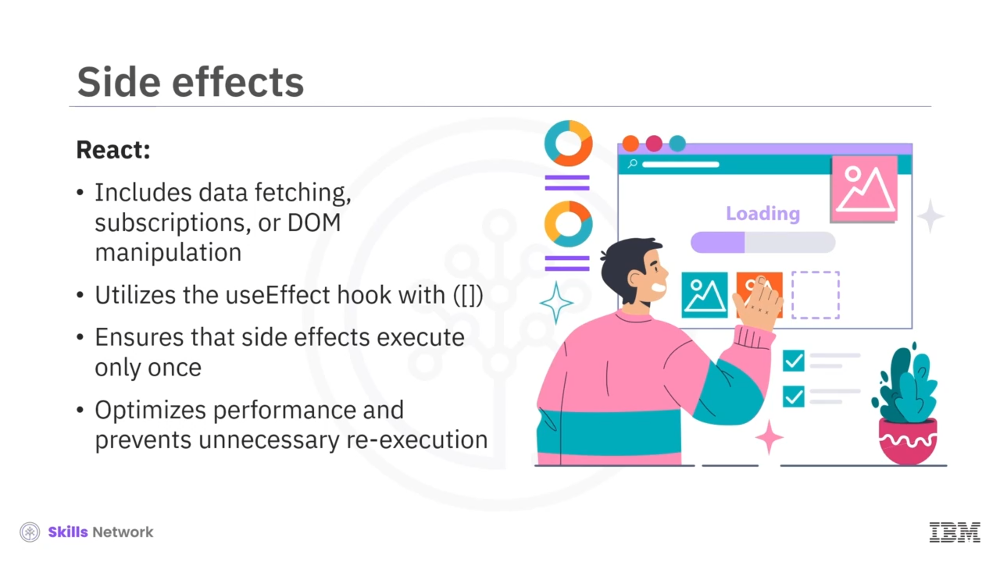

## 🔄 Function Component Lifecycle

Function Component Lifecycle bölümüne hoş geldiniz. Bu videoyu izledikten sonra şunları yapabileceksiniz:

* React’te functional component’leri tanımlamak
* React’te bir functional component’in dört farklı aşamasını ( *phase* ) tanımak

React’te functional component’ler, kullanıcı arayüzleri oluşturmak için temel yapı taşlarıdır. Functional component’lerin yaşam döngüsünü ( *lifecycle* ) anlamak, bileşenlerin varlığı boyunca davranışını ve state’ini yönetmek için gereklidir. Functional component’lerde, class component’lerde bulunan geleneksel lifecycle method’ları bulunmasa da geliştiriciler  *useState* , *useEffect* ve *useReducer* gibi hook’ları kullanarak benzer işlevleri gerçekleştirebilir.

React’te bir functional component’in lifecycle’ı dört ayrı aşamadan oluşur:  **mounting phase** ,  **updating phase** , **unmounting phase** ve  **error handling phase** .

---

## 🧱 Mounting Phase

İlk aşama  **mounting phase** ’dir. Mounting phase sırasında React, functional component’i başlatır ( *initializes* ) ve DOM üzerinde render edilmeye hazırlar.

Mounting phase içinde yer alan önemli adımlar şunlardır:  **initialization** , **state initialization** ve  **side effects** .

### ⚙️ Initialization

Bu adımda React, functional component’in function body’sini çalıştırır; bileşenin başlangıç yapısını ve davranışını kurar.

### 🧷 State Initialization

Initialization’dan sonra React, **state initialization** yapar. Bu adımda React, bileşen içinde state değişkenlerini tanımlamak ve başlatmak için *useState* hook’unu kullanır. Bu state değişkenleri, zamanla değişebilecek verileri tutar ve değiştirildiklerinde bileşenin yeniden render edilmesini tetikler.

Bir örneğe bakalım. Bu örnekte, *useState* hook’u `count` adlı ve başlangıç değeri **0** olan bir state değişkeni oluşturur.

Bu state değişkeni, değeri her değiştiğinde bileşenin yeniden render edilmesini tetikleyen `setCount` fonksiyonu ile aktif olarak güncellenebilir.

### 🧪 Side Effects

Son olarak React, boş bir dependency array ile *useEffect* hook’unu kullanarak veri çekme ( *data fetching* ), abonelikler ( *subscriptions* ) veya DOM manipülasyonu gibi **side effects** işlemlerini gerçekleştirir. Bu adım, side effect’lerin yalnızca ilk render’dan sonra bir kez çalışmasını sağlar; performansı optimize eder ve gereksiz tekrar çalıştırmayı önler.

Bir örnek verelim. Bu örnekte, *useEffect* hook’u bileşen mount edildiğinde `https//api.example.com/data` adresinden veri çeker. Ardından elde edilen veriyi `setData` ile ayarlar; burada boş dependency array, effect’in yalnızca ilk render’dan sonra bir kez çalışmasını sağlar.

Şimdi  **updating phase** ’i tartışacağız.

---

## 🔁 Updating Phase

Updating phase sırasında React, bileşenin state’inde veya props’unda meydana gelen değişikliklere yanıt olarak bileşenin function body’sini yeniden çağırır ( *re-invoking* ). Bu aşama, JavaScript XML ( *JSX* )’in yeniden değerlendirilmesini tetikler ve React’in render edilecek yeni UI’ı belirlemesine olanak tanır.

Bir örnek. Functional component  **myComponent** ’in updating phase’inde, *useState* hook’u `count` state değişkenini **0 point** değerine başlatır. Düğmeye tıklandığında, `increment` fonksiyonu `setCount` kullanarak `count` state’ini önceki değerini bir artıracak şekilde güncelleyerek çağırır. Bu adım, bileşenin yeniden render edilmesini tetikler ve güncellenmiş `count` değerini ekranda görüntüler.

Updating phase, kullanıcı eylemlerine ve state değişikliklerine yanıt vermeyi içerir; UI’ın temel verilerle senkron kalmasını sağlar.

---

## 🧹 Unmounting Phase

Şimdi  **unmounting phase** ’i öğrenelim. Unmounting phase sırasında React, bir bileşeni DOM’dan kaldırırken cleanup işlemlerini yürütür. Bu işlemler, bileşenin lifecycle’ı boyunca oluşturduğu event listener’lar, subscriptions, timer’lar veya diğer kaynakları aktif olarak temizlemeyi içerir.

Bir örnek. Functional component  **myComponent** ’in unmounting phase’inde, *useEffect* içindeki `setInterval` fonksiyonu aktif olarak bir interval timer kurar. Bu timer, her  **1000 milliseconds** ’te bir `interval tick` ifadesini console’a yazdıran bir callback method’u çalıştırır. Bileşen, doğru cleanup sağlamak ve memory leak’leri önlemek için *useEffect* hook’undan bir cleanup fonksiyonu döndürür.

Bu cleanup fonksiyonu, bileşen unmount edildiğinde interval timer’ı temizlemek için `clearInterval` kullanır ve bununla ilişkili kaynakları serbest bırakır.

Bu aktif cleanup mekanizması, bileşen DOM’dan kaldırıldığında interval timer kaynaklarının serbest bırakılmasını sağlar; böylece olası sorunları veya memory leak’leri önler.

---

## 🛡️ Error Handling Phase

Peki React’te render sırasında veya bir child component’in lifecycle method’u içinde bir hata oluşursa ne olur?

React bu gibi durumlarda hatayı en yakın  **error boundary** ’ye yönlendirerek ( *routing* ) ele alır. Bu error-handling mekanizması, functional component lifecycle’ının son aşamasıdır.

Error boundary’ler, React’te child component’lerinin rendering phase’inde veya lifecycle method’larında oluşan hataları yakalayan özel bileşenlerdir. Tüm uygulamanın çökmesi yerine, error boundary’ler bir fallback UI görüntüler; hatanın component tree boyunca daha yukarıya yayılmasını engeller ve belirli bir bileşendeki hataya rağmen uygulamanın geri kalanının çalışır durumda kalmasını sağlar.

---

## ✅ Video Özeti

Bu videoda şunları öğrendiniz:

* React’in lifecycle aşamaları:  **mounting** ,  **updating** , **unmounting** ve  **error handling** .
* Mounting phase, bileşeni başlatır, başlangıç state’ini kurar ve side effect’leri gerçekleştirir.
* Updating phase’te React, function body’yi yeniden çağırır ve JSX’i yeniden değerlendirir.
* Unmounting phase’te React, bileşeni DOM’dan kaldırırken cleanup işlemlerini yürütür.
* React, hatayı en yakın error boundary’ye yönlendirerek ele alır.

