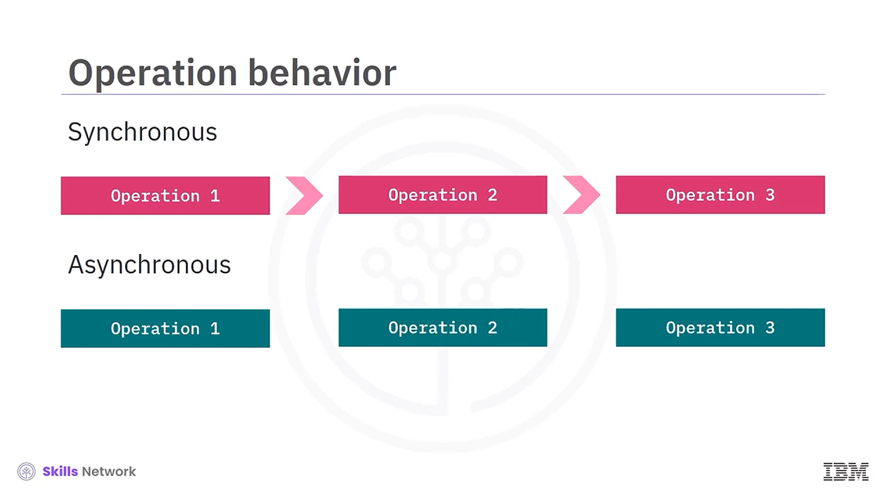
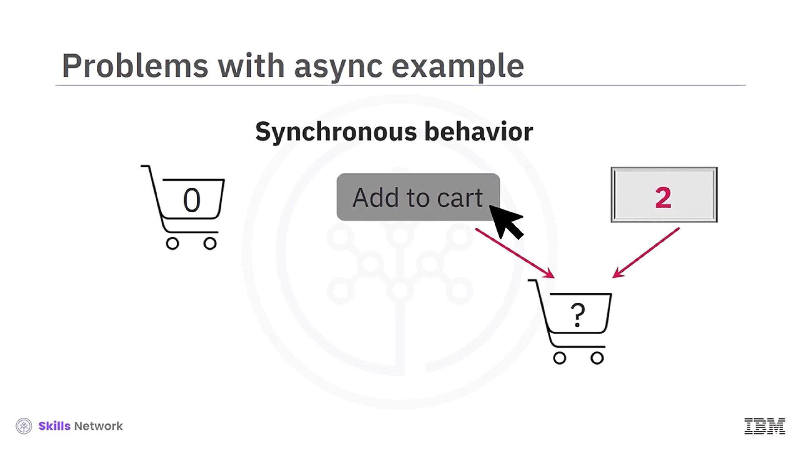
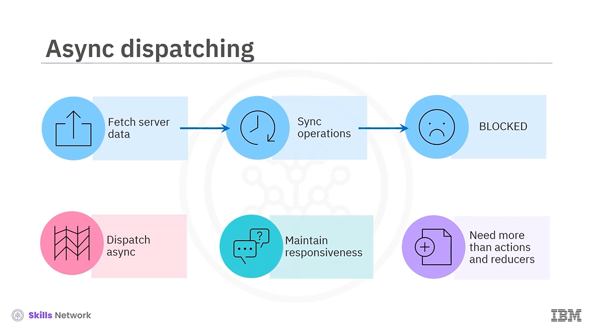

## 🔄 Async with Redux

*Redux ile Asenkron İşlemler’e hoş geldiniz.* Bu videoyu izledikten sonra şunları yapabileceksiniz: *senkron* ve *asenkron* işlemler arasındaki farkları açıklamak, Redux’ta asenkron işlemlerle ilgili zorlukları açıklamak, asenkron işlemlerin oluşturduğu karmaşıklıklara örnekler vermek, async işlemleri yönetmek için *Thunk* ve *Saga* kullanımı açıklamak, *Thunk* ve  *Saga* ’nın artı ve eksilerini karşılaştırmak.

## ⏱️ Senkron ve Asenkron İşlemler

*Senkron* (sync) şekilde çalışan kod, iki işlem verildiğinde, bir işlemin ikinci işlem başlamadan önce çalışmasını tamamlaması gerektiğini ifade eder. Kodunuzda iki işlem varsa ve birinci işlem başlarsa, birinci işlem bitene kadar ikinci işlemi engeller.

*Asenkron* (async) işlemler paralel çalışır. Bu, birinci işlem hâlâ işlenirken ikinci bir işlemin yürütülmeye başlayabileceği anlamına gelir.

## 🎯 Hangi Davranışı Ne Zaman İstersiniz?

Durum hangi davranışa ihtiyaç duyacağınızı belirler. Genel olarak, bir işlemin kullanıcının uygulamayı kullanmaya devam etmesini engellemesini istemediğinizde asenkron davranışı tercih edersiniz.

Bu nedenle  *network istekleri* , bellek yoğun hesaplamalar ve büyük dosyaların yüklenmesi gibi işlemler genellikle asenkron olarak yürütülmelidir. Bu işlemler arka planda çalışabilirken kullanıcı diğer görevleri tamamlayabilir.

## ⚠️ Senkron Davranışın Gerekli Olduğu Durumlar

Senkron davranış da sorunlar oluşturabilir. Durumlar çoğu zaman olayların birbiri ardına işlenmesini gerektirir.

Örneğin, kullanıcı sepete iki ürün eklemek isterse önce kaç ürün eklemek istediğini girmeli, ardından sepeti güncellemek için *Add to Cart* düğmesine tıklamalıdır. Eğer *Add to Cart* düğmesi olayı, ürün sayısını güncellemeden önce gerçekleşirse, yanlış sayıda ürün eklenebilir. Bu durumda senkron davranışı tercih edersiniz.

## 🧩 JavaScript ve Redux Davranışı

JavaScript asenkron davranır. Ancak Redux’ta durum yönetimi senkron davranış gerektirir.

Bir Redux durum değişikliğinin sırasını hatırlayın: süreç, bir *ActionCreator function* çağrısıyla başlar ve bu fonksiyon bir *Action object* döndürür. Sonra *Action object* store’a *dispatch* edilir. Ardından store,  *Action object* ’in *type* özelliğine göre uygun reducer’ı çağırır. Sonuç olarak reducer,  *state object* ’i günceller.

## 🌐 Redux’ta Asenkron İşlemlerin Zorluğu

Action’ları dispatch etmek bazen asenkron işlemler gerektirir. Örneğin, kullanıcınızın uygulamanın sunucudan veri çekmesini istemesi gerektiğini düşünün.

Uygulama senkron şekilde davransaydı, sunucu veriyi döndürene kadar kullanıcıyı uygulamadaki diğer tüm etkileşimlerden alıkoyardı. Bu da sinir bozucu bir kullanıcı deneyimi yaratırdı. Bu durumda, uygulamanın durumlarını yönetmek ve yanıt verebilirliği korumak için işlemleri asenkron olarak dispatch etmek istersiniz.

Ancak gerekli olsa da, bu asenkron davranışı ele almak için yalnızca *actions* ve *reducers* yeterli olmayacaktır.

## 🧱 Middleware’in Rolü

 *Middleware* , asenkron verilerle etkileşim kurmanıza olanak tanır.

Durum değişikliklerini gerçekleştirmek için store’un sağladığı action’ları kullanırsınız. Gerekirse middleware, action’ları yakalar ( *intercepts* ) ve asenkron davranışı desteklemek için onları geciktirir. Asenkron süreç tamamlandığında, Redux akışının geri kalanı her zamanki gibi devam eder; reducer, yeni durumu hesaplamak için action type’ını alır. Son action dispatch, senkron veri akışını yeniden sağlar.

## 🧰 Redux’ta Async İçin Popüler İki Middleware: Thunk ve Saga

Redux ile asenkron davranışı desteklemek için kullanılan en popüler iki middleware: *Thunk* ve  *Saga* .

## 🧵 Thunk

 *Action creator* ’ların bir *action object* döndürdüğünü hatırlayın. *Thunk* ile action creator’lar ayrıca *fonksiyonlar* da döndürür.

Bu fonksiyonlar, Redux store ile etkileşime girmenizi sağlar. Bu fonksiyonlar, API çağrıları gibi asenkron işlemleri ve ayrıca fonksiyonların içinden senkron işlemleri gerçekleştirebilir. Ardından store, sonuçlara göre action’ları dispatch eder.

*Thunk middleware* basit uygulamalar için uygundur ve öğrenmesi nispeten kolaydır. Ancak Thunk içindeki *concurrency* sorunları dikkatli değerlendirme gerektirir. Ayrıca uygulamanız büyürse Thunk iyi ölçeklenmez.

## 🌀 Redux Saga

Asenkron işlemleri ele almak için bir diğer middleware seçeneği  *Redux Saga* ’dır. ES6’da tanıtılan özel fonksiyonlar olan  *generators* ’ı kullanır.

Bu generator fonksiyonları, yani  *Sagas* , asenkron işlemleri ele alma mantığını kapsüllemenize olanak tanır. Sagas, gerektiğinde yürütmeyi durdurup devam ettirerek Redux store dispatch süreciyle birlikte çoklu görev yapabilir.

Sagas, test etmeyi ve hata ayıklamayı kolaylaştıran çeşitli özellikler içerir.  *Pure functions* ’dır; *time travel* ve karmaşık akış günlükleme ( *complex flow logging* ) sağlar. Sagas ayrıca uygulamanız büyüdükçe iyi ölçeklenir.

Buna karşılık, Saga middleware’in sağlam ( *robust* ) yapısı, öğrenmeyi daha karmaşık hale getirir. Generator’ları iyi kullanmak için derinlemesine bir anlayış gereklidir.

## 🧾 Video Özeti

Bu videoda şunları öğrendiniz:

* *Senkron işlemler* , önceki işlem bitene kadar sonraki işlemi engeller.
* *Asenkron işlemler* paralel çalışabilir.
* JavaScript asenkron davranır, ancak Redux mimarisi senkron davranış gerektirir.
* *Thunk* action creator’ları, senkron ve asenkron işlemler yapmanıza olanak tanıyan fonksiyonlar döndürür.
* *Thunk middleware* basit uygulamalar için uygundur ve öğrenmesi nispeten kolaydır.
* *Thunk* iyi ölçeklenmez ve concurrency sorunlarını ele almak için planlama gerektirir.
* *Saga* , gerektiğinde duraklatıp devam ederek Redux store dispatch süreciyle birlikte çoklu görev yapabilen generator fonksiyonlarını kullanır.
* *Saga* , test ve debugging’i kolaylaştıran çok sayıda özellik içerir.
* Saga’nın sağlam yapısı öğrenmeyi daha karmaşık hale getirir ve generator’ları derinlemesine anlamayı gerektirir.

