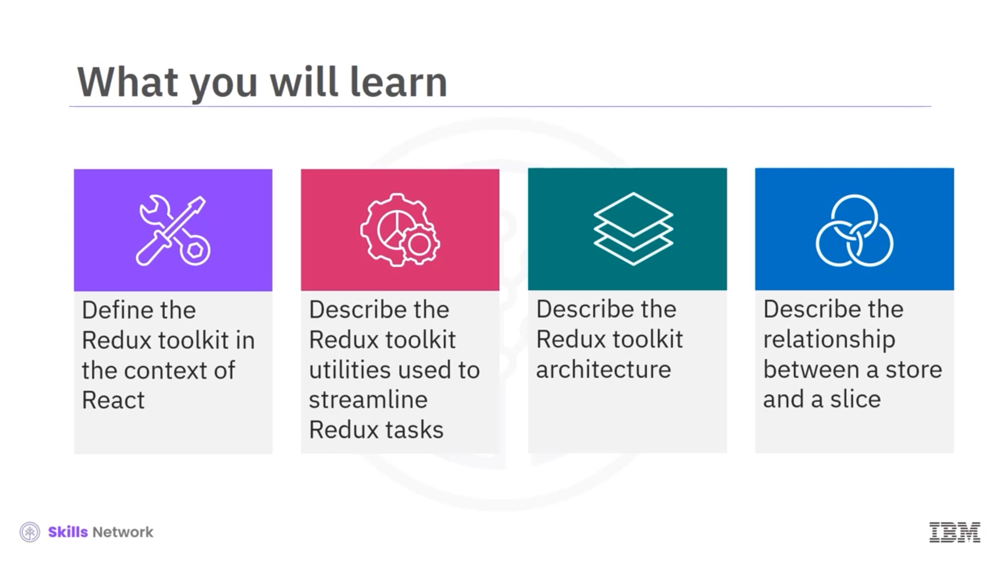
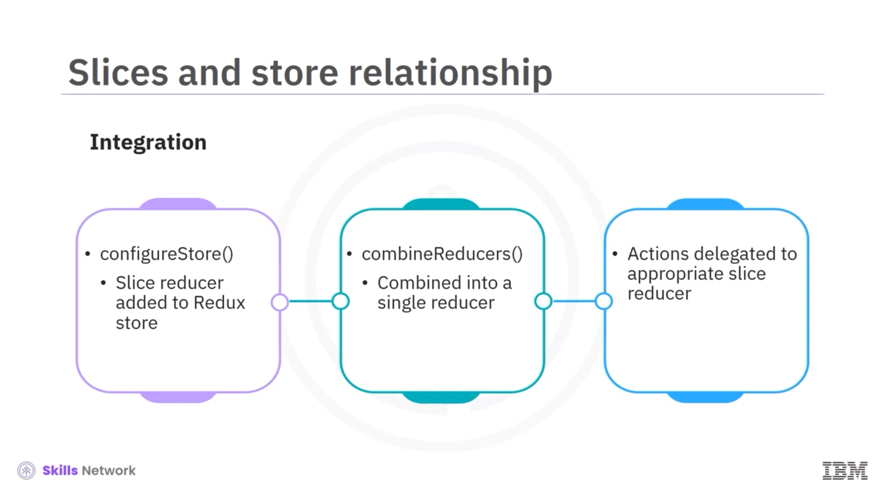
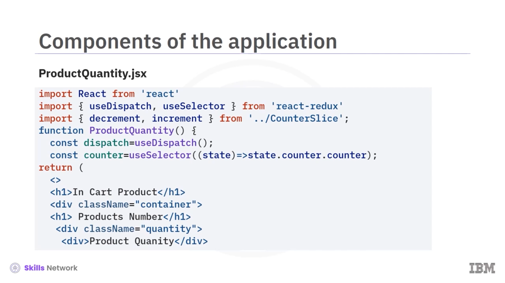
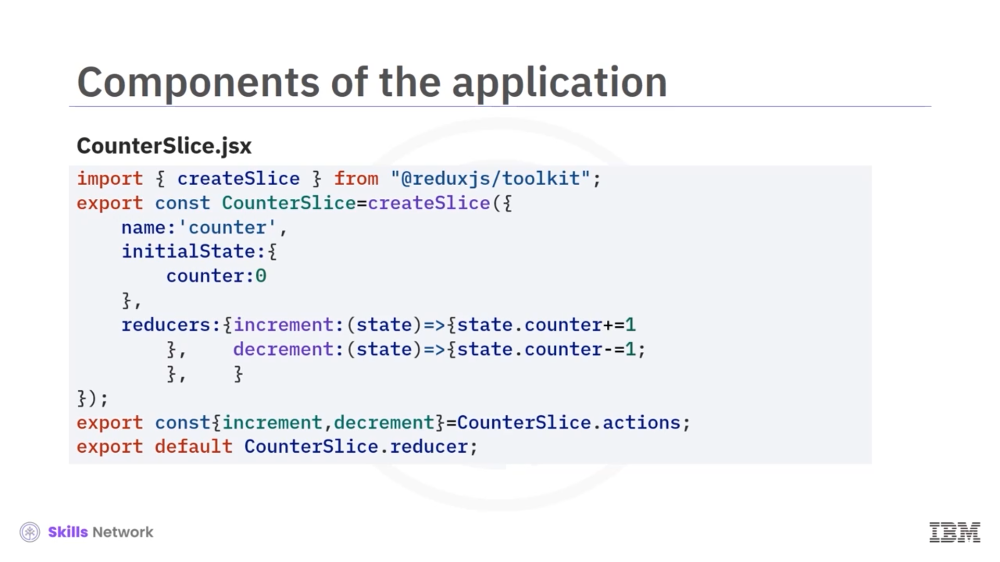
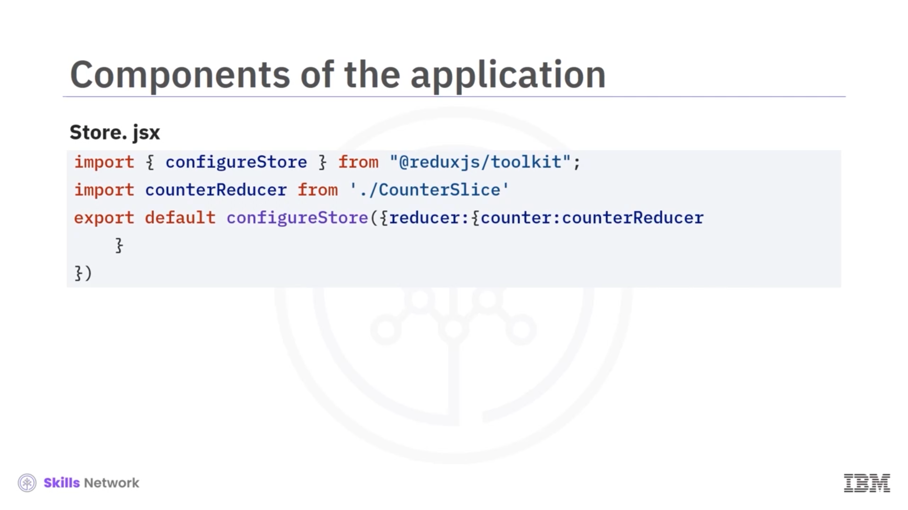

## 🧰 Introduction to Redux Toolkit

*Redux Toolkit hakkında bir videoya hoş geldiniz.* Bu videoyu izledikten sonra şunları yapabileceksiniz: React bağlamında  *Redux Toolkit* ’i tanımlamak, Redux görevlerini kolaylaştırmak için kullanılan *Redux Toolkit yardımcı araçlarını (utilities)* açıklamak, *Redux Toolkit mimarisini* açıklamak, *store* ile *slice* arasındaki ilişkiyi açıklamak.

## ⚙️ React Bağlamında Redux Toolkit Nedir?

React bağlamında  *Redux Toolkit (RTK)* , Redux ekibinin Redux geliştirmeyi basitleştirmek ve daha verimli hale getirmek için sunduğu resmi bir pakettir. Yaygın Redux görevlerini kolaylaştırmaya, *boilerplate* kodunu azaltmaya ve geliştirme sürecini basitleştirmeye yardımcı olan araçlar içerir.

## 🧩 Redux Görevlerini Kolaylaştıran RTK Araçları

 *Redux Toolkit* , Redux görevlerini kolaylaştırmak için yardımcı araçlar içerir. Bir *configureStore* fonksiyonu sağlar; bu fonksiyon, Redux kurulum mantığının birkaç parçasını tek bir fonksiyon çağrısında birleştirir.

Bu fonksiyon; asenkron action’ları yönetmek için *Redux Thunk* gibi yaygın kullanılan middleware’ler ile Redux store’un kurulmasını ve hata ayıklama için  *Redux Devtools Extension* ’ın etkinleştirilmesini içerir.

## 🧱 createSlice ile Slice Reducer’lar

Redux Toolkit, geliştiricilerin state üzerinde *immutable* güncellemeleri otomatik olarak ele alan *slice reducers* tanımlamasını sağlayan *createSlice* fonksiyonunu sunar. Bu fonksiyon, state’i doğrudan mutate etme konusunda endişelenmeden reducer mantığı yazmayı kolaylaştırır.

Redux Toolkit, bir uygulamada Redux’u kurmak için gereken *boilerplate* kodunu önemli ölçüde azaltır. Bu azalma, daha temiz ve daha kısa kod ile daha hızlı geliştirme süresine yol açar.

Redux Toolkit kullanmak, özellikle state yönetiminin karmaşık olabildiği büyük uygulamalarda Redux kod tabanınızı daha temiz, daha düzenli ve bakımı daha kolay hale getirebilir.

## 📦 Kurulum

Redux Toolkit’i bir React uygulamasında kullanmaya başlamak için *npm* veya *yarn* üzerinden yükleyebilirsiniz. Ayrıca uygulamanızda  *React Redux* ’un da yüklü olduğundan emin olun.

## 🗂️ RTK Dosya Yapısı: Slice ve Store

Redux Toolkit en az bir *slice* dosyası ve bir *store* dosyası içerir.

### 🧩 Slice Nedir?

Redux Toolkit’te bir  *slice* , uygulama state’inizin bir parçasını ve onu güncelleme mantığını temsil eder. Slice’lar genellikle Redux Toolkit’in sağladığı *createSlice* fonksiyonu kullanılarak tanımlanır.

Bir slice şunlardan oluşur:

* *reducer*
* *action creators*
* *initial state*

 *Reducer* , mevcut state’i ve bir action’ı alıp, o action’a göre yeni bir state döndüren fonksiyondur.  *Action creators* , store’a dispatch edilecek action’ları oluşturan fonksiyonlardır.  *Initial state* , state slice’ının başlangıç değeridir.

### 🏛️ Store Nedir?

Redux store, uygulamanızın tüm  *state tree* ’sini tutan tek bir JavaScript nesnesidir. Veriniz için  *source of truth* ’tur.

Redux Toolkit’te store, reducer fonksiyonlarını argüman olarak alan bir nesne ile *configureStore* fonksiyonu kullanılarak oluşturulur.

Store şunları sağlar:

* *getState* fonksiyonu ile state’e erişim
* *dispatch(action)* ile state güncellemeleri
* *subscribe(listener)* ile dinleyicileri kaydetme

## 🔗 Slice ve Store Arasındaki İlişki

Slice ve store arasındaki ilişki şöyle özetlenebilir: Slice’lar, uygulama state’inizin tek tek parçalarını ve bunları güncelleme mantığını tanımlar. Store ise tüm bu slice’ların birleştirilerek uygulamanızın tam state tree’sini oluşturduğu yerdir.

Her slice reducer, *configureStore* fonksiyonu kullanılarak store oluşturulurken Redux store’a eklenir. Store, tüm slice reducer’ları *combineReducers* fonksiyonu kullanarak tek bir reducer içinde birleştirir.

Action’lar dispatch edildiğinde, store bu action’ları ilgili slice reducer’lara, onların karşılık geldiği slice’a göre yönlendirir.

## 🛒 Örnek: E-Ticaret Uygulamasında Slice ve Store

Slice ve store arasındaki ilişkiyi bir örnekle anlayalım. Sepetinizdeki ürün miktarındaki artışı, toplam fatura tutarını ve bir satın alımda kazanacağınız ve bir sonraki ödemenizde kullanabileceğiniz *super coins* sayısını gösteren bir e-ticaret uygulamanız olduğunu varsayalım.

Bu uygulamada aşağıdaki bileşenler bulunur:

* **App.jsx** parent component’tir.
* **ProductQuantity.jsx** bir ürün öğesinin miktarını artırır.
* **CartValue.jsx** toplam tutarı hesaplar.
* **CounterSlice.jsx** reducer’ı ve ilişkili action creator’ları tek bir dosyada içerir.
* **Store.jsx** Redux state’ini saklar.
* **Main.jsx** giriş noktasıdır.

### 🧮 ProductQuantity.jsx

 **ProductQuantity.jsx** , bir ürünün miktarını gösterir ve kullanıcıların bunu artırıp azaltmasına izin verir. Redux store ile etkileşim kurmak için React Redux’tan *useDispatch* ve *useSelector* hook’larını içe aktarır.

 *useSelector* , Redux store’dan  *counter state* ’ini çıkarmak için kullanılır. Bileşen, miktarı artırmak veya azaltmak için butonlar render eder.

Bu butonlara tıklandığında, **CounterSlice** içindeki ilgili *increment* veya *decrement* action’ı, *dispatch* kullanılarak Redux store’a dispatch edilir.

## 💰 CartValue.jsx

**CartValue.jsx** bileşeni, Redux store’da saklanan ürün miktarına göre toplam fatura tutarını belirler ve görüntüler.

Redux store’dan counter bilgisini almak için *useSelector* kullanır. Nihai tutar, ürün sayısı ve birim başına belirli bir fiyat kullanılarak hesaplanır.

### 🧩 CounterSlice.jsx

**CounterSlice.jsx** dosyası, *counter* adlı bir Redux slice tanımlar.

Counter state’ini sıfıra başlatır ve iki reducer tanımlar: *increment* ve  *decrement* . Increment veya decrement action’ları dispatch edildiğinde, counter state’i buna göre güncellenir.

### 🏛️ Store.jsx

**Store.jsx** dosyası, Redux store’u Redux Toolkit’teki *configureStore* kullanarak yapılandırır.

 **CounterSlice** ’tan  *counterReducer* ’ı içe aktarır ve bunu CounterSlice için reducer olarak ayarlar. Ardından *configureStore* export edilir ve uygulamada kullanılır.

### 🚪 main.jsx

**main.jsx** bileşeni, uygulamanın giriş noktasıdır. Redux store’u prop olarak geçirerek app bileşenini React Redux’taki *provider* bileşeni ile sarar.

## 🧾 Video Özeti

Bu videoda şunları öğrendiniz:

* React bağlamında  *Redux Toolkit (RTK)* , Redux geliştirmeyi basitleştirmek ve daha verimli hale getirmek için Redux ekibinin sağladığı resmi bir pakettir.
* Redux Toolkit, Redux kurulum mantığının birkaç parçasını tek bir fonksiyon çağrısında birleştiren *configureStore* fonksiyonunu sağlar.
* Redux Toolkit, *immutable* state güncellemelerini otomatik olarak ele alan “ *slice reducers* ” tanımlamayı sağlayan *createSlice* fonksiyonunu sunar.
* Redux Toolkit’te bir  *slice* , uygulama state’inizin bir parçasını ve onu güncelleme mantığını temsil eder.
* Redux store, uygulamanızın tam state tree’sini tutan tek bir JavaScript nesnesidir.

