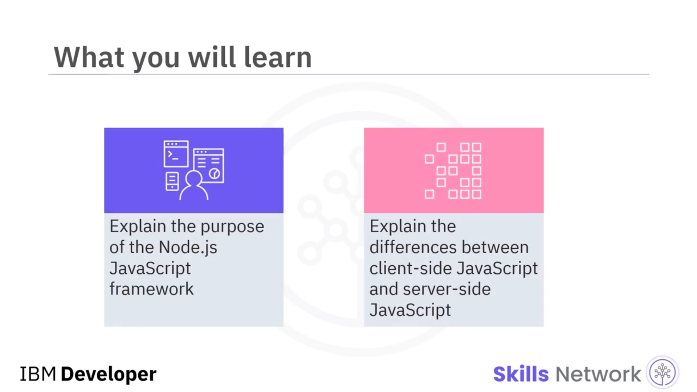
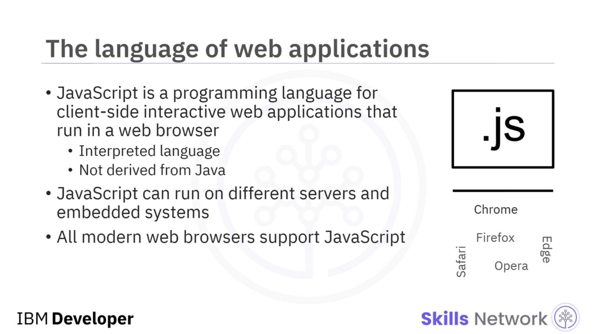
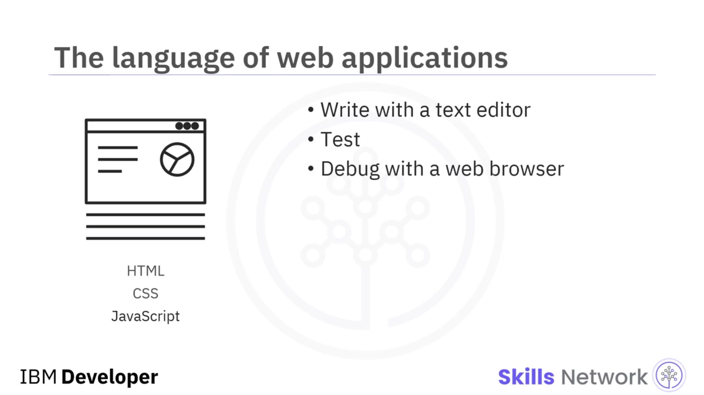
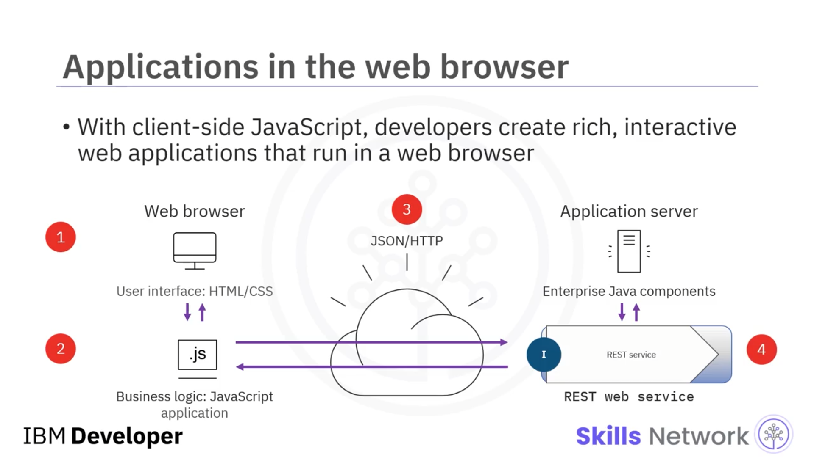
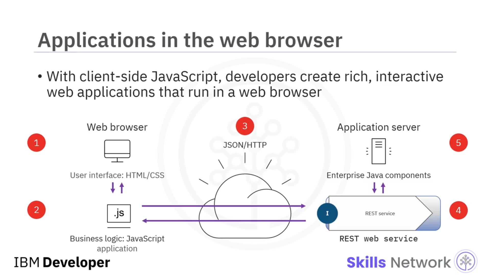
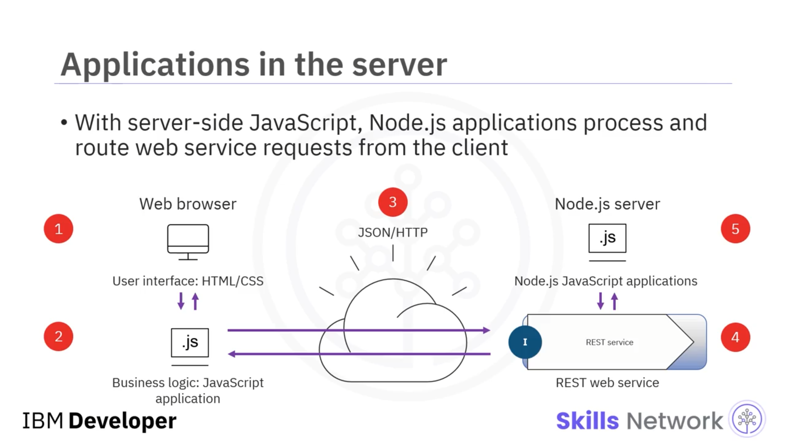
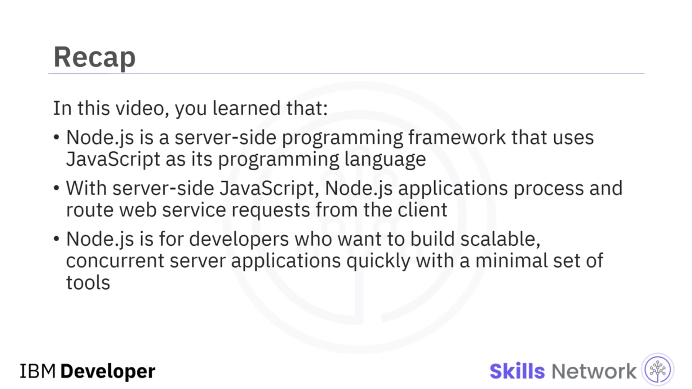

## 🧩 Introduction to Server-Side JavaScript

### 🎬 Videoya Giriş

Sunucu tarafı JavaScript’e Giriş’e hoş geldiniz. Bu videoyu izledikten sonra şunları yapabileceksiniz: *Node.js JavaScript çerçevesinin* amacını açıklamak ve *istemci tarafı JavaScript* ile *sunucu tarafı JavaScript* arasındaki farkları açıklamak.

---

### 🌐 JavaScript’in Web’deki Yeri

JavaScript, World Wide Web’de kullanılan ana dillerden biridir. Başlangıçta, esas olarak tarayıcıların bulunduğu istemcilerde statik web sitelerine dinamik davranış eklemek için geliştirilmiştir.

JavaScript yorumlanan ( *interpreted* ) bir dildir. JavaScript uygulamalarını çalıştırmadan önce derlemeniz gerekmez. Dil sözdizimi Java’ya benzese de, Java programlama dilinden türetilmemiştir.

---

### 🖥️ JavaScript’in Çalışabildiği Ortamlar ve Web Uygulamaları

JavaScript artık farklı sunucularda ve gömülü sistemlerde çalıştırılabilir ve tüm modern web tarayıcıları JavaScript’i destekler.

Geliştiriciler,  *hypertext markup language (HTML)* , *cascading style sheets (CSS)* ve JavaScript ile duyarlı ( *responsive* ), etkileşimli web uygulamaları geliştirir. Bir metin düzenleyici ve bir web tarayıcısı ile JavaScript uygulamalarını hızlıca yazabilir, test edebilir ve hata ayıklayabilirsiniz.

---

### 🧭 İstemci Tarafı JavaScript Akışı

İstemci tarafı JavaScript ile geliştiriciler, web tarayıcısında zengin, etkileşimli web uygulamaları oluşturur.

**Adım 1:** Kullanıcı arayüzü HTML ve CSS kullanılarak oluşturulur.
**Adım 2:** Kullanıcı web sayfasında bir seçenek seçtiğinde, bir JavaScript uygulaması tarafından yazılmış iş mantığını ( *business logic* ) tetikler.
**Adım 3:** JavaScript uygulaması, *JavaScript Object Notation (JSON)* kullanarak *hypertext transfer protocol (HTTP)* üzerinden bir web servis isteği gönderir.

---

### 🧱 Sunucu Tarafında REST Servisi ve Geleneksel Back-End Dilleri

Sunucuda, bir *Representational State Transfer (REST)* web servisi çağrıyı yakalar. Bu servis geleneksel olarak Java, *PHP: Hypertext Preprocessor (PHP)* veya başka bir back-end diliyle yazılırdı.

Son adımda, uygulama sunucusu web servis isteğini *Enterprise Java components* gibi sunucu tarafı bir uygulama kullanarak işler ve istemciye geri döndürür.

---

### 🧠 Sunucu Tarafı JavaScript ve Node.js Akışı

Sunucu tarafı JavaScript ile  *Node.js uygulamaları* , istemciden gelen web servis isteklerini işler ve yönlendirir.

Aşağıdaki diyagramı önceki slayttaki ile karşılaştırın. Adımların çoğu aynıdır.

**Adım 1:** Kullanıcı, HTML ve CSS ile yazılmış kullanıcı arayüzünde bir seçenek seçer.
**Adım 2:** Seçenek, istemci tarafında iş mantığını uygulayan bir JavaScript uygulamasını tetikler.
**Adım 3:** JavaScript uygulaması, JSON ile yazılmış bir veri yükü ( *data payload* ) ile HTTP üzerinden bir web servis çağrısı yapar.
**Adım 4:** Bir REST web servisi HTTP isteğini yakalar.
**Son adım:** *Enterprise Java* uygulamasını çağırmak yerine, Node.js sunucusu JavaScript diliyle yazılmış bir uygulamayı barındırır. JavaScript ile yazılmış bu kod sunucuda çalışır, istemcinin web tarayıcısında değil.

---

### ✅ Videoda Öğrendikleriniz

Bu videoda şunları öğrendiniz:

* Node.js, programlama dili olarak JavaScript kullanan bir sunucu tarafı programlama çerçevesidir.
* Sunucu tarafı JavaScript ile Node.js uygulamaları, istemciden gelen web servis isteklerini işler ve yönlendirir.
* Node.js, minimum araç setiyle hızlı şekilde ölçeklenebilir ( *scalable* ), eşzamanlı ( *concurrent* ) sunucu uygulamaları geliştirmek isteyen geliştiriciler içindir.

