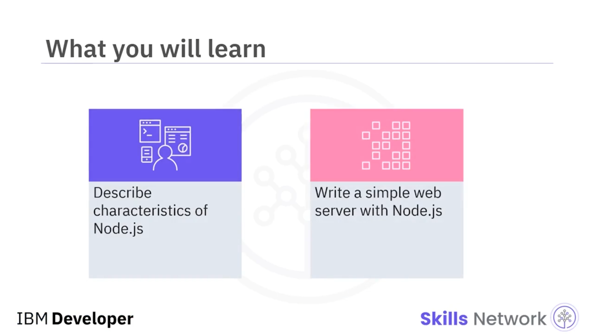
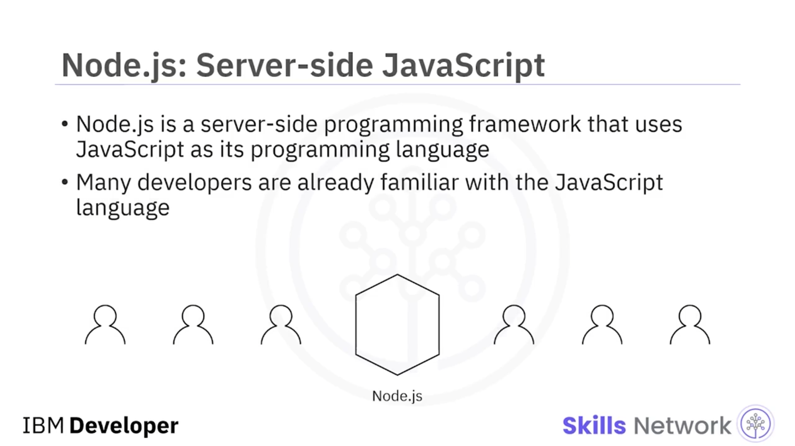
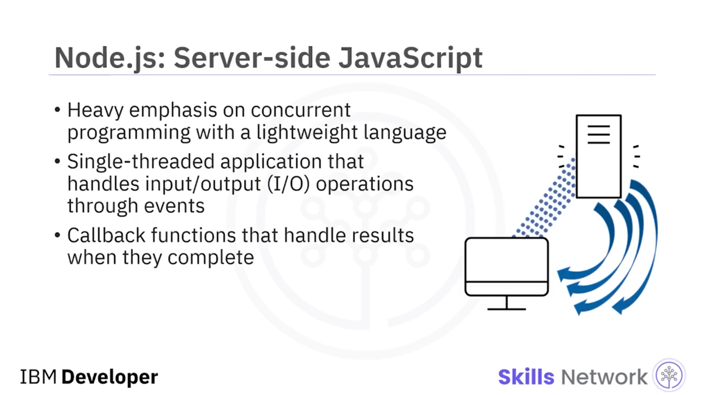
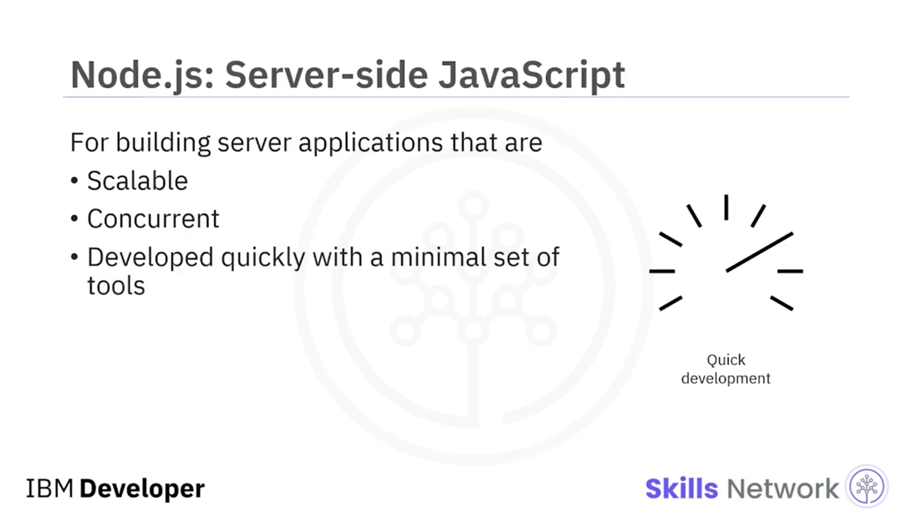
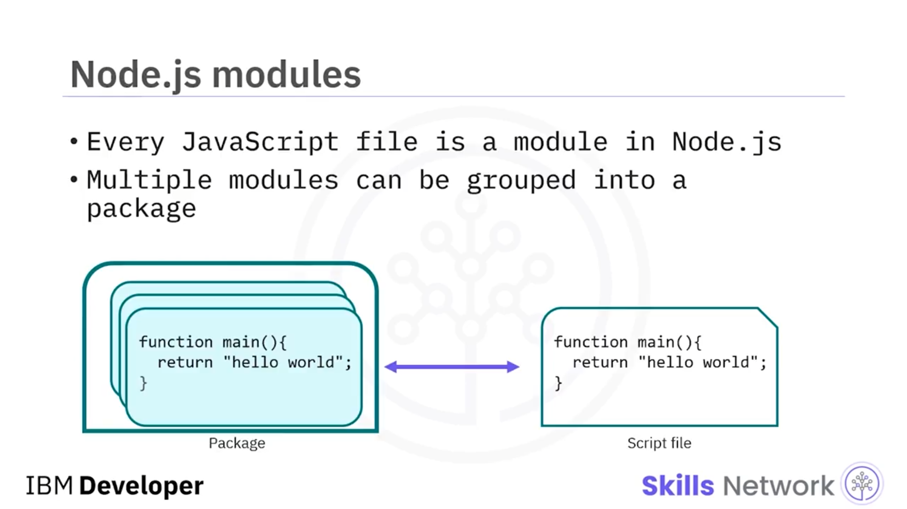
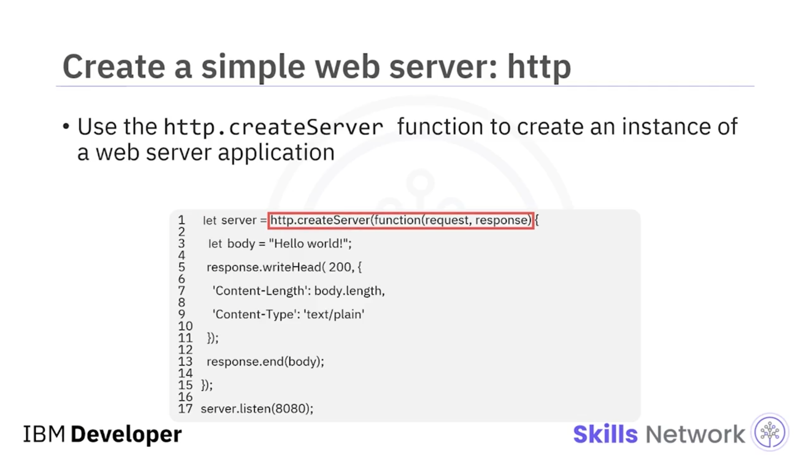
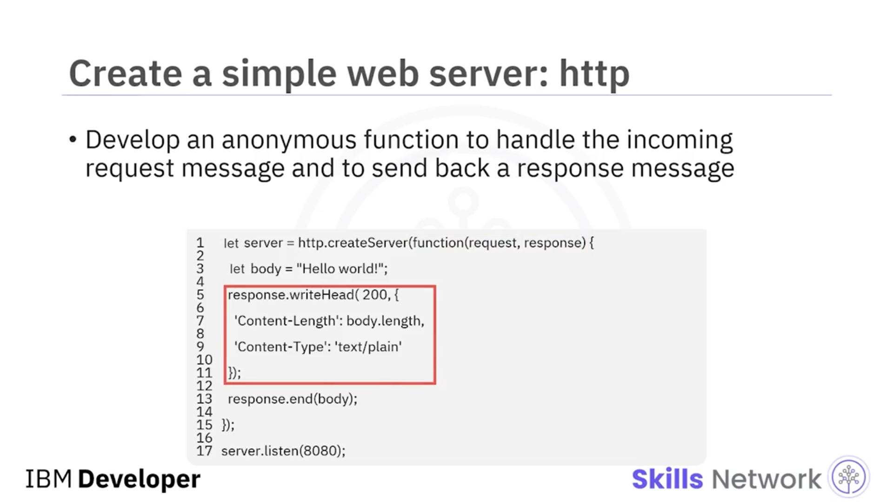
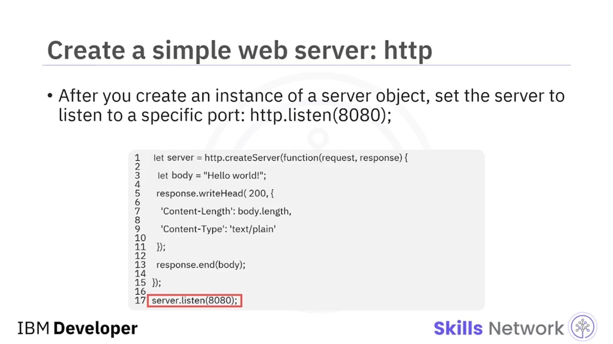
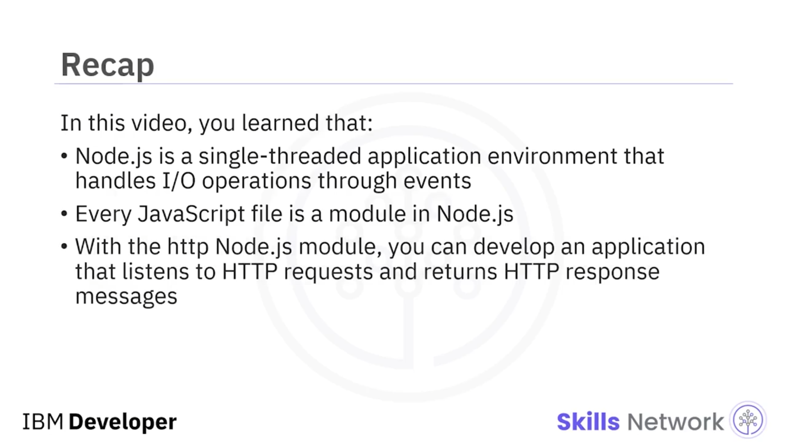

## 🌐 Creating a Web Server with Node.js

### 🎬 Videoya Giriş

Node.js ile Bir Web Sunucusu Oluşturma’ya hoş geldiniz. Bu videoyu izledikten sonra şunları yapabileceksiniz: *Node.js’in özelliklerini* açıklamak ve Node.js ile basit bir web sunucusu yazmak.



---

### 🧠 Node.js Nedir ve Hangi Özelliklere Sahiptir?

Node.js, programlama dili olarak JavaScript kullanan bir sunucu tarafı programlama çerçevesidir. Birçok geliştirici JavaScript diline zaten aşinadır. Hafif bir dil ile eşzamanlı ( *concurrent* ) programlamaya güçlü bir vurgu yapılarak geliştirilmiştir.



Node.js, giriş/çıkış ( *I/O* ) işlemlerini olaylar ( *events* ) üzerinden yöneten tek iş parçacıklı ( *single-threaded* ) bir uygulama ortamıdır. Asenkron I/O işlemlerinde bloklamak yerine, tamamlandıklarında sonuçları işlemek için *callback* fonksiyonları yazarsınız.



---

### 🔁 Eşzamanlılık, Event Loop ve Hızlı Geliştirme

Node.js; *callback* fonksiyonları ve Node.JS çalışma zamanı *event loop* gibi özellikleri kullanarak ölçeklenebilir ve eşzamanlı sunucu uygulamaları geliştirmek isteyen geliştiriciler için uygundur.

JavaScript dilinin bu özellikleri ve Node.js çalışma zamanı, minimum araç setiyle hızlı geliştirmeyi mümkün kılar.



---

### 📦 Modüller ve Paketler

Node.js’te her JavaScript dosyası bir modüldür. Bir modül, bir betik dosyasına karşılık gelir. Bir paket bir veya daha fazla *node* içerebilir.

Node.js çalışma zamanı, uygulamalarınızı oluşturmak ve genişletmek için kullanabileceğiniz birçok yardımcı modülle paketlenmiştir.



---

### 🧩 HTTP Modülü ile Web Sunucusu Geliştirme

*HTTP Node.js modülü* ile HTTP isteklerini dinleyen ve HTTP yanıt mesajları döndüren bir uygulama geliştirebilirsiniz.

Bir web sunucusu örneği ( *instance* ) oluşturmak için `HTTP.createServer` fonksiyonunu kullanın. Web sunucusu `"server"` adlı bir değişkende saklanır.



`createServer` fonksiyonu, parametre olarak isteğe bağlı bir *callback* fonksiyonu alır. Bu *callback* fonksiyonu gelen istek mesajını işler ve uygun bir yanıt mesajı sağlar. Burada gösterilen *callback* fonksiyonu anonimdir.



---

### 🔌 Sunucuyu Bir Porta Dinlemeye Alma

Sunucu nesnesinin bir örneğini oluşturduktan sonra, sunucuyu belirli bir portu dinleyecek şekilde ayarlayabilirsiniz; örneğin, port olarak 8080 parametresiyle `HTTP.listen` fonksiyonunu çağırarak sunucunun 8080 portunu dinlemesini sağlayabilirsiniz.

```bash
8080
```



---

### ✅ Videoda Öğrendikleriniz

Bu videoda şunları öğrendiniz:

* Node.js, I/O işlemlerini olaylar üzerinden yöneten tek iş parçacıklı bir uygulama ortamıdır.
* Node.js’te her JavaScript dosyası bir modüldür.
* HTTP Node.js modülü ile HTTP isteklerini dinleyen ve HTTP yanıt mesajları döndüren bir uygulama geliştirebilirsiniz.


