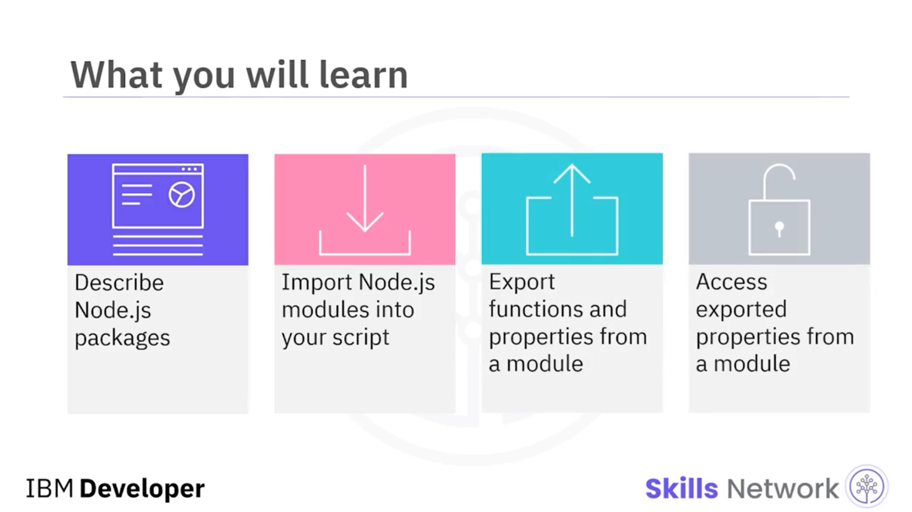
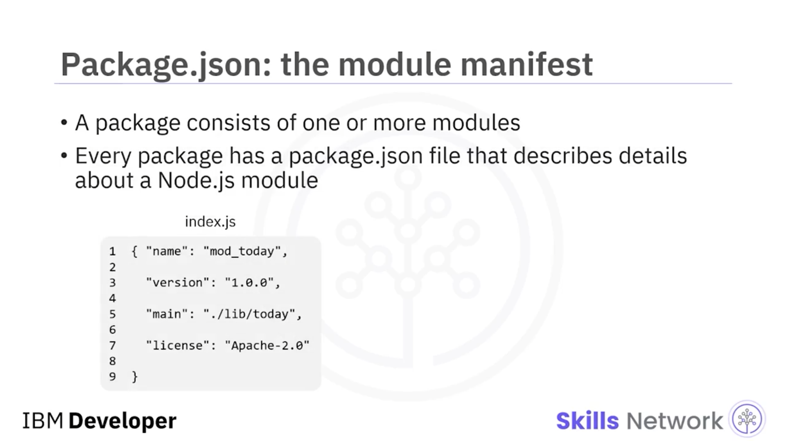
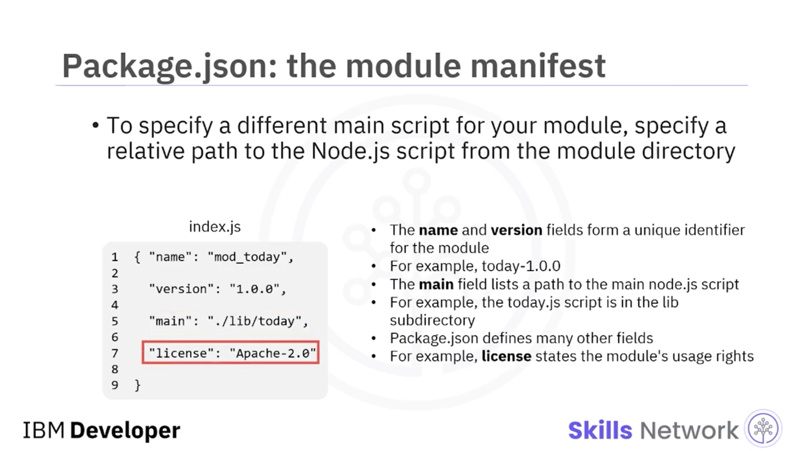
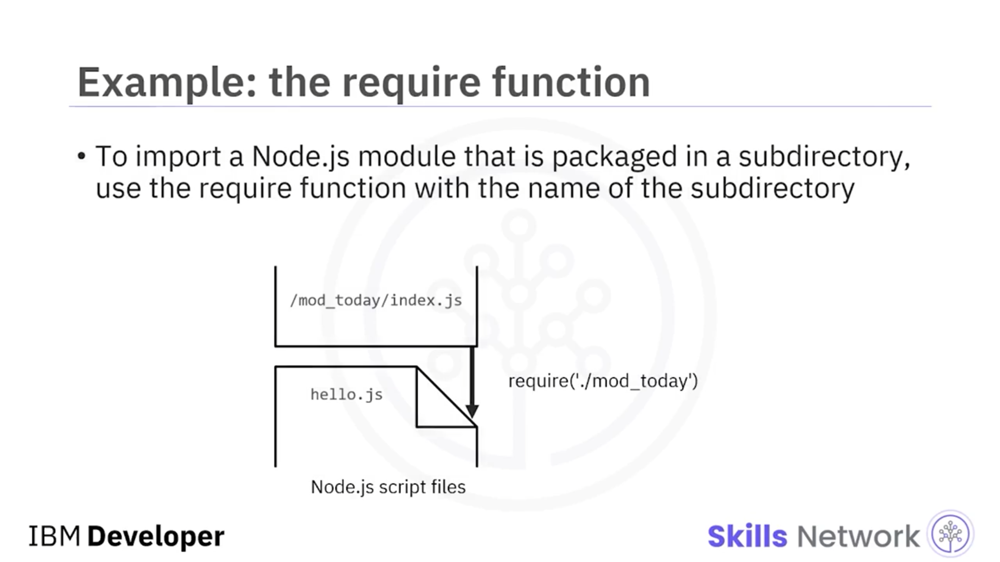
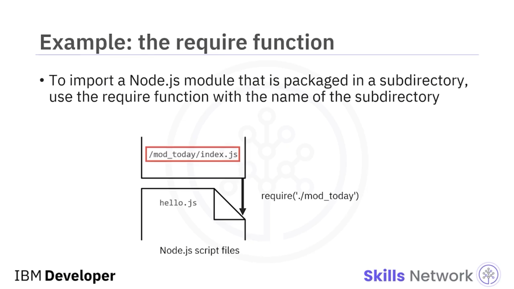
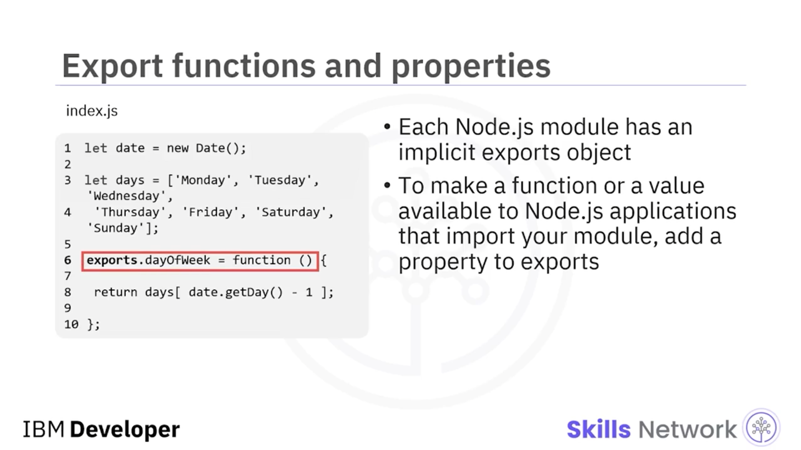
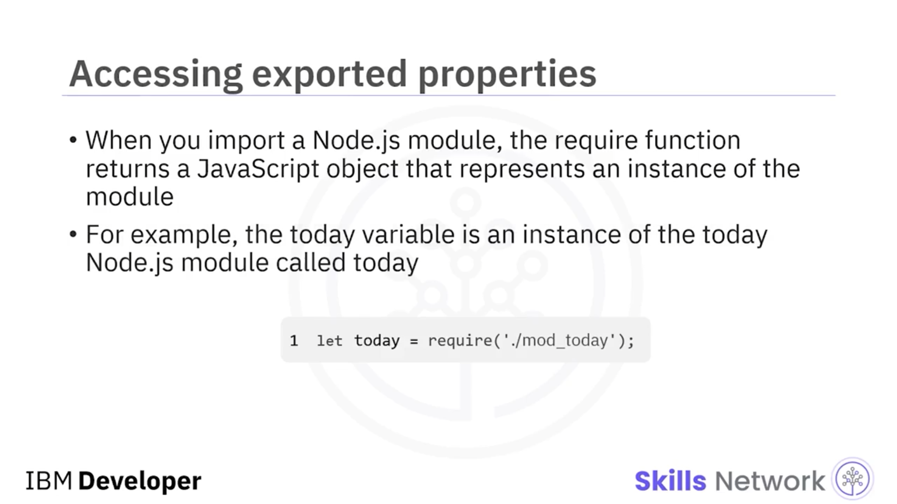
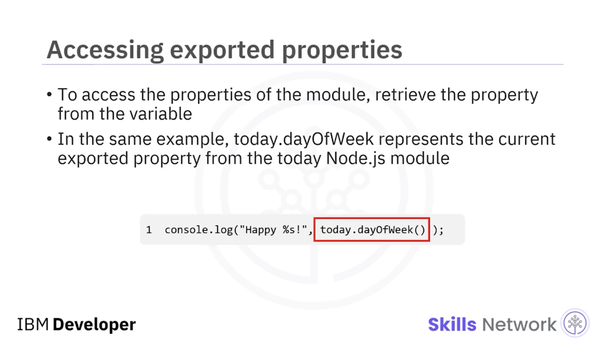
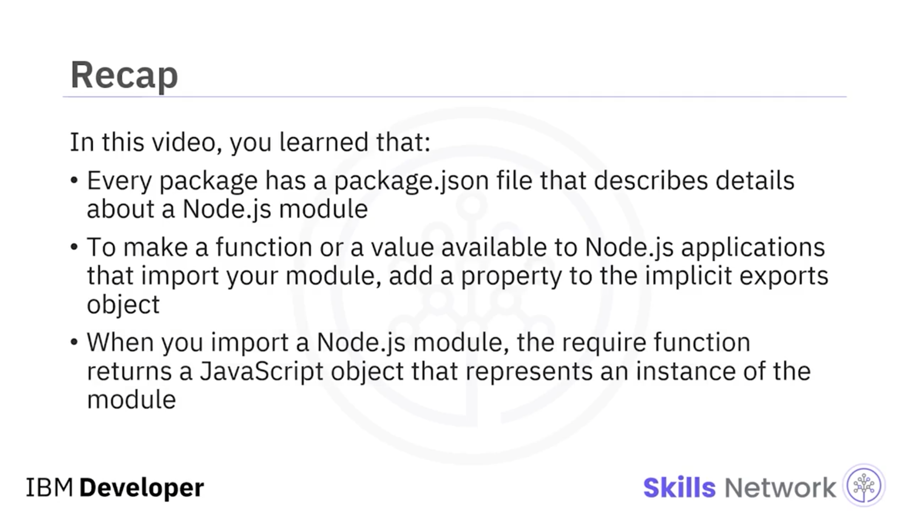

## 🧩 Working with Node.js Modules

### 🎵 Videoya Giriş

[Müzik] Node.js Modülleri ile Çalışma’ya hoş geldiniz. Bu videoyu izledikten sonra şunları yapabileceksiniz: *Node.js paketlerini* tanımlamak. *Node.js modüllerini* betiğinize içe aktarmak. Bir modülden fonksiyonları ve özellikleri dışa aktarmak ve dışa aktarılan özelliklere bir modülden erişmek.

---

### 📦 Paket ve Modül Kavramı

Bir paket bir veya daha fazla modülden oluşur. `package.json` dosyası bir Node.js modülü hakkında ayrıntıları açıklar. Bir modülün `package.json` dosyası yoksa, Node.js ana sınıfın `index.js` adlı dosya olduğunu varsayar.

Bir modülünüz için farklı bir ana betik belirtmek üzere, modül dizininden Node.js betiğine göreli ( *relative* ) bir yol belirtin.

---

### 🗂️ package.json İçeriği ve Alanları

Bu bir `package.json` dosyası örneğidir. `name` ve `version` alanları modül için benzersiz bir tanımlayıcı oluşturur; örneğin, `today-1.0.0`. `main` alanı ana Node.js betiğine giden yolu listeler; bu örnekte `lib` alt dizinindeki `today.js` betiği.

`package.json` başka birçok alan da tanımlar. Örneğin, `license` modülün kullanım haklarını belirtir.

---

### 📥 require ile Modül İçe Aktarma

Bir Node.js modülünü içe aktarmak için `require` fonksiyonunu kullanabilirsiniz.

`require` ifadesi betiklerin dosya uzantısının `.js` olduğunu varsayar. `require` fonksiyonu, içe aktarılan Node.js modülünü temsil eden bir nesne ( *object* ) oluşturur.

Bu örnekte, `today.js` adlı bir Node.js betik dosyası uygulamanızla aynı dizindedir.

---

### 📁 Alt Dizin Adı ile require Çağrısı

Bir alt dizinin adıyla `require` çağırdığınızda, Node.js alt dizin ile aynı ada sahip bir betik dosyası arar. Betik dosyası yoksa, fonksiyon bu adın bir dizin adı olduğunu varsayar ve bu dizin içinde `index.js` adlı bir betik arar.

Tek bir betikten oluşan bir Node.js modülünü içe aktarmak için, betik dosyasına göreli bir yol ile `require` fonksiyonunu kullanın.

Bu örnekte ana uygulama Node.js betik dosyasındadır. `Hello.js`, `today.js` betik dosyasına bir `require` fonksiyon çağrısı yapar.

---

### 🧱 mod_today Örneği ve Varsayılan index.js

Bu örnek aynı `hello.js` Node.js dosyasını kullanır. Node.js modülü `mod_today` adlı bir dizine kaydedilmiştir. Asıl betik dosyası `index.js` içine kaydedilmiştir.

`hello.js`, `mod_today` dizininde `require` fonksiyonunu çağırdığında, betik dosyası `index.js` adlı bir dosya olup olmadığını kontrol eder. Bu, bir Node.js modülündeki betik için varsayılan isimdir.

---

### 📤 exports Nesnesi ile Dışa Aktarma

Her Node.js modülünün örtük ( *implicit* ) bir `exports` nesnesi vardır.

Bir fonksiyonu veya değeri, modülünüzü içe aktaran Node.js uygulamalarına kullanılabilir yapmak için `exports` nesnesine bir özellik ( *property* ) ekleyin.

Bu örnekte, `dayOfWeek` özelliği `exports` nesnesine eklenir. Ardından `dayOfWeek`, haftanın gününü döndüren anonim bir fonksiyona atanır. Örneğin, `dayOfWeek` fonksiyonu 1 döndürürse, bu değer Pazartesi’ye karşılık gelir.

---

### 🔎 İçe Aktarılan Modülden Özelliklere Erişim

Bir Node.js modülünü içe aktardığınızda, `require` fonksiyonu modülün bir örneğini ( *instance* ) temsil eden bir JavaScript nesnesi döndürür. Örneğin, `today` değişkeni `"today"` adlı today Node.js modülünün bir örneğidir.

Modülün özelliklerine erişmek için, özelliği değişken üzerinden alın.

Aynı örnekte, `today.dayOfWeek`, today Node.js modülünden şu anda dışa aktarılmış olan özelliği temsil eder.

---

### ✅ Videoda Öğrendikleriniz

Bu videoda şunları öğrendiniz:

* Her paketin, bir Node.js modülü hakkında ayrıntıları açıklayan bir `package.json` dosyası vardır.
* Modülünüzü içe aktaran Node.js uygulamalarına bir fonksiyonu veya değeri kullanılabilir yapmak için, örtük `exports` nesnesine bir özellik ekleyin.
* Bir Node.js modülünü içe aktardığınızda, `require` fonksiyonu modülün bir örneğini temsil eden bir JavaScript nesnesi döndürür.

