## 📦 Overview of Node Package Manager

### 🎬 Videoya Giriş

Node paket yöneticisine genel bakışa hoş geldiniz. Bu videoyu izledikten sonra şunları yapabileceksiniz: bir paket yöneticisinin amacını açıklamak, Node paket yöneticisinin (NPM) iki ana yönünü tanımlamak, bir `package.json` dosyasının amacını açıklamak ve yerel ( *local* ) bir NPM kurulumu ile küresel ( *global* ) bir NPM kurulumunu karşılaştırmak.

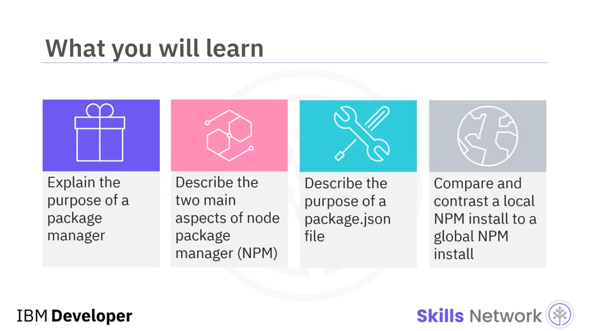

---

### 🧰 Paket Yöneticisi Nedir?

JavaScript gibi modül ve paket kullanan dillerle çalışırken, genellikle *paket yöneticisi* adı verilen bir araca ihtiyaç duyulur. Paket yöneticisi, bağımlılıklar içeren modüller ve paketlerle ilgilenmek için kullanılan bir araçlar setidir. Bazen *paket yönetim sistemi* olarak da adlandırılır.

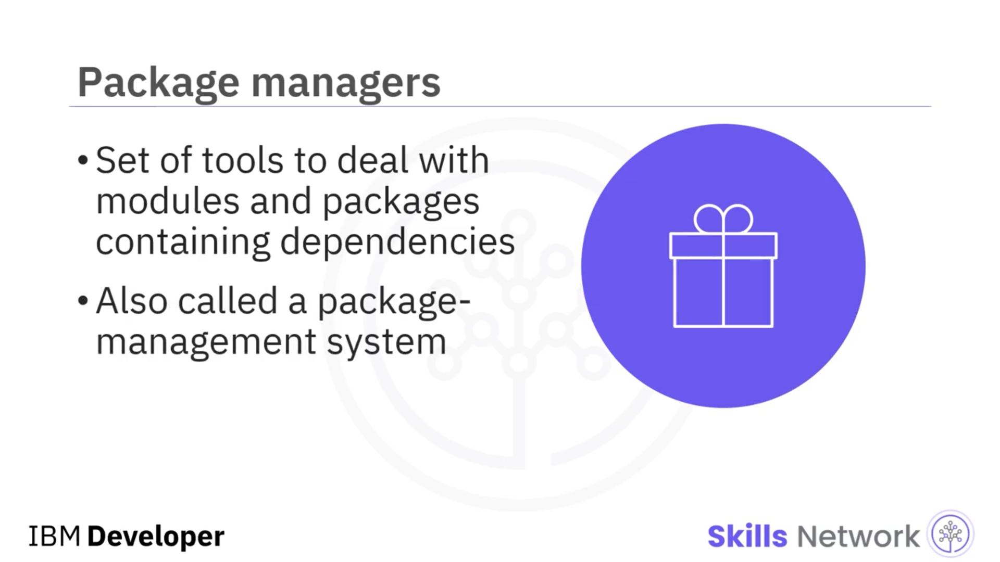

Bağımlılıklar ( *dependencies* ), genellikle kütüphaneler ve paketler biçiminde olan, bir programda çağrılan ve yeniden kullanılan koddur. Örneğin, yeni bir modül geliştiriyorsanız ve sizin yazdığınız başka bir modülde bulunan bir fonksiyonu çağırıyorsanız, o modül de başka biri tarafından yazılmış başka bir modülü çağırıyorsa ve o da üçüncü taraf ( *3rd-party* ) bir başka modülü çağırıyorsa; yazdığınız modül, bu diğer tüm modüllere “bağımlı”dır.

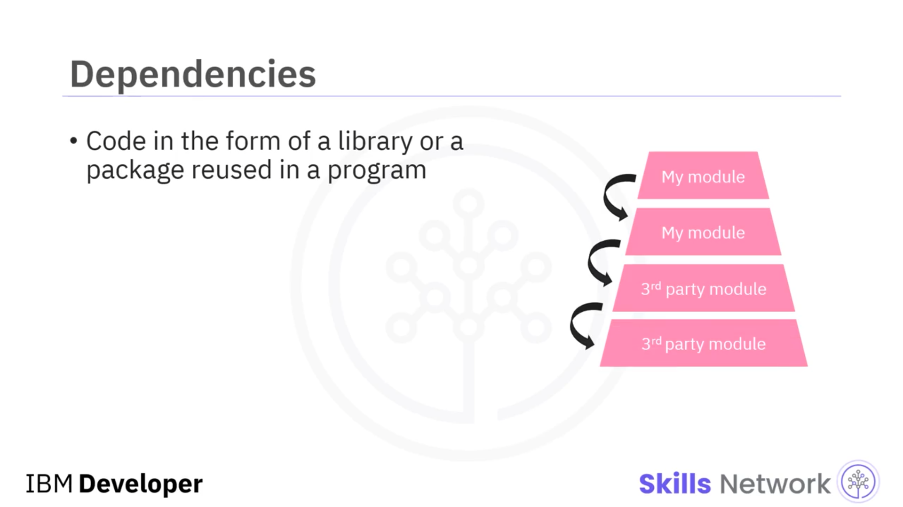

Bir kod kütüphanesi ( *library* ) genellikle birçok bağımlılık içerir, ancak kütüphane kendi içinde bağımsızdır ve kütüphanenin dışındaki koda bağımlı değildir. Paketler de aynı şekilde çalışır.

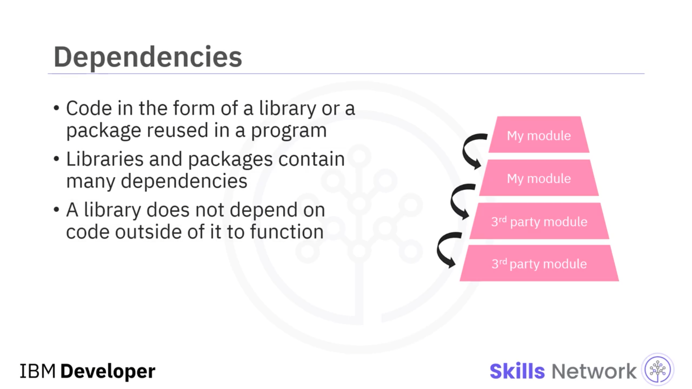

Paket yöneticisi; bir bilgisayar programı için paketleri bulma, kurma, yükseltme, yapılandırma, sürdürme ve kaldırma süreçlerini otomatikleştirir. Paket yöneticileri genellikle bir depodaki ( *repository* ) paketler için bağımlılık ve sürümleme ( *versioning* ) bilgilerini tutan bir veritabanına bağlıdır ve onu sürdürür. Paket yöneticisi, bir yazılımın doğru çalışabilmesi için ihtiyaç duyduğu bağımlılıklara sahip olmasını sağlar ve bu işi manuel yapma gereksinimini ortadan kaldırır.

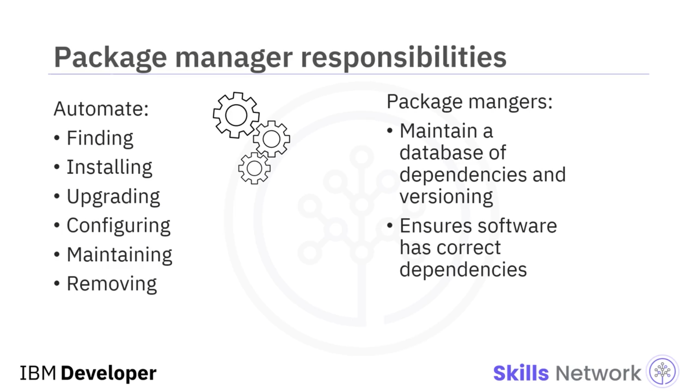

---

### 🟩 NPM Nedir ve Ne İşe Yarar?

Node Package Manager, genellikle *NPM* olarak kısaltılır ve Node.js çalışma zamanı ( *runtime engine* ) için varsayılan paket yöneticisidir. NPM’in iki işlevi vardır.

Birincisi, kullanıcıların paket yayınlamasına ve indirmesine izin veren bir komut satırı arayüzü sağlar. İkincisi, ikili ( *binary* ) JavaScript paketlerinin çevrimiçi bir deposu ( *online repository* ) olarak davranır.

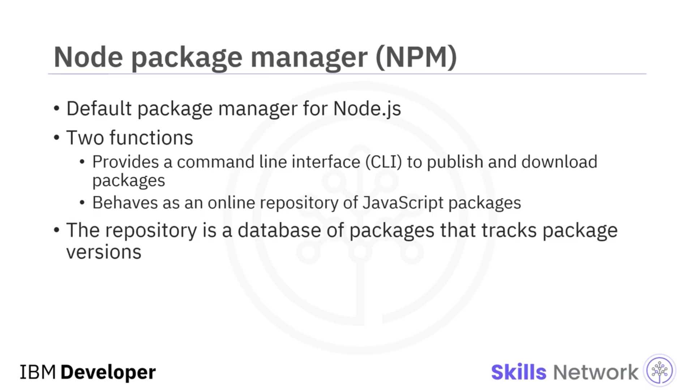

Depo, uygulamalarda referans verilen paketlerin sürümlerini izleyen bir paket veritabanıdır. Tüm NPM paketleri, projenin kök dizininde ( *root directory* ) bulunması gereken `"package.json"` adlı bir dosyaya ihtiyaç duyar.

---

### 🗂️ package.json Dosyasının Amacı

NPM, bir paketteki tüm bağımlılıkları belirlemek için `package.json` dosyasındaki metaveriyi ( *metadata* ) kullanır. Bu dosya, en azından projenin adını ve projenin sürüm numarasını tanımlayan anahtar-değer ( *key-value* ) çiftleri biçiminde projenin tanımlayıcı metaverisini içerir. Burada gösterilen kod, bu iki anahtar-değer çiftine bir örnek gösterir.

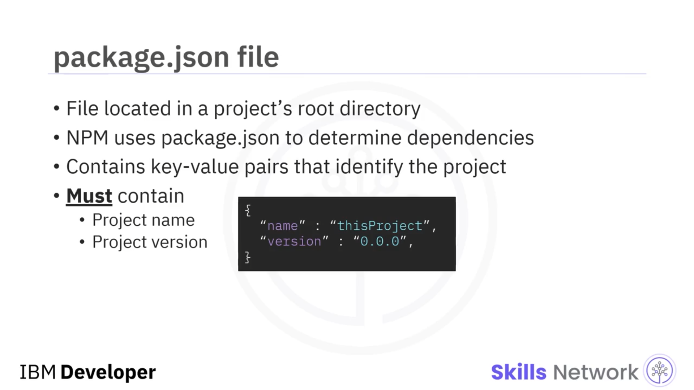

---

### 🧩 NPM Kurulum Türleri: Local ve Global

#### 🏠 Local (Yerel) Kurulum

Uygulamanız içinde kullanmak istediğiniz bir paketi kuruyorsanız, yerel kurulumu kullanmak istersiniz. Yerel kurulum komutunu, paketin kurulmasını istediğiniz dizinden çalıştırın. Yerel kurulum NPM’in varsayılan davranışıdır.

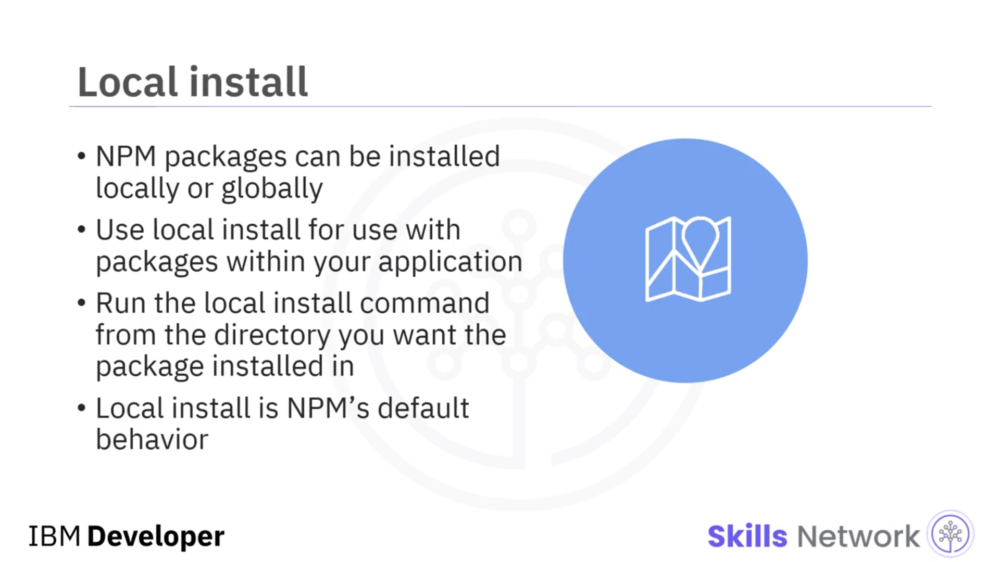

`node_modules` paketini yerel olarak kurmak için, NPM komut satırı arayüzünde şunu girin:

```bash
npm install <package_name>
```

Bu komut, mevcut çalışma dizininizde paket ve onun bağımlılıklarını içeren `node_modules` adlı bir dizin oluşturur.


---

#### 🌍 Global (Küresel) Kurulum

Paketler küresel olarak da kurulabilir. Küresel kurulum, paketin kurulu olduğu makinedeki tüm uygulamaların bu kodu kullanabilmesi anlamına gelir.

Küresel kurulumlar dikkatli kullanılmalıdır; çünkü o bilgisayardaki tüm projeler bu paketi ve onun bağımlılıklarını kullanacaktır. Makinenizde bir projenin farklı sürümleri varsa, hepsi küresel olarak kurulmuş paketi kullanır; bu da diğer bağımlılıklarla uyumluluğu bozabilir.

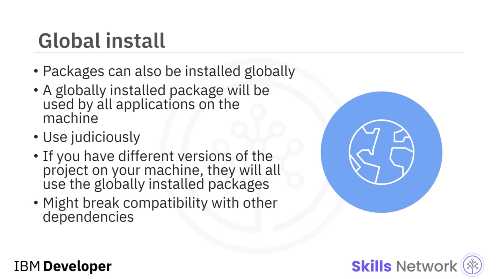

Pakete makinedeki herhangi bir uygulamanın erişebilmesi için `node_modules`’u küresel olarak kurmak üzere komut satırı arayüzünde şu komutu kullanın:

```bash
npm install -g package_name
```

Bu komut, yerel kurulum komutuyla aynıdır ancak `-g` seçeneğini ekler.

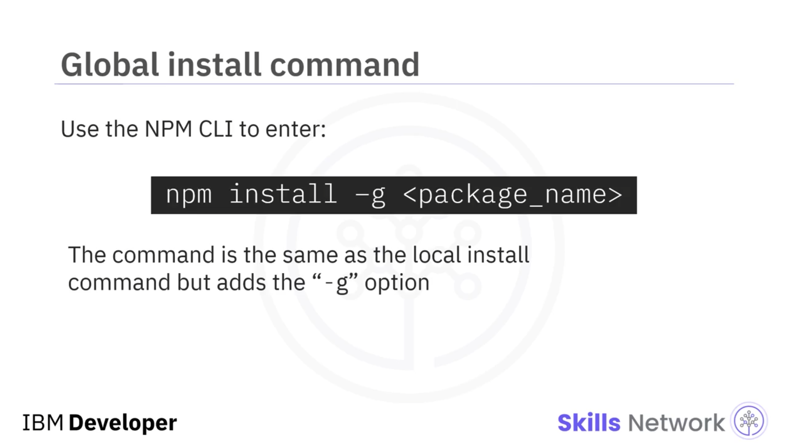

---

### ✅ Videoda Öğrendikleriniz

Bu videoda şunları öğrendiniz:

* Paket yöneticisi, bir yazılımın doğru çalışması için ihtiyaç duyduğu bağımlılıklara sahip olmasını sağlar.
* NPM, bir komut satırı aracı sağlar ve aynı zamanda JavaScript paketlerinin çevrimiçi bir veritabanı olarak işlev görür.
* NPM, bir paketin bağımlılıklarını belirlemek için `package.json` dosyasındaki metaveriyi kullanır.
* Yerel kurulum, yalnızca kurulumun yapıldığı dizindeki uygulamanın pakete erişebilmesi anlamına gelirken; küresel kurulum, makinedeki herhangi bir uygulamanın pakete erişebilmesi anlamına gelir.

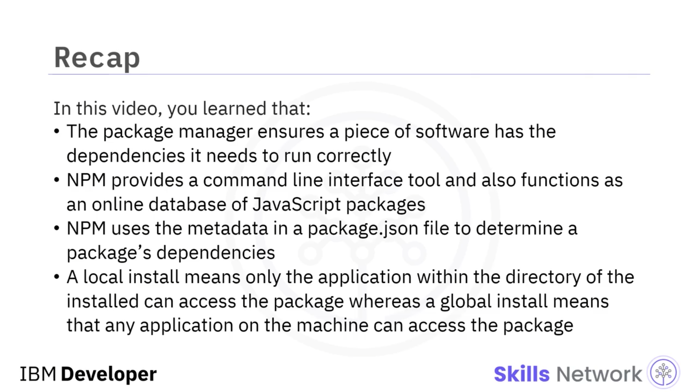
