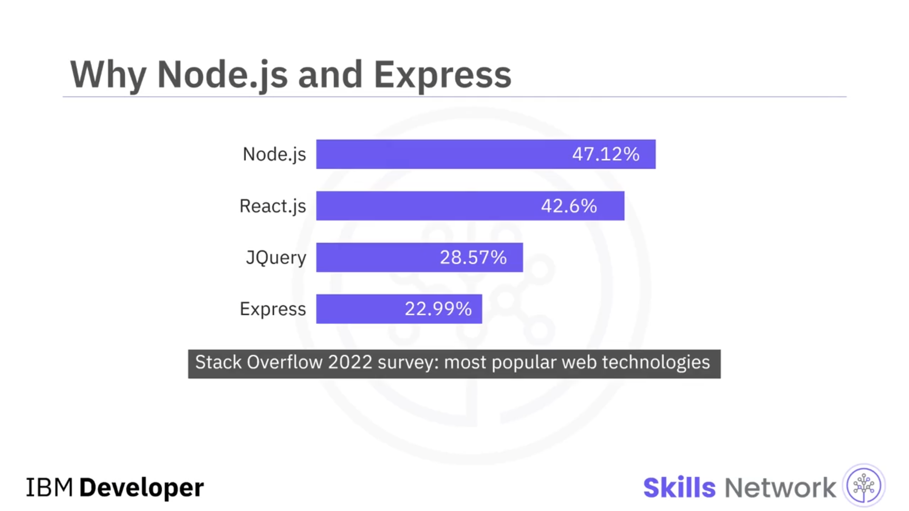
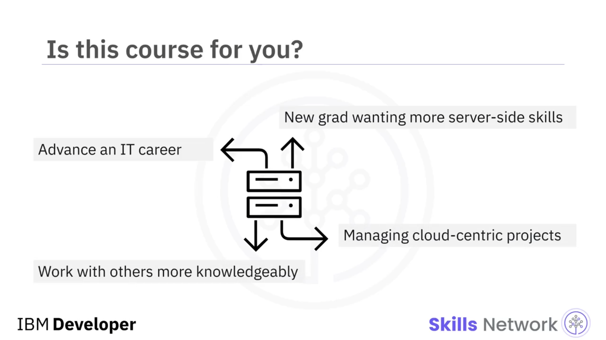
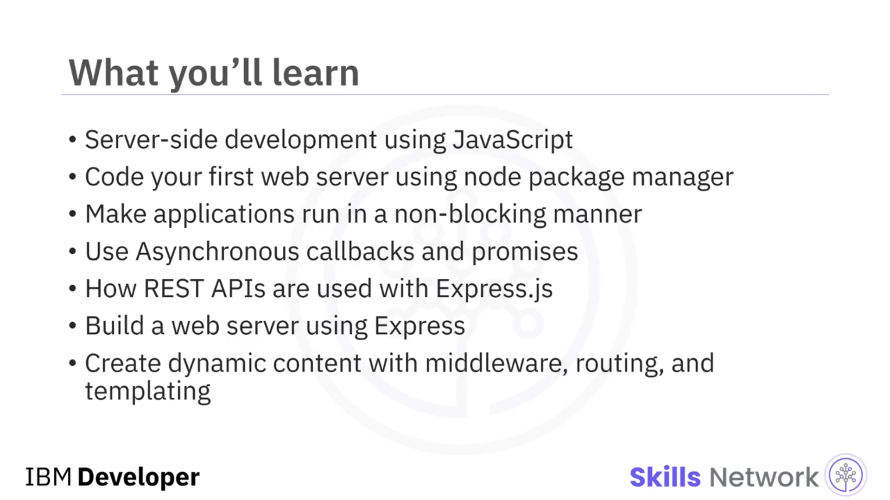

## 🚀 Course Introduction: Node.js & Express ile Back-End Uygulamalar Geliştirmeye Hoş Geldiniz

Node.js ve Express kullanarak Back-End Uygulamalar Geliştirme kursuna hoş geldiniz. Şimdi, Node.js ve Express ile back-end uygulamalar geliştirmenin ne kadar ilgili olduğunu merak ediyor olabilirsiniz.

Stack Overflow’un 2022 anketinde, anketi yanıtlayan geliştiricilerin yaklaşık %50’si tarafından Node.js kullanıldı; bu da onu **en çok kullanılan sunucu tarafı teknolojisi** yaptı. Buna karşılık, Express genel olarak **dördüncü en popüler web teknolojisi** olarak sıralandı ve **en popüler sunucu tarafı web framework’ü** oldu.

Node.js, sunucu tarafı JavaScript uygulamalarını çalıştırabilen bir  *runtime environment* ’tır; Express ise Node.js’in üzerinde çalışan, uygulamalarınızı yazmak için kullanılan sunucu tarafı bir JavaScript web framework’üdür.

## 🎯 Bu Kursun Amacı

Bu kurs, bir back-end veya full-stack geliştirici olarak başarılı olmanıza yardımcı olmak üzere tasarlanmıştır.

* Kariyerinde bir adım ileri gitmek isteyen IT çalışanı olabilirsiniz,
* Sunucu tarafı becerilerini daha da sağlamlaştırmak isteyen yeni bir mezun olabilirsiniz,
* Daha bulut merkezli projeleri yönetmesi gereken bir IT karar vericisi olabilirsiniz,
* Ya da sunucu tarafı hesaplama hakkında daha bilgili konuşabilmek isteyen başka bir alandan biri olabilirsiniz.

## 🧩 Videolar ve Laboratuvarlarda Neler Öğreneceksiniz

Kursun öğretim videolarında ve laboratuvarlarında şunları öğreneceksiniz:

* JavaScript kullanarak sunucu tarafı geliştirme
* İlk web sunucunuzu kodlama
* Uygulama modüllerinizi ve bağımlılıklarınızı yönetmek için Node Package Manager kullanma

Ayrıca şunları keşfedeceksiniz:

* Asenkron callback’ler ve promise’ler kullanarak uygulamaların *non-blocking* şekilde nasıl çalıştırılacağı
* Express.js framework’ü ile HTTP istekleri ve yanıtlarıyla birlikte REST API’lerin nasıl kullanıldığı

Ardından, Express kullanma pratiği yaparak:

* Bir web sunucusu oluşturacak
* Middleware, routing ve templating ile dinamik içerik üreteceksiniz

Ek olarak, *Expert Viewpoint* videolarında uzmanlardan bu sunucu tarafı teknolojilerle ilgili deneyimlerini doğrudan dinleyeceksiniz.

## 👥 Uzmanlar Kendilerini Tanıtıyor

Hadi bu uzmanların kendilerini tanıtmasını dinleyelim:

Benim adım James Reeve ve IBM’de full stack yazılım mühendisiyim.
Merhaba, benim adım Rupinder ve Skill-Up Technologies’te baş çözüm mimarı olarak çalışıyorum.
Ben Dennis Harvey, Coursera’da Cloud teknolojisi için Content Strategy Manager olarak çalışıyorum.
Merhaba! Benim adım Bradley Steinfeld, yazılım mimarıyım ve IBM Cloud ve Cognitive software için çalışıyorum.

Herkese merhaba, benim adım Upkar Lidder ve IBM’de developer advocate’im.
Merhaba, ben Yan Stoneman, Smartronix’te solution architect’im.

## ✅ Kursu En Verimli Şekilde Tamamlamak İçin

Burada ele alınacak çok şey var, bu yüzden bu kurstan en iyi şekilde faydalanmak için:

* Her videoyu izleyin,
* Her quiz ile öğrenmenizi kontrol edin,
* Hands-on lab’leri ve final projeyi tamamlayarak kazandıran bir portföy oluşturun.

Bu heyecan verici yolculukta bir sonraki adımı atın; bu yolculuk sizi olasılıklarla dolu bir dünyaya götürüyor ve bol şans!
