## 🎬 What is Back End Development?

“What is backend development?” bölümüne hoş geldiniz. Bu videoyu izledikten sonra şunları yapabileceksiniz:

* Backend development’ı tanımlamak
* Frontend ve backend teknolojileri arasında ayrım yapmak
* Bir web uygulamasının backend bileşenlerini açıklamak
* Sağlam, ölçeklenebilir bir backend’in önemini açıklamak

## 🖥️ Frontend ve Backend

Bulut tabanlı ve web uygulamaları gibi client-server uygulamalar genellikle bir “frontend” ve bir “backend”den oluşur. Frontend istemci makinede çalışır, backend ise bir sunucuda çalışır.

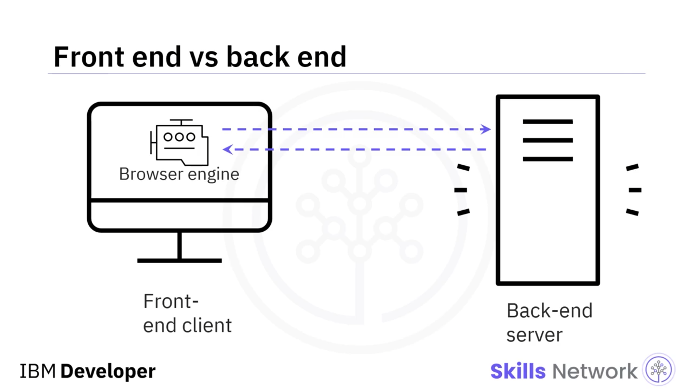

İstemci makine web tarayıcısını ve tarayıcının engine’ini çalıştırır. Tarayıcının engine’i backend ile iletişim kuran parçadır. Backend geliştiricileri, bir web sitesinin doğru şekilde çalışmasını sağlayan teknolojiler üzerinde çalışır; bunun bir kısmı da tarayıcının engine’i ile backend sunucusu arasında iletişim kuran kodu yazmayı içerir. Ayrıca backend development, veritabanları, sunucular ve uygulamalarla ilgili koda dahil olan sunucu tarafı mantığın geliştirilmesini ifade eder.

## 🧱 Backend Teknolojileri

Backend teknolojileri; sunucuları, veritabanlarını, web API’lerini, programlama dillerini, framework’leri ve runtime’ları içerir.

Sunucular, bir istemciyle iletişim kuran ve ona işlevsellik sağlayan donanım, yazılım veya her ikisinden oluşur. Sunucular ayrıca birbirleriyle de iletişim kurabilir ve birbirlerine işlevsellik sağlayabilir. Sunucuların birçok türü vardır. Web uygulamaları sıklıkla veritabanı sunucuları, uygulama sunucuları ve web sunucuları dahil olmak üzere birçok sunucu türü kullanır.

Bu sunucu türlerinin her birini kısaca ele alalım.

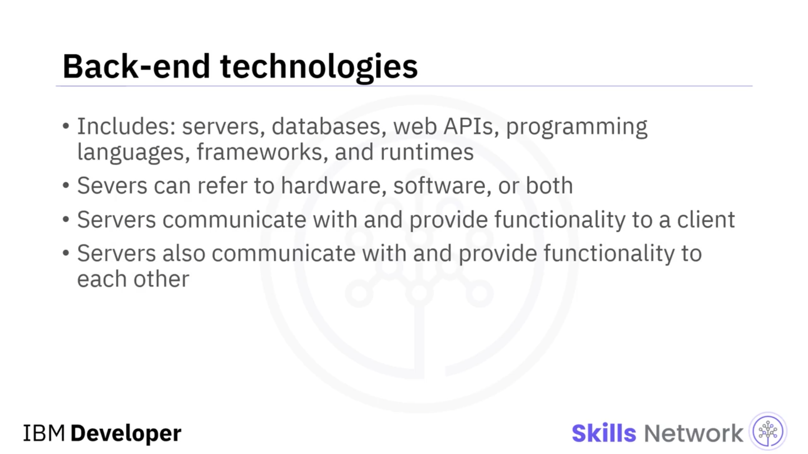

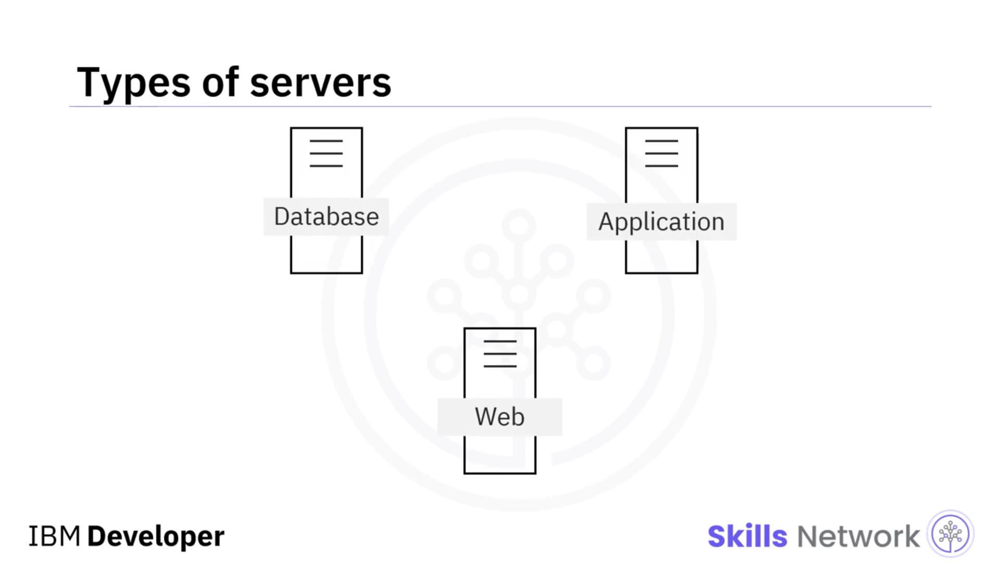

## 🗄️ Database Server

Database server, verileri barındıran, geri çağıran ve ileten makine ve uygulamadır.

“Database server” ve “database” terimleri sıklıkla birbirinin yerine kullanılır.

## 🌐 Web Server

Web server’lar, istemci isteklerine yanıt verilmesini sağlar; bunu genellikle hypertext transfer protocol yani kısaca HTTP kullanarak yapar.

Bir HTTP server, bir web server üzerinde çalışan yazılımın bir parçasıdır. Bir web server’ın yazılım kısmı, kullanıcının sunucuda barındırılan dosyalara nasıl erişeceğini kontrol eden kısımdır.

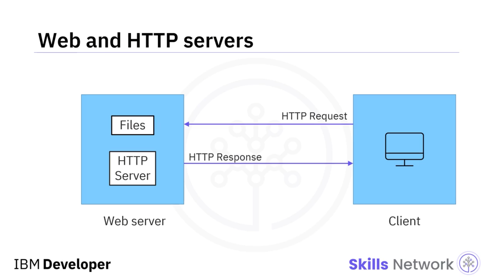

## 🧩 Application Server

Application server’lar, bir iş uygulamasını HTTP üzerinden barındırır ve sunar. Bir veritabanı sunucusu ile bir web sunucusu arasında yer alırlar.

Application server’lar veriyi dinamik içeriğe dönüştürür ve iş mantığını çalıştırır; iş mantığı ise veri depolama ve aktarma kurallarıdır.

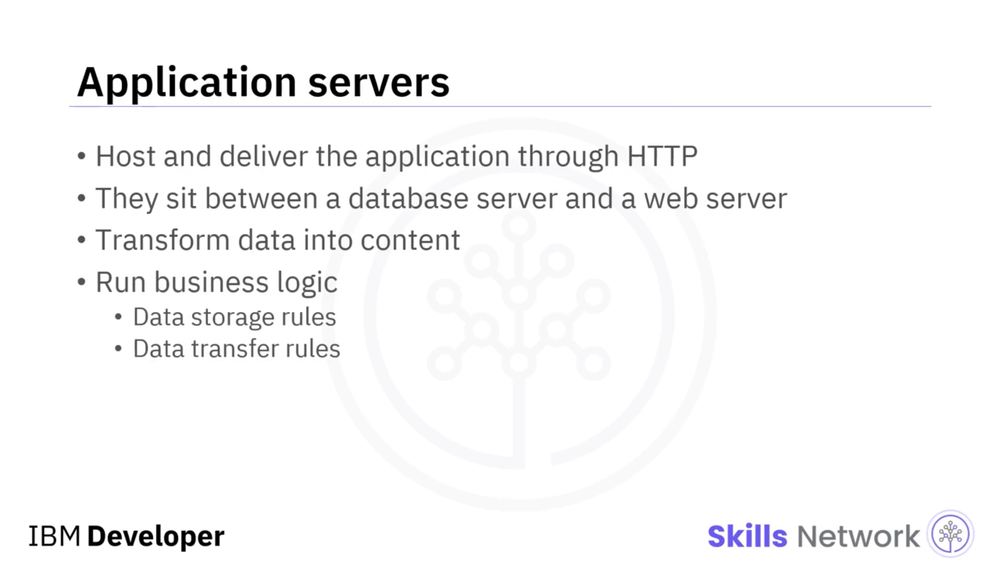

## 🔌 API’ler ve Web Servisleri

Client-server mimarisinde sunucuların birbirleriyle ve frontend ile iletişim kurması gerekir. “Application programming interface” ifadesinin kısaltması olan API’ler, iki yazılım parçasının birbiriyle iletişim kurmasını sağlar.

Bir web service, web API’nin bir türüdür. Bir web service, HTTP istekleri kullanarak iletişim kurar. Başka bir deyişle web service, web sunucuları ile istemci arasında HTTP kullanarak istek gönderip alan programlama arayüzüdür.

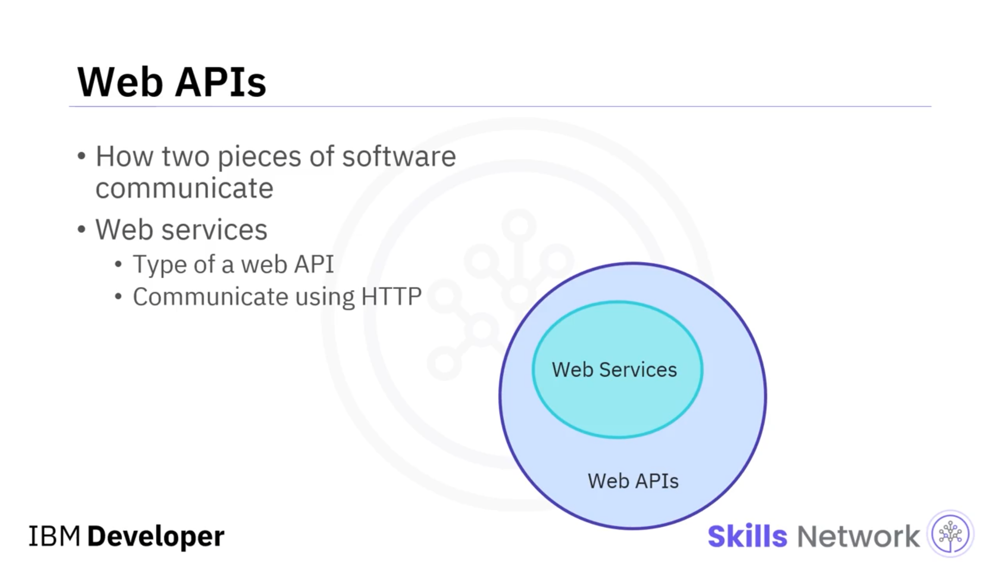

## 🧑‍💻 Backend Programlama Dilleri

Backend programlama dilleri, geliştiricilerin sunucuların çalışmasını sağlamak için kullandığı dillerdir. Bu diller arasında JavaScript, PHP, Python, Ruby, Java ve C-sharp bulunur.

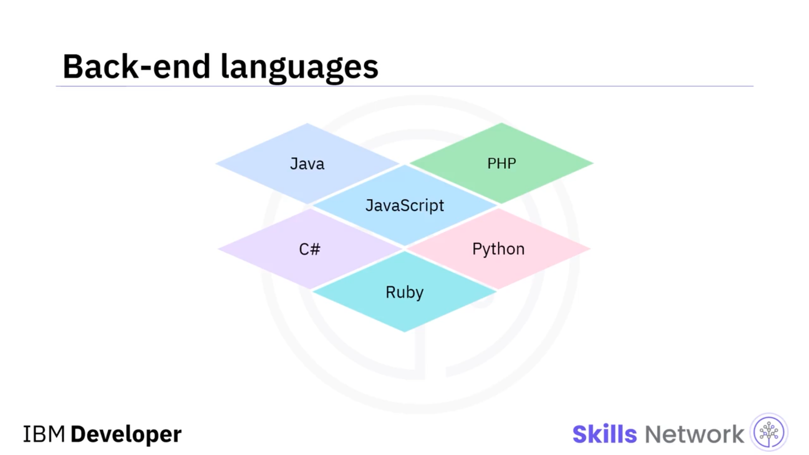

## 🏗️ Framework’ler

Framework’ler, koda yapı sağlar. Bir uygulama bir framework kullanılarak oluşturulabilir ve deploy edilebilir.

Framework genellikle yaygın görevleri gerçekleştirmek için değiştirilemeyen kod üretir. Yaygın backend framework’lerinden bazıları Django (bir Python framework’ü), Ruby on Rails (bir Ruby framework’ü) ve Express.js (bir JavaScript framework’ü) şeklindedir.

Express.js, node.js’in üzerinde çalışan ve bir web sunucusuna yapılan HTTP isteklerini yöneten bir framework’tür.

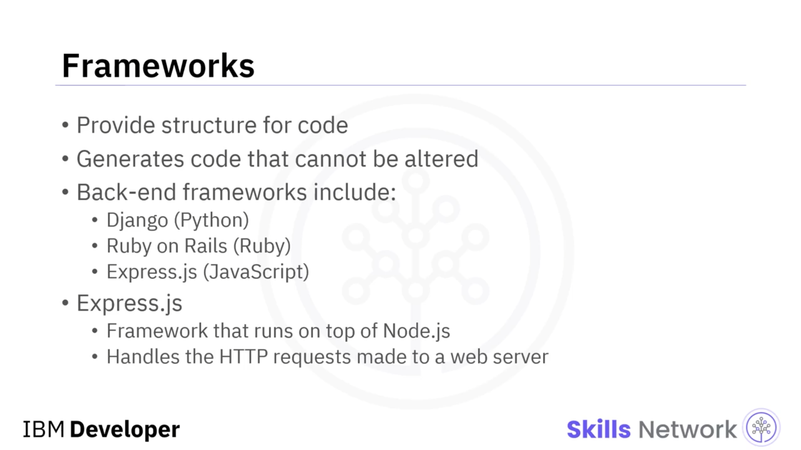

## ⚙️ Runtime Environment’lar

Şimdi runtime environment’ları ele alalım. Bir runtime, bir uygulamanın çalışması için gerekli kaynakları sağlayan mini bir işletim sistemi gibi davranır.

Runtime, bir codebase’in yürütülmesini destekleyen altyapıdır. Bir uygulamanın çalıştırıldığı donanım ve yazılım ortamıdır. Node.js, bir backend runtime environment örneğidir.

Node.js’in bir backend teknolojisi olarak bu kadar popüler hale gelmesinin nedeni, Google Chrome’un open-source V8 engine’i üzerinde çalışmasıdır; bu engine, frontend’de tarayıcıyı çalıştıran engine’in aynısıdır. Ayrıca Microsoft Edge ve Opera gibi çoğu modern tarayıcı da V8 engine’i üzerinde çalışır.

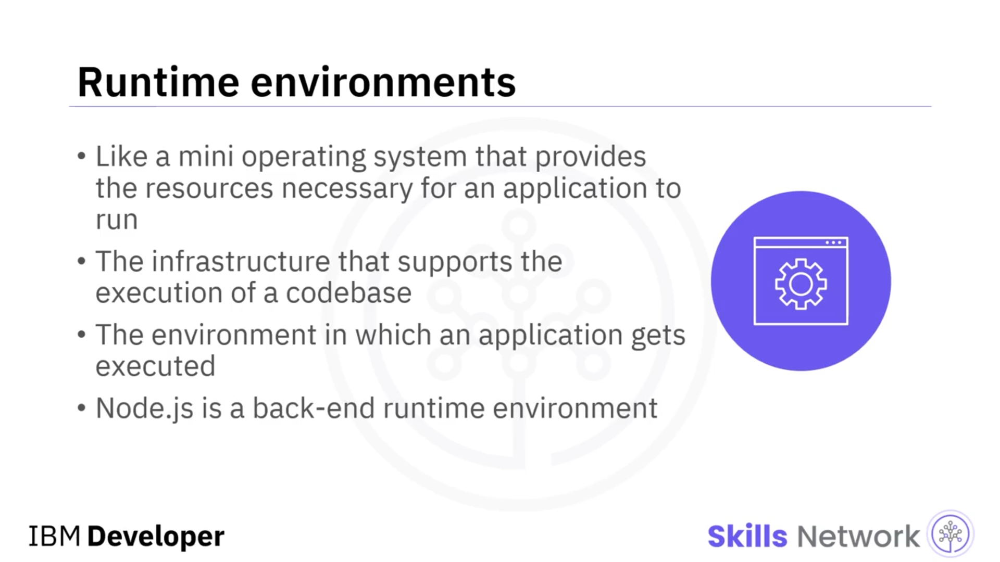

Node.js, frontend’in backend ile iletişim kurmasını çok kolaylaştırır. Node.js, JavaScript çalıştırır.

Daha önceki bir dersten hatırlayın: JavaScript frontend’de yaygın olarak kullanılır. Bu, JavaScript’i hem frontend hem de backend’de kullanımı nedeniyle web geliştiricilerinin öğrenmesi için kullanışlı bir dil yapar.

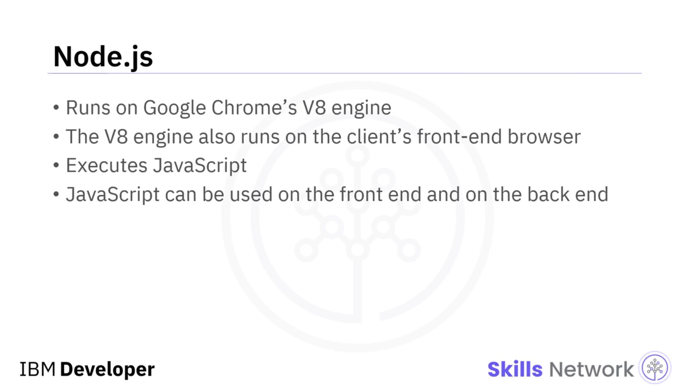

---

## 📈 Ölçeklenebilirlik

Backend geliştiricilerinin ilgilenmesi gereken bir diğer konu ölçeklenebilirliktir. Ölçeklenebilirlik, kurumsal yazılım başarısı için gereklidir ve uygulama üzerindeki yükten etkilenen backend’in sorumluluğudur.

Load, eşzamanlı kullanıcı sayısını, işlem sayısını ve istemciler ile sunucular arasında gidip gelen veri miktarını ifade eder.

Web uygulamaları ölçeklenebilir olmalıdır. Ölçeklenebilirlik, uygulamanın yük büyürken veya küçülürken uygulama performansını etkilemeden yükü dinamik olarak karşılayabilme yeteneğidir.

Ölçeklenebilirlik, bir client-server uygulamasının başarısı için gereklidir.

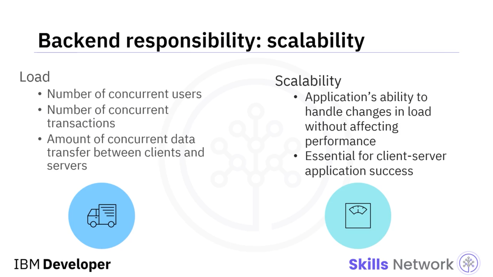

---

## 🔐 Diğer Backend Sorumlulukları

Son olarak, diğer backend sorumlulukları arasında güvenlik, kimlik doğrulama ve kötü amaçlı yazılım saldırılarının önlenmesi yer alır.

Backend aynı zamanda performanstan da büyük ölçüde sorumludur; çünkü makineler arasında veriyi alır ve aktarır, içeriği frontend’e iletir ve uygulamanın iş mantığını sağlar.

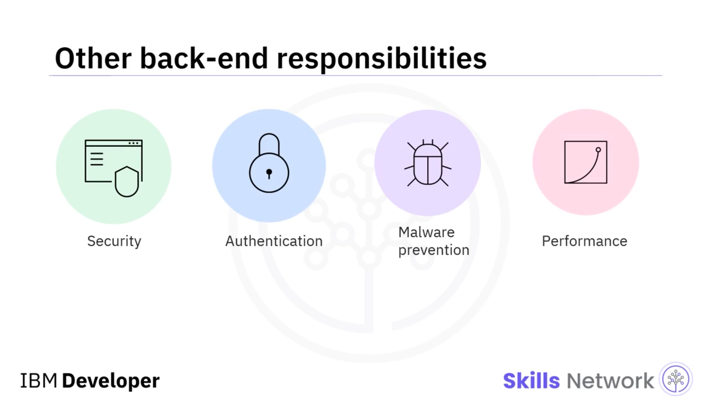

## 🧾 Özet

Bu videoda şunları öğrendiniz:

* Backend development, veritabanları, sunucular ve uygulamalarla ilgili kod dahil olmak üzere sunucu tarafı mantığın geliştirilmesini ifade eder.
* Frontend teknolojileri, arayüz ve web tarayıcısı gibi istemciyle ilgili teknolojilerdir.
* Backend teknolojileri, çeşitli sunucu türlerini ve programlama dilleri, framework’ler ve diğer donanımlar gibi destekleyici altyapıları içerir.
* Backend, ölçeklenebilirlik, güvenlik ve performanstan sorumludur.

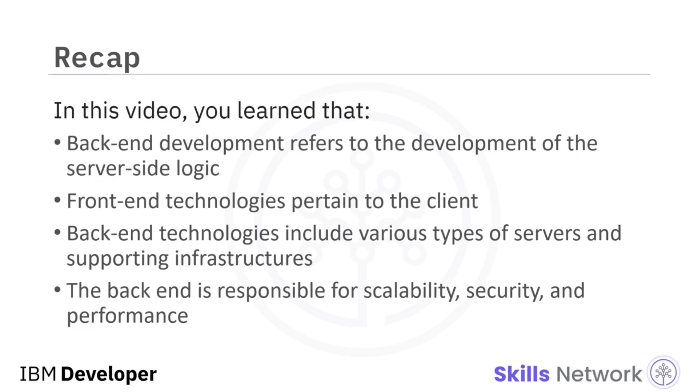
