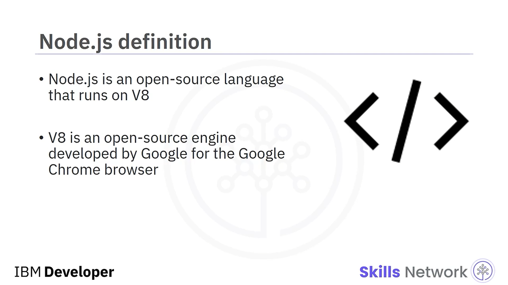
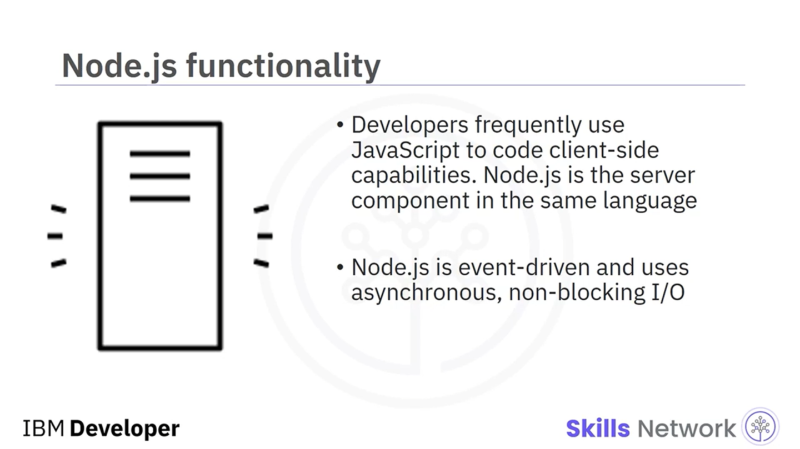
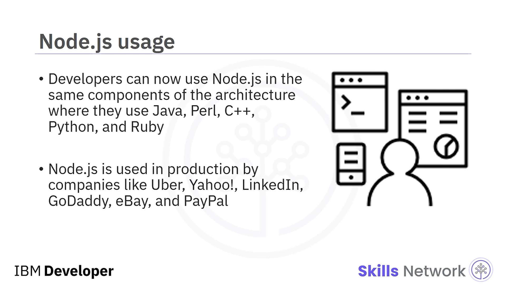
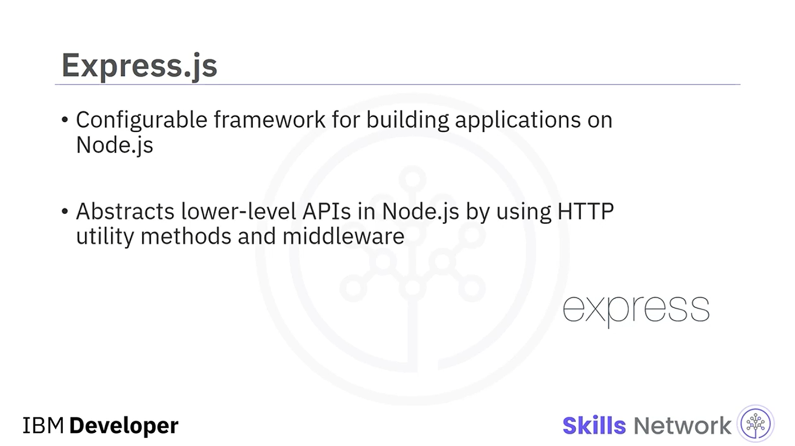
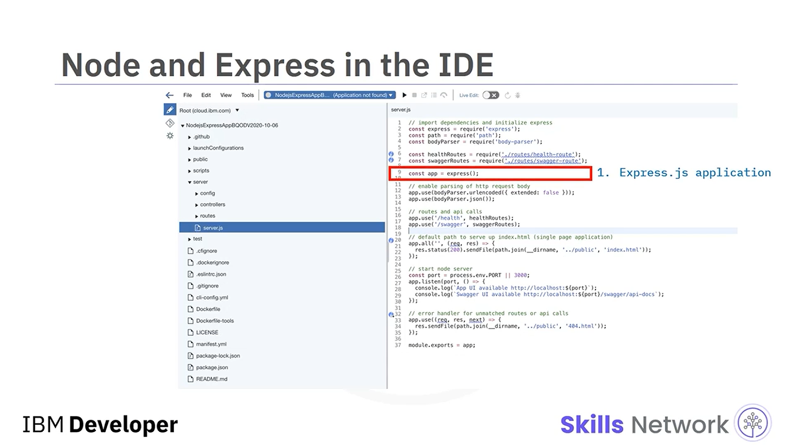
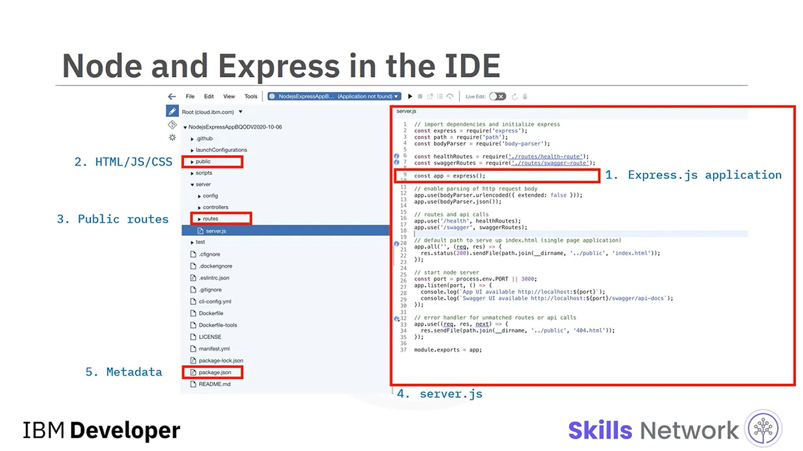
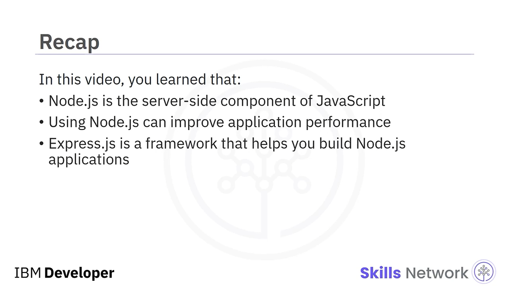

## 🌿 Introduction to Node.js

Introduction to Node.js bölümüne hoş geldiniz. Bu videoyu izledikten sonra şunları yapabileceksiniz: Node.js’in sunucu tarafı scripting için rolünü açıklamak, JavaScript ve Node.js arasındaki farkları listelemek, ExpressJS’i tanımlamak ve ExpressJS’in geliştiricilerin Node.js uygulamaları oluşturmasına nasıl yardımcı olduğunu açıklamak.

Node.js, V8 üzerinde çalışan açık kaynaklı bir dildir. V8, Google Chrome tarayıcısı için Google tarafından geliştirilmiş açık kaynaklı bir engine’dir. Geliştiriciler genellikle istemci tarafı işlevsellik için JavaScript kullanır. Node.js ise aynı dilde sunucu bileşenidir. Node.js event-driven’dır ve asenkron non-blocking I.O. kullanır.

## 🧠 Sunucu Tarafı JavaScript ile İstek Akışı

Sunucu tarafı JavaScript ile node uygulamaları, istemciden gelen web service isteklerini işler ve yönlendirir.

### 🧩 Step 1

Kullanıcı, HTML ve CSS ile yazılmış kullanıcı arayüzünde bir seçenek seçer.

### 🧩 Step 2

Kullanıcının bu aksiyonu, istemci tarafında iş mantığını uygulayan JavaScript kodunu tetikler; örneğin input validation.

### 🧩 Step 3

JavaScript uygulaması, JSON veri payload’ı ile HTTP üzerinden bir web service çağrısı yapar. Node server üzerinde çalışan bir Node.js uygulamasının parçası olan REST web service, HTTP isteğini alır.

### 🧩 Step 4

REST web service isteği işler ve sonucu HTTP üzerinden JSON payload olarak istemciye geri gönderir.

Geliştiriciler AngularJS, Dojo ve jQuery gibi framework’lerde tarayıcı işlevselliği için hâlâ JavaScript kullanabilseler de artık Node.js’i, mimaride Java, Perl, C++, Python ve Ruby kullandıkları aynı bileşenlerde kullanabilirler.

## 🏢 Node.js’in Kullanıldığı Şirketler

Node.js, Uber, Yahoo, LinkedIn, GoDaddy, eBay ve PayPal gibi şirketler tarafından production ortamında kullanılmaktadır. Event-driven’dır ve asenkron, non-blocking I.O. kullanır.

## 🧰 Express.js Nedir?

Express.js, Node.js üzerinde uygulamalar geliştirmek için yüksek düzeyde yapılandırılabilir bir framework’tür. HTTP utility method’ları ve middleware kullanarak Node.js’teki daha düşük seviyeli API’leri soyutlar.

İlk Node.js uygulamanızı oluşturmadan önce, IDE ve bazı temel Node.js kavramlarına aşina olalım. Express.js, Node.js üzerinde uygulama geliştirmeyi basitleştirir. Aşağıdaki özellikler, uygulamanızı hızlı şekilde geliştirmenizi sağlar.

## 🧱 Express.js ile Uygulama Bileşenleri

* **Public** – image, CSS ve Java gibi public asset’ler
* **Templates veya Views** – istekler karşılığında istemciye geri gönderilen server-rendered HTML
* **Routes** – istemci isteklerini kabul eden ve işleyen endpoint’leri tanımlar
* **Server.js** – ana uygulama kodunu içeren bir dosya
* **Package.json** – bağımlılıklar, script’ler vb. dahil proje hakkında metadata bilgilerini içerir

## 🧾 Özet

Bu videoda, Node.js’in JavaScript’in sunucu tarafı bileşeni olduğunu öğrendiniz. Node.js kullanmak uygulama performansını iyileştirebilir. Ve Express.js’in Node.js uygulamaları geliştirmenize yardımcı olan bir framework olduğunu öğrendiniz.

