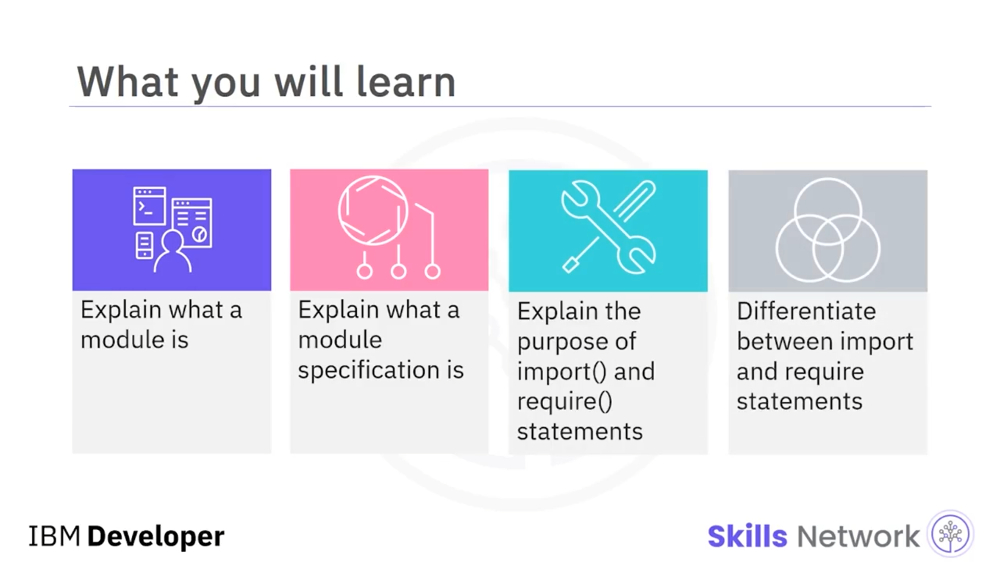
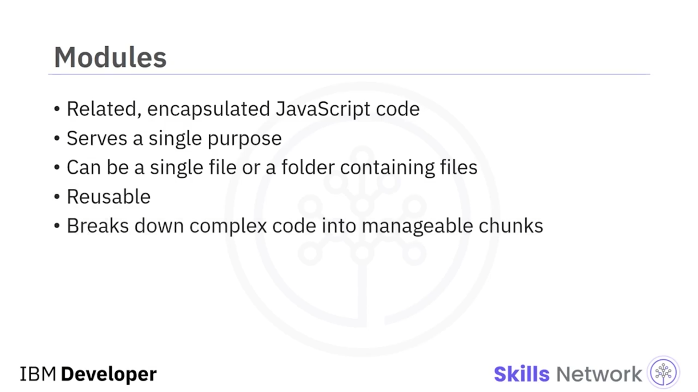
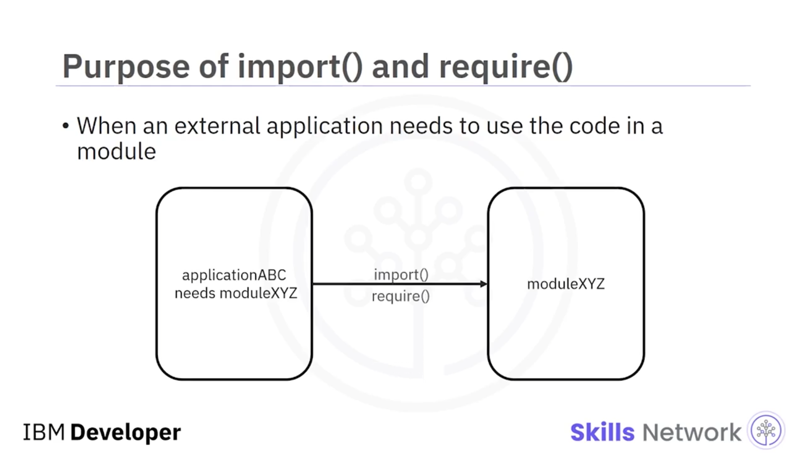
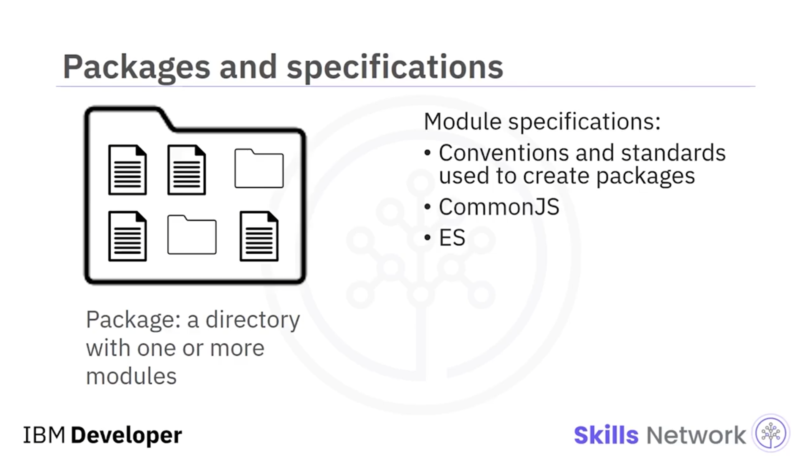
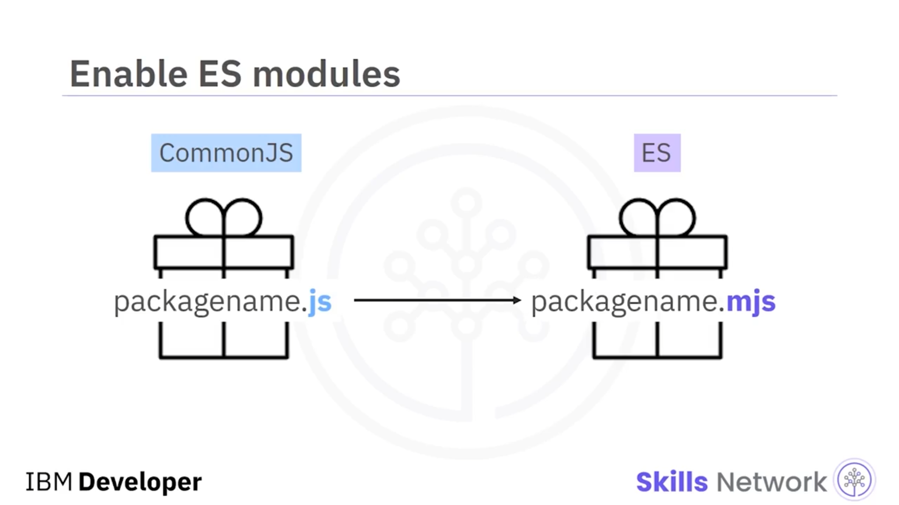
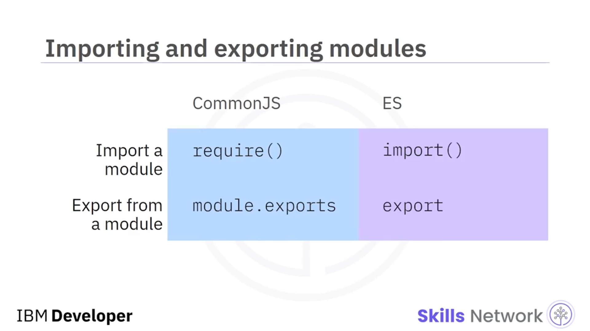
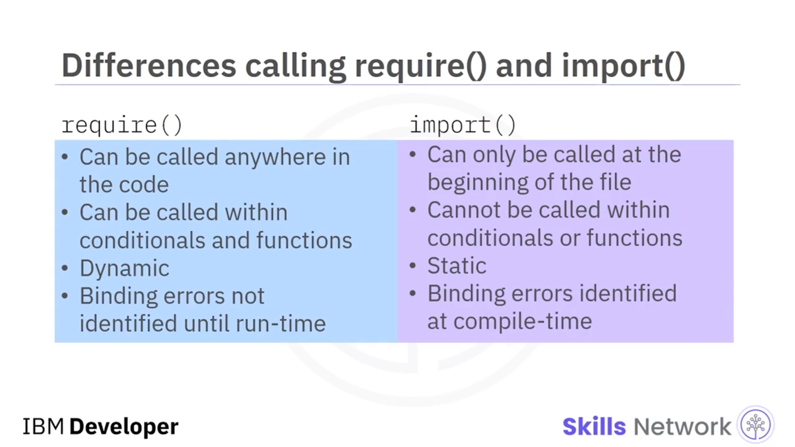
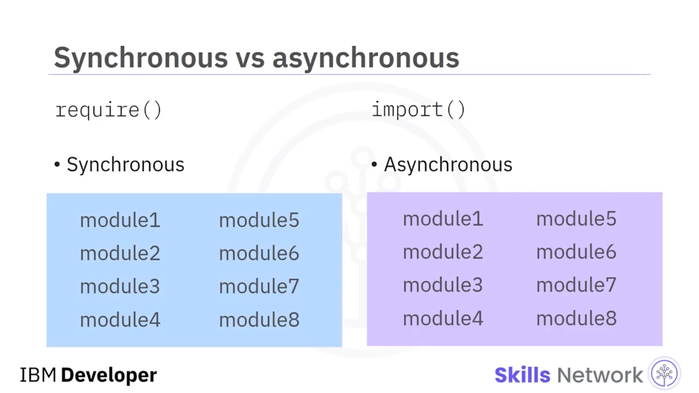
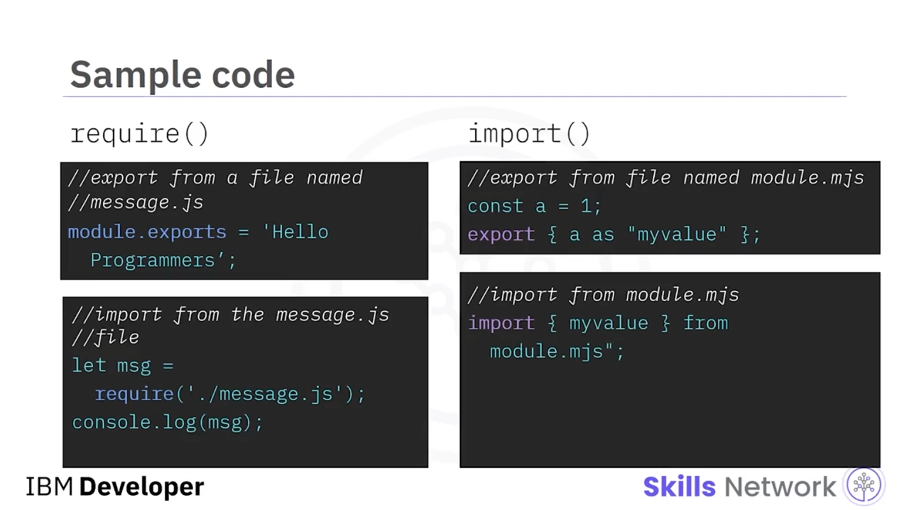
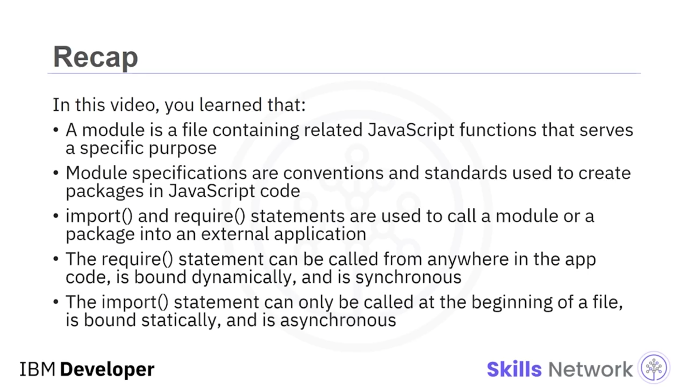

## 📦 Import and Require

Import and require bölümüne hoş geldiniz. Bu videoyu izledikten sonra şunları yapabileceksiniz: bir modülün ne olduğunu açıklamak, bir modül spesifikasyonunun ne olduğunu açıklamak, `import` ve `require` ifadelerinin amacını açıklamak ve `import` ile `require` ifadeleri arasındaki farkları ayırt etmek.



Node.js’te modüller, belirli bir amaca hizmet eden, ilişkili ve kapsüllenmiş JavaScript kodu içeren dosyalardır. Modüller tek bir dosya olabileceği gibi birden fazla dosya ve klasörden oluşan bir koleksiyon da olabilir. Geliştiriciler modüllere yoğun şekilde güvenir; çünkü modüller hem yeniden kullanılabilirlik sağlar hem de karmaşık kodu yönetilebilir parçalara bölmeye yardımcı olur.



Harici bir uygulamanın bir modülün içerdiği kodu kullanması gerektiğinde, uygulamanın o modülü çağırması gerekir. Harici uygulama bir modülü çağırdığında, modül `import()` veya `require()` ifadesi kullanılarak çağrılır.



Hangi ifadenin gerekli olduğu, spesifikasyona bağlıdır.

## 🧩 Spesifikasyonlar

Şimdi spesifikasyonlardan bahsedelim. Bir veya daha fazla modülün birlikte paketlendiği bir dizine *package* denir. Modül spesifikasyonları, Node.js uygulamaları için JavaScript kodunda paketler oluşturmak üzere kullanılan konvansiyonlar ve standartlardır.

Node.js uygulamaları için en yaygın kullanılan modül spesifikasyonları **CommonJS** ve  **ES modules** ’tır. CommonJS ve ES modules arasındaki bazı farklar birazdan ele alınacaktır.



Varsayılan olarak Node.js, JavaScript kodunu bir CommonJS modülü olarak ele alır.

Library yazarları, bir Node.js paketinde ES modules’ı kolayca etkinleştirebilir; bunun için sadece package dosya uzantısını `.js`’den `.mjs`’ye değiştirmeleri yeterlidir.



CommonJS modülleri modül import etmek için `require()` ifadesini kullanırken, ES modules `import()` fonksiyonunu kullanır.

Bir modül kendi dosyasının dışında kullanılacaksa önce export edilmelidir. CommonJS ile `module.exports` ifadesi kullanılmalıdır. Modüller ES spesifikasyonuna “export” anahtar kelimesi kullanılarak export edilebilir.



## 🔍 Require ve Import Arasındaki Farklar

Şimdi require ve import arasındaki farklara daha yakından bakalım. Uygulama kodu içinde `require` ve `import` çağırma farklarına bakalım.

`require` ifadesi dosyanın herhangi bir yerinde çağrılabilirken, `import` ifadesi dosyanın başında çağrılmalıdır. `require` ifadesi herhangi bir yerden çağrılabildiği için, koşul ifadeleri ve fonksiyonlar içinde çağrılabilir; ancak `import` çağrılamaz.

Bu, `require` için bir avantaj gibi gelebilir; ancak `require` ifadesinin **dinamik** olarak bağlandığını, `import`’un ise **statik** olarak bağlandığını unutmayın. Bu, fonksiyon tanımını fonksiyon çağrısına bağlarken oluşan hataların run-time’a kadar tespit edilemeyeceği anlamına gelir. `import` için ise bağlama hataları compile time’da tespit edilir.



`require` ile alınan modüller doğası gereği  **senkron** , `import` ile içe aktarılan modüller ise **asenkron**dur. Senkron, modüllerin doğrusal biçimde, tek tek yükleneceği ve işleneceği anlamına gelir.

Asenkron ise modüllerin eşzamanlı olarak işlenebileceği anlamına gelir. Büyük ölçekli uygulamalarda, yüzlerce modülün yüklendiği senaryolarda `import`, `require` fonksiyonlarına kıyasla daha hızlı çalışır.



## 🧾 Örnek Kodlar

Şimdi `require` ve `import` kullanarak export ve import işlemini gösteren bazı örnek kodlara bakalım.

`require` ifadesinin CommonJS uygulamalarında kullanıldığını hatırlayın. Bu kod parçası, `message.js` adlı bir dosyadan nasıl export yapılacağını gösterir. `message.js` modülünden “Hello programmers” string’ini export etmek için `module.exports` kullanırız. Ardından, `message.js` modülünü ana uygulamaya import etmek için `require` ifadesini kullanırız.

```javascript
// message.js
module.exports = "Hello programmers";
```

```javascript
// main.js
let msg = require("./message.js");
console.log(msg);
```

Şimdi `module.mjs` adlı bir dosyadan bir ES module’ün nasıl export edileceğine bakalım. Bu kod, `a` adında bir constant tanımlar ve constant’ı 1’e eşitler. Sonra `export` ifadesi kullanılır. Süslü parantezlerin kullanımına dikkat edin. `a`, `myValue` olarak yeniden adlandırılır.

```javascript
// module.mjs
const a = 1;
export { a as myValue };
```

Son olarak, `import` kullanarak bir ES module’ün nasıl import edileceğine bakalım. Sadece `import` anahtar kelimesini kullanın. `module.mjs` dosyasından `myValue`’yu import ediyoruz.

```javascript
// main.mjs
import { myValue } from "./module.mjs";
```



## 🧾 Özet

Bu videoda şunları öğrendiniz: bir modül, belirli bir amaca hizmet eden ilişkili JavaScript fonksiyonlarını içeren bir dosyadır. Modül spesifikasyonları, JavaScript kodunda paketler oluşturmak için kullanılan konvansiyonlar ve standartlardır. `import` ve `require` ifadeleri, bir modülü veya paketi harici bir uygulamaya çağırmak için kullanılır. `require` ifadesi uygulama kodunun herhangi bir yerinden çağrılabilir, dinamik olarak bağlanır ve senkrondur; `import` ifadesi ise yalnızca dosyanın başında çağrılabilir, statik olarak bağlanır ve asenkrondur.


