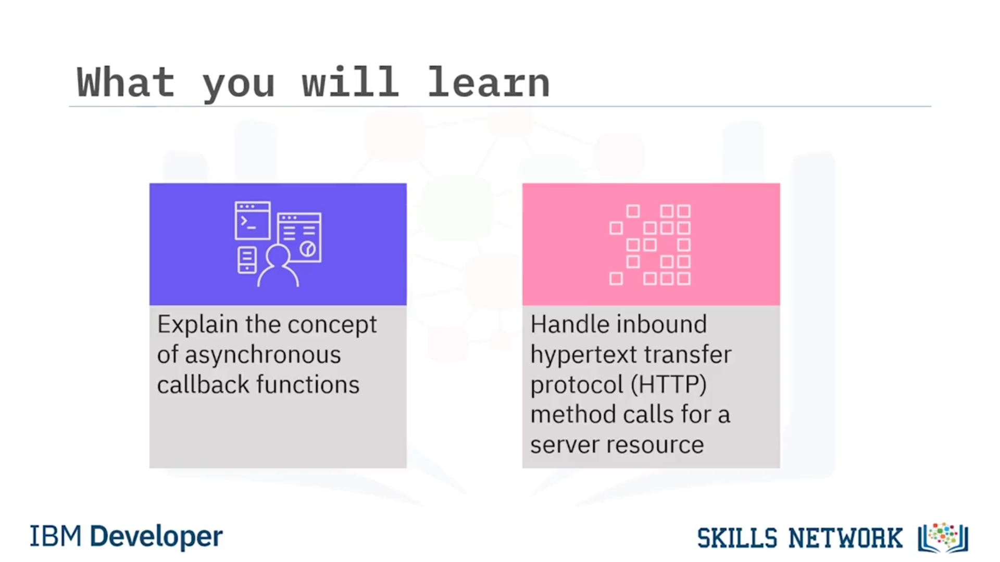
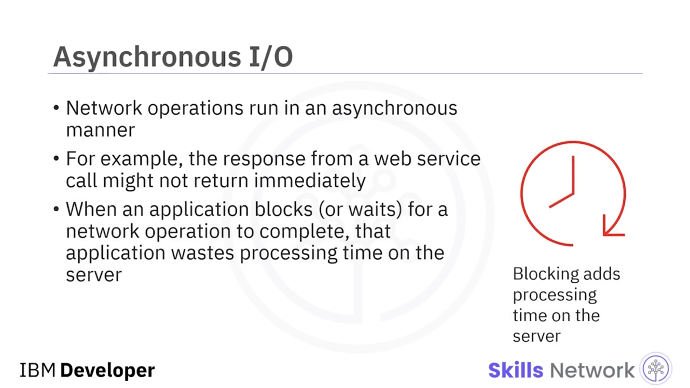
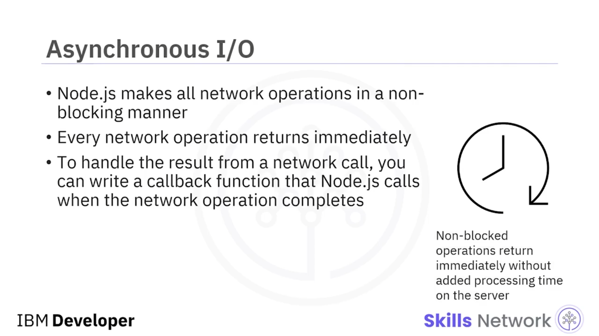
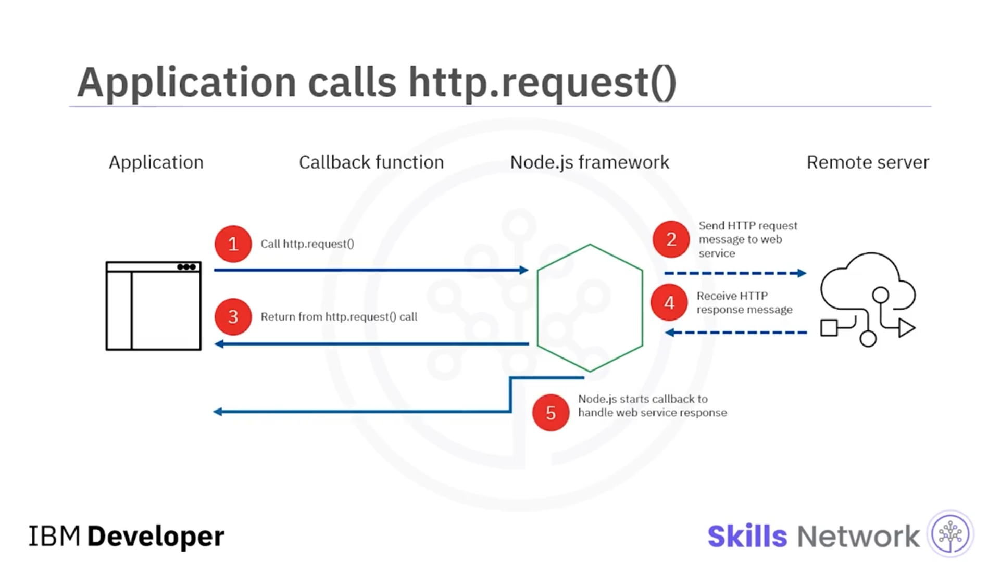
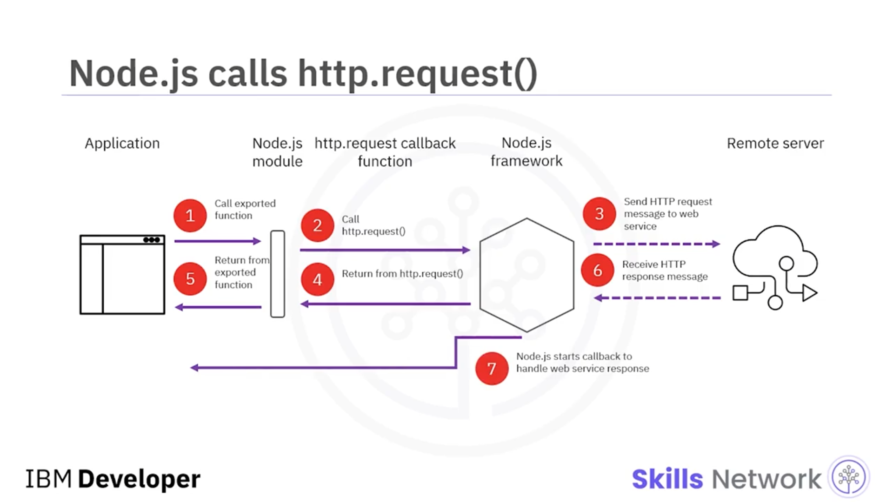
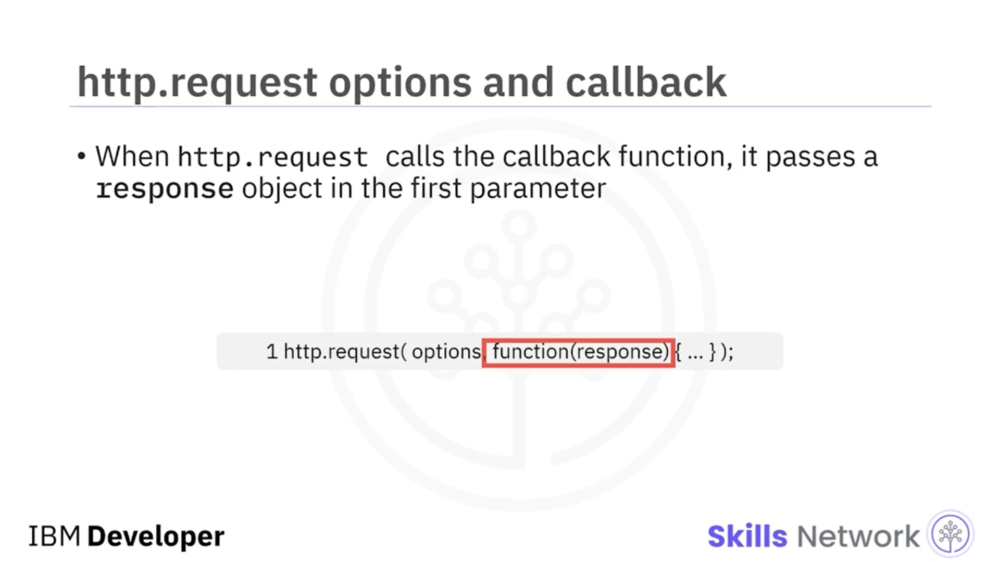
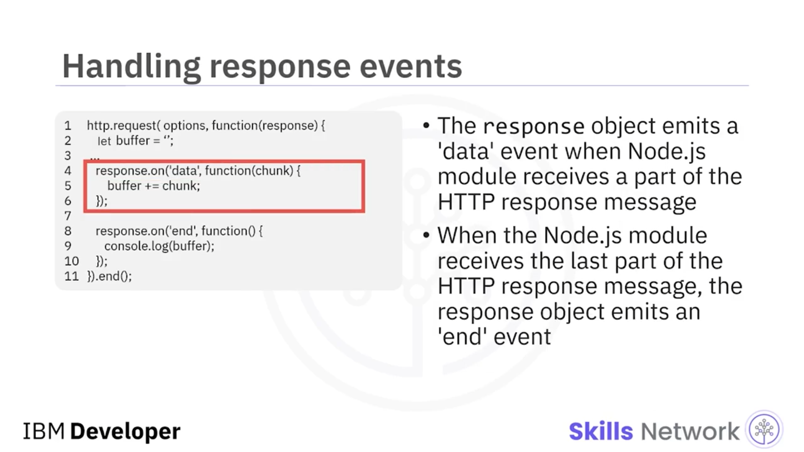
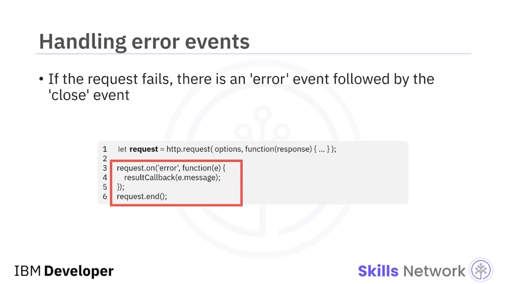
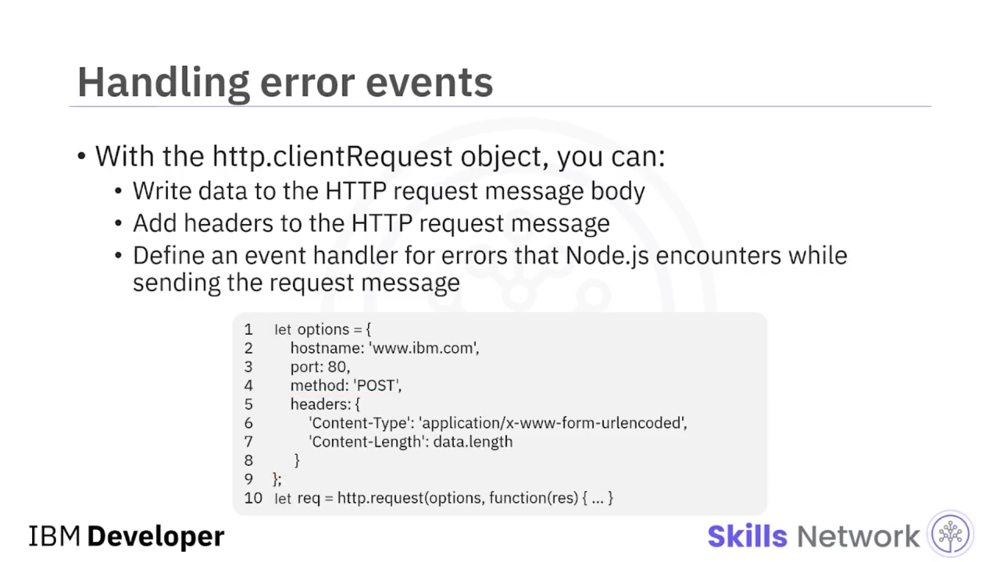
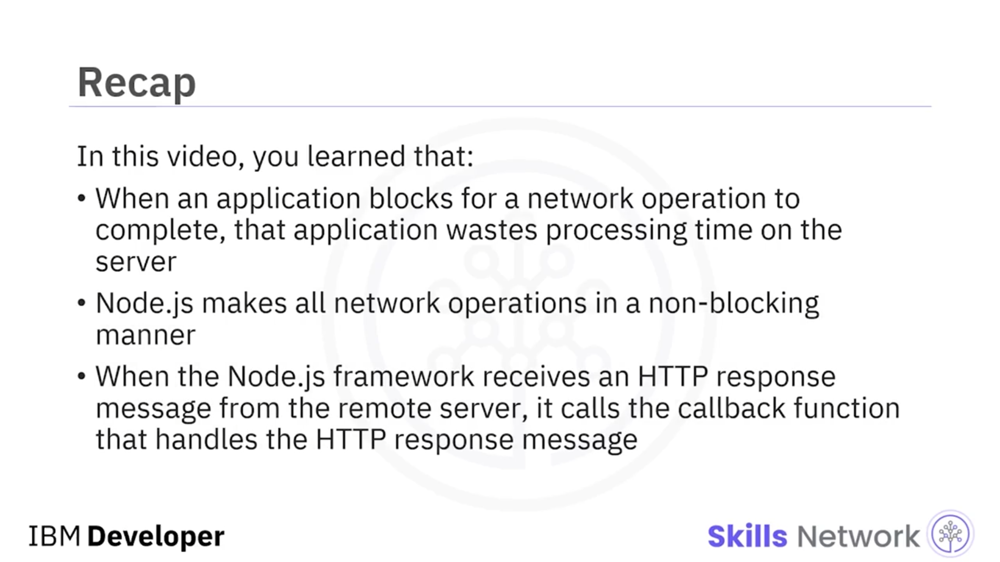

## 🔄 Asenkron G/Ç ve Callback Programlama

Asenkron G/Ç ve Callback Programlama’ya hoş geldiniz. Bu videoyu izledikten sonra şunları yapabiliyor olmalısınız: Asenkron callback fonksiyonları kavramını açıklamak ve bir sunucu kaynağı için gelen *Hypertext Transfer Protocol (HTTP)* metod çağrılarını işlemek.



Ağ işlemleri asenkron bir şekilde çalışır. Örneğin, bir web servis çağrısından gelen yanıt hemen dönmeyebilir. Bir uygulama bir ağ işleminin tamamlanmasını beklediğinde (bloklandığında), sunucuda işlem süresini boşa harcar.

Node.js tüm ağ işlemlerini *non-blocking* (bloklamayan) şekilde yapar. Her ağ işlemi hemen geri döner.



---

## 🧩 Callback Fonksiyonlarıyla Ağ Çağrısı Sonucunu İşleme

Bir ağ çağrısının sonucunu işlemek için, ağ işlemi tamamlandığında Node.js’in çağıracağı bir *callback* fonksiyonu yazarsınız.

Bu senaryoya ait bir sıralama diyagramı; uygulama, Node.js framework’ü, uzak sunucuya yapılan web servis çağrısı ve callback fonksiyonuna geri dönüş arasındaki etkileşimi gösterir.



İlk adımda uygulama `HTTP.request` fonksiyonuna bir çağrı yapar. Bu fonksiyon uzak web sunucusuna bir çağrı yapar ve web servisi ister. Node.js framework’ü, uzak web sunucusundan HTTP yanıt mesajını almadan önce, `HTTP.request` fonksiyon çağrısı için hemen bir sonuç döndürür.

Bu sonuç yalnızca istek mesajının başarıyla gönderildiğini belirtir. Yanıt mesajı hakkında hiçbir şey söylemez.



---

## 📬 HTTP Yanıtı Geldiğinde Callback’in Çağrılması

Node.js framework’ü uzak sunucudan bir HTTP yanıt mesajı aldığında, `HTTP.request` çağrısı sırasında tanımladığınız callback fonksiyonunu çağırır. Bu fonksiyon HTTP yanıt mesajını işler.

Biraz daha karmaşık bir senaryoda uygulamanız özel bir Node.js modülünü çağırır ve bu modül daha sonra bir `HTTP.request` fonksiyon çağrısı yapar. Ardından Node.js framework’ü bir HTTP istek mesajı göndererek uzak sunucunun web servisini çağırır.

İlk senaryoda olduğu gibi, Node.js framework’ü Node.js modülündeki HTTP fonksiyon çağrısına bir değer döndürür. Bu yanıt yalnızca HTTP isteğinin başarıyla gönderildiğini belirtir.

Node.js modülü daha sonra dışa aktarılan fonksiyon çağrısından döner.

Bu noktada, yanıt mesajı henüz gönderilmemişken uygulama bir sonraki adıma geçerek işlemeye devam eder.



---

## 🧾 `data` ve `end` Olaylarını Yakalama

Uzak sunucu bir HTTP yanıt mesajı döndürdüğünde, Node.js framework’ü özel Node.js modülü tarafından tanımlanan callback fonksiyonunu çağırır.

Callback fonksiyonunun amacı iki olayı işlemekten oluşur:

```js
request.on('data')
request.on('end')
```

Bu durumda callback fonksiyonu yalnızca HTTP yanıt mesajı gövdesini console log’a yazdırır.


---

## 🌦️ Örnek: Node.js Modülü İçinden HTTP İsteği Yapmak

Bu kod örneği, bir Node.js modülü içindeki bir fonksiyondan nasıl `HTTP.request` çağrısı yapacağınızı gösterir.

HTTP request fonksiyonundaki ilk parametre bir `options` değişkenidir. `options` değişkeni en az iki değişken içerir: uzak sunucunun `hostname` değeri ve üzerinde işlem yapmak istediğiniz *Uniform Resource Locator (URL)* kaynak yolu.

Buradaki örnekte, San Francisco International Airport (KSFO) için hava gözlemini almak üzere US National Weather Service’e bir çağrı yapıyorsunuz.

HTTP request fonksiyonunun ikinci parametresi bir callback fonksiyonudur. Bu örnekte, bir parametre alan anonim bir fonksiyondur: `response` nesnesi.

Node.js modülü bu anonim fonksiyonu çağırdığında, HTTP response nesnesinin parçalarını alırken olaylar oluşur. Bu örnekte iki özel olay vardır: `'data'` olayı ve `'end'` olayı.

Bu iki olay için, her bir olay türünü işlemek üzere daha fazla callback fonksiyonu tanımlarsınız.

Gerçek kodlamada, HTTP yerine HTTPS kullanmanız gerekebilir.


---

## 🧪 `parseString` Callback’i ve `HTTP.request` Seçenekleri

Sonuç nesnesi bir `parseString` modülünün callback fonksiyonuna aktarılır.

`HTTP.request` fonksiyonu bir URL ve bir dizi seçenek ( *options* ) alır. Her ikisi de verilirse, ikisi birleştirilir ve `options` önceliklidir.



`options` nesnesinde host, port, kimlik doğrulama, protokol ve diğer header’ları tanımlayabilirsiniz.

`HTTP.request` metodu ayrıca, bir yanıt alındığında hemen çağrılan isteğe bağlı bir callback fonksiyonu kabul eder.

`HTTP.request` callback fonksiyonunu çağırdığında, callback’in ilk parametresine bir `response` nesnesi geçirir. Bu callback fonksiyonunun ilk parametresi `response` nesnesidir.

---

## 📣 İstek Sürecindeki Olaylar ve Dinleme

Node.js framework’ü, request fonksiyonunun seyri boyunca birkaç olay ( *event* ) üretir ( *emit* ).

Bu olayları, `object.on()` metodunu kullanarak ve ilk parametre olarak olay adını geçirerek dinleyebilirsiniz.

İstek başarılı olursa, her veri geldiğinde response nesnesi üzerinde bir `'data'` olayı yayımlanır ve response bittiğinde `'end'` olayı gelir.

İstek başarısız olursa, `'error'` olayı gelir ve ardından `'close'` olayı gelir.

Şimdi bu tür hataların nasıl ele alınacağını görelim.



---

## 🧱 `HTTP.ClientRequest` ve Hata Yönetimi

`request` metodu `HTTP.ClientRequest` tipinde bir nesne döndürür. Bu nesne, devam eden isteği temsil eder.

İstek gövdesine ekleme yapabilir, header’larda değişiklik yapabilir ve aşağıda gösterildiği gibi hata olaylarını dinleyebilirsiniz.



Kod, bir hata olması durumunda yalnızca hata mesajını çıktı olarak verir.

İsteği sonlandırmak için `clientRequest.end()` çağrılır.



---

## ✅ Video Özeti

Bu videoda şunları öğrendiniz:

* Bir uygulama bir ağ işleminin tamamlanmasını beklemek için bloklandığında, sunucuda işlem süresini boşa harcar.
* Node.js tüm ağ işlemlerini bloklamayan ( *non-blocking* ) şekilde yapar.
* Node.js framework’ü uzak sunucudan bir HTTP yanıt mesajı aldığında, HTTP yanıt mesajını işleyen callback fonksiyonunu çağırır.


