## 🧩 Callback Fonksiyonları Oluşturma

Callback Fonksiyonları Oluşturmaya hoş geldiniz. Bu videoyu izledikten sonra şunları yapabiliyor olmalısınız: *Hypertext Transfer Protocol* veya *HTTP* metod çağrılarını yakalamak ( *intercept* ) için bir callback fonksiyonu oluşturmak.

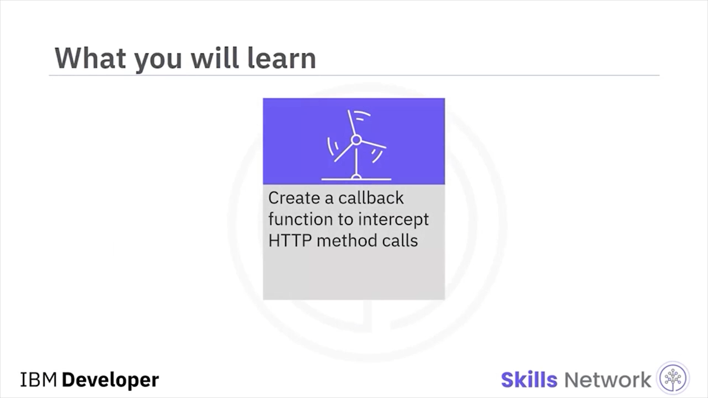

Asenkron bir framework olarak Node.js, sonucu çağıran fonksiyona döndürmek için callback fonksiyonlarını yoğun biçimde kullanır.

---

## ⚠️ SDK Callback Sözleşmesi ve Hata Nesnesi

Node.js modülleri *Software Development Kit* (SDK) içinde, bir callback fonksiyonunda ilk parametre olarak bir hata nesnesi ( *error object* ) geçirir.

Burada fonksiyon, ilk parametre olarak `error` ile tanımlanır.

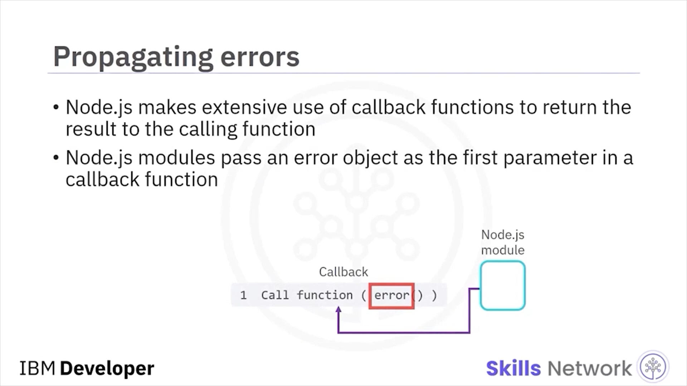

Bu sözleşmeyle callback fonksiyonu, ilk parametrenin bir hata nesnesi içerip içermediğini kontrol eder. Eğer `error` tanımlıysa, callback fonksiyonu hatayı ele alır ve açık olan ağ veya veritabanı bağlantılarını temizler.

Eğer hata tanımlı değilse, callback fonksiyonu çağrının sonucunu inceler.

Eğer hata tanımlıysa, hata mesajını yazdırın. Aksi halde `weather.current` fonksiyon çağrısı başarıyla tamamlanmıştır. Fonksiyon çağrısının sonucunu yazdırın.

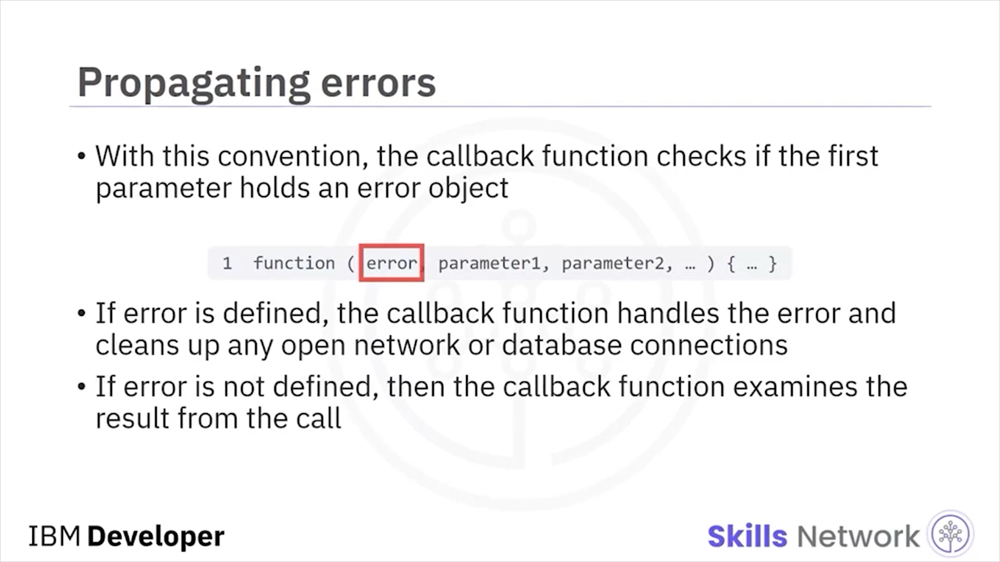

---

## 🌤️ Ana Uygulama Örneği ve Tarayıcıya Yazdırma

Kodlar ana uygulamadadır; bu uygulamada `weather` adında bir nesne vardır ve bu nesne, `weather`’ın `current` fonksiyonunu çağıran Node.js modülüdür.

Konum bir giriş parametresidir; bu örnekte bir havaalanıdır.

Tarayıcıda `temp_f` yazdırmak için `response.end` kullanabiliriz: mevcut hava durumu okuması `temp_f` derece.

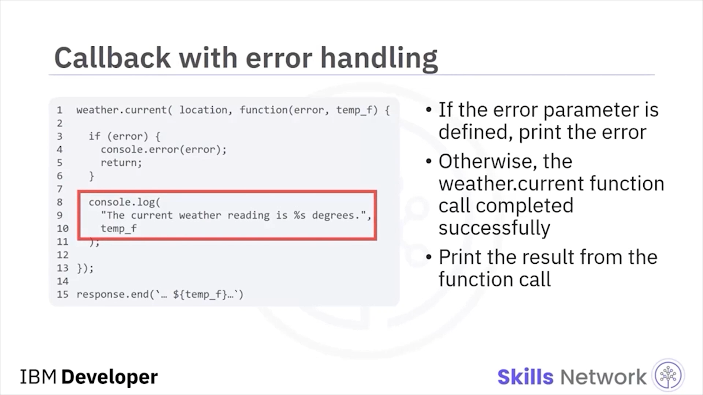

---

## 🧯 Callback’e Error Nesnesi Geçme Örneği

Şimdi callback fonksiyonuna bir hata nesnesi geçirmenin bir örneğine bakacağız.

Callback fonksiyonlarının ilk parametreyi kontrol ederek bir hata durumu oluşup oluşmadığını nasıl anımsadığınızı hatırlayın.

Sonucu console’da yazdırmak yerine, `resultcallback` callback fonksiyonunu hata nesnesiyle çağırırsınız.

Hata nesnesini ana uygulamanın `resultcallback` callback fonksiyonuna geri geçirirsiniz.

Eğer hata oluşmadıysa, `resultcallback` fonksiyonunu ilk parametre olarak `null` ile çağırabilirsiniz.

Kodlar özel ( *custom* ) Node.js modülündedir. Callback handler, HTTP response mesajı gövdesinin içeriğini console’a yazdırmıştır.

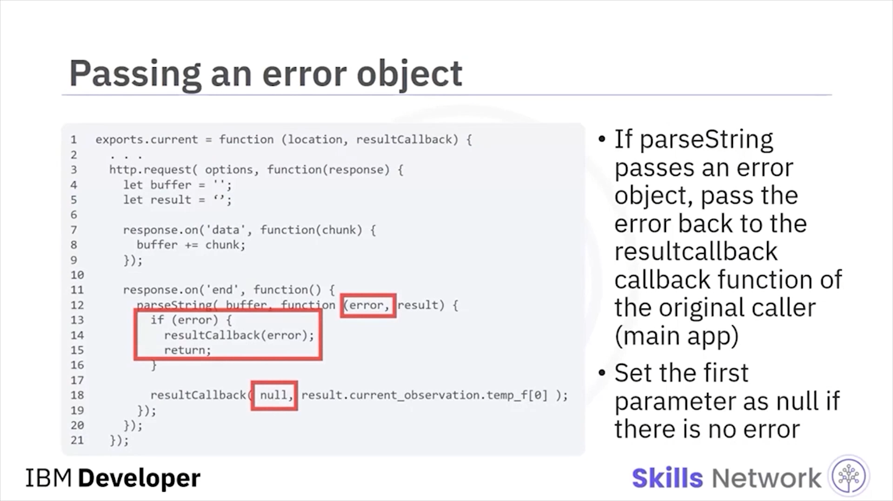

---

## 🔗 HTTP Yanıtını Orijinal Uygulamaya Nasıl Döndürürsünüz?

Peki yanıt mesajını orijinal çağıran uygulamaya döndürmek isteseydiniz?

Bir `return` fonksiyonu kullanırsanız, Node.js `HTTP.request` çağrısı tamamlandıktan sonra callback fonksiyonunu çağırabilir.

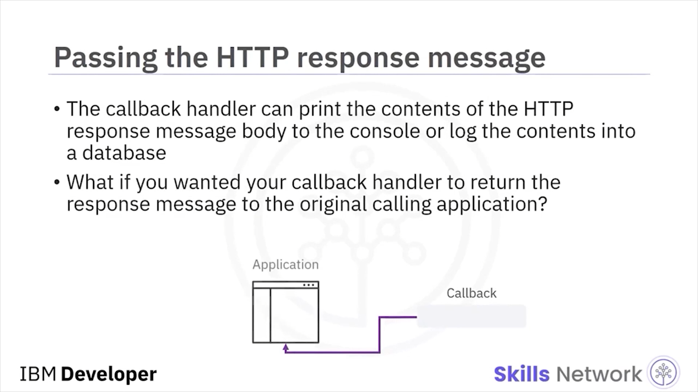

Uygulama dışa aktarılan ( *exported* ) fonksiyonu çağırır. Fonksiyonu uygulayan modül, Node.js framework’ünün onun adına bir web servis çağrısı yapabilmesi için `HTTP.request` çağırır.

Bu istek başarıyla gönderildiğinde framework, kontrolü Node.js modülüne geri verir. Sonra Node.js modülü kontrolü uygulamaya geri verir.

Uzak sunucu, Node.js framework’üne bir HTTP response mesajı geri gönderdiğinde, framework Node.js modülü tarafından tanımlanan callback handler’ı çağırır.

Ancak callback fonksiyonu ile ana uygulama arasında bir bağlantı yoktur.

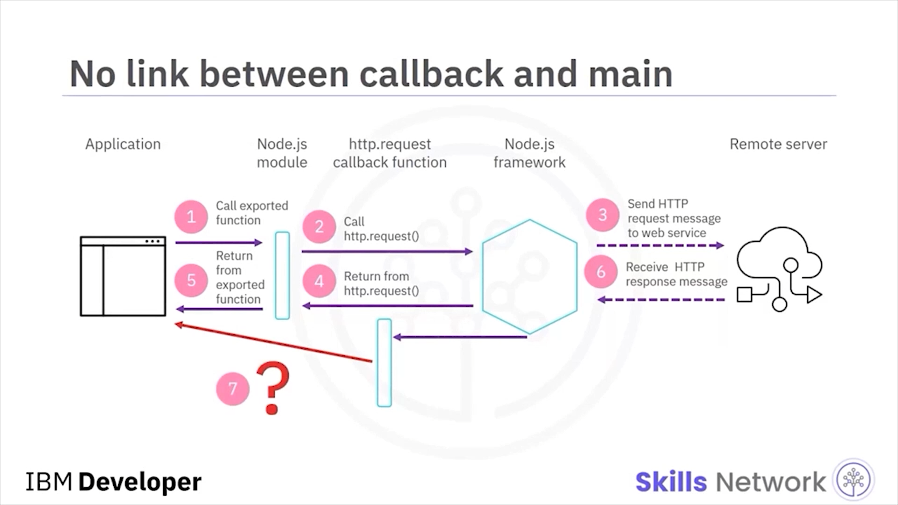

---

## 🧠 Çözüm Deseni: Bir Callback Diğerini Çağırır

Öyleyse callback fonksiyonunu ana uygulamaya nasıl bağlarsınız?

Desen şudur: Bir Node.js uygulaması bir modülü bloklamayan şekilde çağırdığında, uygulama sonucu işlemek için bir callback fonksiyonu sağlar.

Ana uygulama `HTTP.request` çağırıyorsa, HTTP response mesajını işlemek için bir callback handler sağlamalıdır.

Ana uygulama `HTTP.request` çağıran bir fonksiyonu çağırıyorsa, iki callback fonksiyonu vardır:

* Özel modülün, `HTTP.request`’ten gelen HTTP response mesajını işleyen bir callback fonksiyonu vardır.
* Ana uygulamanın, ilk callback fonksiyonunda yakalanan sonucu işleyen bir callback fonksiyonu vardır.

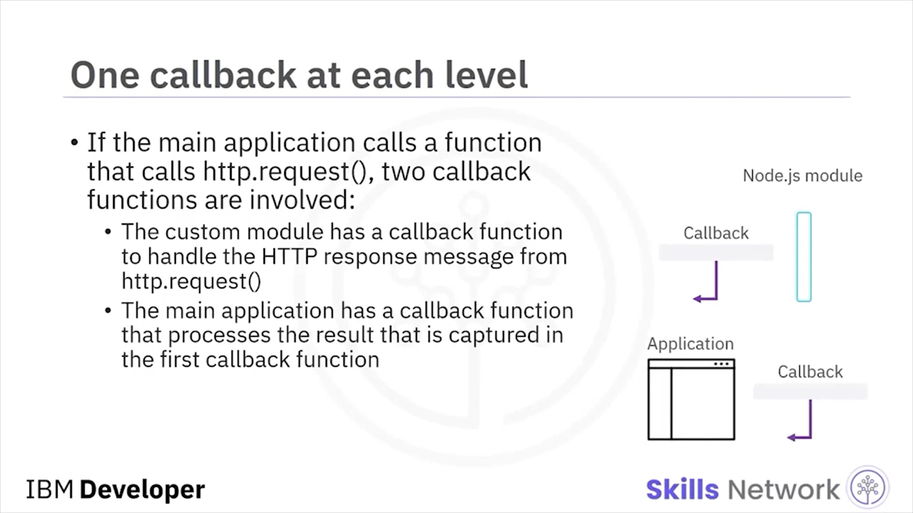

---

## 🧾 Akışın Çalışma Şekli

Bu çözümün nasıl çalıştığını görelim.

`HTTP.request` fonksiyon çağrısından sonucu yakalamak için bir callback fonksiyonu oluşturacağız.

Uygulama Node.js modülüne bir çağrı yapar. Node.js modülü, uzak sunucuya bir HTTP istek mesajı göndermek için `HTTP.request` fonksiyon çağrısı yapar.

Uzak servis bir HTTP response mesajı döndürmeden önce, `HTTP.request` fonksiyon çağrısı kontrolü Node.js modülüne geri verir; çünkü istek mesajı başarıyla gönderilmiştir.

Sonra Node.js modülü ana uygulamaya bir değerle yanıt verir.

Daha sonraki bir zamanda uzak sunucu bir HTTP response mesajı geri gönderir.

Node.js framework’ü, Node.js modülü tarafından tanımlanan callback fonksiyonunu çağırır.

Bu callback fonksiyonu, ana uygulama tarafından tanımlanan başka bir callback fonksiyonunu çağırır.

Node.js modülü bir response mesajı aldığında, Node.js modülünden ana uygulamaya mesaj aktarmanın tek yolu bir callback fonksiyonunun başka bir callback fonksiyonunu çağırmasıdır.

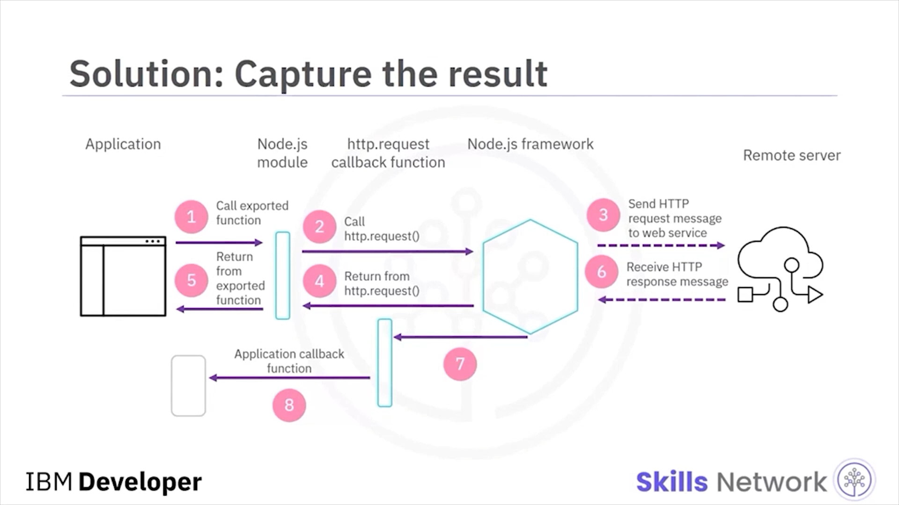

---

## 🧪 `weather.current` İçinde Anonim Callback

Burada ana uygulama `weather.current` çağırdığında, çağrının sonucunu işlemek üzere anonim bir callback fonksiyonu geçirir.

Bu durumda anonim fonksiyon tek bir giriş parametresi alır: `temp_f`.

Bu callback fonksiyonunun amacı, Fahrenheit cinsinden hava durumu okumasını alıp sonuçları console log’a yazdırmaktır.

Özel Node.js modülündeki `resultcallback` callback fonksiyonu, ana uygulamadaki `weather` nesnesinin `current` fonksiyonuna ait anonim callback fonksiyona (`function temp_f`) bağlanır.

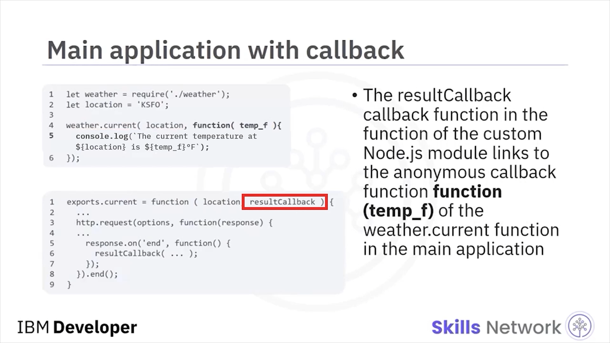

---

## 📦 Modülde `current` Özelliği ve `resultcallback` Referansı

Şimdi bir callback fonksiyonu ile ana uygulamaya sonuç döndüren bir Node.js modülü görebilirsiniz.

Burada `current` adlı property için bir fonksiyon tanımlanır. Bu property modülün bir parçası olarak dışa aktarılır ( *exported* ).

Anonim fonksiyon, ana uygulamadan `resultcallback` adlı bir parametre alır.

Bu, ana uygulamanın callback fonksiyonuna bir referansı Node.js modülünün callback fonksiyonuna iletme şeklidir.

`resultcallback` parametresi, ana uygulamadaki anonim callback fonksiyonunu saklar.

`current` property’sinin alt kısmına bakın.

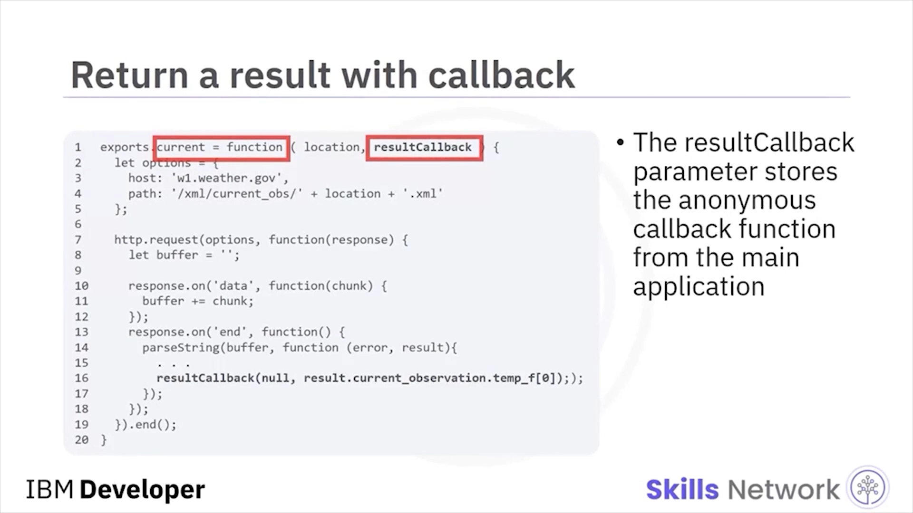

---

## ✅ `response.on('end')` ile Sonucu Üst Callback’e Aktarma

Bir `response.on('end')` event handler’ı HTTP response mesajının iletimini ele alır.

Uzak sunucu response mesajını göndermeyi bitirdiğinde, kod `resultcallback` çağrısı yapar ve ona Fahrenheit cinsinden mevcut hava durumu okumasını geçirir.

Bir callback handler’dan diğerine değer geçirme yolu budur.

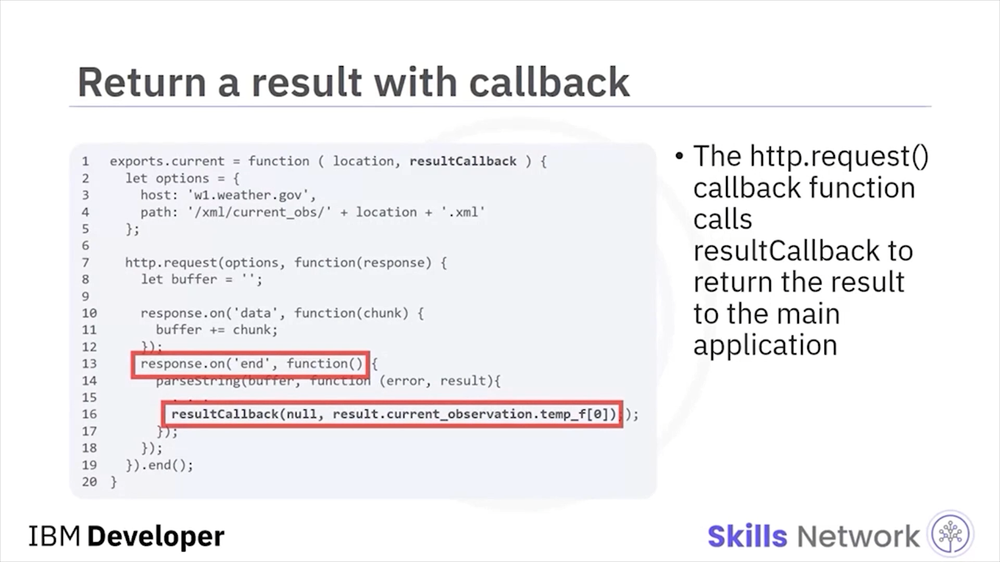

---

## 🧾 Video Özeti

Bu videoda şunları öğrendiniz:

* Node.js, sonuçları çağıran fonksiyona döndürmek için callback fonksiyonlarını yoğun biçimde kullanır.
* SDK içindeki Node.js modülleri, callback fonksiyonunda ilk parametre olarak bir hata nesnesi geçirir.
* Her seviyede bir callback fonksiyonu vardır.

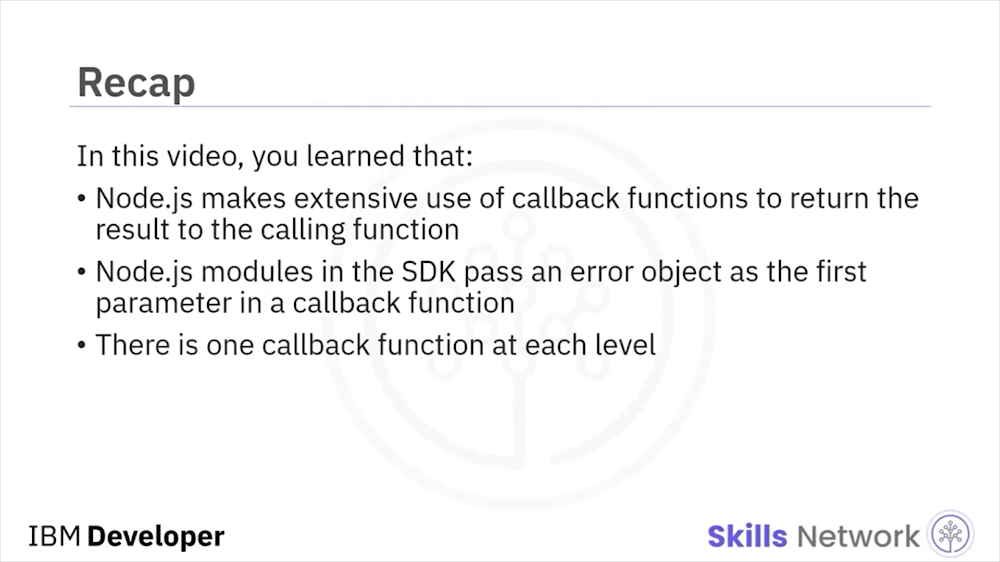
