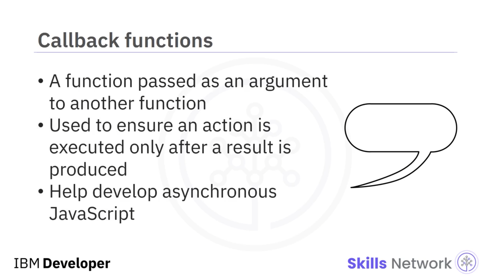
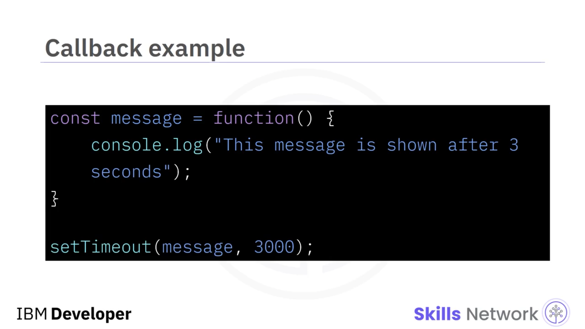
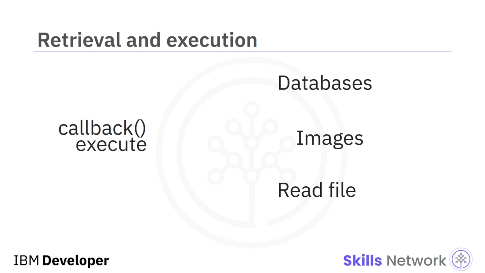
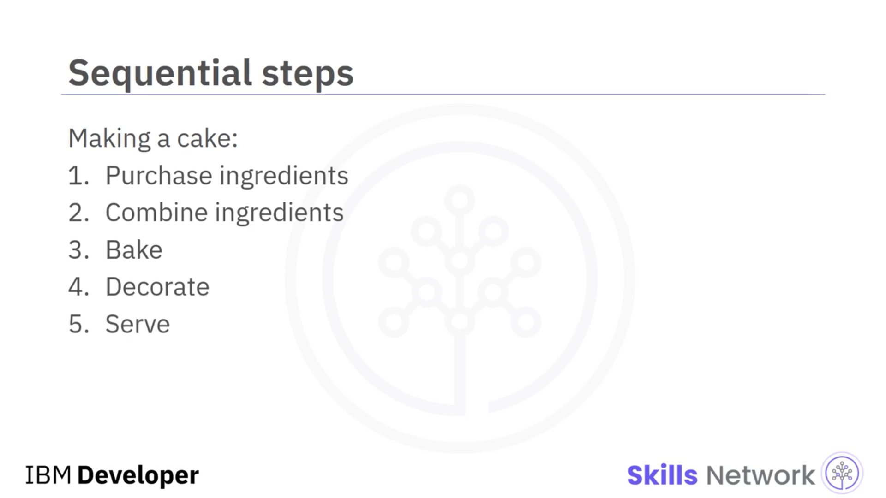
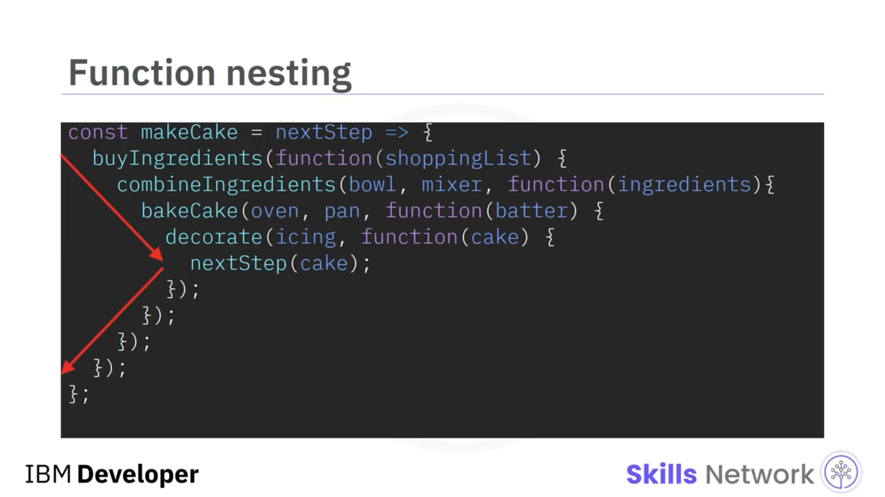
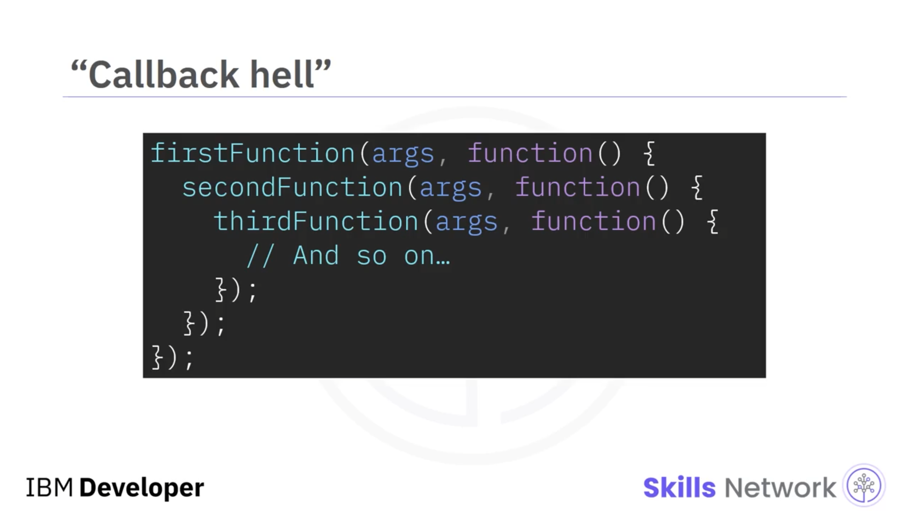
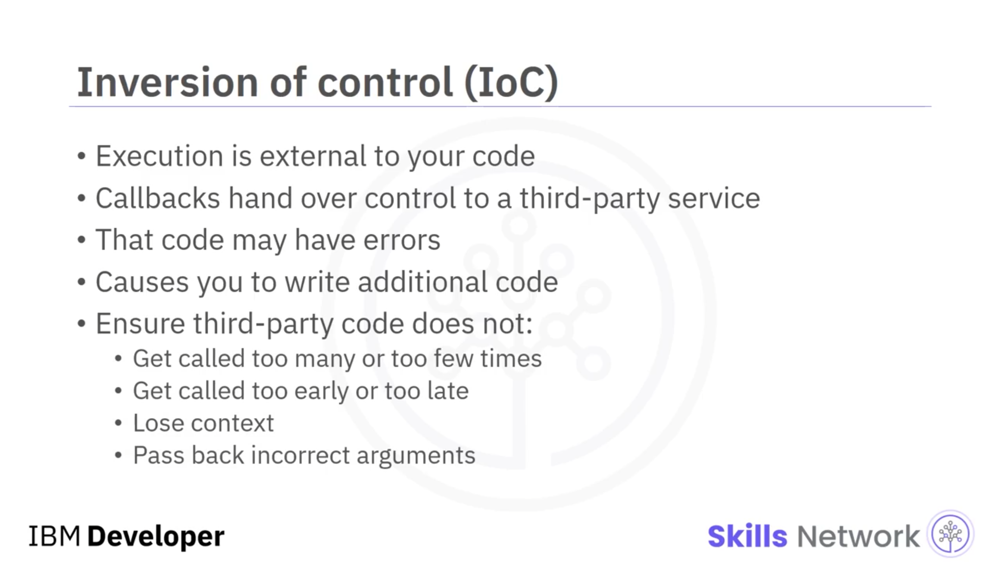
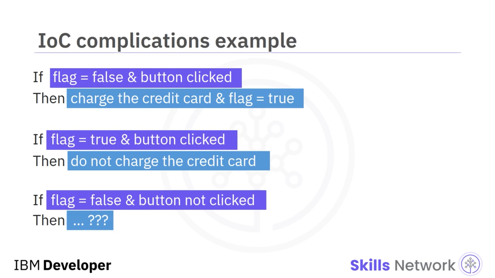
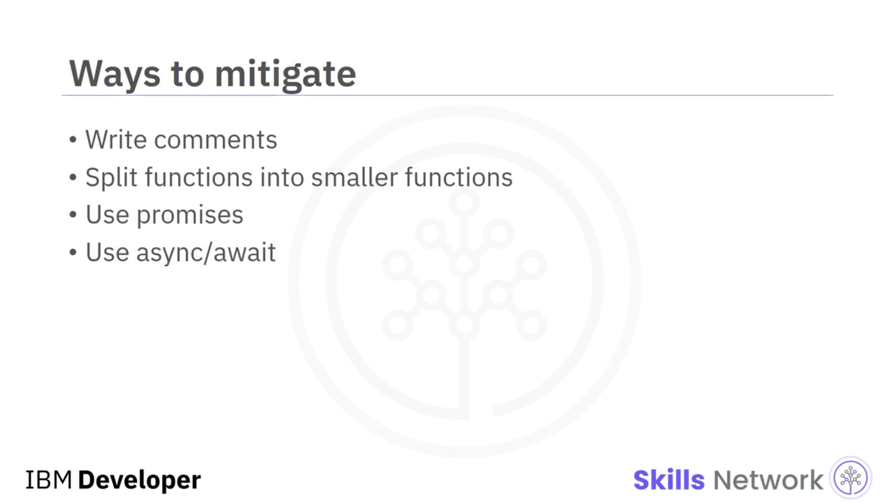
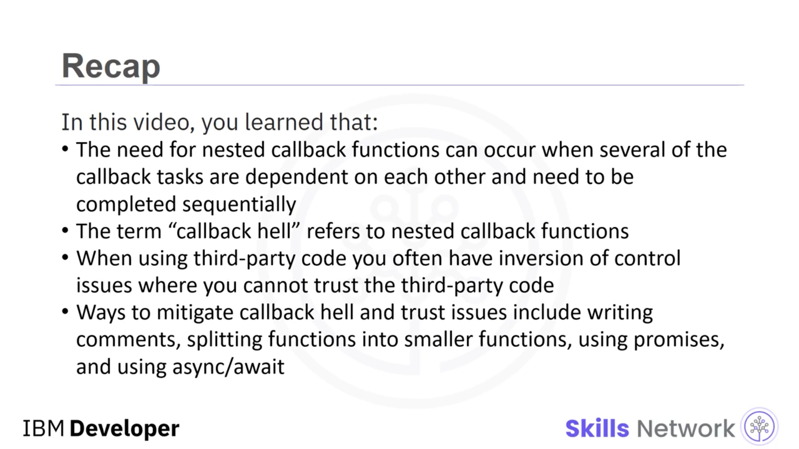

## 🧩 Issues with Callbacks

Issues with Callbacks’a hoş geldiniz. Bu videoyu izledikten sonra şunları yapabileceksiniz: İç içe callback’lerin neden oluştuğunu açıklamak, iç içe callback’lerin zorluklarını açıklamak,  *inversion of control* ’ü tanımlamak,  *inversion of control* ’ün zorluklarını açıklamak, iç içe callback’leri ve  *inversion of control* ’ü azaltmanın birkaç yolunu belirlemek.

Bir callback’in, sonucu temel alarak callback’i çalıştıran başka bir fonksiyona argüman olarak geçirilen bir fonksiyon olduğunu hatırlayın. Temelde, yalnızca bir sonuç üretildikten sonra çalıştırılan fonksiyonlardır. Callback’ler, asenkron JavaScript kodu geliştirmemize yardımcı olur. Callback’ler, bir ön koşul görevi tamamlanmadan bir fonksiyonun çalışmamasını sağlar.

Bu örnekte, `message` bir callback fonksiyonu örneğidir. Çağrıldığında konsola “This message is shown after 3 seconds” yazar.

JavaScript’te, bir eylemi gerçekleştirmeden önce milisaniye cinsinden belirtilen süre kadar bekleyen, yerleşik bir metot vardır: `setTimeout`. Bu örnekte `message`, `setTimeout` fonksiyonuna geçirilir. Böylece 3 saniye bekledikten sonra `setTimeout`, konsola “message” yazar.

Genellikle bu asenkron callback’ler (kısaca  *async* ), veritabanlarından değer almak, görseller indirmek, dosya okumak vb. için kullanılır. Çoğu zaman bu kaynaklar, onlara ihtiyaç duyan uygulamanın dışındaki başka servisler tarafından sağlanır. Callback fonksiyonları bir yanıt bekler ve yanıt gönderildiğinde çalışırlar.

---

## 🎂 Sıralı İşler ve İç İçe Callback’ler

Örneğin, bir kek yaptığınızı düşünün. Adımlar şunlardır:

* Kek malzemelerini satın al.
* Malzemeleri birleştir.
* Keki pişir.
* Keki süsle.
* Keki servis et.

Bu adımlar aynı anda tamamlanamaz. Başka bir deyişle, bu adımlar asenkron olarak tamamlanamaz. Bir sonraki adım, yalnızca bir önceki adım tamamlandıktan sonra başlatılabilir.

Callback’leri bir şeyin sıralı gerçekleşmesi için kullanırken, fonksiyonların birbiri içine iç içe yerleştirilmesi gerekir. Kek örneğimizin sözde kodu, her bir sonraki fonksiyonun bir sonraki fonksiyona argüman olarak geçtiği şekilde, buna benzer bir hale gelebilir. Her callback, bir önceki callback’e bağlıdır ve onu bekler; böylece kodun okunabilirliğini ve sürdürülebilirliğini etkileyen bir piramit yapısı oluşur.

Callback fonksiyonlarının bu şekilde iç içe geçirilmesine çoğu zaman **“Callback Hell”** denir ve özünde, piramit yapısı oluşturan, aşağı doğru üst üste yığılmış iç içe callback’lerdir. Bu yapı bazen **“The Pyramid of Doom”** olarak da adlandırılır.

---

## 🔄 Inversion of Control (IoC)

Callback’lerle ilgili bir diğer sorun, **inversion of control** (IoC) olarak da adlandırılan *kontrolün tersine çevrilmesi*dir.  *Inversion of control* , talimatların yürütülmesi gibi kontrol akışının sizin kodunuzun dışında olmasına denir. Çoğu zaman callback’ler kontrolü üçüncü bir tarafa devreder. Ancak bu üçüncü taraf kodundaki sorunları ve hataları yakalamak zor olabilir.

Üçüncü taraf koda güvenmek zorunda kalırsınız ya da üçüncü taraf kodunun şunları yapmadığından emin olmak için ek kod yazmanız gerekir:

* Çok fazla kez veya çok az kez çağrılmak
* Çok erken veya çok geç çağrılmak
* Bağlamı ( *context* ) kaybetmek
* Hatalı argümanlar geri döndürmek

Örneğin, üçüncü taraf kodunda bir hata olduğunu ve kullanıcı yanlışlıkla bir düğmeye birden fazla kez tıkladığında kodun birden fazla kez çağrıldığını varsayalım. Bu sorunu bir boolean bayrakla çözmeye çalışabilirsiniz.

Bayrak `false` iken düğmeye tıklanırsa karttan ödeme alınır ve bayrak `true` yapılır. Böylece bayrak `true` olduğunda ve düğmeye yeniden tıklandığında, dallanma mantığı müşterinin kartından bir kez daha çekim yapmaz.

Peki callback hiç çağrılmazsa ne olur? Bu bayrak `false` olarak kalır ve şimdi hesaba katmanız gereken bir başka kullanım durumu daha ortaya çıkar. Bu tür hataları yakalamak için kodunuz, üçüncü taraf kodunun başarısız olmamasını sağlamak amacıyla gereksiz ( *extraneous* ) kodlarla dolu hale gelir.

---

## 🛠️ Callback Hell ve Güven Sorunlarını Azaltma Yolları

Callback hell ve güven sorunlarını azaltmanın birkaç yolu vardır:

* Yorumlar yazabilirsiniz
* Fonksiyonları daha küçük fonksiyonlara bölebilirsiniz
* `Promise` kullanabilirsiniz
* `async/await` kullanabilirsiniz

`Promise` ve `async/await`, ilerleyen videolarda ele alınacaktır.

---

## ✅ Video Özeti

Bu videoda şunları öğrendiniz:

* İç içe callback fonksiyonlarına ihtiyaç, callback görevlerinin birçoğu birbirine bağımlı olduğunda ve sıralı olarak tamamlanması gerektiğinde ortaya çıkabilir.
* “Callback hell” terimi, iç içe callback fonksiyonlarını ifade eder.
* Üçüncü taraf kod kullanırken, üçüncü taraf koda güvenemediğiniz *inversion of control* sorunlarıyla sıklıkla karşılaşırsınız.
* Callback hell ve güven sorunlarını azaltmanın yolları; yorum yazmak, fonksiyonları daha küçük fonksiyonlara bölmek, `Promise` kullanmak ve `async/await` kullanmaktır.

