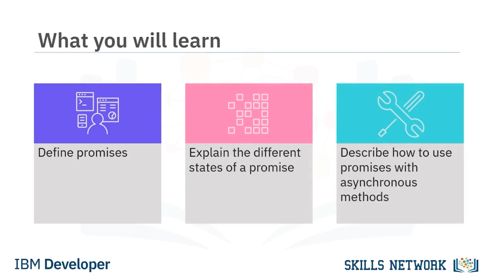
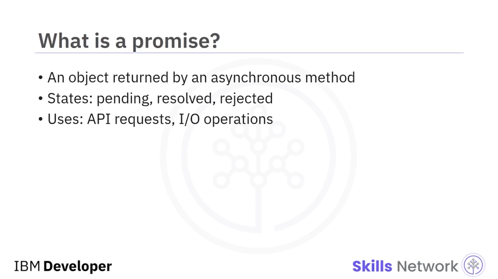
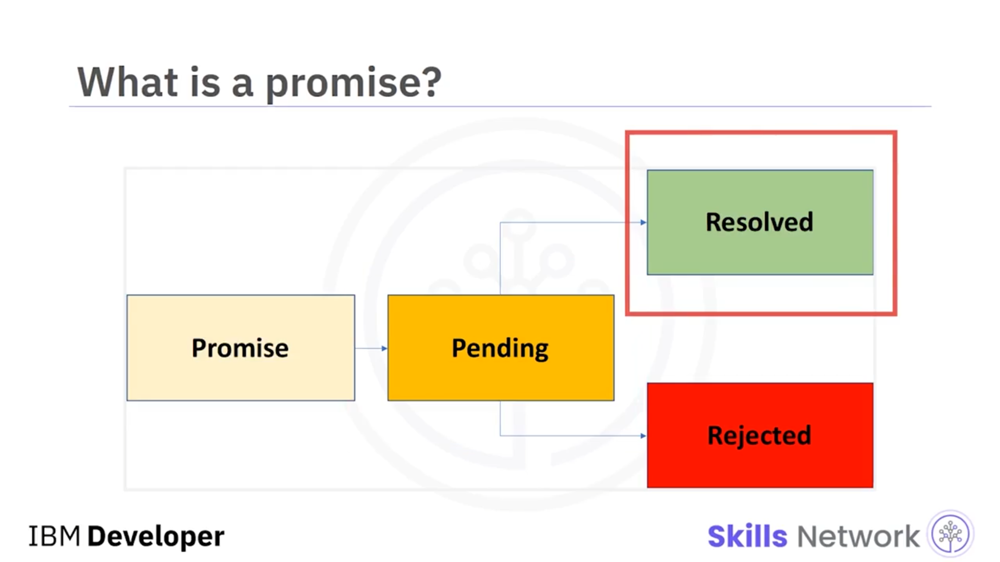
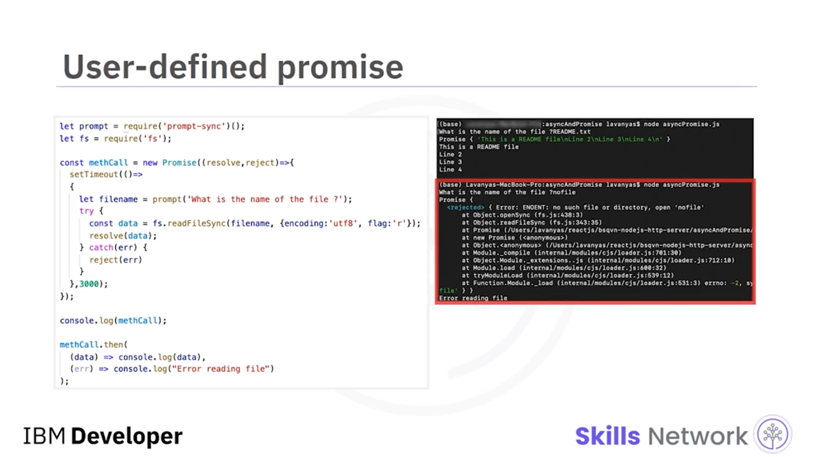
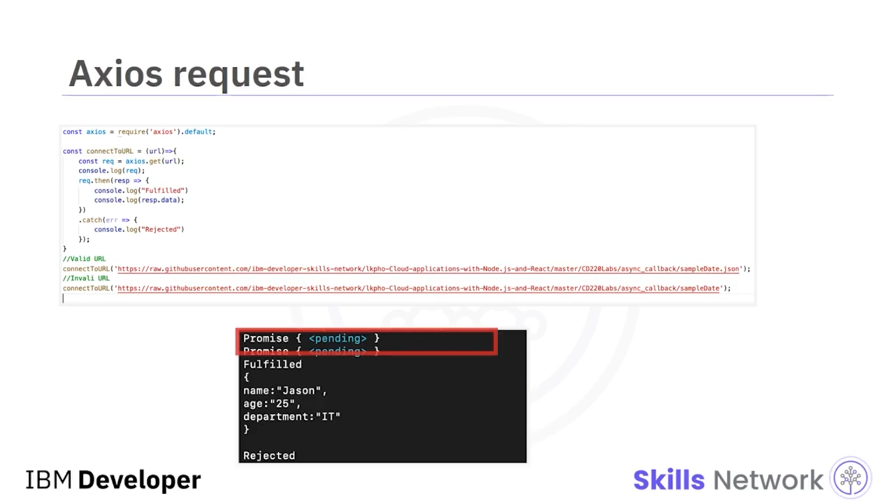
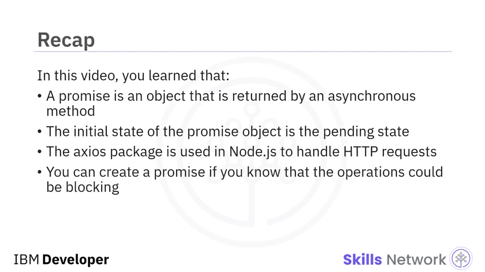

## 🤝 Promises

Promises’a hoş geldiniz. Bu videoyu izledikten sonra şunları yapabileceksiniz:  *Promise* ’leri tanımlamak, bir  *promise* ’in farklı durumlarını açıklamak ve  *promise* ’leri asenkron metotlarla nasıl kullanacağınızı anlatmak.

Bir  *promise* , asenkron bir metot tarafından döndürülen bir nesnedir.  *Promise* ’in üç durumu vardır: `pending`, `resolved` ve `rejected`.

 *Promise* ’ler; uygulama programlama arayüzü ( *API* ) istekleri, giriş/çıkış ( *I/O* ) işlemleri ve zaman alan, kaynakları bloke edebilecek diğer işlemler için en kullanışlıdır. Bir metodun, çalıştırılması zaman alacağını ve böylece kaynakları bloke edeceğini biliyorsanız, bir *promise* nesnesi döndürecek şekilde tanımlanabilir.

---

## 🚦 Bir Promise’in Durumları

Bir *promise* döndüren bir metodu çağırdığınızda bir *promise* nesnesi oluşturulur.  *Promise* ’in başlangıç durumu `pending` durumudur. İşlem tamamlanana veya bazı hatalar işlemin iptal edilmesine neden olana kadar bu durumda kalır.

İşlem tamamlandığında,  *promise* ’in `resolved` olduğu söylenir. Bir hata olduğunda ise  *promise* ’in `rejected` olduğu söylenir.

Ayrıca, gerçekleştireceğiniz işlemlerin bloke edici olabileceğini biliyorsanız siz de bir *promise* nesnesi oluşturabilirsiniz. Bu örnekte, `methCall` dosyanın başarıyla okunup okunmamasına bağlı olarak yerine getirilen ( *fulfilled* ) veya reddedilen ( *rejected* ) bir  *promise* ’tir.

Çıktı ekranında, dosya adı geçerliyse dosya içeriğinin okunduğunu ve görüntülendiğini görebilirsiniz. Bu durumda *promise* `resolved` olur. Dosya adı geçersizse *promise* `rejected` olur ve hata mesajı görüntülenir.

---

## 🌐 HTTP İstekleri ve Axios

*Hypertext transfer protocol* (`HTTP`) isteklerinin senkron şekilde çağrıldığında bloke edici olabileceğini bilirsiniz. Node.js ekosisteminde, `HTTP` isteklerinin etrafına *promise* saran birçok paket vardır. `axios` paketi, `HTTP` isteklerini yönetmek için kullanılan bu paketlerden biridir. Bir *promise* nesnesi döndürür.

İstenen *uniform resource locator* (`URL`) yanıt verene kadar  *promise* ’in durumu `pending` olur. *Promise* nesnesinde, *promise* yerine getirildikten sonra çağrılan bir `"then"` metodu vardır. *Promise* reddedilirse `catch` çalıştırılır.

Bu örnekte önce geçerli bir `URL` geçirirsiniz. Bu, `pending` bir *promise* oluşturur. *Promise* yerine getirildiğinde, yanıt konsola yazdırılır. Sonra geçersiz bir `URL` geçirirsiniz. Bu da `pending` olan bir *promise* nesnesi oluşturur. Bu *promise* reddedilecektir. Bu durum `catch` bloğunda ele alınmaktadır.

`resolve` ve `reject` için konsol çıktısını görebilirsiniz.

---

## ✅ Video Özeti

Bu videoda şunları öğrendiniz:

* *Promise* , asenkron bir metot tarafından döndürülen bir nesnedir.
* *Promise* nesnesinin başlangıç durumu `pending` durumudur.
* Node.js’te `HTTP` isteklerini yönetmek için `axios` paketi kullanılır ve bir *promise* nesnesi döndürür.
* İşlemlerin bloke edici olabileceğini biliyorsanız bir *promise* oluşturabilirsiniz.

