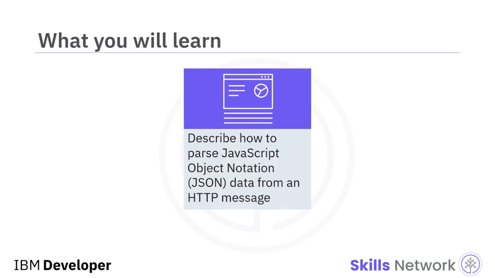
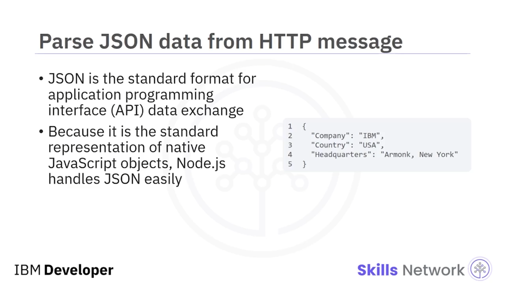
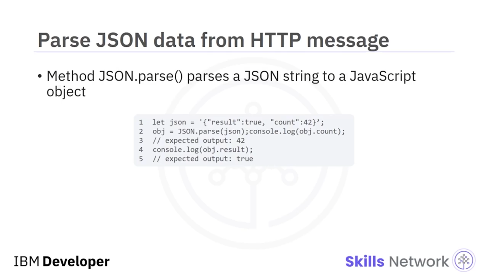
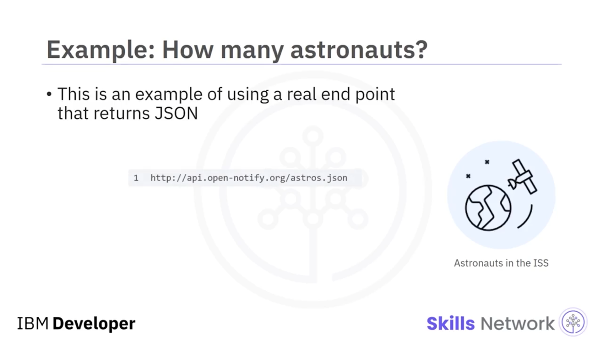
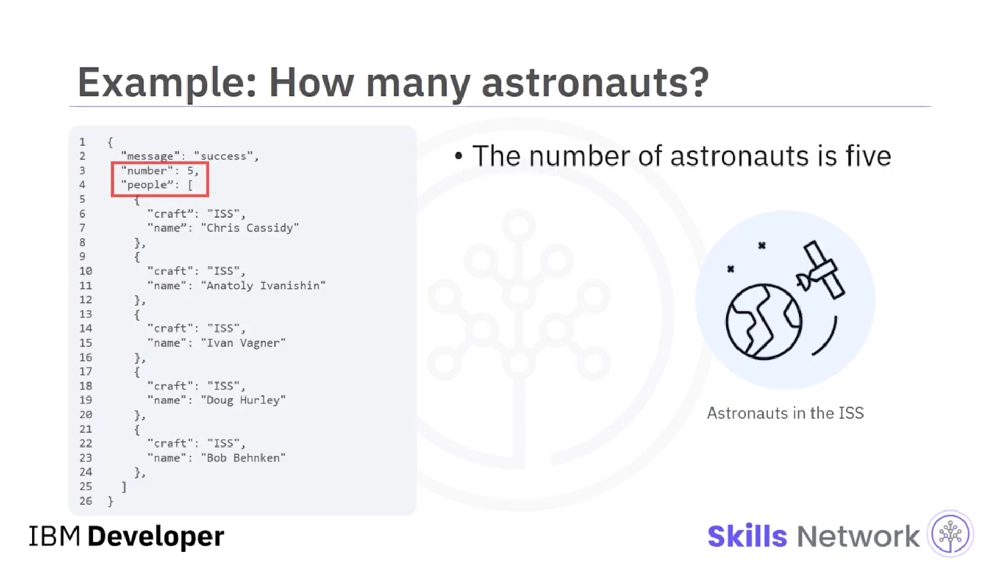
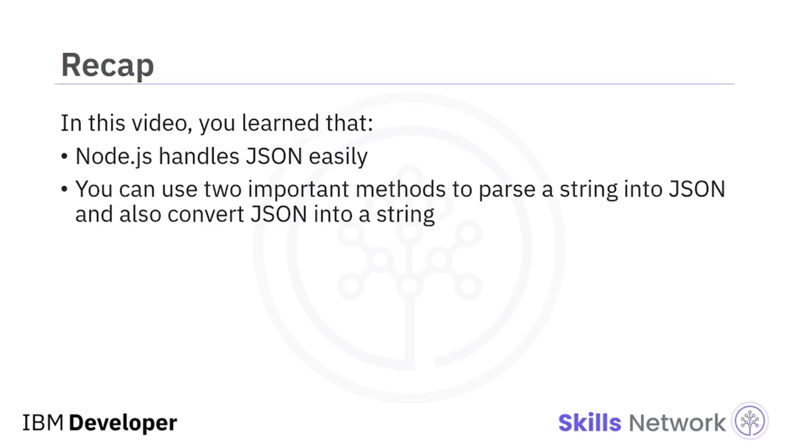

## 🧾 Working with JSON

🎵 Working with JSON’a hoş geldiniz. Bu videoyu izledikten sonra şunları yapabilmelisiniz: Bir *hypertext transfer protocol* (`HTTP`) mesajından *JavaScript Object Notation* (`JSON`) verisini ayrıştırmak ( *parse* ). `JSON`, *application programming interface* (`API`) veri alışverişi için standart formattır. Yerel ( *native* ) JavaScript nesnelerinin standart temsilidir ve Node.js bunu kolayca işler.

Bu örnekte nesne, öznitelik-değer ( *attribute-value* ) çiftlerinden oluşur. İlk öznitelik `"Company"` ve değeri `"IBM"`’dir. İkinci öznitelik `"Country"` ve değeri `"USA"`’dır. Üçüncü öznitelik `"Headquarters"` ve değeri `"Armonk, New York"`’tur.

Bir `JSON` string’ini bir JavaScript nesnesine ayrıştırmak için `JSON.parse` metodunu kullanın. `JSON.stringify()` metodu ise bir JavaScript nesnesini bir `JSON` string’ine dönüştürür.

Artık `JSON`’un ne olduğunu ve bir string’i `JSON`’a ayrıştırmak için ve ayrıca `JSON`’u bir string’e dönüştürmek için kullanabileceğiniz iki önemli metodu bildiğinize göre, `JSON` döndüren gerçek bir endpoint kullanma örneğine bakalım.

`JSON` kullanarak *International Space Station* (`ISS`)’te kaç astronot olduğunu öğrenebilirsiniz. Astronot sayısının beş olduğunu buldunuz.

---

## ✅ Video Özeti

Bu videoda şunları öğrendiniz:

* Node.js, `JSON`’u kolayca işler.
* Bir string’i `JSON`’a ayrıştırmak ve `JSON`’u bir string’e dönüştürmek için iki önemli metodu kullanabilirsiniz.

