## 🔁 Promises, async/await ve Node.js–Express’te axios İstekleri

Promises, Async, Await ve Axios ile Node.js ve Express’te asenkron işlemleri yönetmenin temel kavramlarını ele alan bu videoya hoş geldiniz. Bu videoyu izledikten sonra şunları yapabileceksiniz:

* *Promise* ’lerin temel kavramlarını açıklamak ve JavaScript’te işlemleri nasıl zincirlediğini anlatmak
* Daha net ve okunabilir asenkron kod için `async/await` sözdizimini kullanmak
* Axios kütüphanesiyle `HTTP` istekleri yapmak

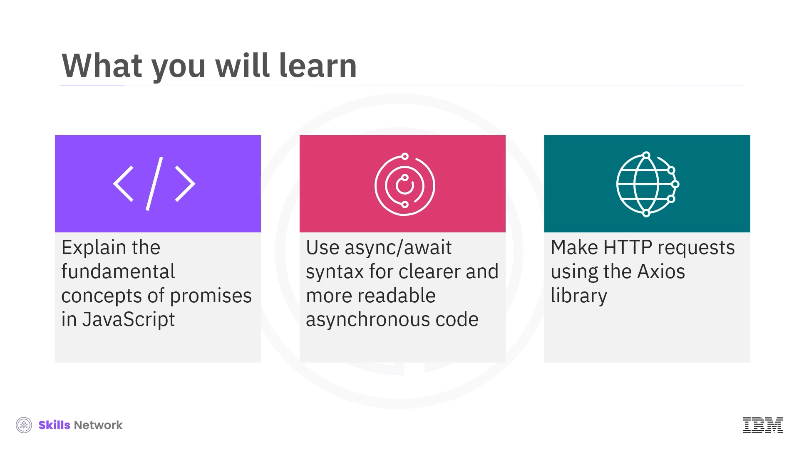

Bir web uygulamasını bahçe ekipmanları satın almak için kullandığınızı düşünün. Uygulama performans olarak gecikiyor ve alışveriş deneyiminizi hayal kırıklığına uğratıyor. Bu uygulamayı tekrar kullanarak herhangi bir satın alma yapmak ister miydiniz? JavaScript’in asenkron programlamasına sahip bir web uygulaması, tepkisel ve performanslı olduğu için bu tür sorunlarla karşılaşmaz. Node.js ve Express ile çalışıyorsanız, asenkron programlamayı ustalaşmak çok önemlidir; çünkü asenkron programlama web uygulamalarınızın performansını artırır ve kullanıcı deneyimini iyileştirir.

Önce JavaScript’te asenkron işlemleri yönetmek için temel bir kavram olan  *Promise* ’leri inceleyerek başlayalım.

---

## 🤝 Promise Nedir?

Bir  *Promise* , asenkron bir işlemin başarı ya da başarısızlığını ve ortaya çıkan değerini temsil eden bir nesnedir. İşlemleri daha okunabilir ve yönetilebilir bir şekilde zincirlemenize ( *chain* ) olanak tanır.

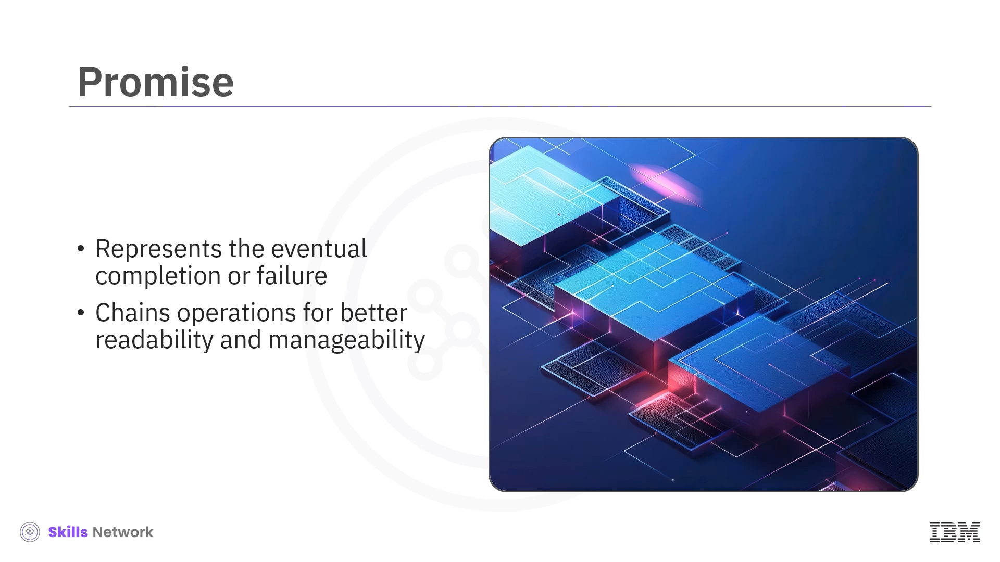

Şimdi, bir  *Promise* ’in durumlarını ( *states* ) öğrenelim. Bir *Promise* üç durumda olabilir: `pending`, `fulfilled` veya `rejected`.

* `pending`, ne `fulfilled` ne de `rejected` olan başlangıç durumunu ifade eder.
* `fulfilled` durumu, işlemin başarıyla tamamlanmasını ifade eder.
* `rejected` durumu, işlemin başarısız olduğunu ifade eder.

Bir  *Promise* , geleneksel callback yöntemlerine kıyasla asenkron görevleri daha zarif bir şekilde ele almamızı sağlar.

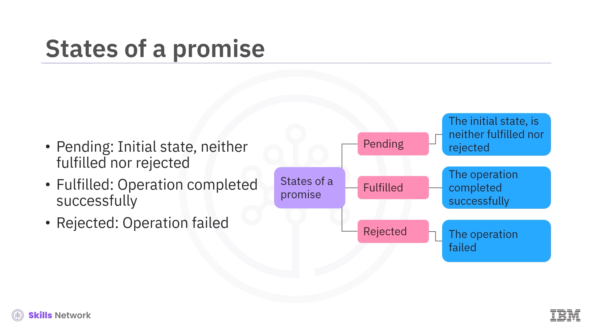

---

## 🧱 Promise Oluşturma

Şimdi bir  *Promise* ’in nasıl oluşturulduğunu inceleyelim. Bu kod parçasında bir  *Promise* ’in oluşturulduğunu görebilirsiniz. Bir *Promise* oluşturmak için `new Promise` yapıcısını ( *constructor* ) kullanırız; bu yapı, `resolve` ve `reject` parametrelerini alan bir fonksiyon kabul eder. İşleminiz başarılıysa `resolve` fonksiyonu çağrılır. Aksi halde `reject` fonksiyonu çağrılır.

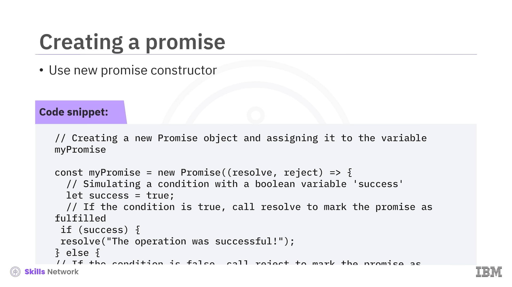

---

## 🔗 Promise Zincirleme

Şimdi  *Promise* ’lerin, birden fazla asenkron işlemi sırayla zincirlemenize nasıl olanak tanıdığını inceleyelim.

Bu örnekte kod, çözümlenen ( *resolved* ) değeri veya hatayı `then` ve `catch` metotlarıyla ele almanıza izin verir. Bu metotlar da *Promise* döndürür ve birden fazla asenkron işlemi sırayla zincirler.

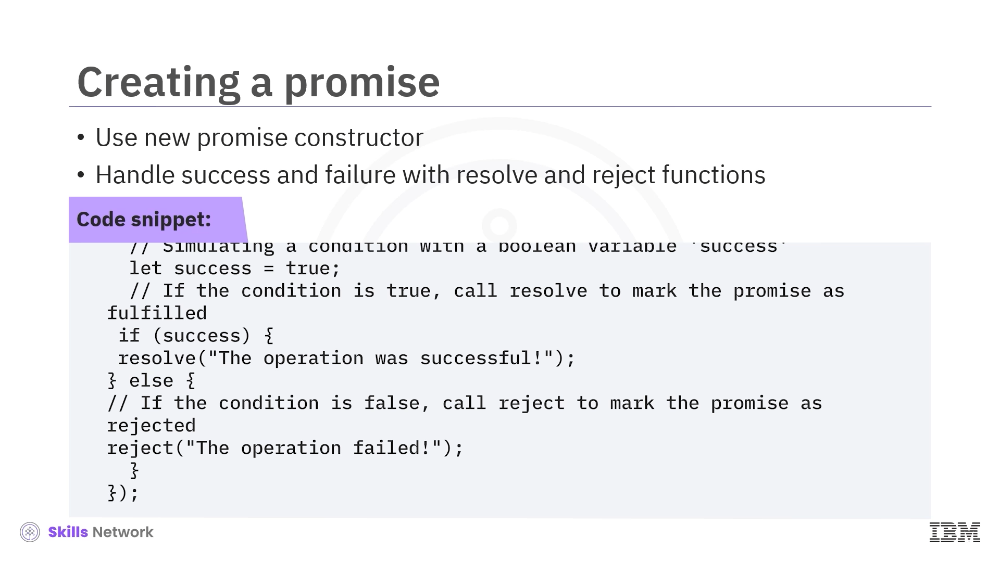

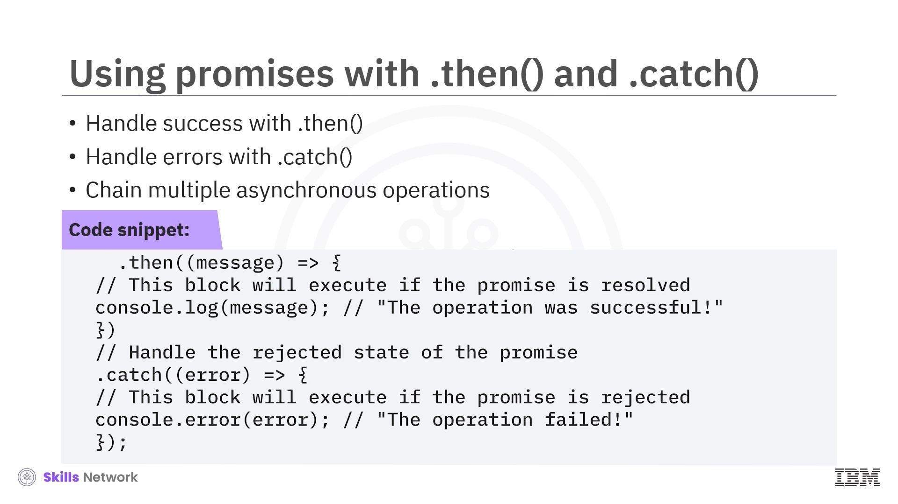

---

## 📄 Dosya Okumada Promise Kullanımı

Şimdi, bir dosyayı okumak için  *Promise* ’lerin kullanıldığı pratik bir örneği inceleyelim.

Bu kodda *Promises* modülü şu işlevleri gerçekleştirir:

* Bir dosyanın içeriğini okur.
* Dosya başarıyla okunursa dosya içeriğini konsola yazdırır.
* Dosya başarıyla okunamazsa konsola bir hata mesajı fırlatır ( *throw* ).

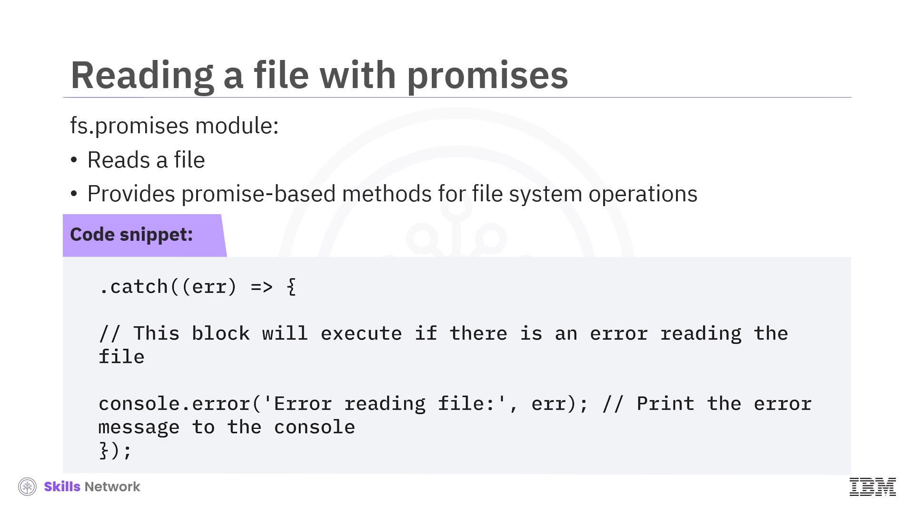

---

## 🧠 async/await ile Promise’lerle Çalışma

Şimdi `async/await` ile  *Promise* ’lerle nasıl çalışılacağını öğrenme zamanı.

 *Promise* ’ler kodunuzun yapısını ve okunabilirliğini karmaşıklaştırır. `async` ve `await`,  *Promise* ’lerin üzerinde sözdizimsel şeker ( *syntactic sugar* ) sağlar; bu da asenkron kodun daha senkron kod gibi görünmesini sağlar ve okuma-yazmayı sizin için kolaylaştırır.

Bir `async` fonksiyon bir *Promise* döndürdüğünden, bir `async` fonksiyon içinde `await` kullanabilirsiniz. `await` kullanımı, bir *Promise* `resolved` ya da `rejected` olana kadar yürütmeyi duraklatır ( *pauses execution* ).

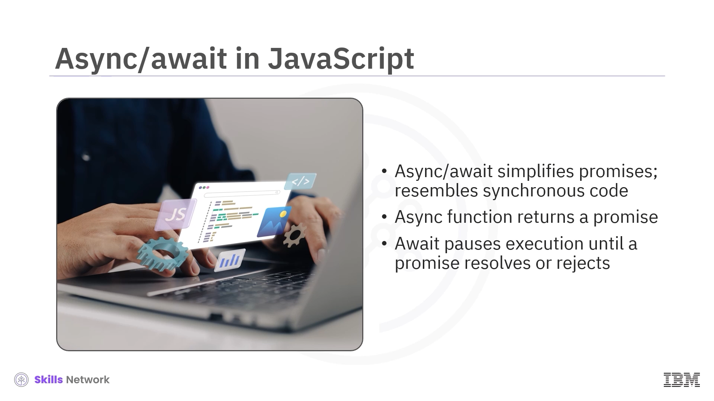

Şimdi `async/await` faydalarını daha ayrıntılı inceleyelim. `async` ve `await` kullandığınızda, asenkron kod daha doğrusal görünür ve anlaması daha kolay olur. Hata yönetimi için geliştiricilere daha tanıdık olan standart `try-catch` kullanımına izin verir.

Ayrıca kodun asenkron akışı nedeniyle debug işlemini daha kolay yapabilirsiniz.

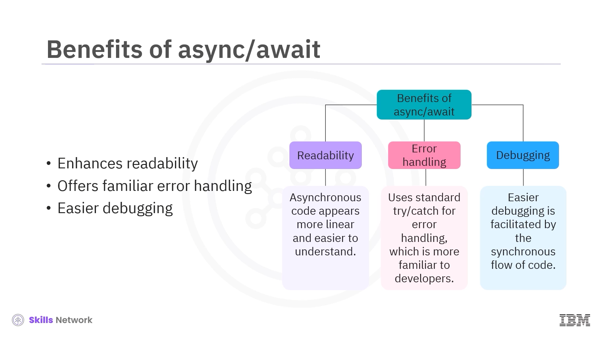

---

## 🧪 async/await Örneği

Artık `async/await`’in temel faydalarını tanıdığınıza göre, bir örnek içinde kullanalım.

Bu kod parçası, `async/await` fonksiyonunun JavaScript’te asenkron programlamayı nasıl basitleştirdiğini gösterir. Bu örnekte `async` fonksiyon şu eylemleri gerçekleştirir:

* Koşullu bir işlemi simüle eder.
* Koşul sağlanırsa bir başarı mesajı döndürür.
* Koşul sağlanmazsa bir hata üretir.
* `async` fonksiyonu çağırmak için `await` kullanır.
* Sonucu veya hataları `try` ve `catch` kullanarak ele alır.
* Zincirler yerine daha kolay şekilde  *Promise* ’leri yönetir.

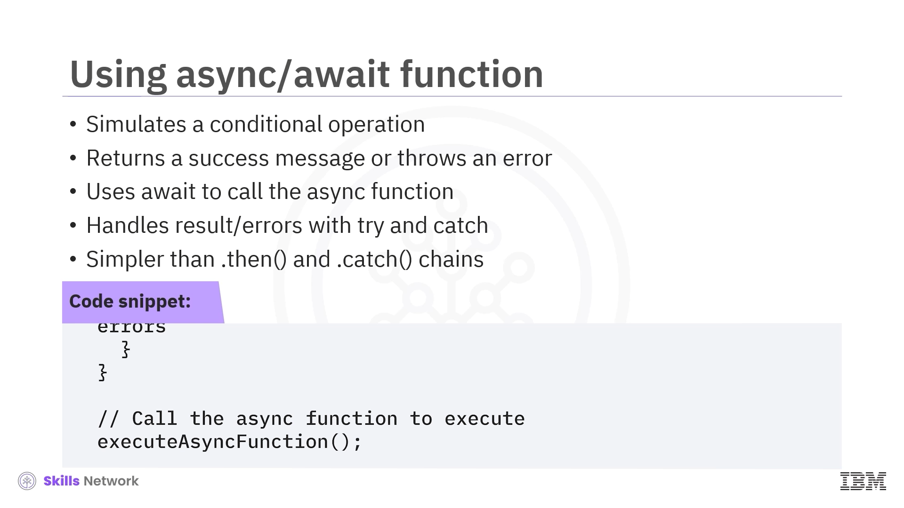

---

## 🌐 Axios Nedir?

Şimdi Axios’u ve nasıl kullanıldığını öğrenme zamanı.

Axios, tarayıcı ve Node.js için *Promise-based* bir `HTTP` istemcisidir. Axios, REST endpoint’lerine asenkron `HTTP` istekleri göndermenizi ve `CRUD` işlemlerini gerçekleştirmenizi kolaylaştırır. Axios, `JSON` verisini otomatik olarak dönüştürür ve temiz ve basit bir API sağlar.

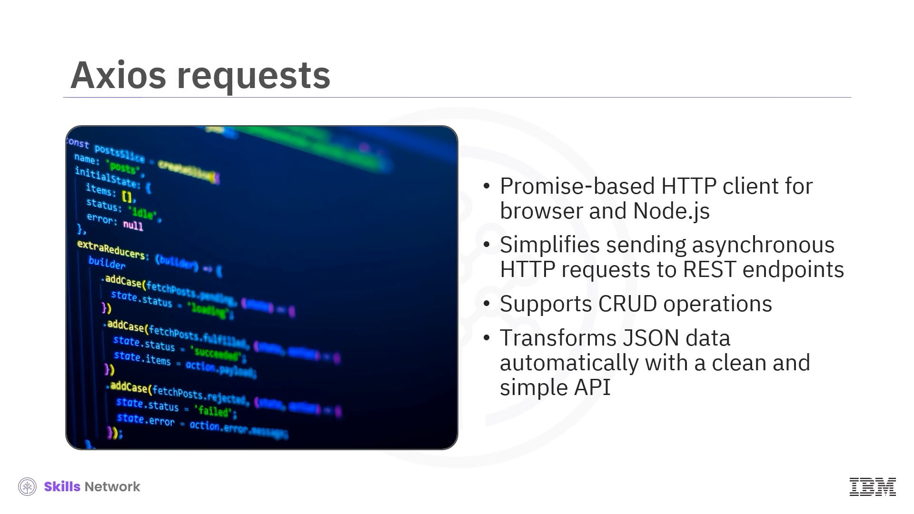

---

## 🧩 Axios’un Temel Özellikleri

Axios şu özellikleri sunar:

* `async/await` kullanımını kolaylaştırmak için  *Promise* ’leri kullanır.
* `JSON` verisini otomatik olarak dönüştürür.
* Değiştirmek için istekleri veya yanıtları yakalamanıza ( *intercept* ) izin verir.
* İstek iptalini ( *request cancellation* ) destekler.
* Kapsamlı hata yönetimi özellikleri sağlar.

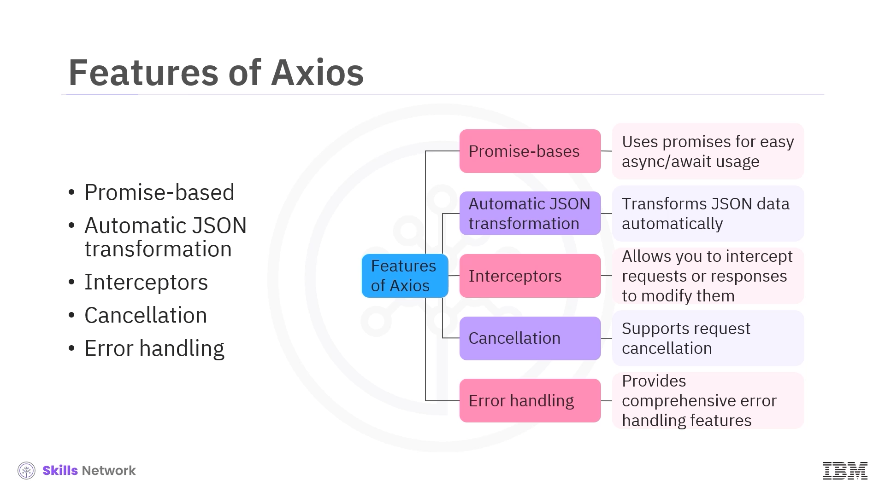

---

## 📥 Axios ile GET İsteği

Şimdi Axios ile pratik bir örnekte `GET` isteği yapalım.

Bu kod parçasında görebileceğiniz gibi, önce Axios’u yüklemeniz gerekir. Yüklendikten sonra Axios’u kullanabilir ve `HTTP GET` isteklerini yapmayı nasıl basitleştirdiğini görebilirsiniz.

`axios.get` metodu, yanıt ( *response* ) nesnesiyle çözümlenen bir *Promise* döndürür. Bu, `data`’ya erişmenizi sağlar.

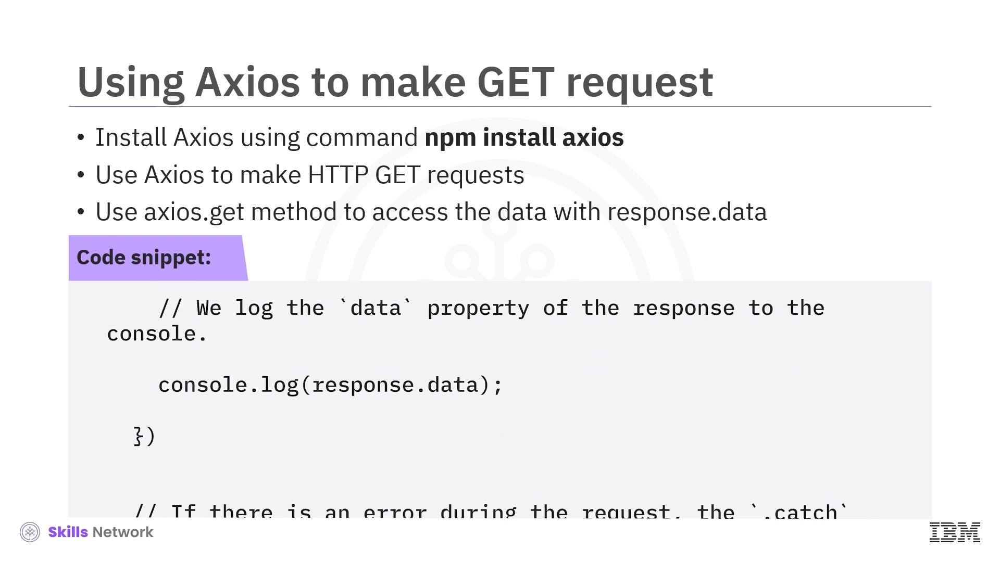

---

## 📤 Axios ile POST İsteği

Şimdi Axios ile `POST` isteği yapmayı öğrenme zamanı.

Axios’un `HTTP POST` isteklerini nasıl yaptığını ve yanıtları ile hataları nasıl ele aldığını gösteren bir kod parçasına bakalım.

Bu kod, `HTTP` istekleri için Axios’u içe aktarır ve `POST` isteği için kullanıcı verisi nesnesi oluşturur. `axios.post()` fonksiyonunu kullanarak bu kod sunucuya veri gönderir. Son olarak, başarı durumunda yanıt verisini; hata durumunda hata mesajını log’lar.

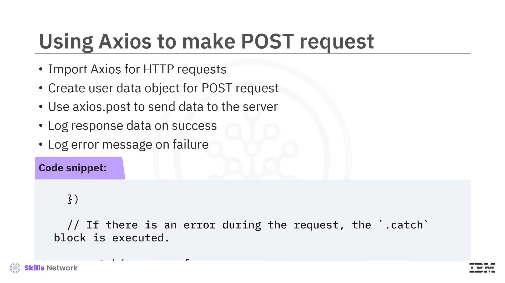

---

## 🔗 async/await ve Axios’u Birlikte Kullanma

Şimdi `async/await` ve Axios’u birlikte kullanarak `HTTP` isteklerini ele alalım.

`async/await` ile Axios’u birleştirdiğinizde, `HTTP` isteklerini ele almak için temiz bir yaklaşım sağlar. Bu örnekte, kodun `POST` isteği tamamlanana kadar fonksiyon yürütmesini duraklatmak için `await` kullandığını görebilirsiniz. Son olarak sonuç, `try` bloğu içinde ele alınır.

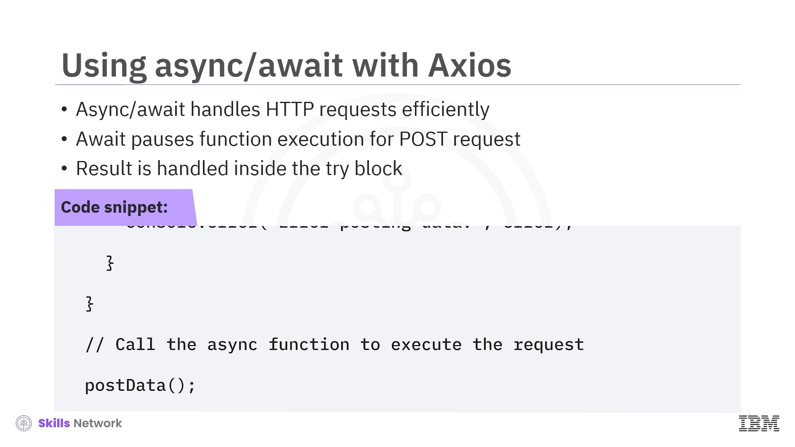

---

## ✅ Video Özeti

Bu videoda şunları öğrendiniz:

* JavaScript’te asenkron programlama, tepkisel ve performanslı web uygulamaları oluşturabilir.
* *Promise* ’ler, asenkron işlemleri ele almak için bir yol sağlar; işlemleri zincirlemeye izin vererek kodu daha okunabilir ve yönetilebilir hale getirir.
* `async/await` sözdizimi,  *Promise* ’ler üzerine inşa edilir ve senkron koda benzeyen asenkron kod yazmanızı sağlar; böylece asenkron görevlerin yönetimini basitleştirir.
* Axios, harici API’lere ve servislere istek yapmak için bir `HTTP` istemcisi olarak kullanılabilir ve JavaScript uygulamalarında `HTTP` isteklerini yönetme sürecini basitleştirir.

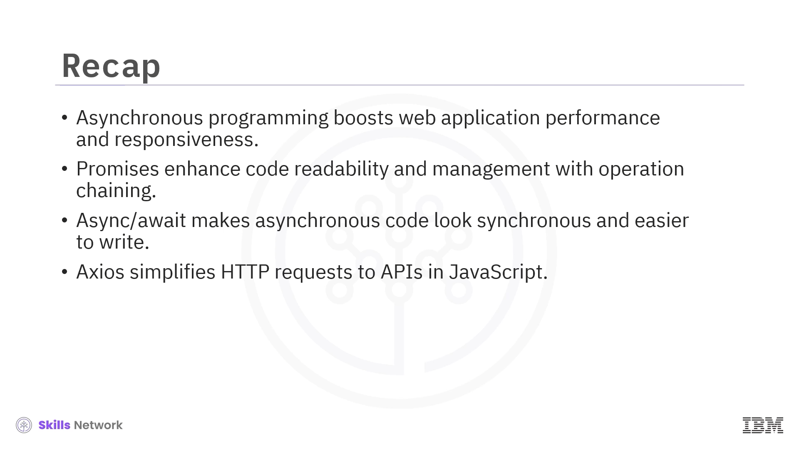
