## 🔐 Node.js’te Authentication

**Authentication in Node.js** bölümüne hoş geldiniz. Bu videoyu izledikten sonra şunları yapabileceksiniz: Node.js’te token tabanlı authentication’ın avantajlarını tartışmak ve Node.js’te token tabanlı authentication ve authorization’ı uygulamak.

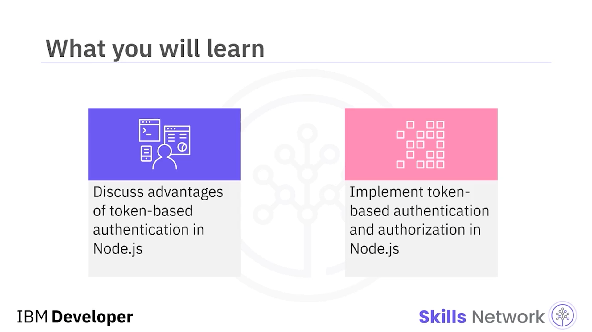

---

## 🪪 Authentication Nedir?

Authentication, bir kullanıcının kimliğini doğrulama sürecidir; bunun için kimlik bilgileri ( *credentials* ) elde edilir ve bu kimlik bilgileri kullanılarak kullanıcının kimliği doğrulanır. Authentication, kullanıcıları tanımlamak ve kimliklerine ( *ID* ) bağlı olarak erişim hakları ve içerikler sağlamak için tasarlanmıştır.


Başka bir videoda tartışıldığı gibi, authentication şu yaklaşımlar kullanılarak gerçekleştirilebilir:  *session-based authentication* , *token-based authentication* ve  *password-less authentication* .

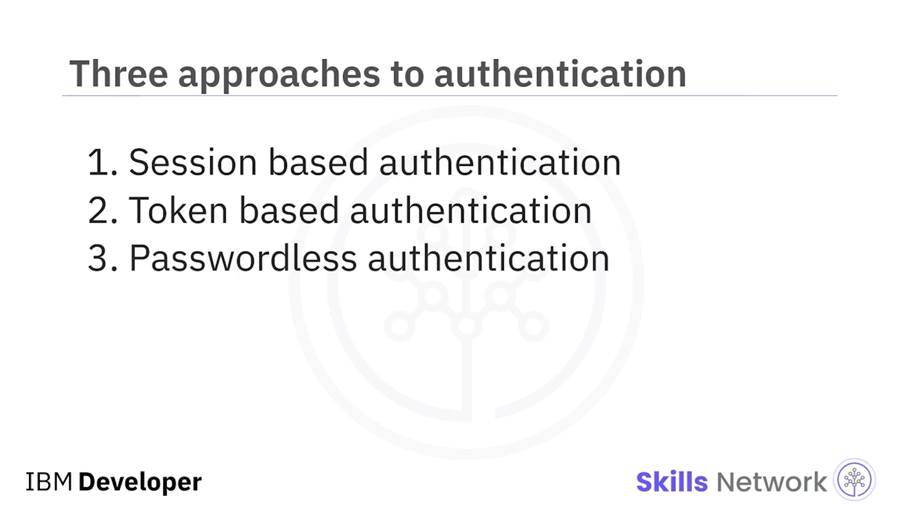

Token-based authentication, Node.js’te authentication’ı uygulamak için en popüler yaklaşımdır ve aşağıdakiler token-based authentication kullanmanın bazı avantajlarıdır.

---

## 🪙 Token-based Authentication’ın Avantajları

Token-based authentication daha ölçeklenebilirdir; çünkü token yalnızca istemci tarafında saklanmalıdır. Ayrıca sunucunun yalnızca token’ı kullanıcı bilgileriyle birlikte doğrulaması gerektiğinden, birden fazla kullanıcıyı yönetmek daha kolaydır.

Token-based authentication esneklik sunar; çünkü birden fazla sunucu üzerinde kullanılabilirler ve aynı anda farklı web siteleri ve uygulamalar için authentication sağlayabilirler.

Token-based authentication’ta kullanılan JWT imzalanabilir ve şifrelenebilir; bu da token’ların kurcalanamayacağı ( *cannot be tampered with* ) ve özel şifreleme anahtarı ( *private encryption key* ) olmadan okunamayacağı anlamına gelir.

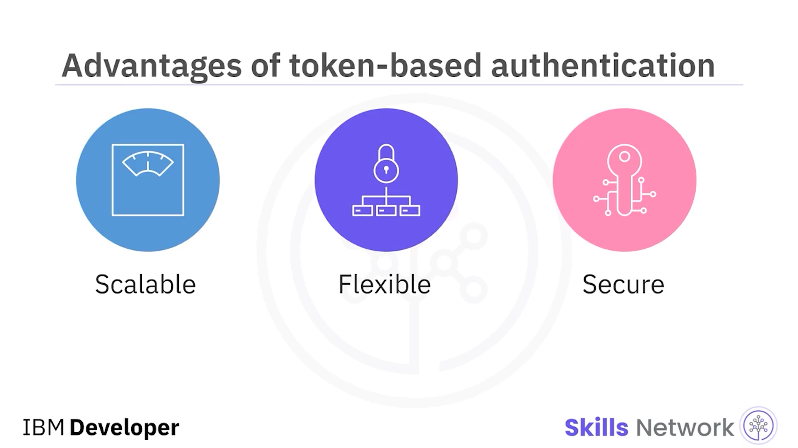

---

## 🧩 ExpressJS API Sunucusu Kurulumu

Şimdi, kullanım haklarına göre çalışan bilgilerine erişim sağlayan bir ExpressJS API sunucusu kuralım. Uygulamanın iki API’si olacak ve her birinin kendi endpoint’leri bulunacak.

İlk olarak, isteğin gövdesinde ( *request body* ) kullanıcı adı ve parola gönderilerek oturum açmayı sağlayan ve oturum açmak için bir web token döndüren bir **POST API** kullanacağız.

Bu API endpoint’ine çağrı, uygulamanın ön ucunu barındıran web sunucusundan yapılmalıdır.

İkinci olarak, yalnızca doğrulanmış kullanıcıların erişebileceği çalışan bilgilerini almak için bir kaynak endpoint’i olan **GET API** olacak.

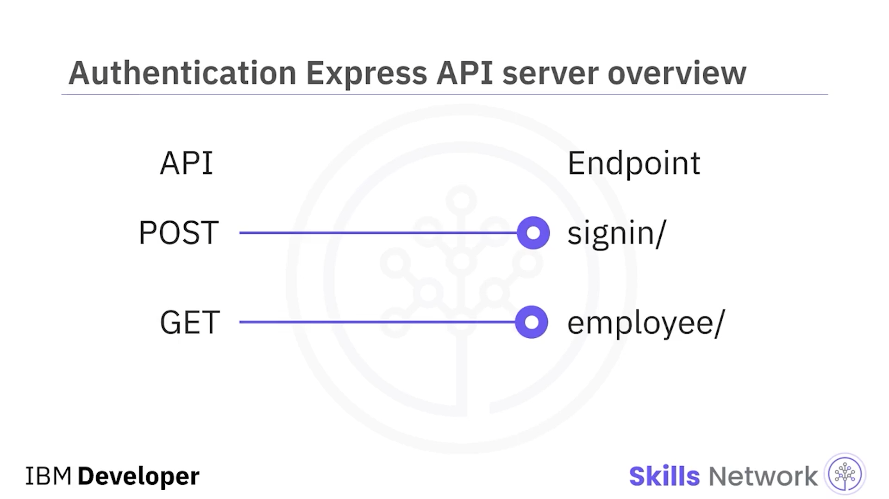

---

## 🧱 İlk Kod: Yetkisiz Erişim Engeli

Bu kodun nasıl görünebileceğini düşünelim. Bu kod, `express` fonksiyonunu çağırıp `myApp` sabitine atayarak bir web sunucusu modülü oluşturur.

`myapp.get` fonksiyonu çalışanların API’si için bir **GET API endpoint’i** oluşturur ve bu endpoint’e yapılan her çağrı şu anda **401** HTTP durum kodu döndürür.

 **401** , yetkisiz ( *not authorized* ) anlamına gelir.

Mesaj olarak, “please log in to access this resource” döndürülür.

Sunucu ayrıca sunucuya gelen HTTP çağrıları için **5000** portunu dinler ve konsola “API server is localhost colon 5000” mesajını yazar.

API’yi çalıştırmak için, önce dosyayı kaydedin ve adını `apiServer.js` yapın.

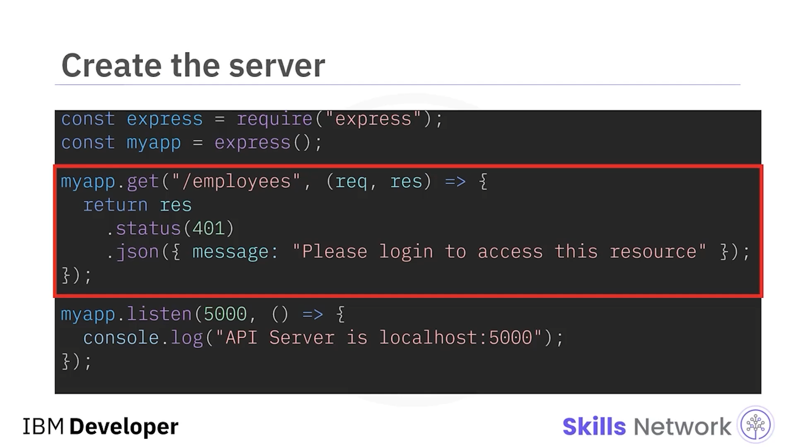

---

## 💻 Çalıştırma Komutu

```bash
node apiServer.js
```

Güvenli endpoint’in kullanıcı yetkili olmadıkça erişilemediğini doğrulamak için, ekranda bu `curl` komutunu çalıştırın.

Çıktıda, kodunuza göre “please log in to access this resource” mesajını görmelisiniz.

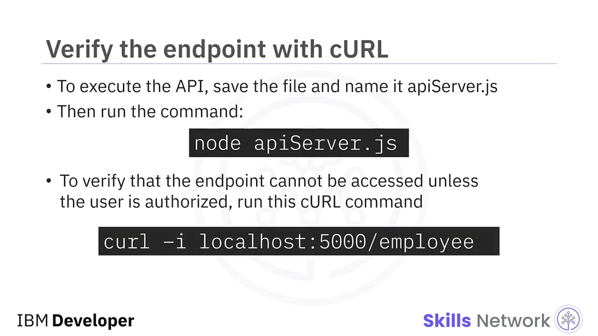

---

## 🪙 Login ve JWT Üretimi

Kodun sonraki bölümünde, kullanıcı adı ve parola doğru olduğu sürece kullanıcıların oturum açmasına ve doğrulanmış üretilmiş bir token’ın geri gönderilmesine izin veririz.

Genellikle kullanıcı adları ve parolalar veritabanında saklanır. Ancak, bir veritabanı bağlantısı kurmak bu kod demosunun kapsamı dışında olduğundan, bu örnek kodda kullanıcı adı ve parola olarak `user` ve `password` değerlerini sabit ( *hard code* ) şekilde kullanacağız.

Doğrulanmış JWT üretmek için `jsonwebtoken` npm paketini kullanın.

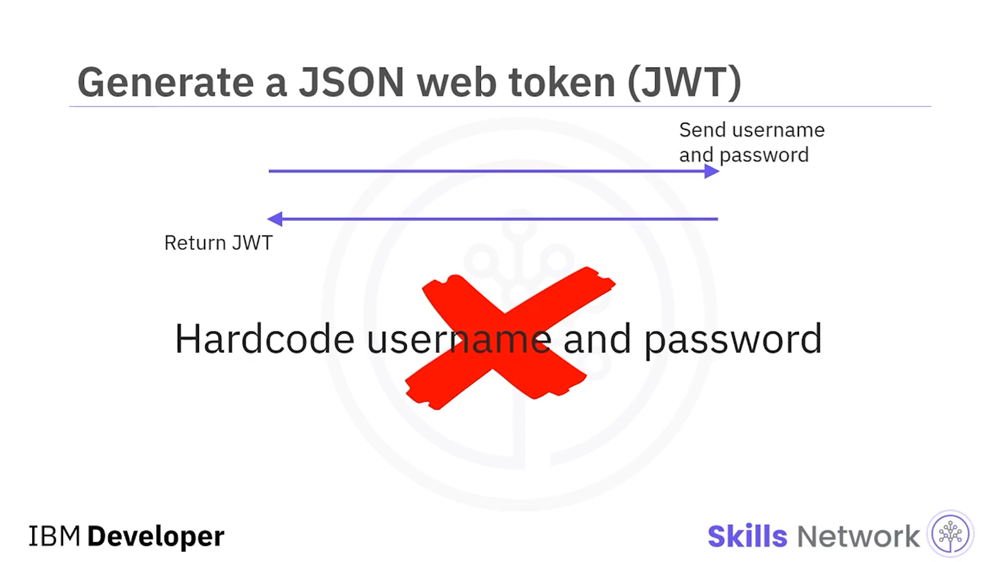

---

## 📦 jsonwebtoken Kurulumu

```bash
npm install --save jsonwebtoken
```


Başlangıçta `jsonwebtoken` paketinden `jsonwebtoken` modülünü `require` etmeniz gerekir. Bu modül, JWT secret kullanarak JWT üretmek için kullanılır.

Ardından JWT secret’ı saklamak için bir sabit tanımlanır.

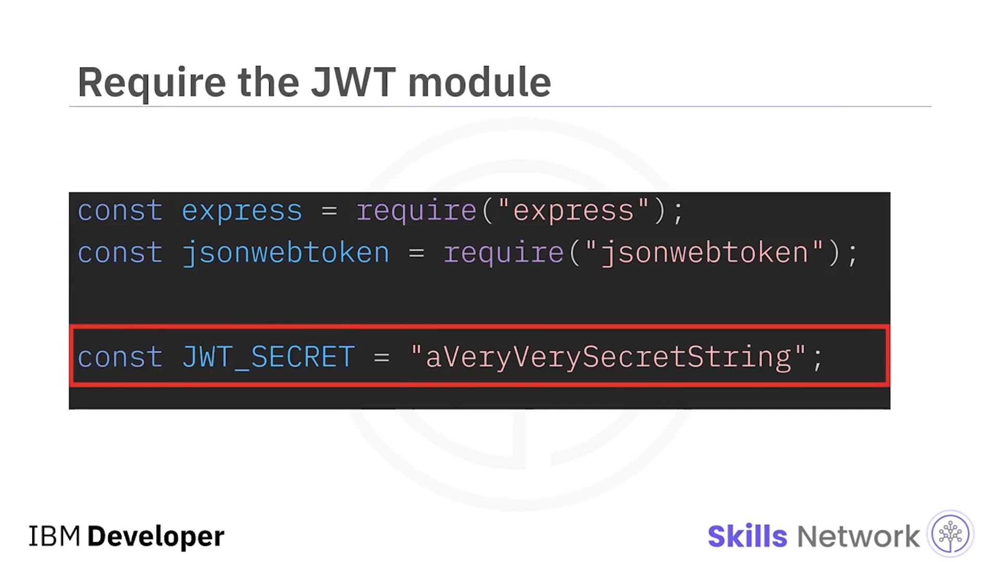

`myapp.use` metodu, API metotlarının JSON yanıtı döndürmesini etkinleştirir.

Bu videoda kodu göstermek için kullanıcı adı ve parolayı sabitliyoruz. Ancak lütfen şunu not edin: JWT secret her zaman bir parola üretici ( *password generator* ) kullanılarak üretilmeli ve config dosyasında bir environment variable olarak saklanmalı; burada gösterildiği gibi API içinde sabitlenmemelidir.

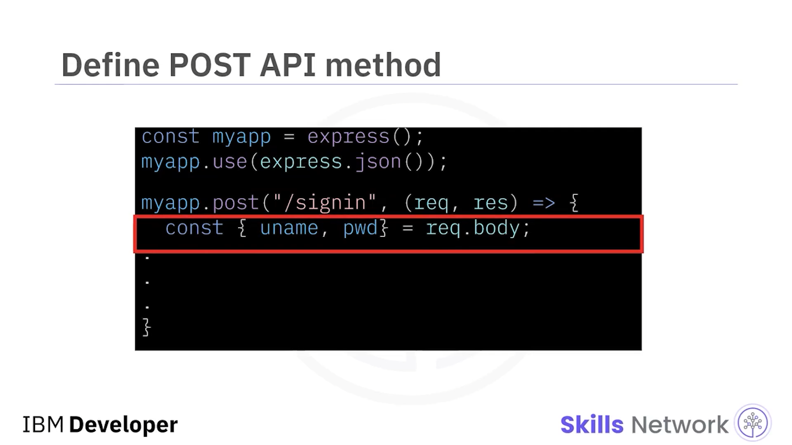

---

## 🔎 Kimlik Bilgilerini Doğrulama ve Token Döndürme

Request body’den gelen kullanıcı adı ve parola, veritabanından çekilen değerlerle karşılaştırılır.

Kullanıcı adı ve parola eşleştiğinde, `jsonwebtoken.sign` fonksiyonu kullanılarak kullanıcı adı ve JWT secret parametreleri eklenip JWT üretilir ve sign-in API’den JSON yanıtı olarak döndürülür.

Eğer kullanıcı adı ve parola eşleşmesi başarısız olursa, **401** HTTP durum kodu “invalid username and or password” mesajıyla döndürülür.

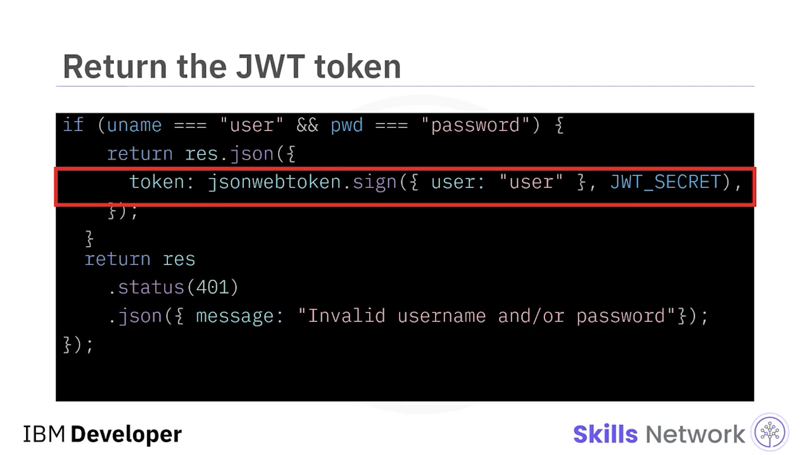

---

## 🛡️ Authorization: employees Endpoint’i

Sonra, `employees` endpoint’i ile `getAPI` metodu tanımlanır.

Sign-in API çağrısından alınan token, `authorization` header içinde gönderilir.

`getAPI employees`, gelen API isteğinden authorization header’ını `request.header` fonksiyonunu kullanarak okuyacak şekilde güncellenir.

İstek içinde header bulunmazsa, `getAPI` tarafından **401** durum kodu ve “no token” mesajı döndürülür.

Authorization header her zaman başında “bearer” dizesiyle başlar; bu nedenle bu token, *bearer token* olarak da bilinir.

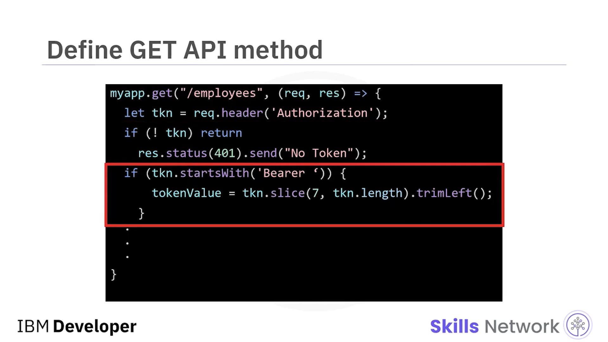

Alınan JWT, `jsonwebtoken.verify` fonksiyonu kullanılarak doğrulanır; bunun için alınan token ve JWT secret parametre olarak verilir.

Bu fonksiyonun döndürdüğü değer, user özelliğinin ( *user property* ) veritabanından alınan kullanıcı adıyla eşleşip eşleşmediğini doğrulamak için kullanılır.

Eşleşme gerçekleşirse, kullanıcı doğrulanır ( *authenticated* ) ve `employees` API’sine erişim sağlanır.

API, **200** başarı durum kodu ile “access successful to employee endpoint” mesajını döndürür.

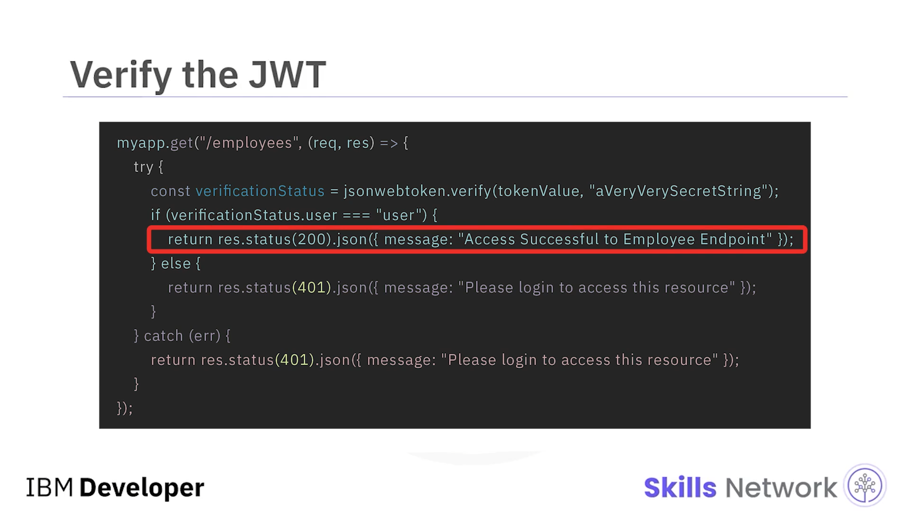

Doğrulama başarısız olursa, istemciye **401 unauthorized** durum kodu ve “please log in to access this resource” mesajı gönderilir.

Son olarak, **5000** portunda yanıtları dinleyen bir listener fonksiyonu yazın ve konsol log’a “API server is localhost 5000” ifadesini yazdırın.

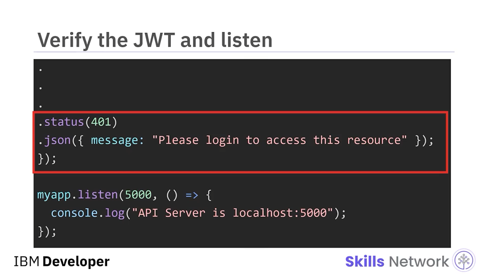

---

## ✅ Özet

Az önce yazdığınız kodda, request body’den kullanıcı adı ve parola alan bir sign-in API endpoint’i vardır ve bunları veritabanında saklanan kullanıcı adı ve parola ile doğrular.

Eşleşme varsa, `jsonwebtoken.sign` metodu ile token üretir ve yanıtta geri gönderir.

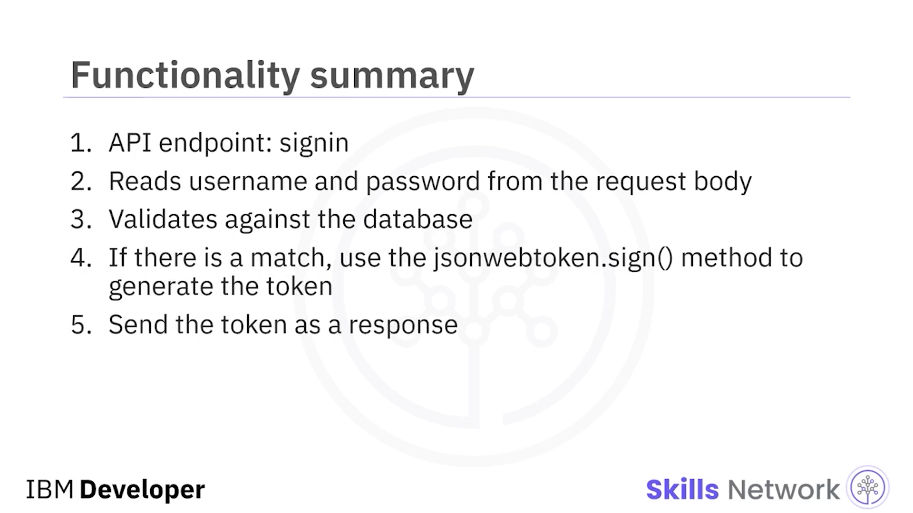

## Bu videoda şunları öğrendiniz:

Token-based authentication’ın avantajları ölçeklenebilirlik, esneklik ve güvenliği içerir.

Authentication sırasında bir kullanıcıyı bir uygulamaya giriş yaptırmak için **POST API** kullanılır.

Authorization’da bir kullanıcının hangi kaynaklara erişebileceğini belirlemek için **GET API** kullanılır.

Bir JSON web token, bir kullanıcıyı doğrulamak ve hangi kaynaklara erişebileceğini yetkilendirmek için kullanılır.

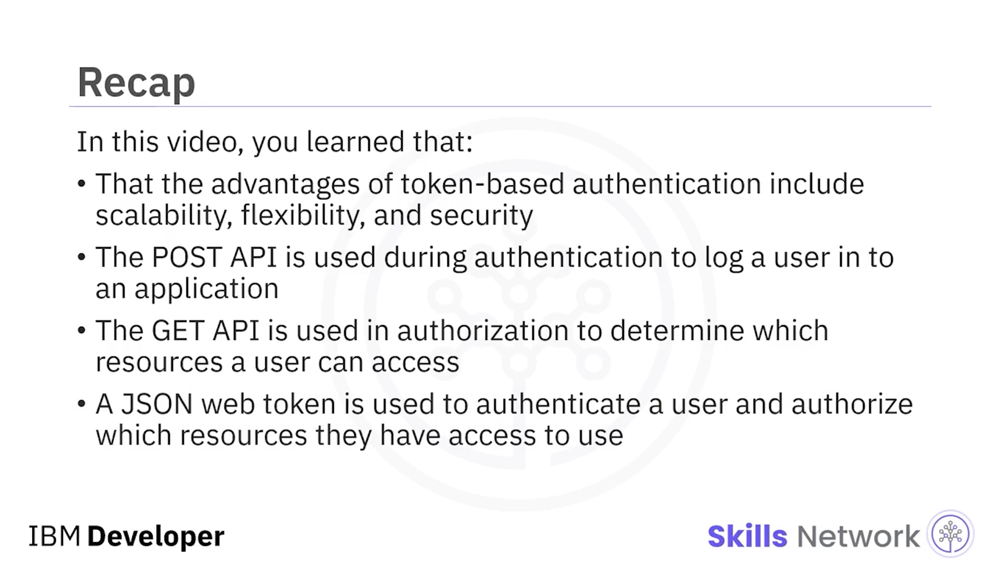
