## ✅ Express Best Practices

**Express Best Practices** bölümüne hoş geldiniz. Bu videoyu izledikten sonra şunları yapabileceksiniz: Express uygulaması ve API’leri oluştururken klasör yapısı konvansiyonlarını açıklamak ve Express uygulamaları ile API’leri geliştirirken yaygın olarak takip edilen en iyi uygulamaları ( *best practices* ) belirlemek.

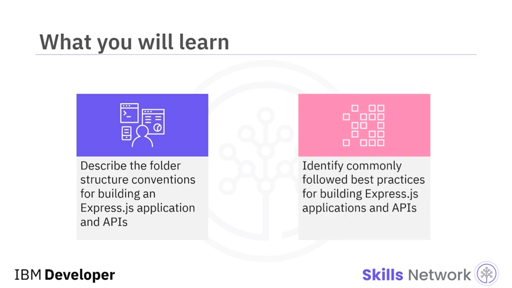

---

## 🗂️ Express Uygulamalarında Klasör Yapısı Konvansiyonları

Ruby on Rails, .NET ve Django gibi web framework’leri dosyaların saklanması için zorunlu dizin yapıları gerektirir. Express, uygulamaları için önceden tanımlı bir dizin yapısı zorunlu kılmaz. Ancak uygulamanın boyutu büyüdükçe bakım zorlaşabileceğinden, önceden bir dizin yapısı tanımlamak genellikle iyi bir fikirdir.

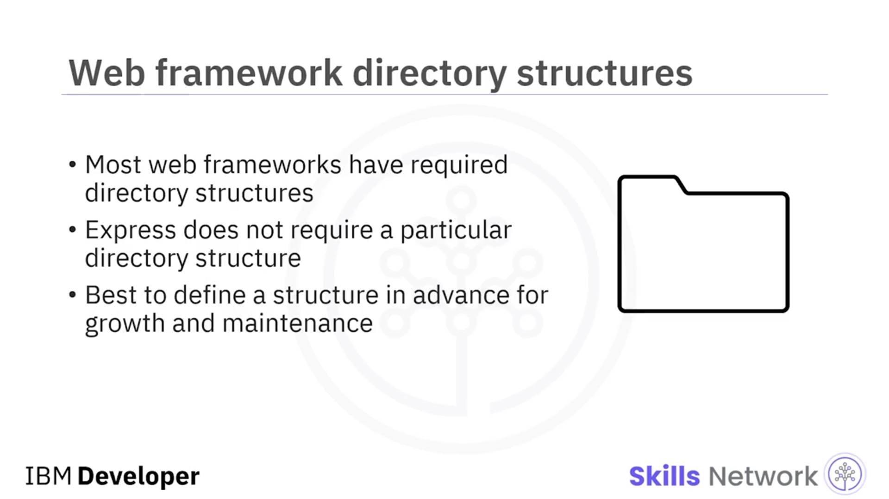

Proje klasörü içinde aşağıdaki dizinlerin kullanılması önerilir:

* `node_modules`
* `config`
* `models`
* `routes`
* `views`
* `public`

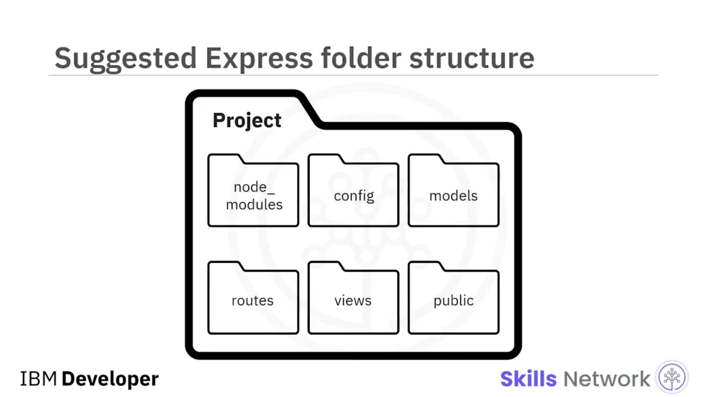

---

## 📁 Klasörlerin İçeriği

### 📦 node_modules

`node_modules` klasörü, uygulamanın modüllerini ve paketlerini içerir. `"npm install"` komutu çalıştırıldıktan sonra otomatik olarak oluşturulur. Node package manager ( *npm* ) başka bir videoda ele alınmıştır.

### ⚙️ config

`config` klasörü; veritabanı bağlantı yapılandırması, environment variables dosyası ve geliştirilmekte olan uygulamanın kullandığı harici servislerin API anahtarlarını içeren bir kimlik bilgileri ( *credentials* ) dosyası gibi yapılandırma dosyalarını içermelidir.

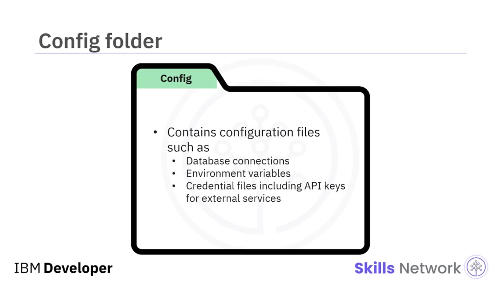

### 🧱 models

`models` klasörü, uygulamanın veri modellerini içerir. Dosyalar; ilişkisel ( *relational* ) veya ilişkisel olmayan ( *non-relational* ) gibi veri deposu türünü belirtir ve bir nesne-ilişkisel eşleme (*object-relational mapping* /  *ORM* ) kütüphanesi tarafından tanımlanır.

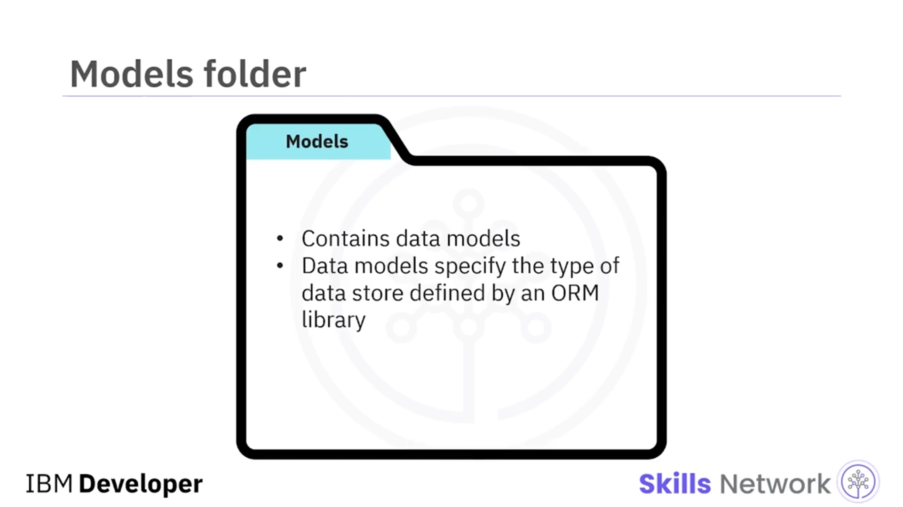

### 🧭 routes

`routes` klasörü, farklı varlıklar ( *entities* ) için tüm route’ları farklı dosyalarda belirtmek için kullanılır. Her mantıksal route kümesi için bir dosya olmalıdır; örneğin her bir kaynak türü için bir dosya.

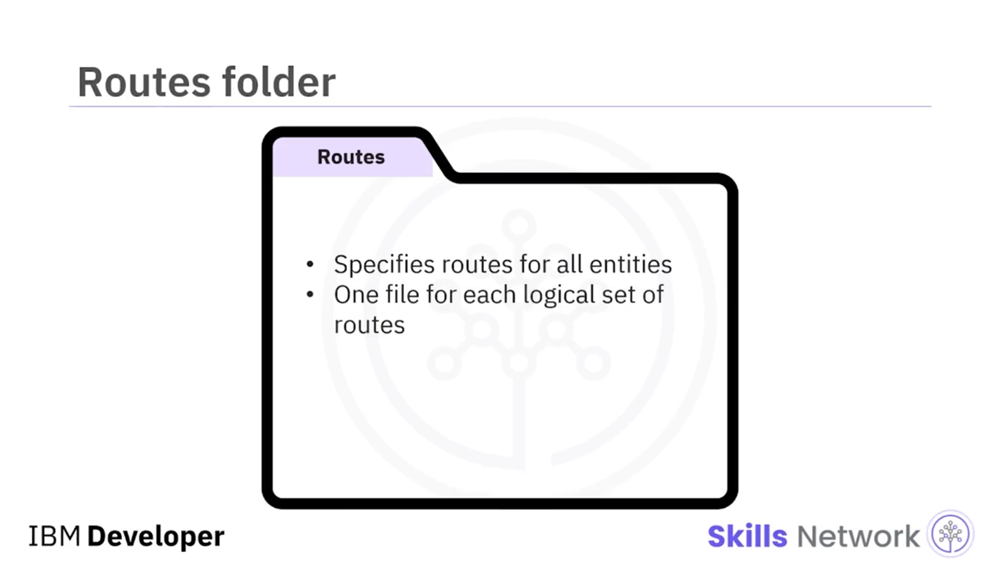

### 🧾 views

`views` klasörü template dosyalarını içerir. Bir template, istemciye geri gönderilmek üzere HTML, CSS ve JavaScript’i dinamik olarak yazar. Bu yaklaşım, kullanıcıya özel kullanıcı arayüzlerini ( *user-specific user interfaces* ) üretmeyi kolaylaştırır.

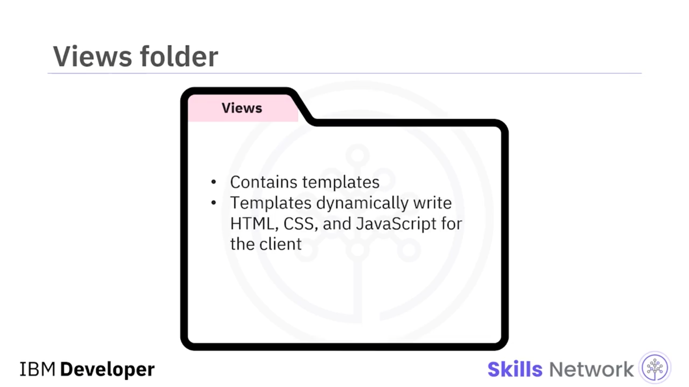

### 🧩 public

`public` klasörü; görseller, CSS ve JavaScript gibi tüm statik içeriği içerir. Her içerik türü için bir alt klasör olması çoğu zaman faydalıdır.

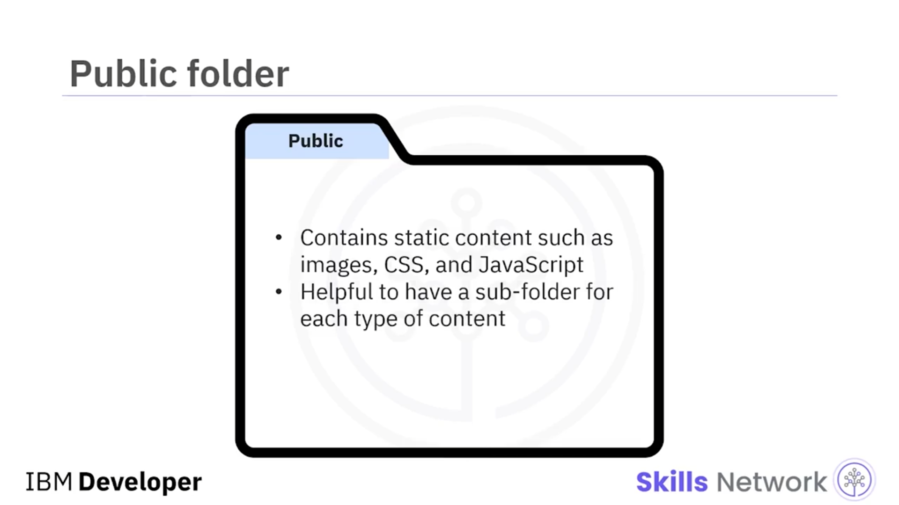

---

## 📄 Proje Klasöründeki Temel Dosyalar

Proje klasörü ayrıca birkaç dosya içermelidir: `app.js`, `routes.js` ve `package.json`.

* `app.js` dosyası, uygulamanızın ana yapılandırma dosyasıdır.

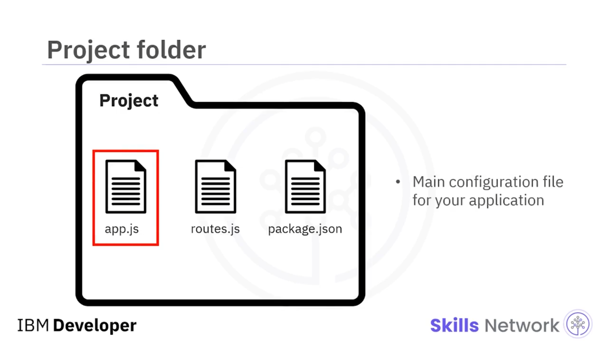

* `routes.js` dosyası, uygulamadaki tüm route’lara erişmek için merkezi bir konumdur. Bu dosya `routes` klasöründeki tüm dosyaları `require` eder veya `import` eder ve sonra bunları tek bir modül olarak `export` eder; bu modül de `app.js` dosyasına `import` edilir. Bu, uygulamadaki tüm route’lar için tek bir giriş noktası ( *single point of entry* ) oluşturur.

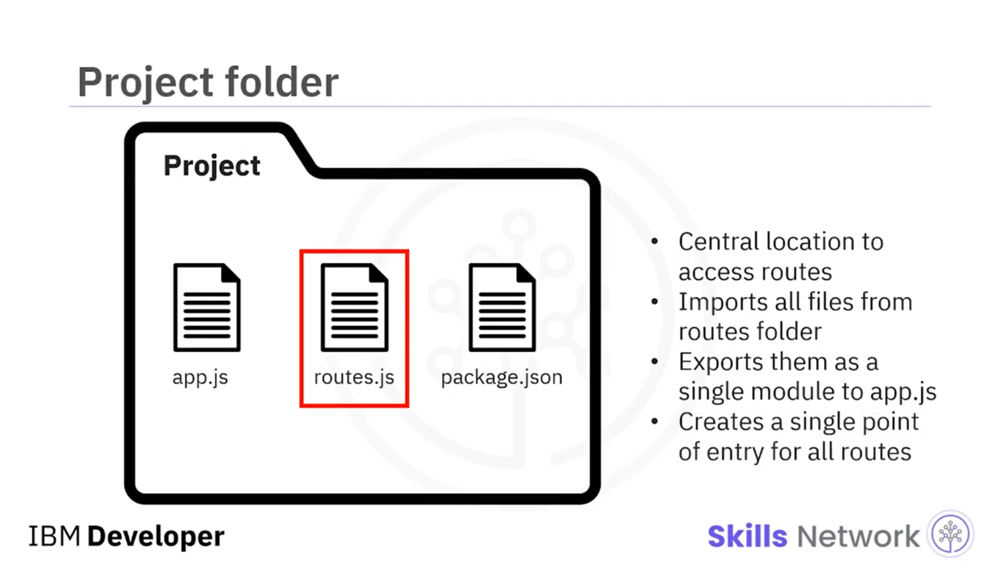

* `package.json` dosyası, projenin bağımlılıklarını yönetmek için kullanılan metadata’yı içerir.

---

## 🧱 API’ler İçin Klasör Yapısı

Bir API için klasör yapısı proje klasörüne oldukça benzerdir. Ancak `views` veya `public` klasörlerine ihtiyaç yoktur.

Dolayısıyla klasörler şöyle görünmelidir:

* `node_modules`
* `config`
* `models`
* `routes`

Ve şu dosyalar:

* `app.js`
* `routes.js`
* `package.json`

---

## 🧾 API Route İsimlendirme

Bir API route’u adlandırırken, bir kaynak tanımlayıcısı ( *resource identifier* ) olarak bir isim ( *noun* ) kullandığınızdan emin olun.

Bu tablo, route içinde *employee* kelimesini kullanarak  **POST** ,  **GET** , **PATCH** ve **DELETE** için HTTP route örnekleri sağlar. Bu route’lar, çalışan verisini değiştirmek için HTTP method’ları ve API route’ları yazıyorsanız örnek teşkil eder.

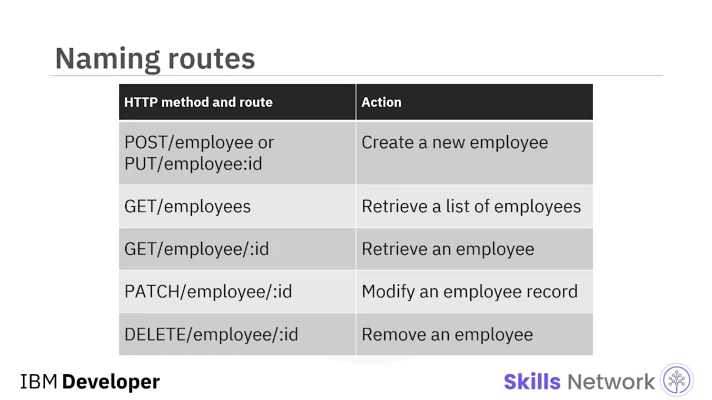

---

## 🚦 HTTP Status Code Kullanımı

HTTP status code’ları doğru kullandığınızdan emin olun.

* **200’ler** : her şey yolunda
* **300’ler** : kaynak taşındı
* **400’ler** : istemci tarafı hata
* **500’ler** : API tarafında bir şeyler yanlış gitti

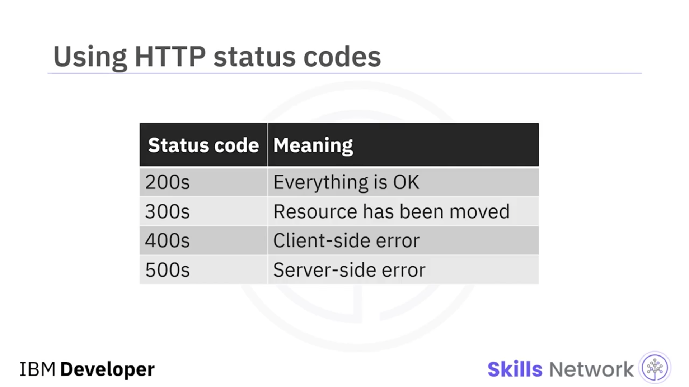

---

## 🧪 REST API’lerde Black-box Test

Bir diğer en iyi uygulama, Node.js REST API’lerini black-box test etmektir. Black-box testing, kodun iç yapısına bakmadan test etmek anlamına gelir. Sistem, mock veya stub bağımlılıklar olmadan bütün olarak test edilir.

Node.js üzerinde çalışan bir JavaScript test framework’ü olan Mocha, “supertest” adlı basit bir modül içerir. SuperTest, HTTP isteklerini test etmenizi sağlar; bu da REST API’lerini black-box test etmek istediğinizde tam olarak ihtiyaç duyduğunuz şeydir.

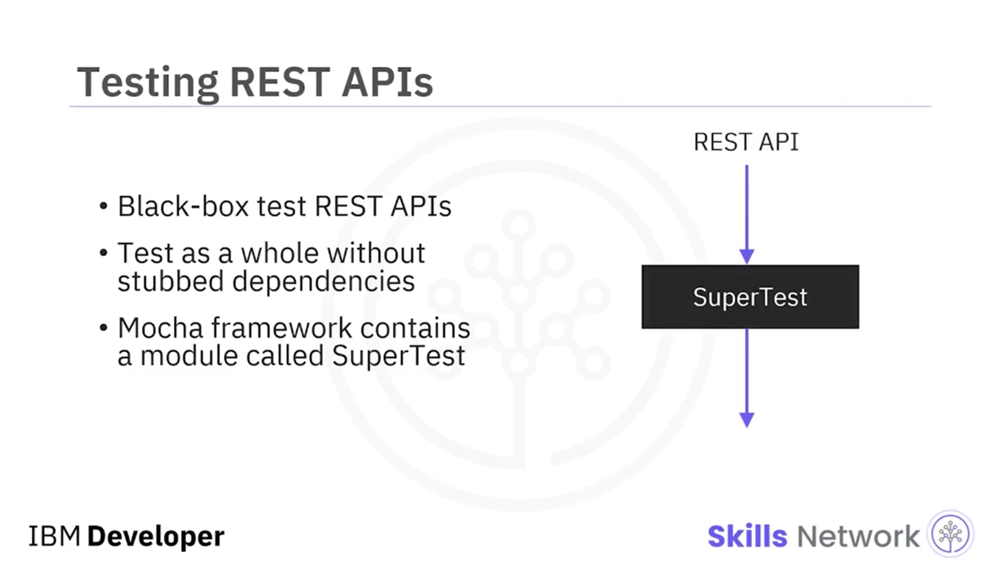

---

## 🔐 JWT Tabanlı Stateless Authentication

API’niz authentication gerektiriyorsa, JSON Web Token ( *JWT* ) tabanlı stateless authentication kullanmak en iyi uygulamadır. REST API’ler stateless olmalıdır; dolayısıyla authentication da stateless olmalıdır.

Stateless authentication, oturum bilgisi gibi bilgilerin büyük kısmını (örneğin kullanıcı özelliklerini) istemci tarafında sağlayarak kullanıcıları doğrular.

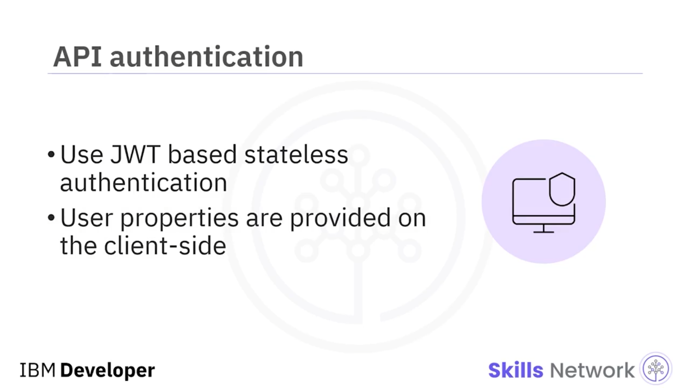

---

## 🧾 API Dokümantasyonu

Burada vurgulayacağımız son en iyi API uygulaması, doğru API dokümantasyonu oluşturmaktır. Bir API’nin tüm amacı başkalarının onu kullanabilmesidir; bu nedenle Node.js REST API’niz için uygun dokümantasyon sağlamalısınız.

API’leriniz için dokümantasyon oluştururken faydalı olabilecek iki açık kaynak proje şunlardır: **API Blueprint** ve  **Swagger** .

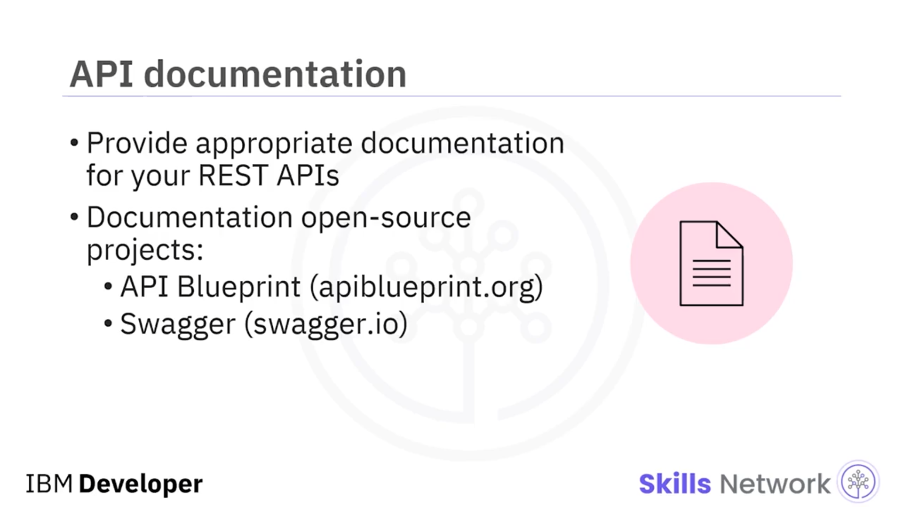

---

## 📌 Express/Node.js Uygulamalarında Ek İpuçları

Node package manager ( *NPM* ) kullanımıyla ilgili olarak, bir Node.js projesini başlatırken `npm init` komutunu kullanın.

Bağımlılıkları kurmak için `npm install` komutunu kullanırken `--save` veya `--save-dev` özniteliğini kullanın. Bu, uygulama farklı bir platforma taşınırsa doğru bağımlılıkların da onunla birlikte kurulmasını sağlar.

Asla `node_modules` deposunu push etmeyin. Ve her zaman kurulum için npm kullanın.

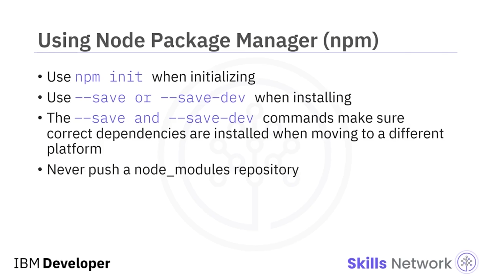

Şu büyük/küçük harf konvansiyonlarına bağlı kalın:

* Dosya adları için tamamen küçük harf kullanın
* Değişkenler için camel case kullanın
* npm modülleri küçük harf ve tire ile ayrılmış şekilde adlandırılır

Ve npm modülleri için `require` metodunu kullanırken camel case kullanın.

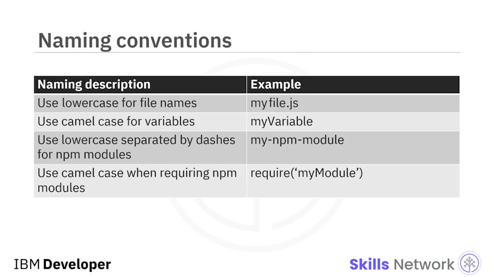

---

## ✅ Bu Videoda Öğrendikleriniz

Bu videoda şunları öğrendiniz:

Hem bir Express.js uygulamasında hem de bir API’de `node_modules`, `config`, `models` ve `routes` klasörlerini içeren bir dizin yapısı kullanın.

RESTful API geliştirirken en iyi uygulamalar şunları içerir:

* Kaynak tanımlayıcı olarak bir isim ( *noun* ) kullanmak
* HTTP status code’ları doğru kullanmak
* SuperTest kullanarak REST API’leri black-box test etmek
* JWT tabanlı stateless authentication kullanmak
* İyi dokümantasyon eklemek

Son olarak, diğer ipuçları şunları içerir: Büyük/küçük harf konvansiyonlarına uymak, npm’i önerildiği şekilde kullanmak, değişkenler için config dosyaları kullanmak ve benzer işlevdeki route’ları kendi dosyaları içinde gruplamak.

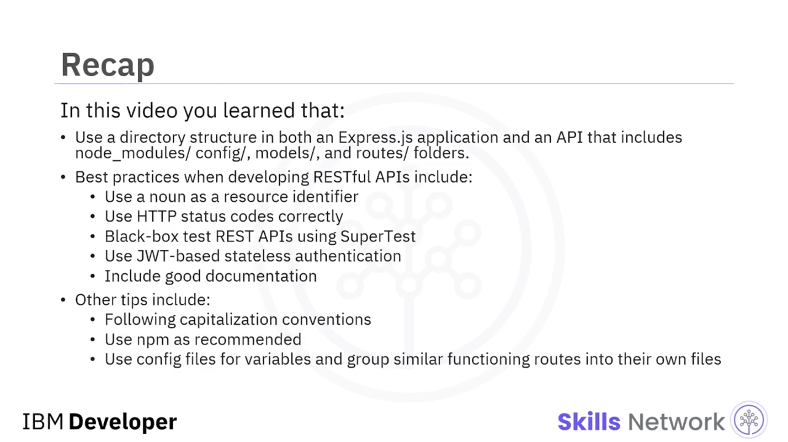
