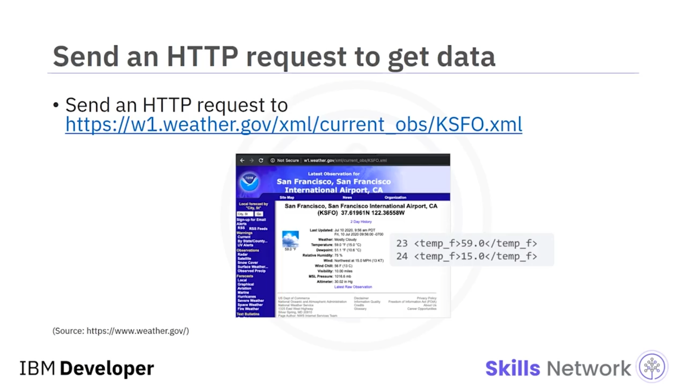
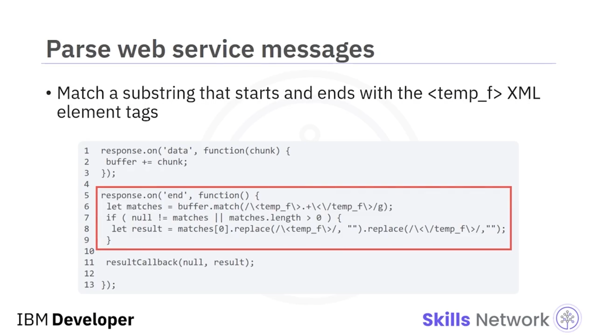
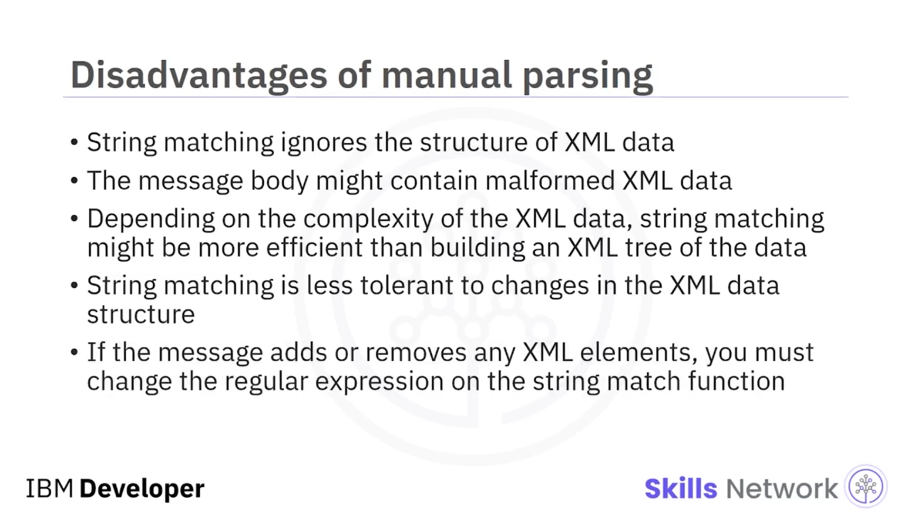
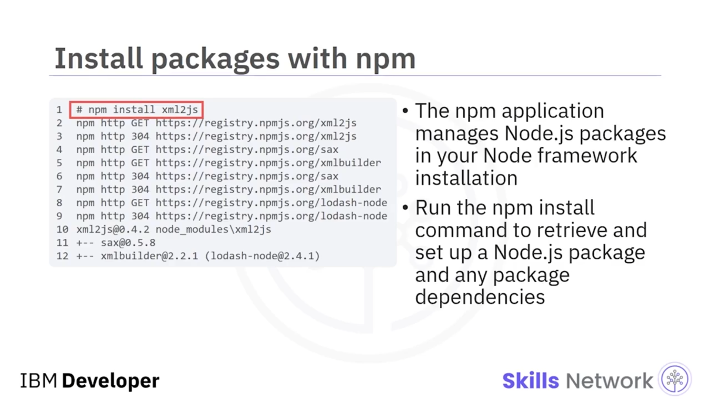
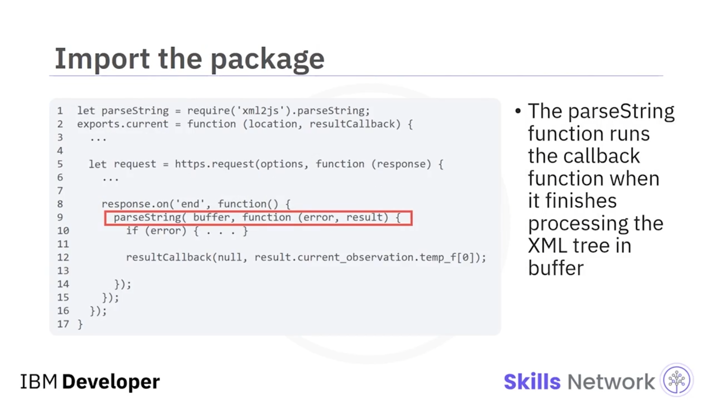
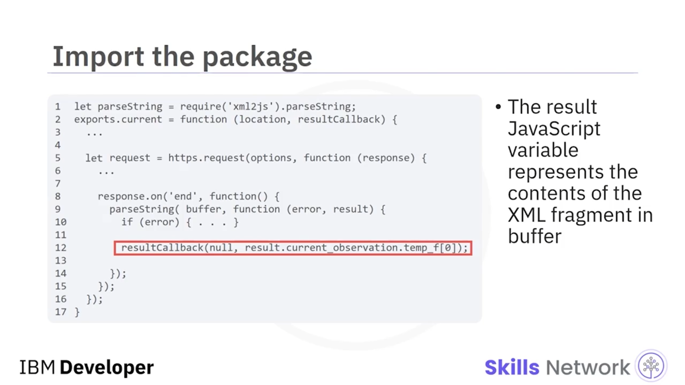
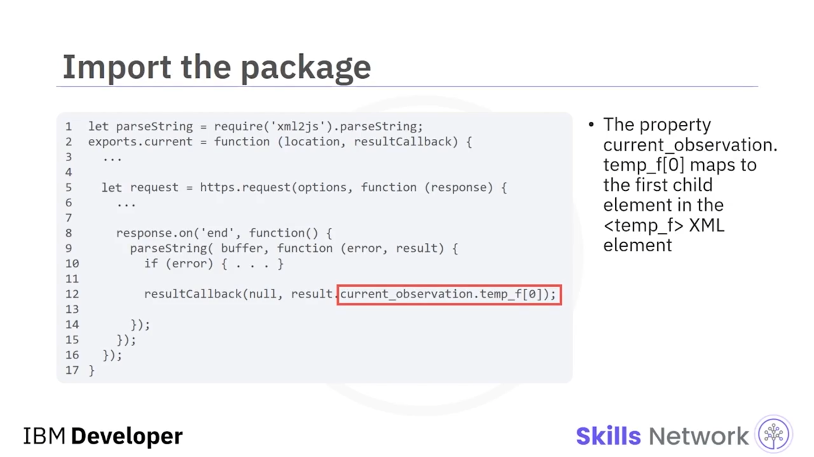
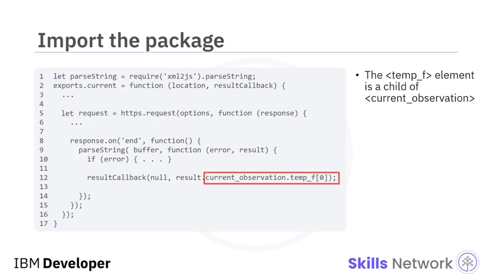

## 🧩 Extending Node.js

Extending Node.js’e hoş geldiniz. Bu videoyu izledikten sonra şunları yapabiliyor olmalısınız: Node.js’i üçüncü taraf paketlerle genişletmek ve paket bağımlılığını tanımlamak.


Node.js kullanarak bir *hypertext transfer protocol (HTTP)* sunucusu oluşturabilirsiniz, ancak varsayılan Node.js çatısı sınırlıdır. Bununla birlikte, bir web sunucusu oluşturmanın  *routing* , gelen dosyaları ayrıştırma,  *authentication* , bir veritabanına bağlanma ve diğer yönleri gibi birçok bileşeni vardır.

Örneğin,  *extensible markup language (XML)* ’i JavaScript *string* fonksiyonlarıyla ayrıştırabilirsiniz, ancak bir XML  *document object* , XML verisini bir akış ( *stream* ) halinde ayrıştırmada verimli değildir. Geliştiriciler, çekirdek Node.js işlevselliğini genişletmek için harici kütüphanelere ve paketlere güvenir.


---

## 🌦️ HTTP İsteği ile Hava Durumu Verisi Alma Örneği

Diyelim ki San Francisco International Airport’un hava durumu verisini bilmeniz gerekiyor.

Harici bir web sunucusuna bir HTTP isteği gönderebilirsiniz. Hava durumu verisini aldıktan sonra, onu manuel olarak ayrıştırabilirsiniz.



Burada web servis mesajlarını bir *string* olarak ayrıştırırsınız. Node.js HTTP yanıt mesajının son kısmını aldığında, `response.on('end')` olay işleyicisini çağırır. Callback fonksiyonunun içinde, `buffer.match` fonksiyon çağrısına sahip ilk satır, XML mesajının `temp_f` XML öğe etiketleriyle başlayıp bittiği kısmını bulur. Başlangıç ve bitiş `temp_f` etiketleri dahil bu  *string* , `matches` değişkenine kaydedilir. Bir eşleşme varsa, `matches[0].replace` üzerindeki ikinci çağrı başlangıç ve bitiş `temp_f` XML öğelerini ayıklar.



---

## ⚠️ XML’i String Olarak İşlemenin Dezavantajları

XML verisini *string* olarak ele almanın dezavantajlarını düşünün.

*String matching* XML verisinin yapısını yok sayar. Mesaj gövdesi bozuk ( *malformed* ) XML verisi içerebilir. XML verisinin karmaşıklığına bağlı olarak, *string matching* verinin bir XML ağacını ( *XML tree* ) oluşturmaktan daha verimli olabilir.

 *String matching* , XML veri yapısındaki değişikliklere daha az toleranslıdır. Mesaj herhangi bir XML öğesi ekler veya kaldırırsa, *string match* fonksiyonundaki düzenli ifadeyi ( *regular expression* ) değiştirmek zorundasınız.



---

## 🧰 xml2js Paketi ile XML’i JavaScript Nesnesine Dönüştürme

Bir *string* içindeki XML öğelerini bir JavaScript nesnesine ayrıştırmak için `xml2js` Node.js paketini kullanabilirsiniz.

Bu, yalnızca JavaScript kullanan bir Node.js paketidir. Başka bir dilde yazılmış bir XML ayrıştırma kütüphanesi gerektirmez.

Üçüncü taraf paket lisanslarının kendi lisansları olabileceği için, `xml2js` Node.js paketini yüklemeden önce lisans koşullarının şirketiniz ve uygulamanızla uyumlu olduğunu doğrulayın.


---

## 📦 npm ile Paket ve Bağımlılık Yönetimi

Node.js çatı kurulumunuzda Node.js paketlerini yönetmek için `npm` uygulamasını kullanabilirsiniz.

Örneğin, bir Node.js paketini ve paket bağımlılıklarını almak ve kurmak için `npm install` komutunu çalıştırın. Bu örnekte, komut satırından `npm install xml2js` çağrısı yaparsınız. `npm` uygulaması İnternet’e çıkar ve Node.js modülü `xml2js`’i ve gerektirdiği tüm bağımlılıkları indirir.

```bash
npm install xml2js
```



---

## 🧪 Paketi Uygulamaya Dahil Etme ve parseString

Burada paketi uygulamanıza içe aktarırsınız. İlk satırda, `parseString` fonksiyonu, `buffer` içindeki XML ağacını işlerken tamamladığında callback fonksiyonunu çağırır.



Son satırda, `result` JavaScript değişkeni, `buffer` içindeki XML parçasının içeriğini temsil eder. Başka bir deyişle, `result` JavaScript değişkeni XML öğesini temsil eder, ancak JavaScript biçimindedir.

`current_observation.temp_f[0]` özelliği, `temp_f` XML öğesindeki ilk alt öğeye karşılık gelir. `temp_f` öğesi, `current_observation` öğesinin bir alt öğesidir.







---

## ✅ Özet

Bu videoda şunları öğrendiniz:

* Geliştiriciler, Node.js’in özelliklerini genişletmek için üçüncü taraf paketlere güvenir.
* *String matching* , XML verisinin yapısını yok sayar.
* `xml2js` Node.js paketi, XML öğelerinden oluşan bir  *string* ’i bir JavaScript nesnesine ayrıştırır ve `npm` uygulaması, Node.js çatı kurulumunuzda Node.js paketlerini yönetir.


