## 🌐 Introduction to Web Frameworks

Web Framework’lere Giriş’e hoş geldiniz. Bu videoyu izledikten sonra şunları yapabiliyor olacaksınız: Node.js ile Node.js tabanlı web framework’leri arasındaki farkı açıklamak. *MVC* ve *REST API* mimari stillerini açıklamak. Ve birkaç Node web framework’ünün öne çıkan özelliklerini tanımlamak.

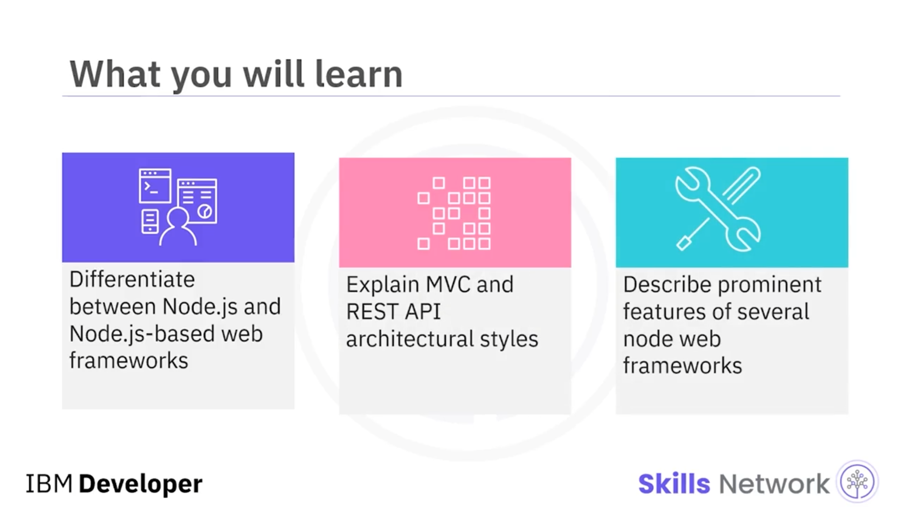

Bazen Node.js yanlışlıkla bir web framework’ü olarak adlandırılır. Node.js bir framework değildir; sunucuda JavaScript çalıştıran bir  *runtime environment* ’tır.  *Runtime environment* ’lar, belirli bir kod tabanına sahip programları çalıştırabilen donanım ve yazılımdır.

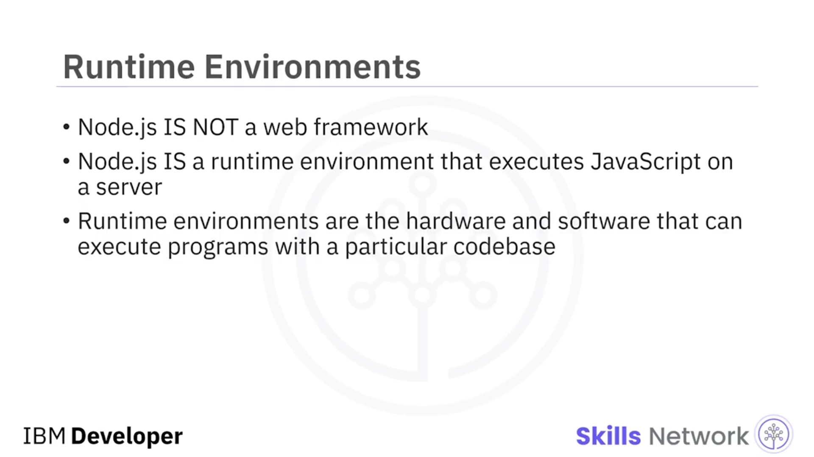

Bir framework ise, belirli bir ortam için bir uygulamanın üzerine inşa edildiği bir iskelet gibidir. Framework, uygulamayı destekleyen temel yapıdır. Bu nedenle, Node.js’i kullanmak için onunla birlikte çalışan bir web framework’ü kullanmanız gerekir. Node.js ile çalışan bir framework’e *node web framework* veya kısaca *node framework* denir.

Farklı node framework’leri vardır. Bu videonun ilerleyen kısmında birkaçını ele alacağız. Ancak tek tek framework’leri tartışmadan önce, web framework’lerinin back-end oluştururken kullanabileceği iki yaklaşımı konuşalım:  *Model-View-Controller* , daha çok *MVC* olarak bilinir; ve  *Representational state transfer application programming interfaces* , kısaca  *REST API* .

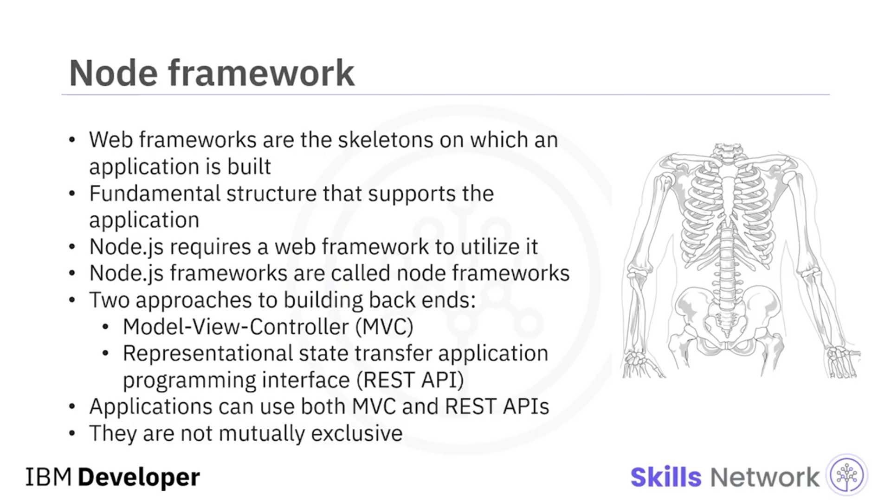

---

## 🧱 MVC ve REST API Yaklaşımları

Bir MVC yaklaşımı, REST API’lerle aynı anda kullanılabilir. Birbirini dışlayan yaklaşımlar değildir.

 *MVC* , “model view controller” anlamına gelir. MVC, bir uygulamayı üç bileşene ayıran bir mimari desendir:  *model* , *view* ve  *controller* . Şimdi bu bileşenlerin her birinin ne olduğuna bakalım.

* *Model* katmanı, uygulamanın verisini yönetmekten sorumludur. Veritabanı ile etkileşime girer ve veri mantığını yönetir.
* *View* , model tarafından kendisine aktarılan verinin sunumunu ( *presentation* ) işlemekten sorumludur.
* *Controller* ise veri akışını düzenler. Kullanıcı tarafından sağlanan veriyi işlemekten sorumludur ve bu veriyi işlenmesi veya depolanması için modele gönderir.

MVC framework’leri genellikle verinin ayrıştırılmasına ihtiyaç duyan uygulamaları geliştirmek için kullanılır: verinin kendisi  *model* ; verinin sunumu  *view* ; veriyi işleyen modül ise  *controller* ’dır.

Back-end’i MVC deseniyle geliştirmeye elverişli framework’lere  *Koa* ,  *Django* , *Express* ve *NestJS* dahildir.

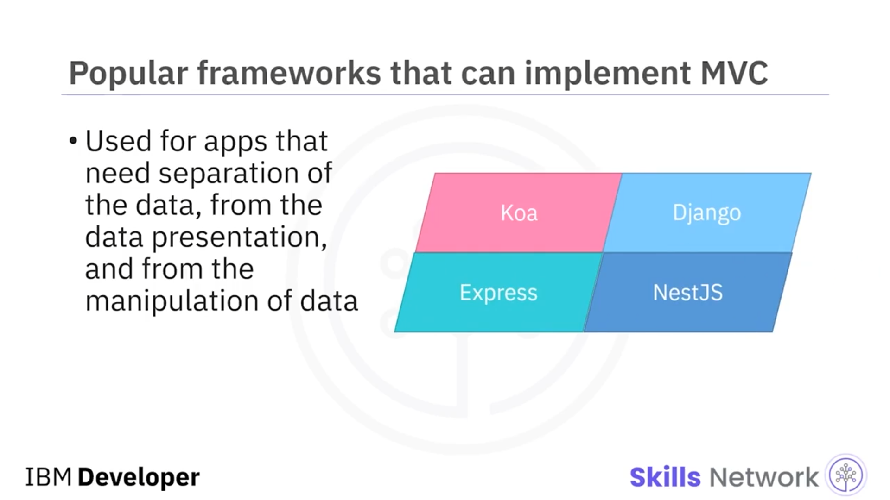

---

## 🔌 REST APIs

Şimdi  *REST API* ’leri konuşalım. REST API’ler, birden fazla web servisinin birbiriyle iletişim kurmasına olanak tanır.

*RESTful APIs* belirli kısıtlamalara tabidir. İstemci tarafındaki kod, sunucu kodundan tamamen bağımsız olmalıdır. İstemci tarafı kodu güncellenebilir ve bu, sunucu koduna müdahale etmez; bunun tersi de geçerlidir.

İkinci olarak, RESTful API’ler  *stateless* ’tir. *Stateless* demek, istemcinin sunucunun durumunu bilmesine gerek olmaması ve sunucunun da istemcinin durumunu bilmesine gerek olmaması demektir; ikisi arasındaki iletişim için bu bilgi gerekli değildir.

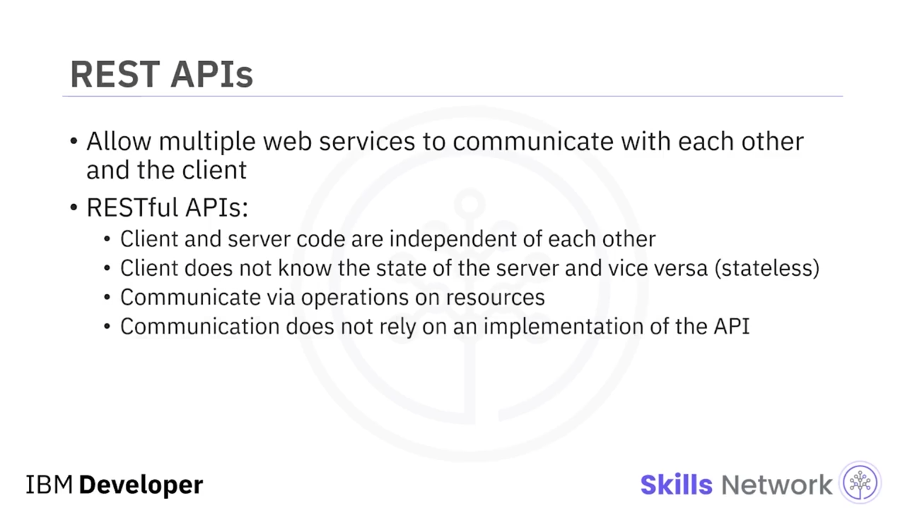

REST API’ler, kaynaklar ( *resources* ) üzerinde yapılan işlemler aracılığıyla iletişim kurar ve API’nin belirli bir uygulanış biçimine ( *implementation* ) bağlı değildir. Bir istemci, `GET`, `POST`, `PATCH` veya `DELETE` gibi HTTP yöntemleriyle bir REST API üzerinden kaynak istediğinde, sunucu kaynağın durumunun bir temsilini ( *representation* ) istemciye döndürür.

İstemci ve sunucu arasında aktarılan verinin temsili genellikle bir  *JSON payload* ’udur, ancak HTML, XLT, Python, PHP veya düz metin ( *plain text* ) de olabilir.

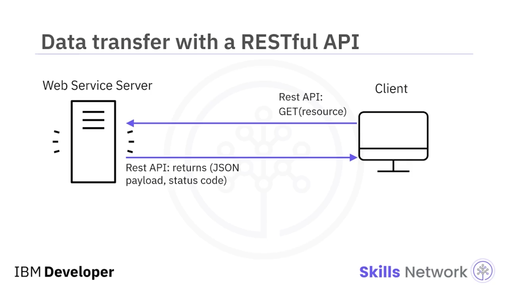

---

## 🧩 Popüler Node Web Framework’leri

Artık back-end kodunu yapılandırmanın birkaç yolunu konuştuğumuza göre, şimdi framework’lerin kendisini daha derinlemesine inceleyelim.

---

## 🚀 Express.js (Express)

 *Express.js* , yani  *Express* , en popüler Node Web Framework’lerinden biridir. *Routing* ve *middleware* için kullanılır.

JavaScript ile yapılan doğrudan ( *straightforward* ) kodlama, nispeten küçük bir öğrenme eğrisi ( *learning curve* ) anlamına gelir. Express ile MVC mimari desenini uygulamak kolaydır. Uygulamadaki hataları kolayca tespit etmeye yardımcı olan *debugging mechanisms* sağlar.

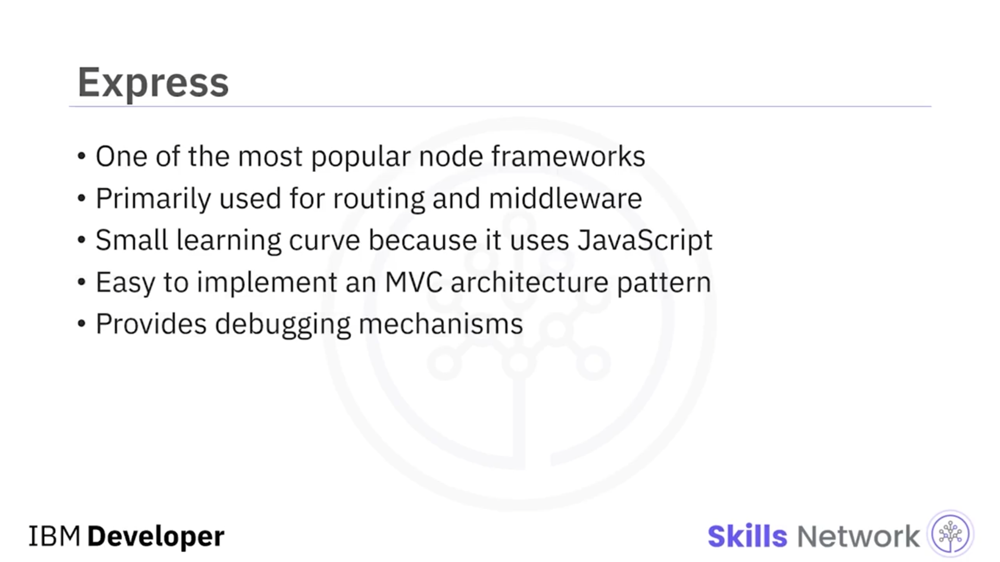

Express, asenkron programlama ile birbirinden bağımsız çoklu işlem isteklerini eşzamanlı ( *concurrently* ) ele aldığı için yüksek performans sağlar. HTTP isteklerini ele almak için programları anlaşılır ( *intelligible* ) ve yeniden kullanılabilir ( *reusable* ) hale getiren birçok *HTTP helpers* içerir.

İstemci ve sunucunun, URL’lere HTTP başlıklarını verimli biçimde sağlayarak ve istek yapan istemcinin ihtiyaç duyduğu tam veriyi getirerek iletişim kurmasına yardımcı olan güçlü bir *content negotiation* özelliğine sahiptir.

---

## ⚙️ Koa

 *Koa* , Express’i tasarlayan aynı ekip tarafından tasarlanmış, nispeten yeni bir web framework’üdür. Daha küçük, daha ifade gücü yüksek ( *more expressive* ) olmayı ve web uygulamaları ile API’ler için daha sağlam ( *more robust* ) bir temel sunmayı hedefler.

Koa, callback’lerin gerekli olmamasını sağlayacak şekilde *async functions* kullanır ve hata ele alma yeteneğini artırır. Koa, yüksek performanslı, zorlu, karmaşık ve büyük, deneyimli ekipler tarafından geliştirilen uygulamalar için uygundur.

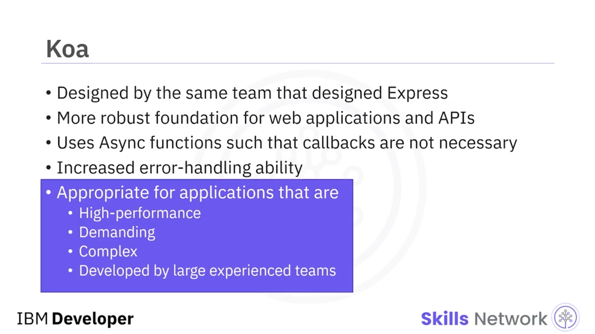

---

## 🔄 Socket.io

 *Socket.io* , istemciler ve sunucular arasında iki yönlü ( *bidirectional* ) verinin gerçek zamanlı ( *real-time* ) olarak değiş tokuş edildiği uygulamaları geliştirmek için mükemmel bir seçimdir.

İletişim için HTTP yerine *WebSocket* kullanan uygulamalar geliştirebilirsiniz. Sunucuları, verinin istemci tarafından çağrılmasına gerek kalmadan veriyi iletir ( *push* ).

Sohbet odaları, mesajlaşma uygulamaları, video konferans ve çok oyunculu oyunlar gibi uygulamalar için uygundur.

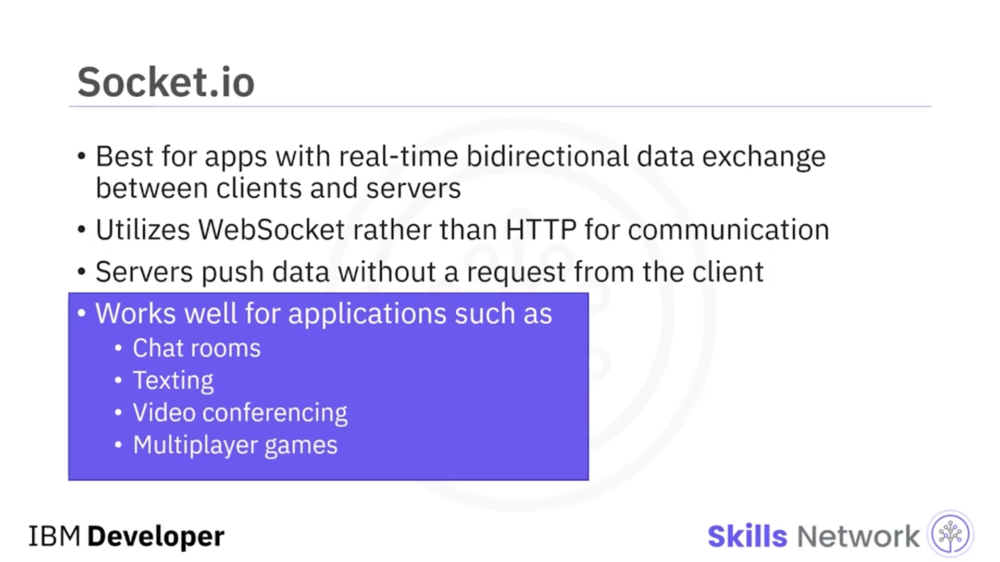

---

## 🛡️ Hapi.js

 *Hapi.js* , içine çok sayıda güvenlik bileşeni gömülü ( *built into it* ) güvenilir bir açık kaynak node web framework’üdür. Çok sayıda yerleşik eklenti ( *built-in plugins* ) vardır; bu nedenle resmi olmayan *middleware* kullanmanıza gerek kalmaz.

En çok proxy ve API sunucuları, HTTP-proxy uygulamaları, REST API’ler ve diğer masaüstü uygulamalarını geliştirmesiyle bilinir.

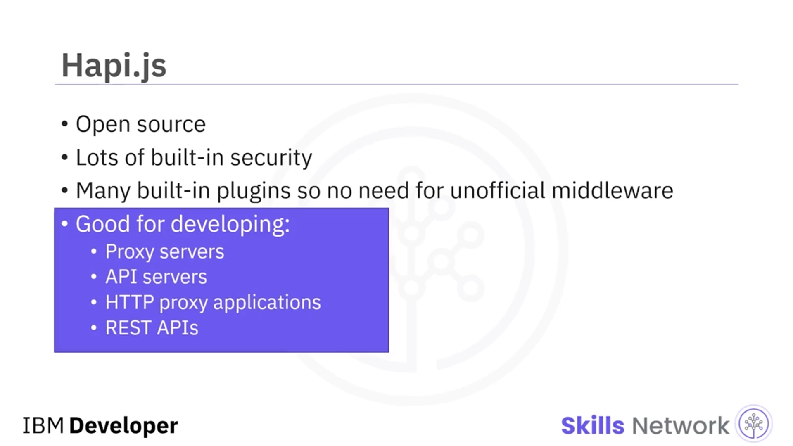

---

## 🏢 NestJS

Ve son olarak, çok sayıda kütüphanesi ( *multitude of libraries* ) sayesinde esnekliğiyle birlikte dinamik, ölçeklenebilir ( *scalable* ) kurumsal ( *enterprise* ) uygulamalar geliştirmek için uygun olan *NestJS* framework’ü vardır.

Bir MVC mimarisini izler. NestJS, Express’in üzerine inşa edilmiştir; bu yüzden benzer amaçlara sahiptirler ve karşılaştırılabilir fonksiyonlar sağlarlar.

*TypeScript* ile uyumludur; bu, JavaScript’in bir  *subset superset* ’idir. Front-end *Angular* framework’ü ile birlikte çalışır. Ayrıca Nest, hem nesne yönelimli ( *object-oriented* ) hem de fonksiyonel reaktif programlamayı ( *functional reactive programming* ) birleştirir; bu, potansiyel olarak üretkenliği ve uygulama performansını iki katına çıkarır.

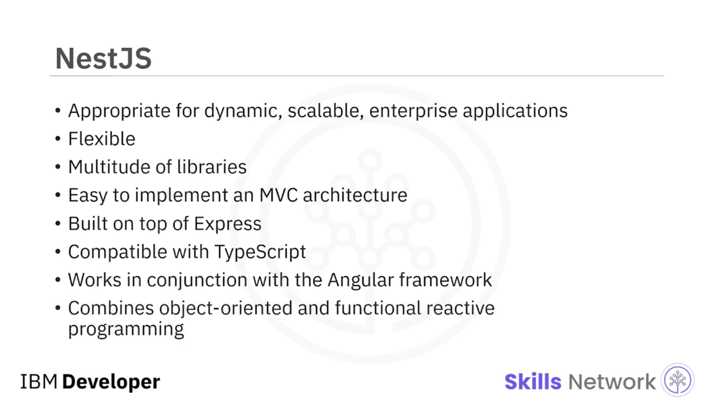

---

## ✅ Özet

Bu videoda şunları öğrendiniz:

* Node.js bir  *runtime environment* ’tır; node web framework’leri ise çalışmak için Node.js ortamını kullanır.
* MVC mimari stili bir back-end uygulamasını üç parçaya böler:  *model* , *view* ve  *controller* .
* REST API framework’leri, birbirleriyle iletişim kurmak için HTTP yöntemlerini kullanır.
* Popüler node web framework’lerinden bazıları  *Express* ,  *Koa* , *Hapi.js* ve  *NestJS* ’tir.

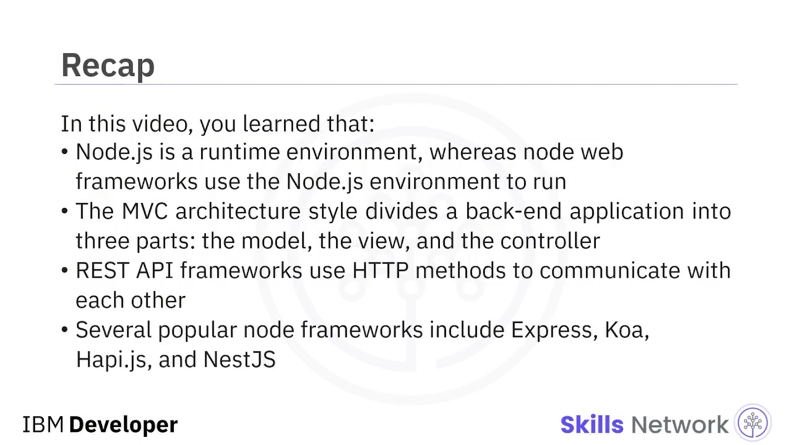
