## 🚀 Express Web Application Framework

Express Web Application Framework’e hoş geldiniz. Bu videoyu izledikten sonra şunları yapabiliyor olacaksınız: Express framework’ünü tanımlamak, Express’in birincil kullanım alanlarını açıklamak ve Express’i indirmek.

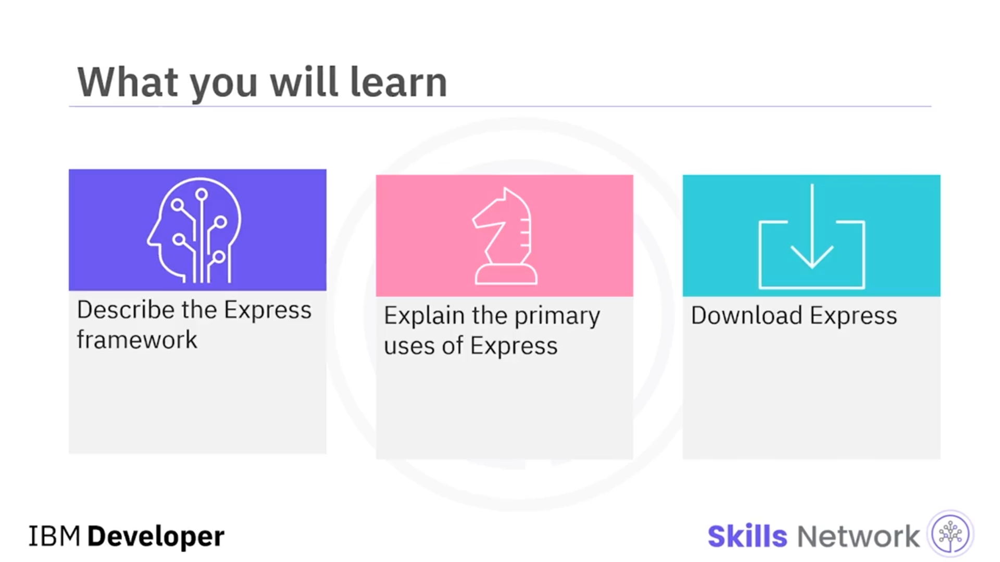

Express, Node.js  *runtime environment* ’ına dayalı bir web uygulama framework’üdür; ancak Express düşük seviye ayrıntıları soyutlar ( *abstracts* ). Express, uygulamanızı daha iyi organize etmenize ve uygulamanızı daha hızlı geliştirmenize yardımcı olur. *Middleware* paketlerini entegre etmek ve farklı *hypertext transfer protocol (HTTP)* istek yöntemlerini ele almak için güçlü mekanizmalar sağlar.

Express web uygulama framework’ü günümüzde alanda yaygın olarak kullanılır ve diğer framework’lerin de temelini oluşturur.

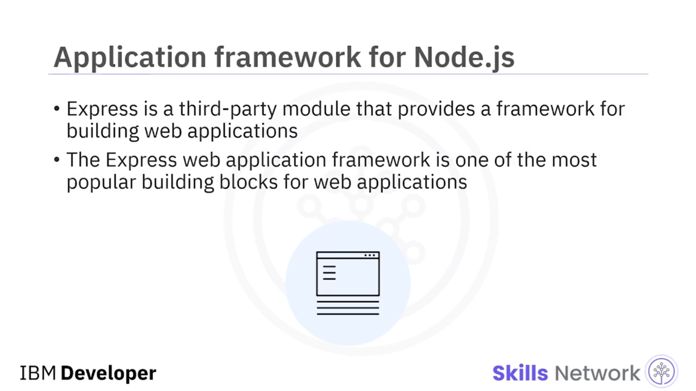

---

## 🎯 Express’in Birincil Kullanım Amaçları

Express temel olarak iki amaç için kullanılır: biri API olarak, ikincisi ise sunucu taraflı render ( *server-side rendering* ), yani *SSR* olarak da bilinen şekilde şablon ( *templates* ) kurmaktır.

---

## 🧩 Express ile API Geliştirme

Express’i API oluşturmak için kullanmak, veri katmanı ( *data layer* ) ile etkileşime girmek üzere bir HTTP arayüzü kurmak anlamına gelir. API’ler söz konusu olduğunda, veri bir yanıt nesnesi ( *response object* ) kullanılarak istemciye JSON formatında geri gönderilir; kısaca `res`.

`res.json` metodu, gönderilen verinin içerik türü ( *content type* ) hakkında istemciyi bilgilendirmek için kullanılır; örneğin bunun bir görsel mi yoksa metin mi olduğu gibi. Ayrıca veriyi *Stringify* etmek, başka bir deyişle JavaScript’i JSON formatına dönüştürmek için de kullanılabilir.

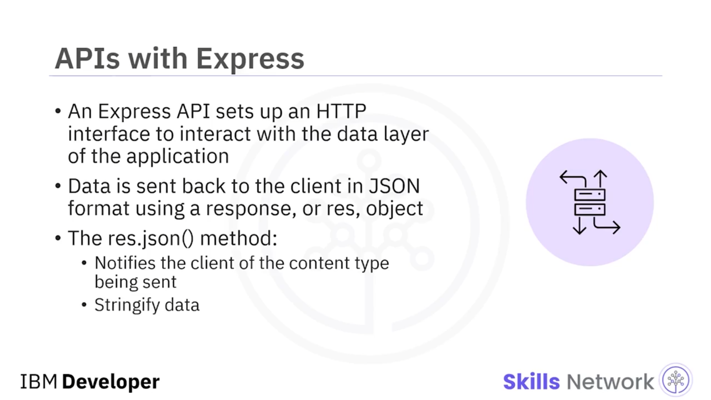

---

## 🖥️ Server-Side Rendering (SSR)

 *Server-side rendering (SSR)* ’da Express, şablonları kurmak için kullanılır. Express, HTTP isteğiyle sağlanan, istemciden gelen veriyi şablonla birlikte kullanarak dinamik biçimde HTML, CSS ve/veya JavaScript yazmaktan sorumludur. HTML, CSS ve/veya JavaScript, tarayıcının sayfayı render edebilmesi için metin ( *text* ) olarak istemciye geri gönderilir.

Bu işlem, Express `res.render` metodu kullanılarak gerçekleştirilir.

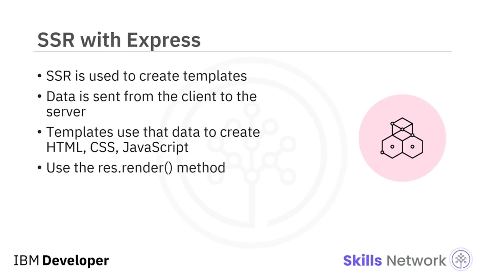

---

## 🧱 Express ve Node.js Core API Karşılaştırması

Express, bir web kaynak yoluna ( *web resource path* ) eşlediğiniz bir `app` sınıfı ( *app class* ) uygular.

Buna karşılık, Node.js çekirdek *application programming interface (API)* kullanıldığında `http.createServer` fonksiyonu, web kaynak yolunu ayrıştırmak için sizin özel callback fonksiyonunuza dayanır.

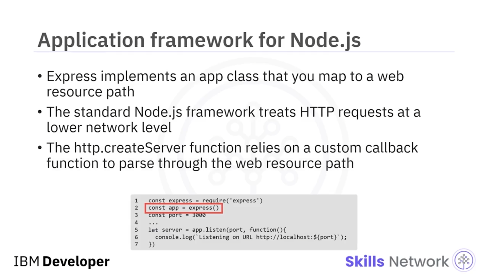

---

## 🪜 Express ile Çalışmaya Genel Bakış: 5 Adım

Express ile çalışma sürecine genel bakış aşağıdaki gibidir. Beş adım vardır:

1. Bir Node.js projesinin paket manifest’inde Express’i bağımlılık ( *dependency* ) olarak tanımlayın.
2. Eksik modülleri indirmek için `npm` komutunu çalıştırın.
3. Express modülünü içe aktarın ve bir Express uygulaması oluşturun.
4. Yeni bir route handler oluşturun.
5. Belirli bir port numarası üzerinde bir HTTP sunucusu başlatın.

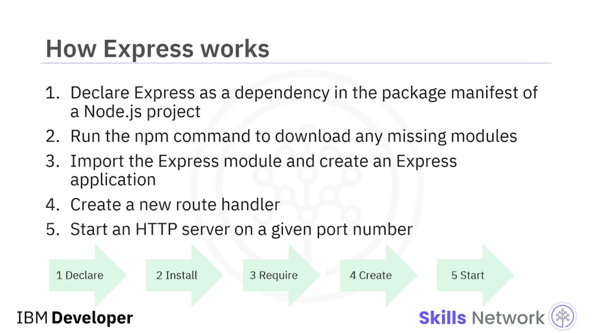

---

## 📄 package.json İçinde Express’i Bağımlılık Olarak Tanımlama

Şimdi birinci ve ikinci adımları nasıl tamamlayacağınızı göreceksiniz.

Öncelikle, `package.json` dosyasında Express’i bağımlılık olarak tanımlamak için proje klasörünüzde bir `package.json` dosyası oluşturun.

`package.json` dosyası, bir Node.js modülünün içeriği hakkında aşağıdaki beş öğe dahil bilgileri saklar: `name`, `version`, `description`, `main` ve `dependencies`.

* `name`, Node.js modülünün adıdır.

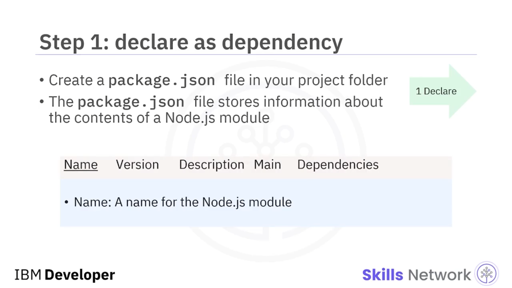

* `version`, modülün major ve minor sürüm numarasını tanımlayan bir string’dir.

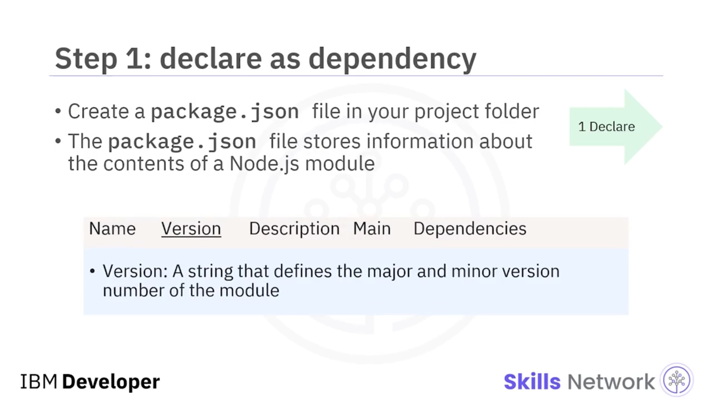

* `description`, modülün amacını açıklayan bir cümledir.

  
* `main`, modülün giriş noktası ( *entry point* ) olan Node.js script’ini belirtir.

  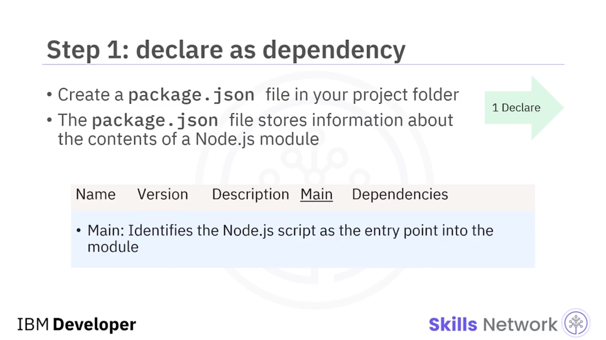
* `dependencies`, mevcut modülün ihtiyaç duyduğu Node.js modüllerinin bir listesidir.

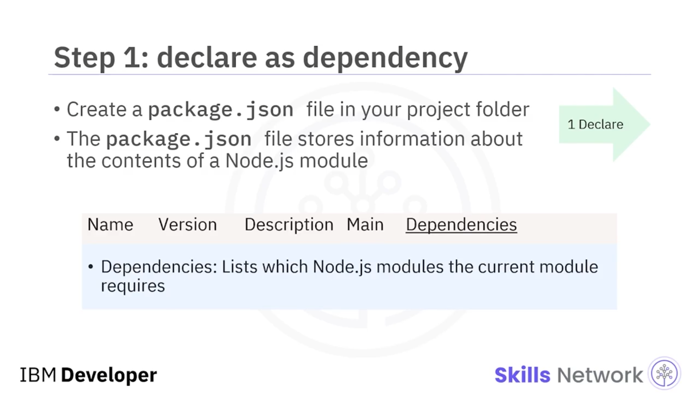

Express’i bağımlılık olarak tanımlamak için, `dependencies` özelliğinde Express modülünü ve bir sürüm numarasını listeleyin.

Burada, bu `package.json` bağımlılık dosyasında modülün adı `temperature`’dır. Sürümü `1.0.0`’dır. Açıklaması `"retrieve current weather conditions in the United States."` şeklindedir. Modüldeki giriş noktası olan ana script dosyası `app.js` olarak ayarlanmıştır. Express framework’üne bağımlıdır ve bu sürüm `4.x`’tir.

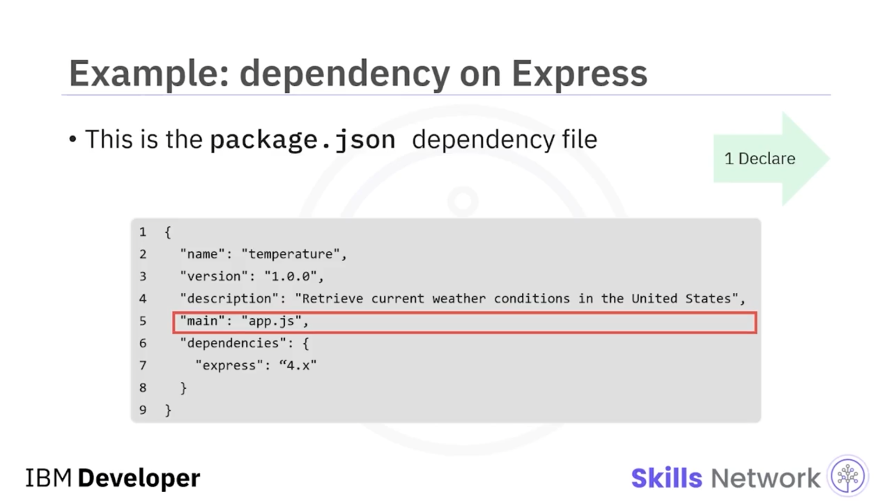

---

## 📦 npm install ile Eksik Modülleri İndirme

2. adımda, eksik modülleri indirmek için `npm` komutunu çalıştırırsınız.

Node.js modül dizininin içinde `npm install` komutunu çalıştırdığınızda, eksik bağımlı Node.js modüllerini çözer ( *resolves* ). Komut, eksik Node.js modüllerini indirir ve kendi `node_module` dizinine kaydeder.


Bu şema, farklı paketlerde aynı Node.js modülünün farklı sürümlerini kullanmanıza izin verir.

Örneğin, özel ( *custom* ) bir Node.js modülü Express framework’ünün 4.0 sürümünü yükler. Başka bir Node.js modülü ise kendi Node modülü deposunda ( *repository* ) 5.0 sürümünü yükler.

Bir Node.js modülünü paylaşılan `node_module` dizinine kurmak için, Node.js kurulum dizininizden modül adınızla birlikte `npm install` çalıştırın.

Express’i indirmek için proje klasörünüzde `npm install` çalıştırın.

`npm install` komutunu parametresiz çalıştırdığınızda, `npm` uygulaması `package.json` dosyanızı tarar. `node_module` dizininizi kontrol ederek eksik modül olup olmadığına bakar. Bu durumda Express web uygulama framework’ü mevcut kurulumunuzda yoktur. `npm` uygulaması Express framework’ünü ve ona bağımlı tüm modülleri indirir.

```bash
npm install
```


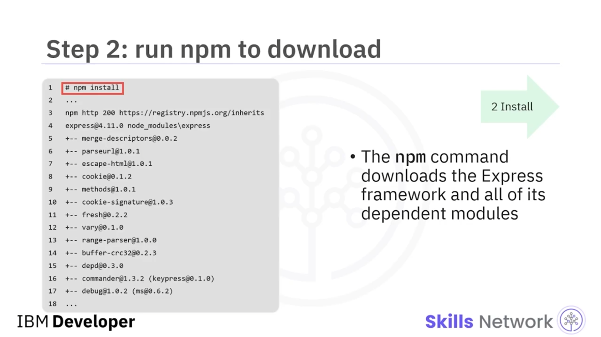

---

## ✅ Özet

Bu videoda şunları öğrendiniz:

* Express, web uygulamaları oluşturmak için bir framework sağlayan üçüncü taraf bir modüldür.
* Express iki amaca hizmet eder: API kurmak ve SSR uygulamak.
* Express’i kurmak için beş adım vardır: Bir Node.js projesinin paket manifest’inde Express’i bağımlılık olarak tanımlayın. Eksik modülleri indirmek için `npm` komutunu çalıştırın. Express modülünü içe aktarın ve bir Express uygulaması oluşturun. Yeni bir route handler oluşturun. Ve son olarak, belirli bir port numarası üzerinde bir HTTP sunucusu başlatın.

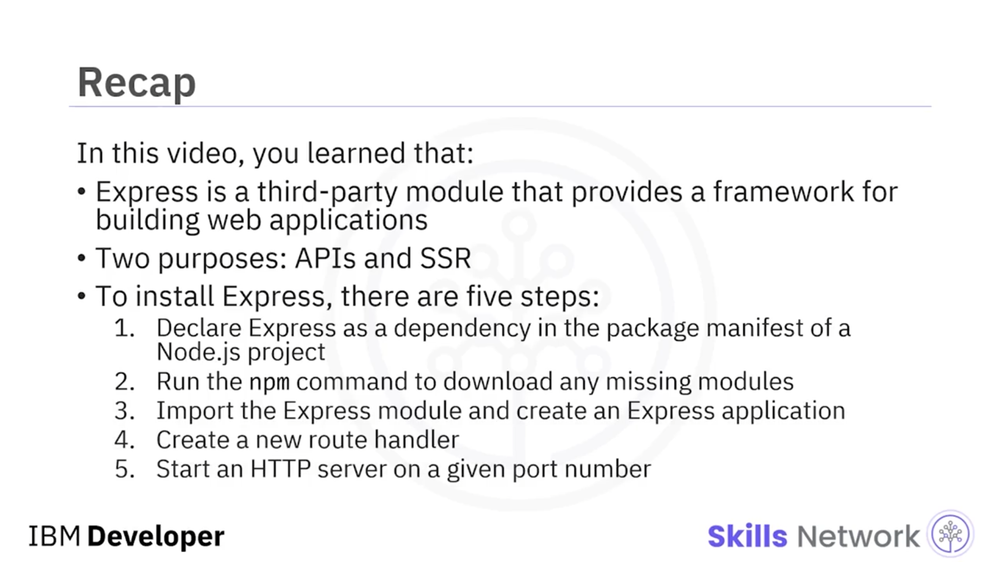
