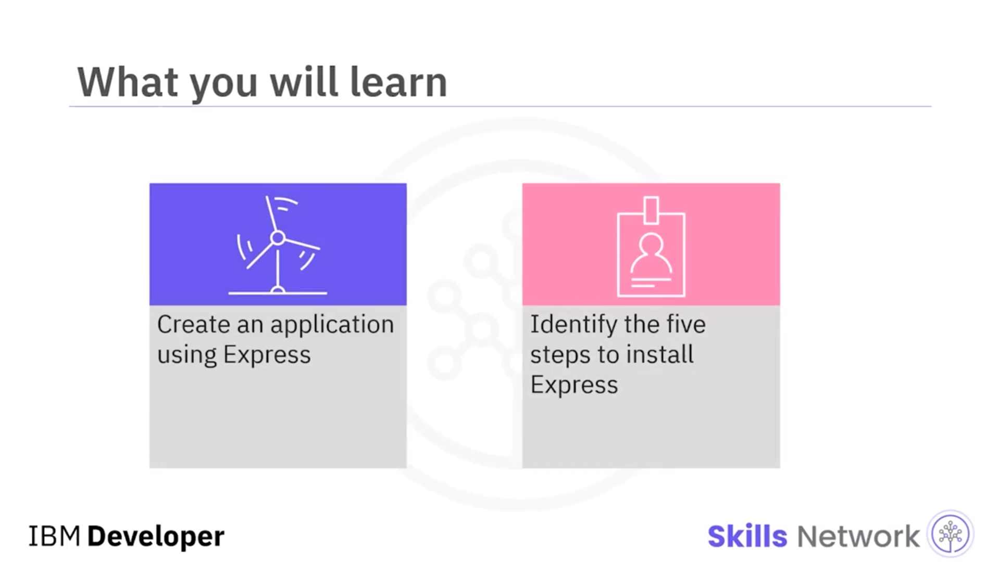
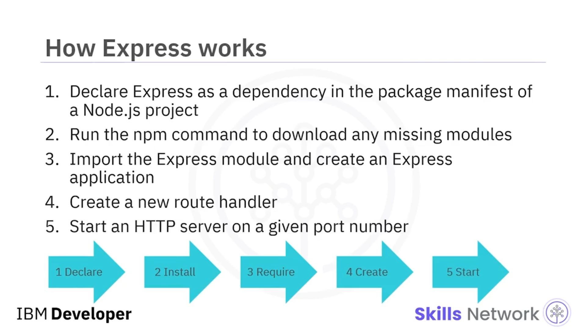
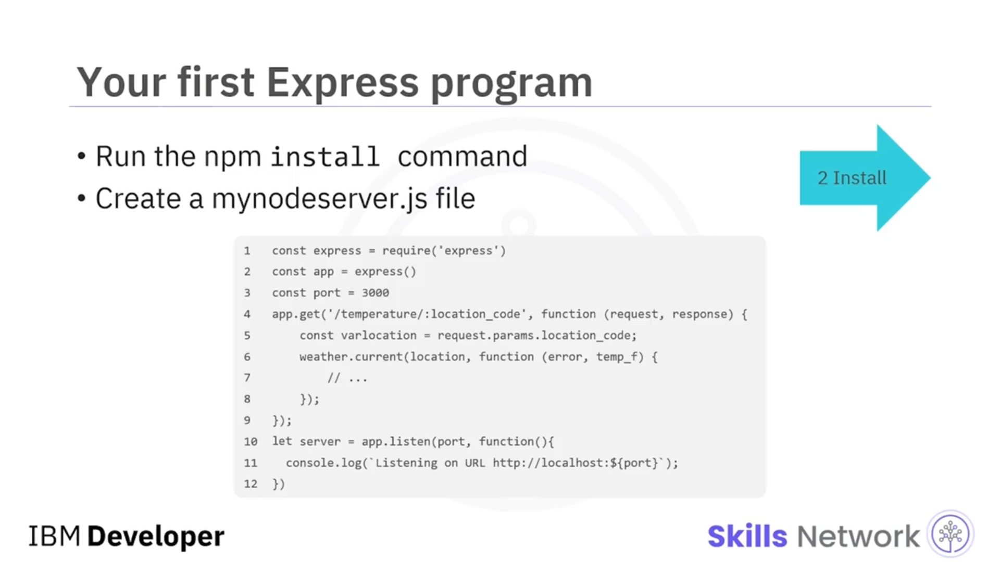
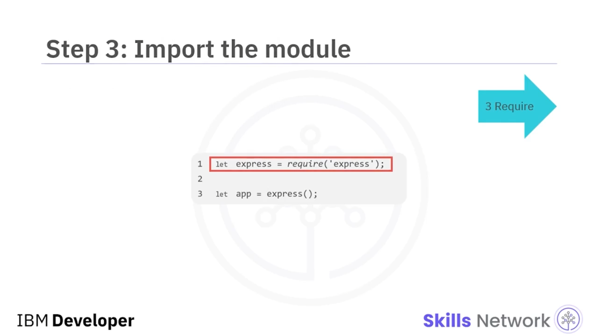
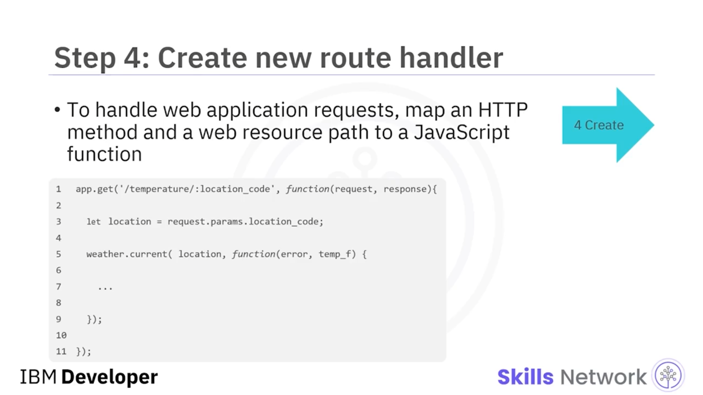
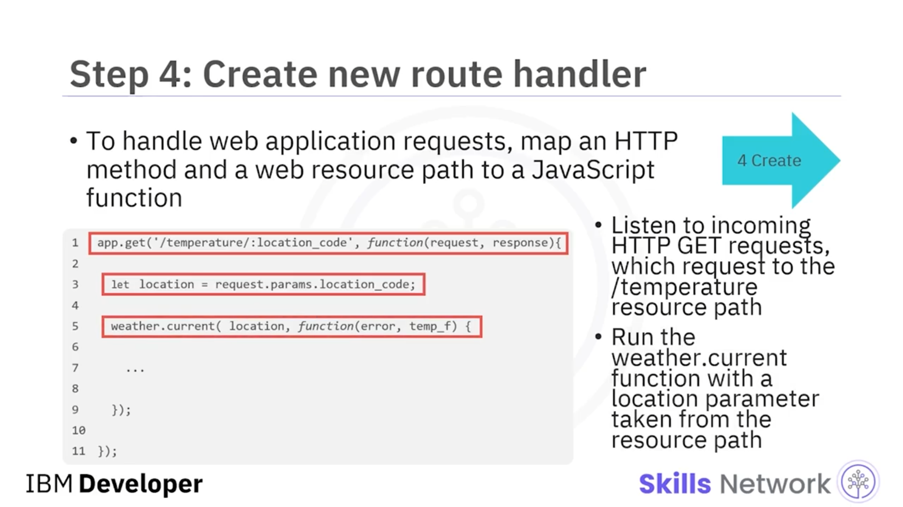
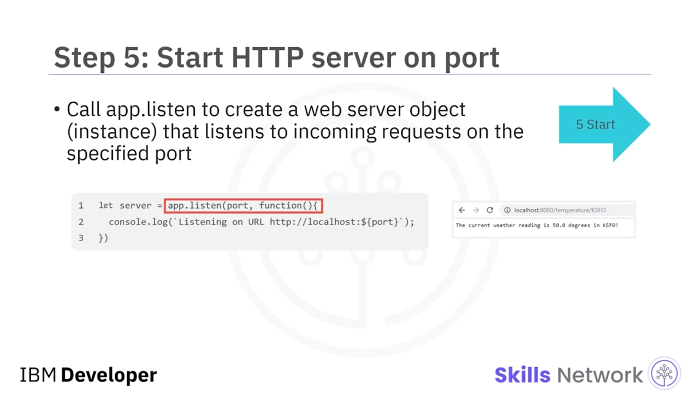
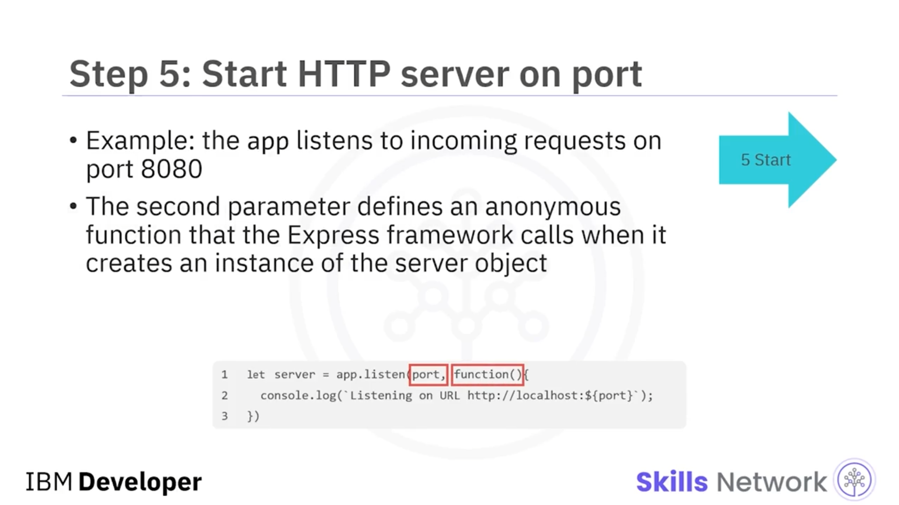
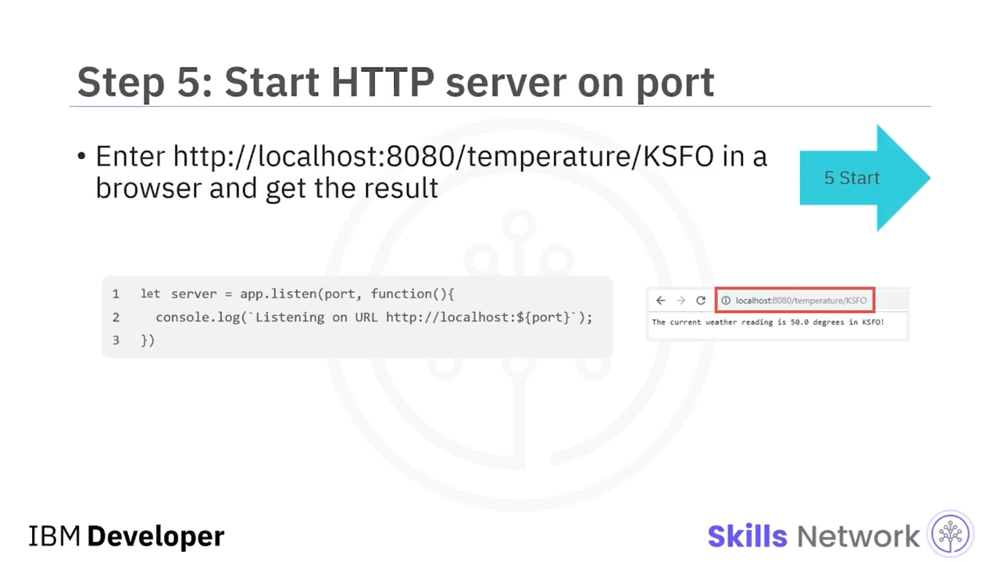
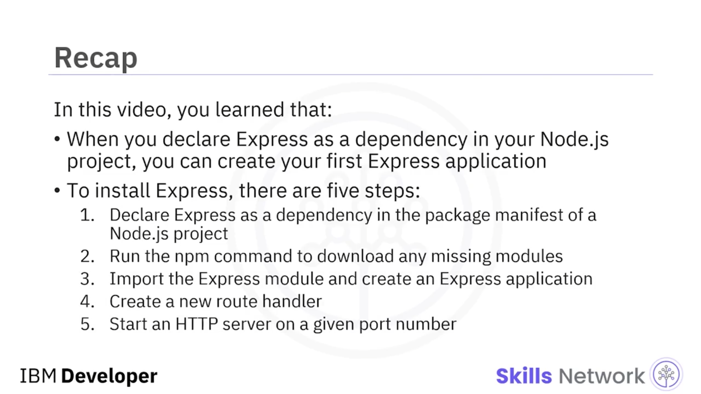

## 🌱 Your First Express Web Application

Your First Express Web Application uygulamanıza hoş geldiniz. Bu videoyu izledikten sonra, Express kullanarak bir uygulama oluşturabilecek ve Express’i yüklemek için beş adımı tanımlayabileceksiniz.

Express ile çalışmak için bu beş adımı izleyin:

1. Express’i Node.js projenizin paket bildiriminde ( *package manifest* ) bir bağımlılık ( *dependency* ) olarak tanımlayın.
2. Eksik modülleri indirmek için `npm` komutunu çalıştırın.
3. Express modülünü içe aktarın ( *import* ) ve bir Express uygulaması oluşturun.
4. Yeni bir rota işleyicisi ( *route handler* ) oluşturun.
5. Belirli bir port numarası üzerinde bir **Hiper Metin Aktarım Protokolü (HTTP)** sunucusu başlatın.

Express’i Node.js projenizde bir bağımlılık olarak tanımlayıp eksik modülleri indirdiğinizde, proje klasörünüzde bir `mynodeserver.js` dosyası oluşturabilirsiniz.

---

## 🧩 İlk Express Programınızla Kodlamaya Başlama

Artık ilk Express programınızla kodlamaya başlayabilirsiniz. Bu örnekte, mevcut hava durumu koşullarını almak için bir program yazıyorsunuz.

Express web uygulama çatısının ( *framework* ) bir kopyasını içe aktardıktan sonra, çatıdan ( *framework* ) `app` JavaScript nesnesinin bir örneğini ( *instance* ) oluşturun.

Ardından, yeni bir rota işleyicisi ( *route handler* ) oluşturun.

Uygulamanızda web uygulaması isteklerini işlemek için, bir HTTP yöntemini ve bir web kaynak yolunu ( *web resource path* ) JavaScript fonksiyonuna eşleyin.

Burada, gelen HTTP **GET** isteklerini dinliyorsunuz; bu istekler `temperature` kaynak yoluna istek yapar.

Ayrıca, `temperature` kaynak yolundan sonra gelen değeri `location_code` adlı bir değişkende saklıyorsunuz.

---

## 🧷 Path Parametreleri ve Değişken Kullanımı

Yoldaki ( *path* ) değişkene `request.params.location_code` kullanarak erişebilir ve değeri “location” adlı bir konum değişkenine saklayabilirsiniz.

`weather.current` fonksiyonunu çalıştırdığınızda, kaynak yolundan alınan `location` parametresini geçirirsiniz.

---

## 🚀 HTTP Sunucusunu Başlatma

Son adımda, belirli bir port numarası üzerinde bir HTTP sunucusu başlatırsınız.

Sunucunun bir örneğini ( *instance* ) `app` üzerinden oluşturmak için, belirtilen port üzerinde gelen istekleri dinleyen bir web sunucusu nesnesi (yani bir örnek) oluşturmak üzere `app.listen` çağrısı yapın.

`app` gelen istekleri dinler; örneğin, **8080** portunda.

İkinci parametre, Express çatısının ( *framework* ) sunucu nesnesinin bir örneğini oluşturduğunda çağırdığı anonim bir fonksiyonu tanımlar.

Sonuç için, tarayıcınızda **uniform resource locator (URL)** değerini girin.

---

## ✅ Bu Videoda Öğrendikleriniz

Bu videoda şunları öğrendiniz:

Express’i Node.js projenizde bir bağımlılık olarak tanımlayıp eksik modülleri indirdiğinizde, bir uygulama oluşturabilir ve Express ile kodlamaya başlayabilirsiniz.

Ayrıca Express’i yüklemek için beş adım vardır:

1. Express’i bir Node.js projesinin paket bildiriminde ( *package manifest* ) bir bağımlılık ( *dependency* ) olarak tanımlayın.
2. Eksik modülleri indirmek için `npm` komutunu çalıştırın.
3. Express modülünü içe aktarın ( *import* ) ve bir Express uygulaması oluşturun.
4. Yeni bir rota işleyicisi ( *route handler* ) oluşturun.
5. Belirli bir port numarası üzerinde bir HTTP sunucusu başlatın.

