## 🧭 Routing, Middleware ve Templating

Routing, Middleware ve Templating bölümüne hoş geldiniz. Bu videoyu izledikten sonra şunları yapabileceksiniz: Express’te routing’i açıklamak. Middleware’i ve nasıl kullanıldığını açıklamak. Ve Express’te şablon ( *template* ) render etmeyi açıklamak.

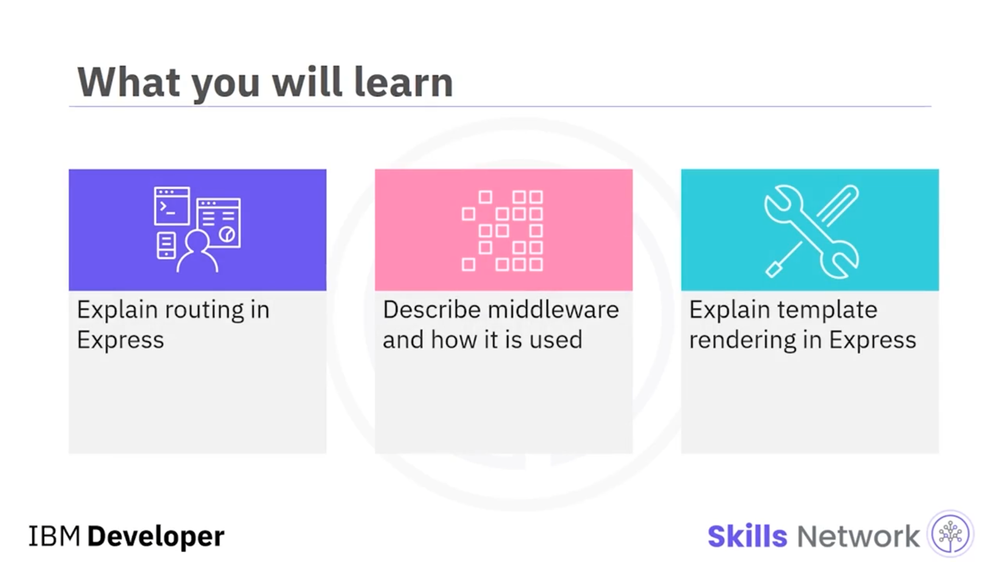

---

## 🛣️ Express’te Routing

Routing, sunucu tarafı betik yazımının ( *server-side scripting* ) önemli bir yönüdür. Aynı sunucuya giden farklı route’lara yapılan istekler sunucu tarafından işlenmelidir. İstekler  **GET** ,  **POST** , **PUT** veya **DELETE** olabilir.

Sunucu, route’ların her birine gelen her isteği işlemeli veya uygun hata mesajlarını döndürmelidir. Routing, uygulama seviyesinde ( *application level* ) veya router seviyesinde ( *router level* ) ele alınabilir.

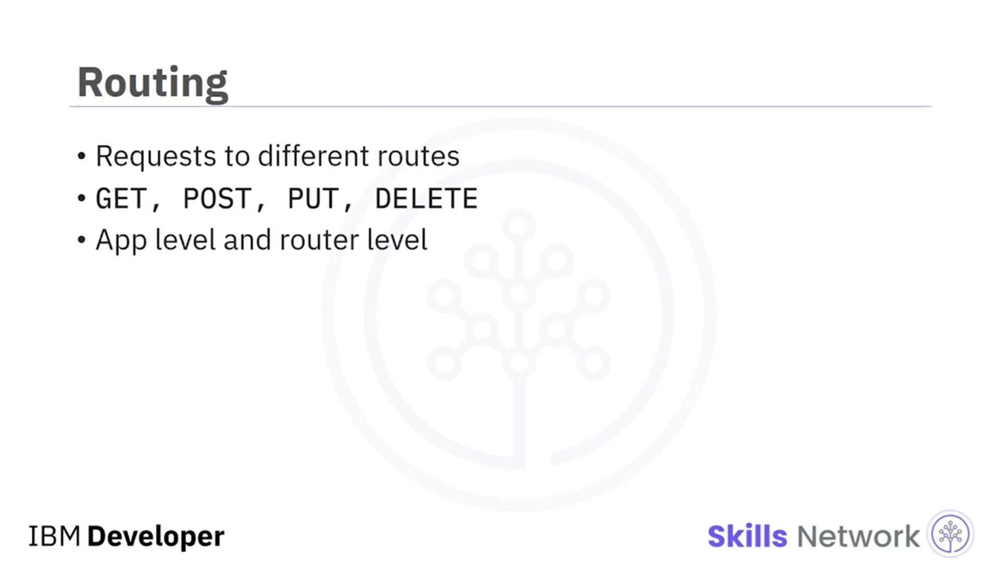

Burada, uygulama seviyesinde her route üzerindeki her metodu ayrı metotlarla ele alıyorsunuz. Bu, daha az sayıda uç nokta ( *end points* ) veya route olduğunda basittir.

Bu `App.get`, `/user/about/id` uç noktasına gelen **GET** sorgularını işler. Bu `App.post`, aynı uç noktaya gelen **POST** sorgularını işler.

Bu `App.get`, `/item/about/id` uç noktasına gelen **GET** sorgularını işler. Ve bu `App.post` da `/item/about/id` uç noktasına gelen **POST** sorgularını işler.

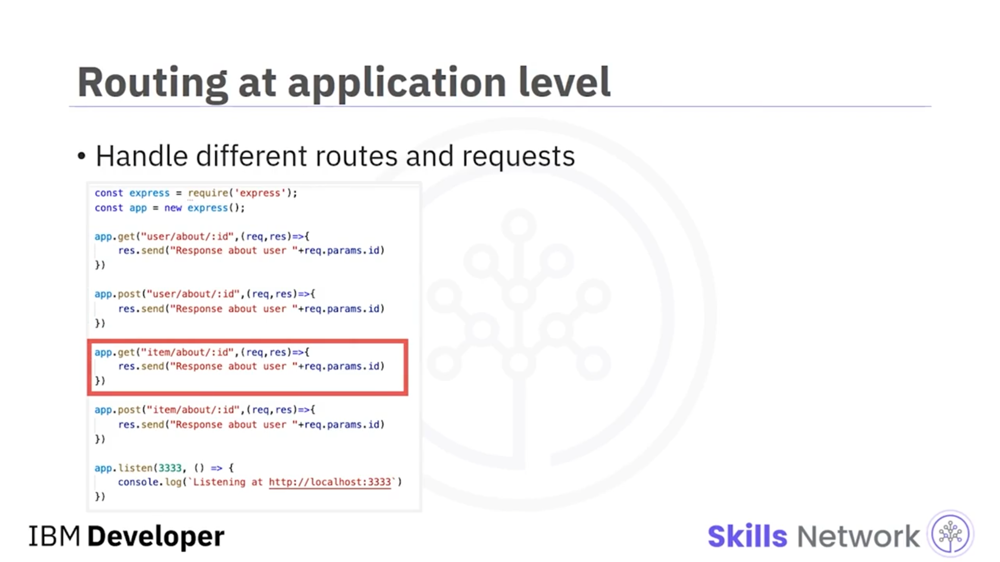

---

## 🧩 Çok Sayıda Route İçin Router Kullanımı

Ele alınacak çok sayıda route olduğunda, kodun bakımı router’larla daha iyidir. Bir router, sorgu işlemeyi dallandırmak ( *branching query handling* ) ve her sorguyu farklı şekilde yönlendirmek ( *routing* ) için kullanılır.

Burada iki router tanımlıyorsunuz. Biri bir item için, diğeri bir user içindir. Item ile gelen tüm istekler `itemRouter` tarafından işlenir. `/item/about` ve `/item/detail` route’ları ele alınır.

`/user` ile gelen tüm istekler `userRouter` tarafından işlenir. Burada `/user/about` ve `/user/detail` route’ları ele alınır.

 **Uniform resource locator (URL)** ’a bağlı olarak yanıt değişir.

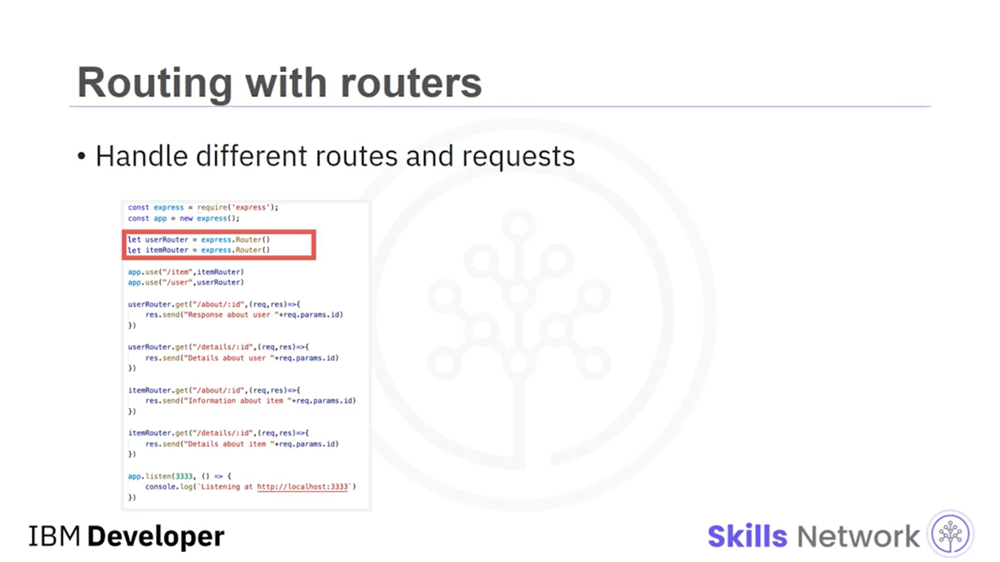

---

## 🧱 Middleware Tanımı ve Zincirleme

Middleware, *request* ve *response* nesnelerine ve `next` fonksiyonuna erişimi olan fonksiyonları içerir. `next` parametresi, fonksiyon çalıştırıldıktan sonra ne yapılacağını belirler.

Bir Express uygulaması birden fazla middleware’e sahip olabilir ve bunlar birbirine zincirlenebilir. Middleware, amaç, kullanım ve kaynağa göre kategorize edilir.

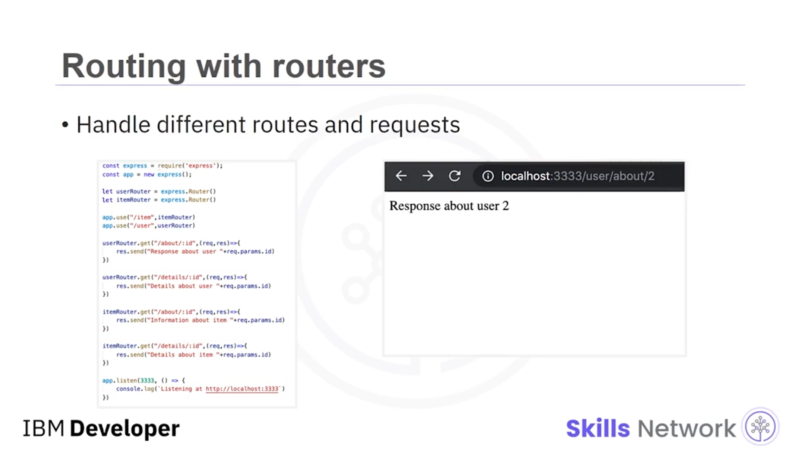

Beş tür middleware şunlardır:  **application level** ,  **router level** ,  **error handling** , **built-in** ve  **third party** .

Middleware; istekleri ayrıştırma ( *parsing requests* ), kimlik doğrulama ekleme ( *adding authentication* ) ve hataları işleme ( *handling errors* ) gibi faaliyetler için kullanışlıdır.

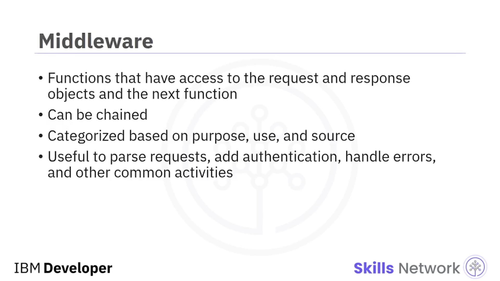

---

## 🚪 Application-level Middleware

Application-level middleware, `app.use` kullanılarak uygulamaya bağlanır. Bu sunucu uygulamasına gelen tüm istemci istekleri bu middleware üzerinden yönlendirilir.

Bu routing, kimlik doğrulama ( *authentication* ) ve oturum bilgilerini kontrol etme ( *checking session information* ) gibi faaliyetler için kullanışlıdır.

Burada, geçirilen parolayı kontrol edecek bir middleware tanımlıyorsunuz. Parola `pwd123` değerine eşitse, zamanı log’layacak ve bir sonraki mantıksal eyleme zincirlenecektir; bu eylem isteği işlemektir.

Değilse, yanıt durum kodu **402** olarak ayarlanacak ve kullanıcının giriş yapamayacağını söyleyen bir mesaj görünecektir.

Application-level middleware’i bir kapı bekçisi ( *gatekeeper* ) olarak düşünün. Uygulama sunucusuna gelen hiçbir istek onun ötesine geçemez.

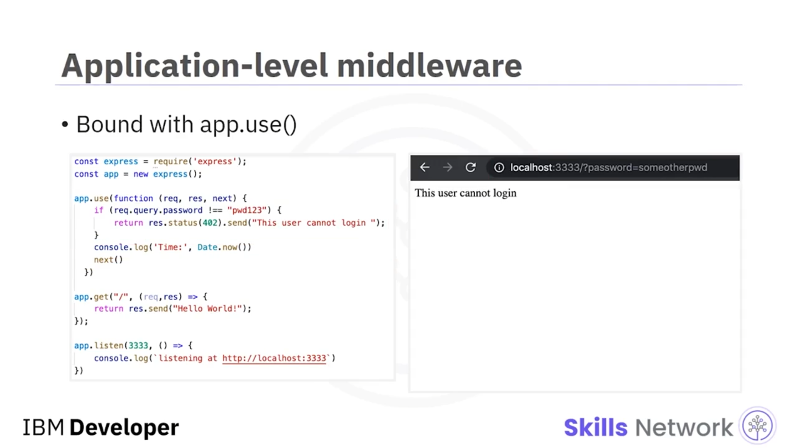

---

## 🧭 Router-level Middleware

Router-level middleware uygulamaya bağlı değildir. Bunun yerine `express.Router()` örneğine ( *instance* ) bağlanır.

Tüm isteklerin aynı middleware’den geçmesi yerine, belirli bir route için belirli bir middleware kullanabilirsiniz.

Burada, route `/user` ise isteğin user router üzerinden, route `/item` ise item router üzerinden geçmesini istiyorsunuz.

İki router’ı tanımlarsınız, router’ların kullanacağı middleware fonksiyonunu ve sonra ne olacağını tanımlarsınız ve ardından uygulama route’larını her router’a bağlarsınız.

Yanıt, istemci tarafındaki istek route’una bağlı olarak değişecektir.

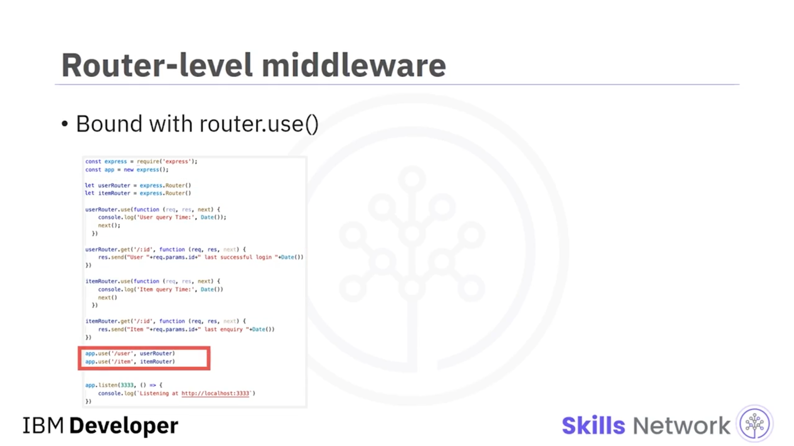

---

## 🧯 Error-handling Middleware

Error-handling middleware, tüm uygulamaya veya belirli router’lara bağlanabilir.

Error-handling middleware her zaman dört argüman alır:  **error** ,  **request** , **response** ve zincirleneceği `next` fonksiyonu.

`next` parametresini kullanmasanız bile, yine de metot imzasında ( *method signature* ) tanımlamanız gerekir.

Bu, application-level error-handling middleware’e bir örnektir. User id  **1** ’e erişilirse, bunun admin kullanıcı olduğunu söyleyen bir hata fırlatılır ( *error is thrown* ).

Bu hata middleware tarafından ele alınır ve **500** durum kodu ile bir yanıt döndürür.

Diğer tüm kullanıcılar için istek sorunsuz şekilde işlenir ve **Hello User Id** mesajı görüntülenir.

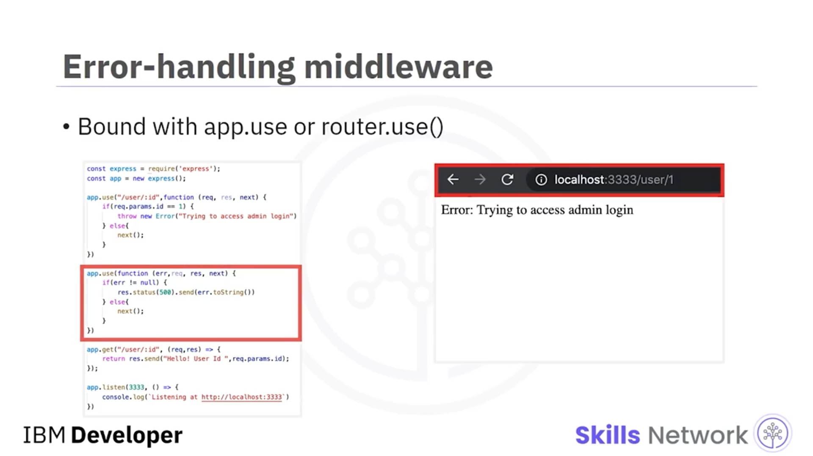

---

## 🧩 Built-in Middleware

Built-in middleware, tüm uygulamaya veya belirli router’lara bağlanabilir.

Built-in middleware; sunucudan **hypertext markup language (HTML)** sayfaları render etmek, ön uçtan gelen **JavaScript Object Notation (JSON)** girdisini ayrıştırmak ve çerezleri ( *cookies* ) ayrıştırmak gibi faaliyetler için kullanışlıdır.

Bu, sunucu tarafında statik HTML sayfalarını ve görselleri render etmek için kullanılan statik middleware’e bir örnektir.

Burada application seviyesinde, statik dosyaların `cad220_staticfiles` dizininden render edilebileceğini tanımlıyorsunuz.

Sağ tarafta, bu dizinden render edilen HTML’i görüyorsunuz. URL’nin yalnızca sunucu adresi ve port numarasını, ardından dosya adını içerdiğine dikkat edin.

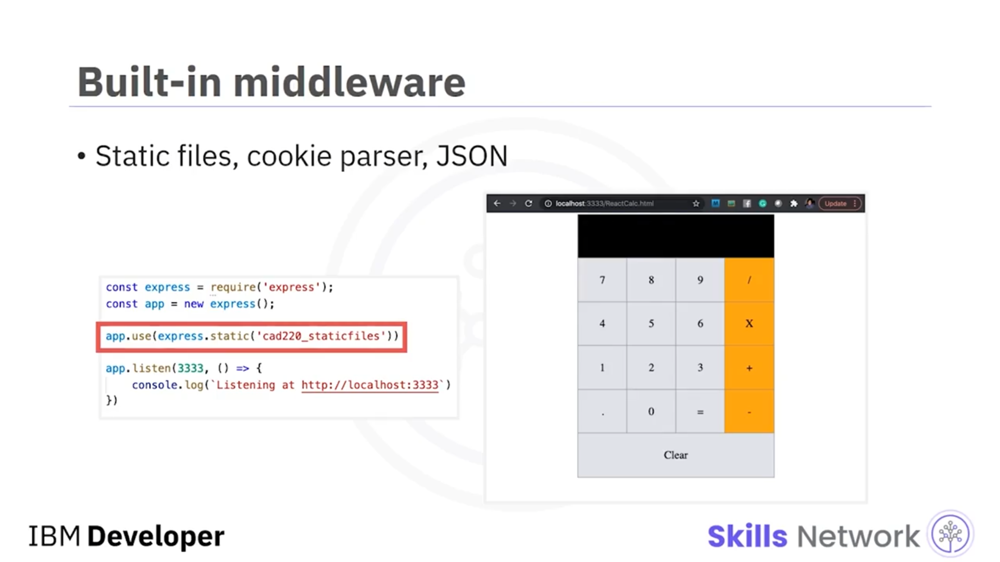

---

## 🧩 Kendi Middleware’inizi Yazma ve Third-party Middleware

Kendi middleware’inizi tanımlayabilir veya `npm install` ile kullanılabilir hale gelen third-party middleware kullanabilirsiniz. Node.js açık kaynak olduğu için, kurulup kullanılabilecek çok sayıda seçenek vardır.

Middleware oluşturmak basittir. Üç parametre alan bir fonksiyondur:  *request* , *response* ve `next`.

Bu üç parametreyi alan bir metot tanımlayabilir ve sonra bunu `app.use` veya `router.use` ile bağlayabilirsiniz.

Middleware’in zincirlenme sırası, `.use` metodunun onları bağlamak için kullanıldığı sıraya bağlıdır.

Burada `myLogger` adlı bir middleware oluşturuyor ve uygulamanın bunu kullanmasını sağlıyorsunuz.

Render edilen çıktı, isteğin alındığı zamanı içerir.

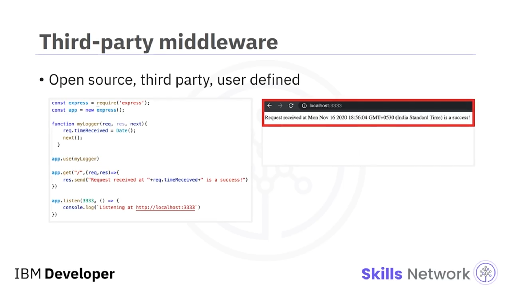

---

## 🧾 Template Rendering

Template rendering, sunucunun HTML şablonunda dinamik içeriği doldurabilme yeteneğidir.

Bu örnek, sunucudan React bileşenlerini render eden `express-react-views` kullanır.

View engine özelliğini ayarlarsınız; bu,  *views* ’unuzdan HTML oluşturmakla sorumludur. *Views* JSX kodudur.

Views, `myviews` adlı bir dizindedir. View engine, `myviews` dizininde `index` adlı bir JSX dosyası arayacak ve `name` özelliğini ( *property* ) ona geçecektir.

Render edilen çıktı, kullanıcının adını içerecektir. Bu örnek, iki kullanıcı için çıktıyı gösterir.

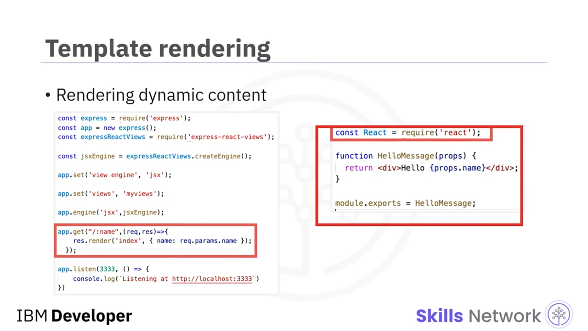

---

## ✅ Bu Videoda Öğrendikleriniz

Bu videoda şunları öğrendiniz:

Router’lar, sorgu işlemeyi dallandırmak için kullanılır. Middleware’in beş türü  **application level** ,  **router level** ,  **error handling** , **built-in** ve  **third party** ’dir.

Template rendering, sunucunun HTML şablonunda dinamik içeriği doldurabilme yeteneğidir.

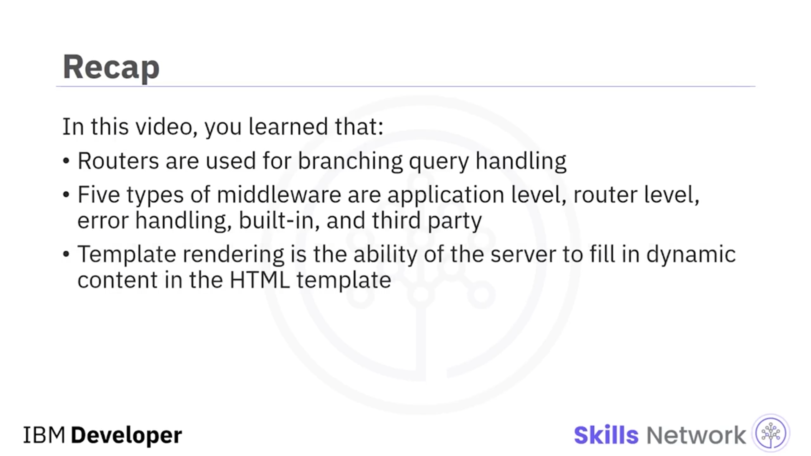
