## 🔐 Node.js’te Authentication ve Authorization

Node.js’te authentication ve authorization’ı inceleyen bu videoya hoş geldiniz. Bu videoyu izledikten sonra şunları yapabileceksiniz: Node.js’te authentication ihtiyacını ve bir kullanıcının kimliğini nasıl doğruladığını açıklamak. Oturum tabanlı authentication’ı ( *session-based authentication* ) açıklamak; buna session ID’lerin oluşturulması, saklanması ve yok edilmesi dahildir. Ayrıca token tabanlı authentication ve passwordless authentication’ı karşılaştırmak; JWT’lerin ve açık/özel anahtar ( *public/private key* ) çiftlerinin kullanımını vurgulamak.

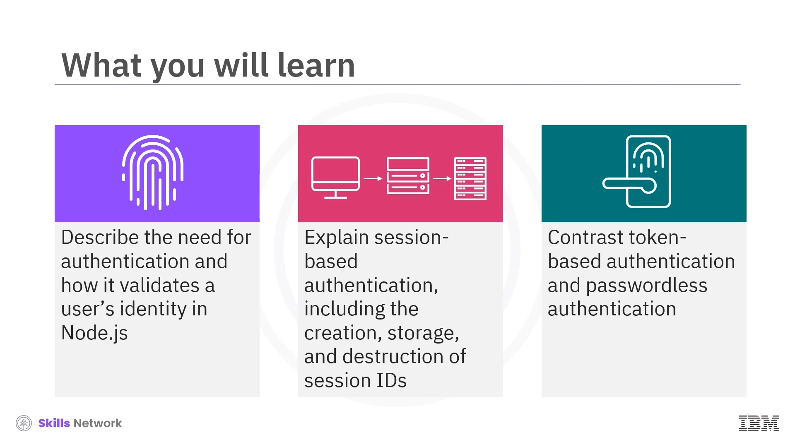

Node.js ile kullanıcıların kayıt olup alışveriş yaptığı bir e-ticaret platformu tasarladığınızı hayal edin. Ancak platformun authentication ve authorization mekanizmalarının yeterince sağlam olmadığını fark ediyorsunuz; kullanıcı verileri risk altında olabilir ve yetkisiz erişim mümkün hale gelebilir. Bu, veri ihlalleri ve müşterilerin güveninin kaybedilmesi gibi ağır sonuçlara yol açabilir. Bu durumdan nasıl kaçınabilirsiniz?

Node.js’te authentication ve authorization kavramlarını öğrenmek; kullanıcı kimlik doğrulamasını güvence altına almak, hassas verileri korumak ve uygulamanızın güvenilirliğini ve kullanıcı memnuniyetini artırmak için kritik öneme sahiptir.

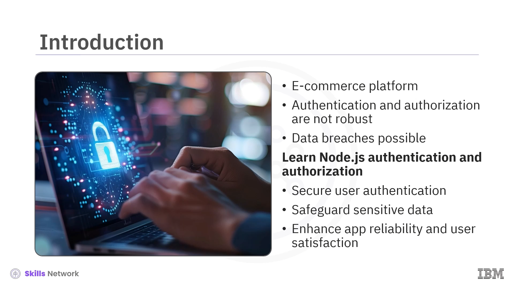

---

## 🪪 Authentication Nedir?

Authentication, bir kişinin kim olduğunu iddia ettiğini doğrulamak için kimlik bilgilerini ( *credentials* ) kontrol etme işlemidir. Bu, yalnızca yetkili kullanıcıların sistemin belirli bölümlerine erişebilmesi için uygulamaları güvence altına almanın temel bir yönüdür. Bu doğrulama sürecini uygulamanın arka ucu ( *backend* ) yürütmekten sorumludur.

Şimdi, üç popüler authentication yöntemini öğrenelim. Node.js’te üç popüler authentication yöntemi şunlardır:  *session-based* ,  *token-based* ,  *passwordless* . Şimdi her birini ayrıntılı şekilde inceleyelim.

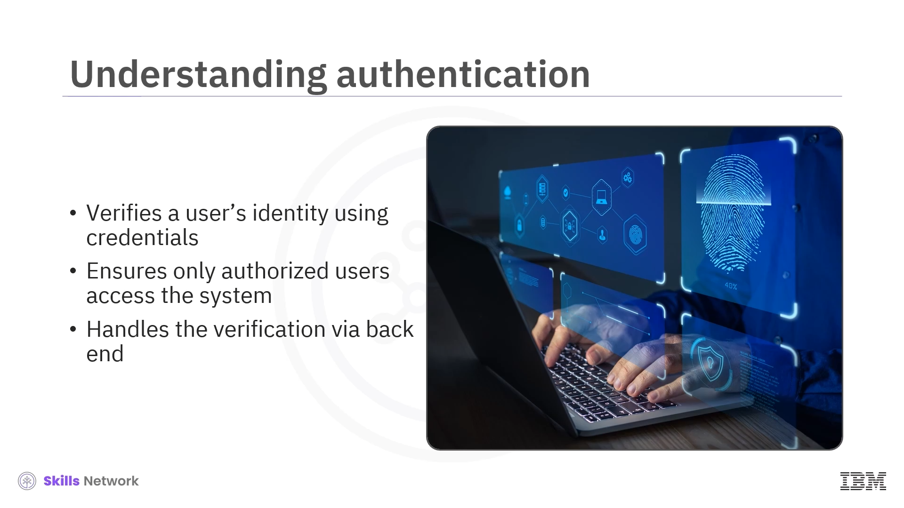

---

## 🗝️ Session-based Authentication

Session-based authentication en eski yöntemlerden biridir. Şöyle çalışır:

Kimlik bilgilerinizle giriş yaparsınız; bunlar, session ID’ye göre erişilebilir kaynakları saklayan bir veritabanına karşı doğrulanır. Geçerliyse, sunucu benzersiz, şifrelenmiş ( *encrypted* ) bir session ID oluşturur; bu ID veritabanında ve tarayıcı çerezi ( *browser cookie* ) olarak saklanır. Çıkış yaptığınızda veya belirli bir sürenin ardından session ID yok edilir; bu da hem tarayıcıdan hem veritabanından çıkış yapılmasını sağlar.

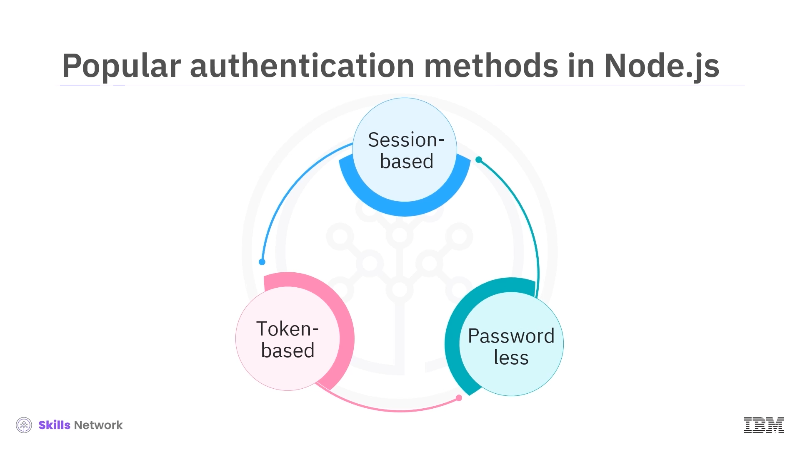

Şimdi, bir Express uygulamasında session-based authentication’ı gösteren bir kod parçasını inceleyelim. Bu örnekte kod aşağıdaki işlevleri yerine getirir:

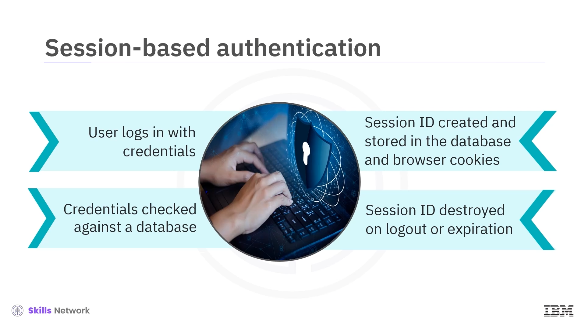

Önce bir Express uygulaması kurar ve session yönetimini yapılandırır. Ardından `express-session` middleware’ini yapılandırır; buna session verisini şifrelemek için bir gizli anahtar ( *secret key* ) ve `resave` ile `save uninitialized` gibi diğer seçenekler dahildir. Sonra login için **POST** isteklerini yönetir. Sağlanan kullanıcı adı ve parola eşleşirse, kullanıcı adını session içine kaydeder. Son olarak, kullanıcı olarak doğrulanıp doğrulanmadığınızı kontrol eder. Doğrulanmışsanız uygulama sizi karşılar, değilse giriş yapmanızı ister.

Session-based authentication’ı öğrendiğinize göre, şimdi token tabanlı güvenliğe geçelim.

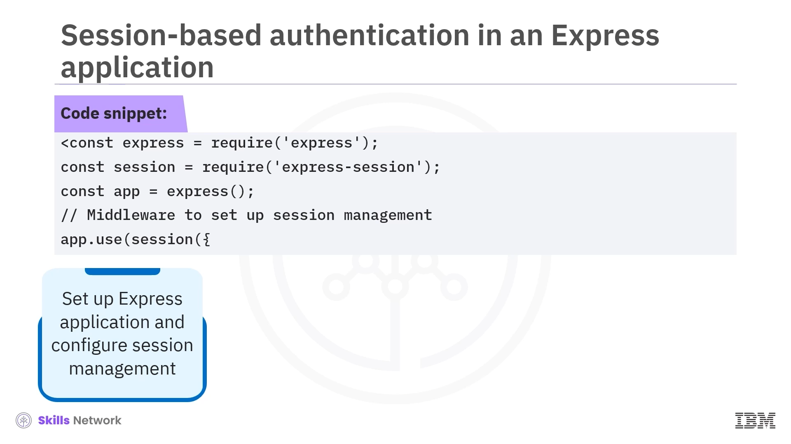

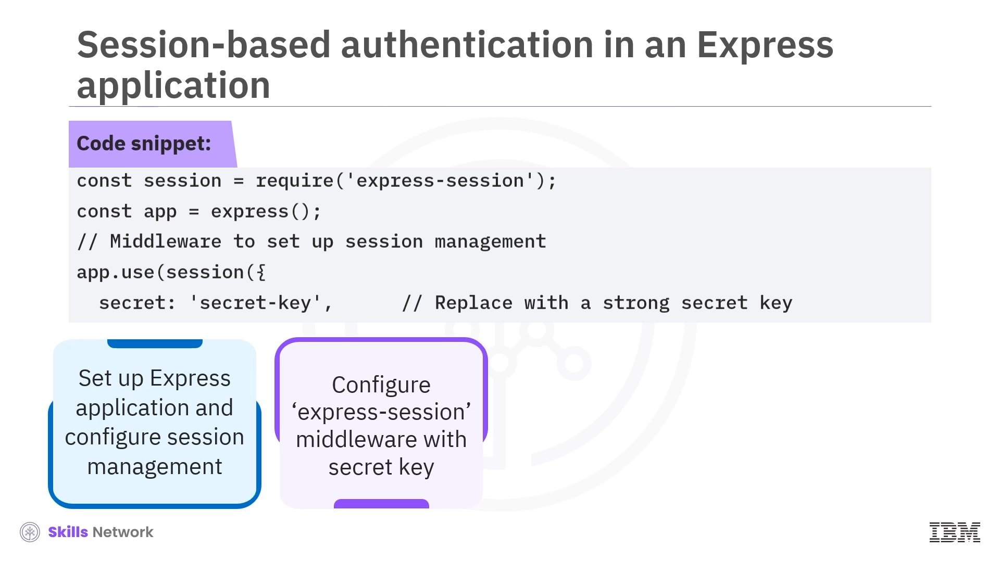

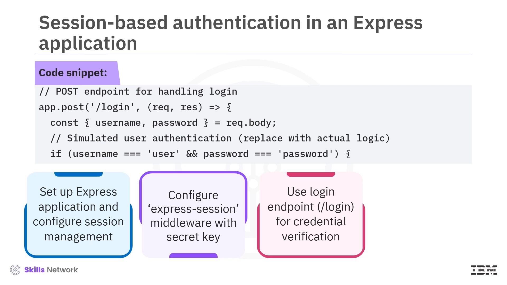

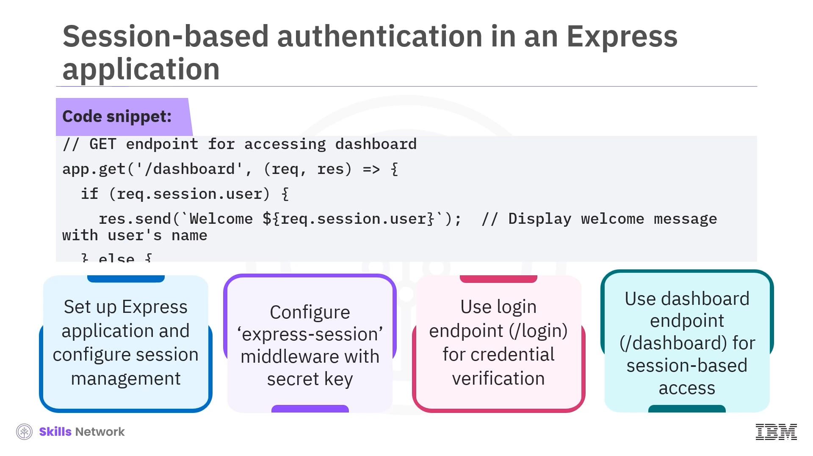

---

## 🪙 Token-based Security

Token-based security iki temel kavram içerir: authentication ve authorization.

Authentication, kimlik bilgilerinizi sağladığınız ve kullanıcı kimlik bilgilerinizi doğrulayan bir token aldığınız durumdur. Authorization, kaynaklara erişmek için token’ı kullandığınız durumdur; bu sayede kaynak sunucusu hangi kaynaklara erişmenize izin verildiğini bilir.

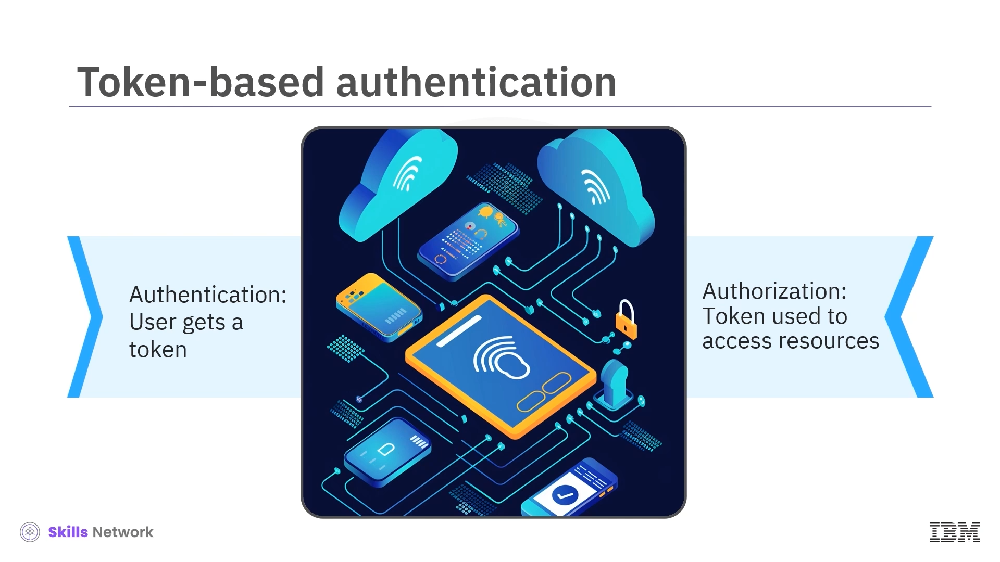

Token’lar çoğu zaman **JSON Web Token’lar (JWT)** biçimindedir. JWT üç bölümden oluşur:

Header, token türünü ve kullanılan algoritmayı içerir. Payload, kullanıcı özniteliklerini ( *claims* ) içerir; örneğin izinler ( *permissions* ) ve sona erme zamanları ( *expiration times* ). Signature, iletim sırasında token’ın bütünlüğünü ( *integrity* ) sağlar.

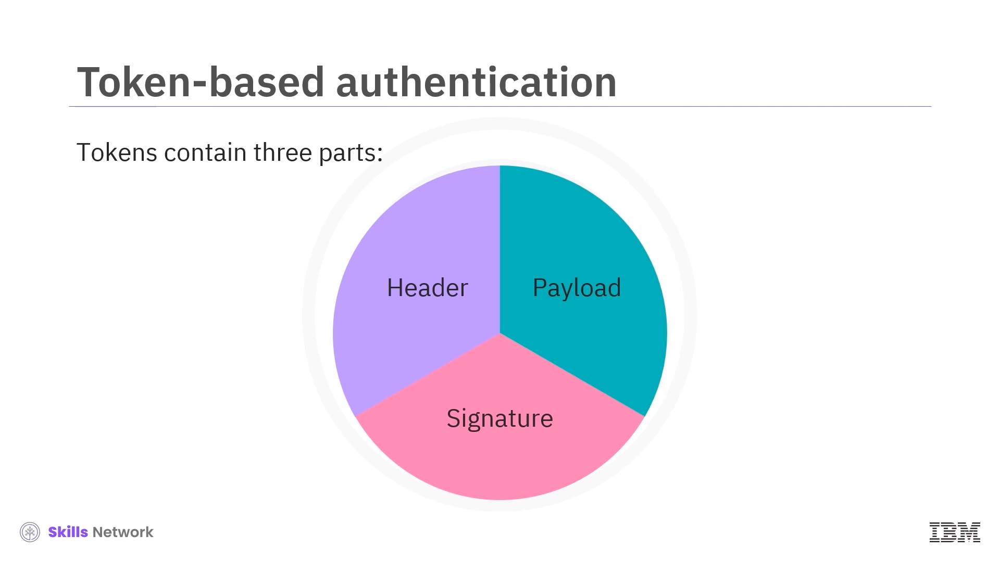

JWT, “jot” diye telaffuz edilir ve JWT olarak yazılır; imzalı JSON payload verisi oluşturmak için bir internet standardıdır.

Token-based authentication’ta tarayıcınız bir web uygulamasına erişim ister. Authentication sunucusu bir ID token ile yanıt verir; bu token istemci tarafından güvenli bir çerez ( *secure cookie* ) olarak saklanır ve authentication sağlayan web sunucusuna gönderilir.

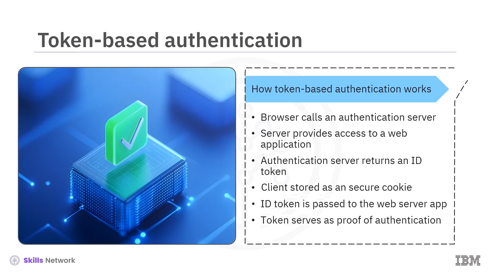

---

## 🧾 Token-based Authorization

Token-based authorization, bir web uygulaması bir API gibi korumalı bir kaynağa erişim istediğinde gerçekleşir.

Bu süreçte kullanıcı authorization sunucusunda kimliğini doğrular; ardından sunucu, istemciye geri gönderilen ve saklanan bir access token üretir. Her HTTP isteğinde token, kaynak API sunucusuna iletilir ve gömülü izin detaylarını taşır; böylece authorization sunucusunu sorgulama ihtiyacını ortadan kaldırır.

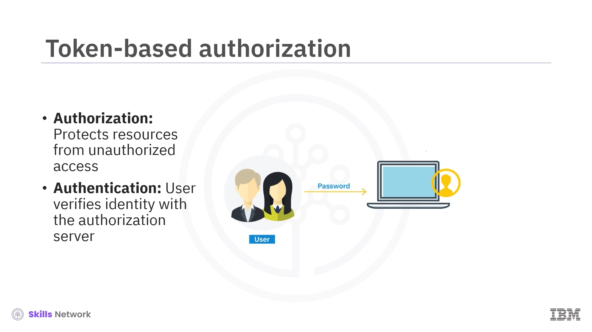

Token çalınsa bile, şifreleme nedeniyle kimlik bilgilerini açığa çıkarmaz.

Şimdi, bir Express uygulamasında token-based authentication örneğini göreceksiniz. Bu örnekte kod aşağıdaki işlevleri yerine getirir:

Önce kod, JSON isteklerini ayrıştırmak için BodyParser gibi middleware’lerle bir Express uygulaması yapılandırır. Ardından kullanıcı girişi için **POST** isteklerini yönetir. Kimlik bilgileri geçerliyse, kullanıcı adını içeren bir JWT veya token üretir; gelen isteklerin authorization header’ında JWT olup olmadığını kontrol eder. Varsa token’ı doğrular ve erişim izni vermek için kullanıcı adını çıkarır.

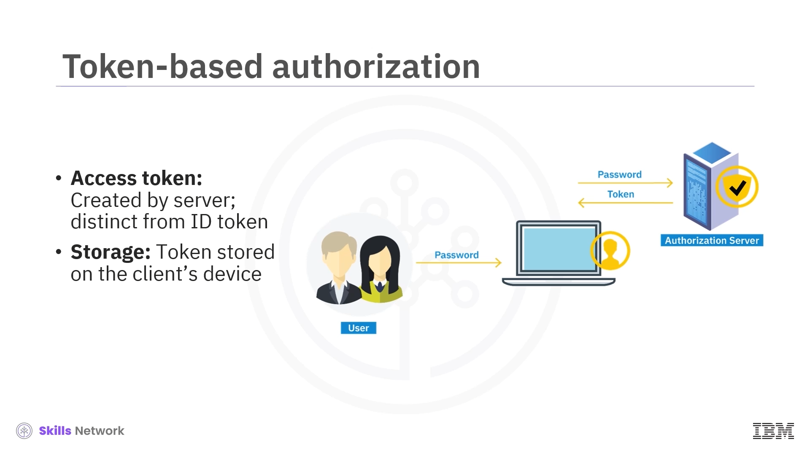

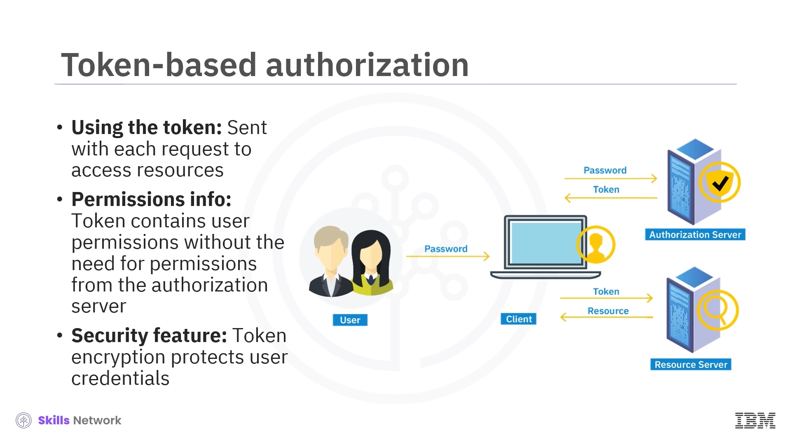

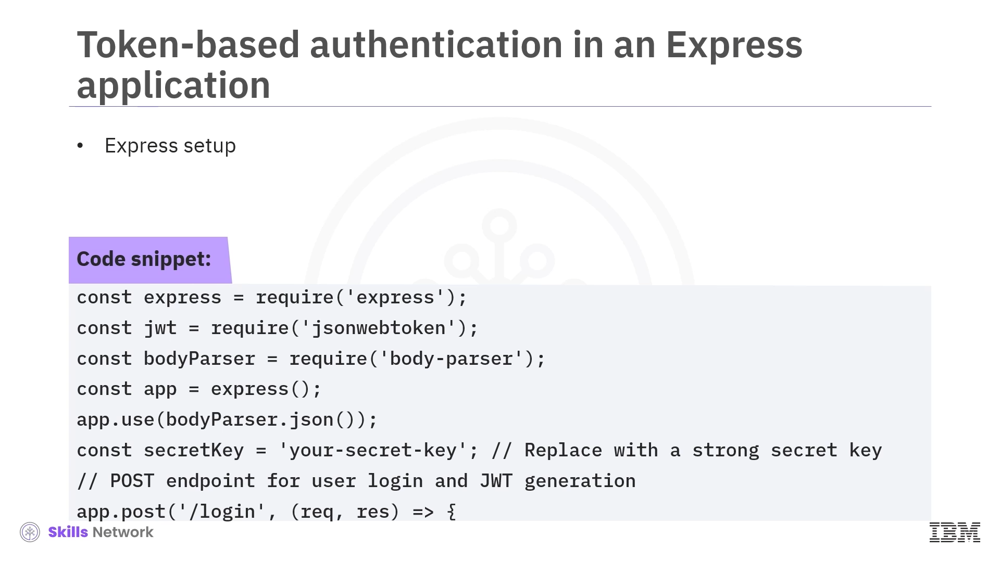

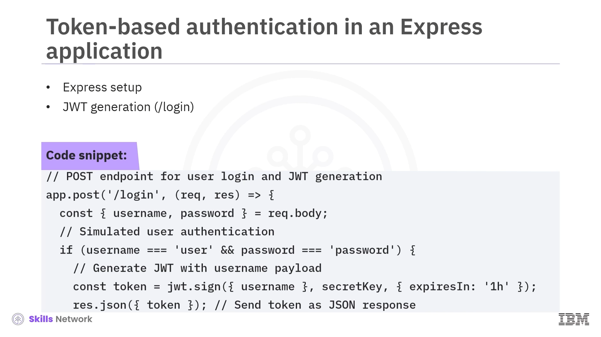

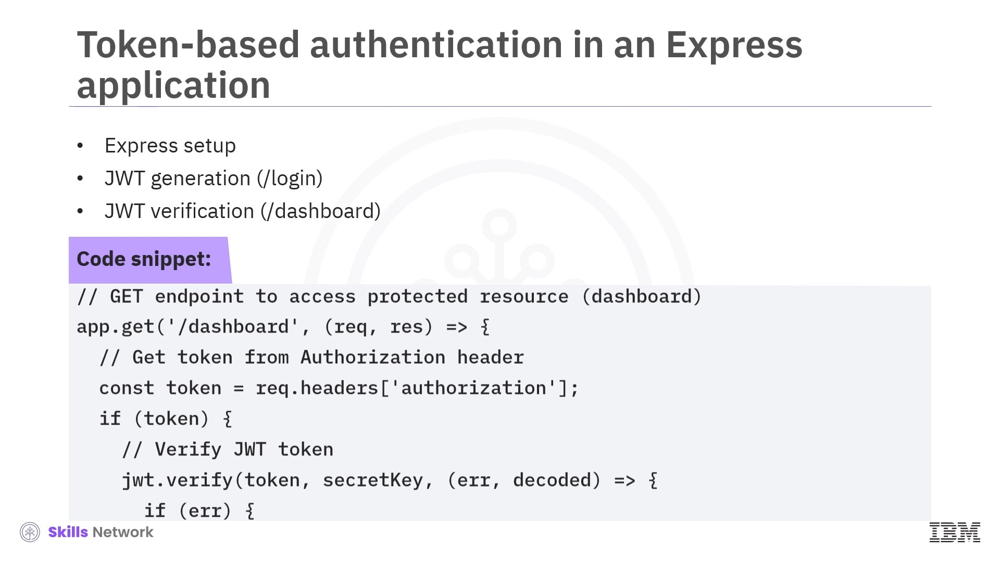

---

## 🔑 Passwordless Authentication

Passwordless authentication, geleneksel parolalara olan ihtiyacı ortadan kaldırır; biyometri, e-postanıza gönderilen  *magic link* ’ler veya mobil cihazınıza gönderilen tek kullanımlık parolalar ( *one-time passcodes* ) gibi yöntemleri kullanır.

Bu yaklaşım sıklıkla parola kurtarma sistemlerinde kullanılır. Açık anahtar ve özel anahtar şifrelemesine ( *public/private key encryption* ) dayanır.

Kayıt olduğunuzda, cihazınız kimliğinize bağlı bir özel-açık anahtar çifti üretir. Açık anahtar veriyi şifrelemek için kullanılır ve herkes tarafından erişilebilir; özel anahtar ise cihazınızda güvenli şekilde saklanır ve verinin şifresini çözer ( *decrypts* ).

Giriş sırasında uygulama bir login challenge oluşturur, bunu açık anahtarla şifreler ve erişimi yetkilendirmek için özel anahtarınızla şifresini çözer.

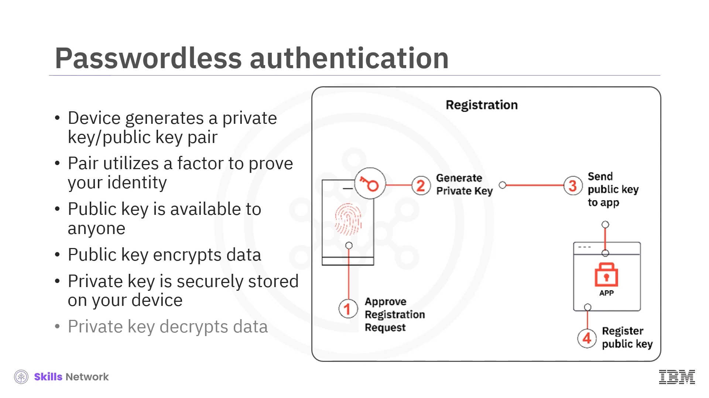

Şimdi, passwordless authentication’ın bir Express uygulamasında nasıl uygulandığını göreceksiniz. Bu örnekte kod aşağıdaki işlevleri yerine getirir:

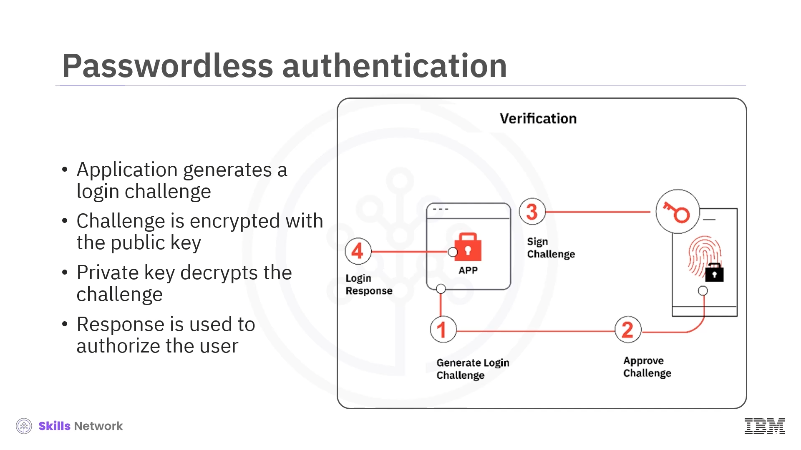

Kod, JSON isteklerini ayrıştırmak için middleware veya body parser ile bir Express uygulaması kurar. Ardından kullanıcıların erişim talep etmek için e-postalarını sağladığı **POST** isteklerini yönetir. Sonra altı haneli bir doğrulama kodu üretir ve bunu bellek içi ( *in-memory* ) bir nesnede saklar. Ardından alınan kodu saklanan kodla karşılaştırarak doğrulayan **POST** isteklerini yönetir. Eşleşirse kullanıcıya erişim verir. Aksi halde erişimi reddeder.

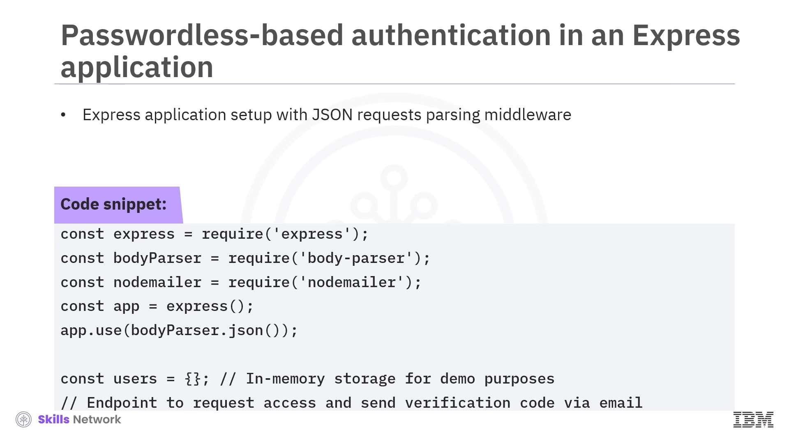

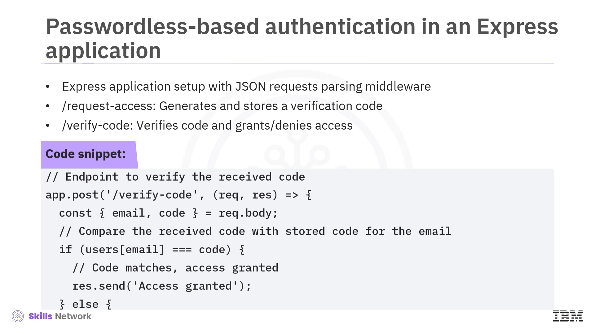

---

## ✅ Bu Videoda Öğrendikleriniz

Bu videoda şunları öğrendiniz: Authentication, kimlik bilgilerini kullanarak kimliğinizi doğrular; kim olduğunuzu iddia ettiğinizi doğrulamak için doğrulama yapar.

Session-based authentication, veritabanında ve istemcinin tarayıcısında saklanan bir session ID oluşturmak için kimlik bilgilerini kullanır. Çıkış yaptığınızda session ID yok edilir.

Token-based authentication, çoğunlukla JWT olan access token’ları kullanır; bu token’lar, sunucu ile istemci arasında aktarılan verilerle birlikte iki taraf arasında iletilir.

Passwordless authentication, istemci ile sunucu arasında parola olmadan aktarılan verileri şifrelemek ve şifresini çözmek için açık-özel anahtar çiftlerini kullanır.

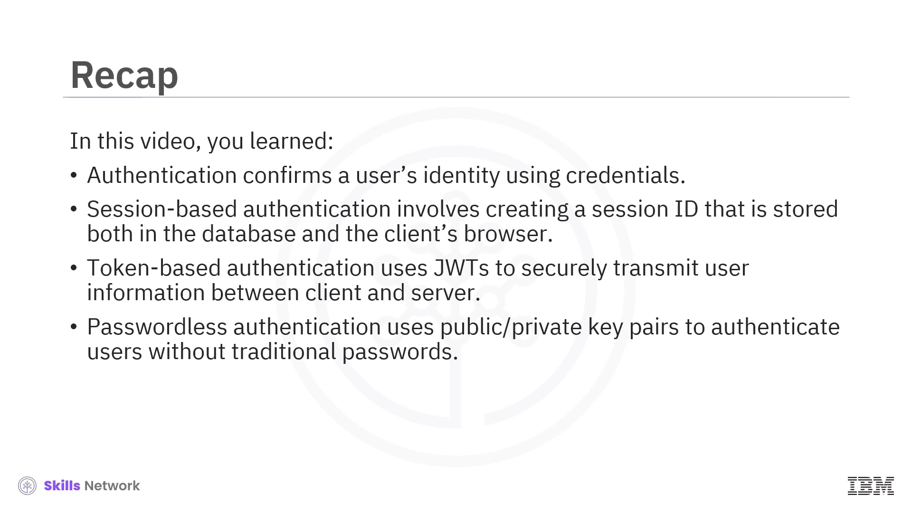
