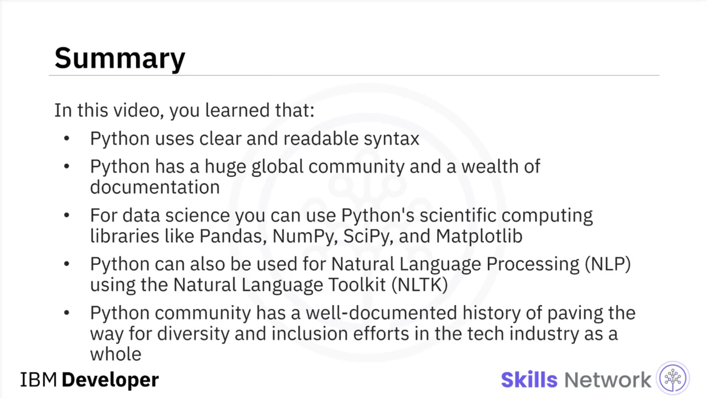

# 🐍 Python’a Giriş

### 🎯 Python’a giriş ve öğrenme hedefleri

“Python’a Giriş”e hoş geldiniz. Bu videoyu izledikten sonra Python’u kimlerin kullandığını belirleyebilecek, Python’u kullanmanın faydalarını listeleyebilecek ve Python topluluğunun çeşitlilik ve kapsayıcılık çabalarını tanımlayabileceksiniz.

Python son derece güçlü bir programlama dilidir. Veri bilimi endüstrisinde en yaygın kullanılan ve en popüler programlama dilidir.

2019 Kaggle Veri Bilimi ve Makine Öğrenimi Anketi’ne göre, dünya çapında 10.000’den fazla katılımcının dörtte üçü Python’u düzenli olarak kullandığını bildirmiştir.

Glassdoor, 2019 yılında listelenen veri bilimi pozisyonlarının %75’inden fazlasının iş tanımlarında Python bulunduğunu bildirmiştir.

Bir veri bilimci adayı ilk olarak hangi dili öğrenmeli diye sorulduğunda, veri bilimcilerin çoğu Python cevabını vermektedir.

---

### 👥 Python’u kimler kullanıyor?

Python’u kullanan kişilerden başlayalım. Zaten programlama biliyorsanız, Python sizin için harikadır; çünkü açık ve okunabilir bir sözdizimine sahiptir.

Diğer dillerde yazdığınız aynı programları Python kullanarak daha az kodla geliştirebilirsiniz.

Yeni başlayanlar için de Python, geniş küresel topluluğu ve zengin dokümantasyonu sayesinde başlanacak iyi bir dildir.

2019 yılında yapılan çeşitli anketler, dünya genelindeki veri profesyonellerinin %80’inden fazlasının Python kullandığını ortaya koymuştur.

---

### 🧰 Python’un kullanım alanları ve kütüphaneleri

Python; veri bilimi, yapay zeka ve makine öğrenimi, web geliştirme ve Raspberry Pi gibi Nesnelerin İnterneti (IoT) cihazları da dahil olmak üzere birçok alanda kullanışlıdır.

Python’u yoğun biçimde kullanan büyük kuruluşlara IBM, Wikipedia, Google, Yahoo!, CERN, NASA, Facebook, Amazon, Instagram, Spotify ve Reddit örnek verilebilir.

Python, küresel bir topluluk tarafından geniş ölçüde desteklenmekte ve Python Yazılım Vakfı ( *Python Software Foundation* ) tarafından yönlendirilmektedir.

Python, birçok farklı türde probleme uygulanabilen, üst düzey ( *high-level* ), genel amaçlı bir programlama dilidir.

Veritabanları, otomasyon, web kazıma, metin işleme, görüntü işleme, makine öğrenimi ve veri analitiği ile sınırlı olmamak üzere pek çok farklı göreve uygun araçlar sağlayan büyük bir standart kütüphaneye sahiptir.

Veri bilimi için, Python’un bilimsel hesaplama kütüphanelerinden `Pandas`, `NumPy`, `SciPy` ve `Matplotlib`’i kullanabilirsiniz.

Yapay zeka için ise `TensorFlow`, `PyTorch`, `Keras` ve `Scikit-learn` gibi kütüphanelere sahiptir.

---

### 🤝 Doğal dil işleme, çeşitlilik ve kapsayıcı Python topluluğu

Python, *Natural Language Toolkit* (`NLTK`) kullanılarak Doğal Dil İşleme (*Natural Language Processing* – NLP) için de kullanılabilir.

Python için bir diğer önemli çekicilik, Python topluluğunun teknoloji sektörünün geneli için çeşitlilik ve kapsayıcılık çabalarına öncülük ettiğinin iyi belgelenmiş bir geçmişe sahip olmasıdır.

Python dili, hem çevrimiçi hem de yüz yüze Python topluluklarında herkes için güvenliği ve kapsayıcılığı sağlamayı amaçlayan ve Python Yazılım Vakfı tarafından uygulanan bir davranış kurallarına ( *code of conduct* ) sahiptir.

`PyLadies` gibi topluluklar, Python öğrenmekle ilgilenen kişiler için güvenli ve kapsayıcı ortamlarda alanlar yaratmayı amaçlamaktadır.

`PyLadies`, daha fazla kadının Python açık kaynak topluluğunda etkin katılımcılar ve liderler haline gelmesine yardımcı olmaya odaklanan uluslararası bir mentorluk grubudur.

## Özet

Bu videoda, Python’un açık ve okunabilir bir sözdizimi kullandığını öğrendiniz. Python’un büyük bir küresel topluluğu ve zengin bir dokümantasyonu vardır.

Veri bilimi için, Python’un `Pandas`, `NumPy`, `SciPy` ve `Matplotlib` gibi bilimsel hesaplama kütüphanelerini kullanabilirsiniz.

Python, *Natural Language Toolkit* (`NLTK`) kullanılarak Doğal Dil İşleme (NLP) için de kullanılabilir.

Python topluluğu, teknoloji endüstrisinin geneli için çeşitlilik ve kapsayıcılık çabalarına öncülük etme konusunda iyi belgelenmiş bir geçmişe sahiptir.

