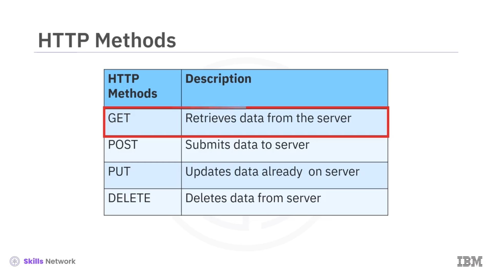

# 🌐 REST API'ler & HTTP İstekleri - Bölüm 1

## 🎯 HTTP Protokolüne Giriş

Bu videoda `HTTP` protokolünü ele alacağız. Özellikle *Uniform Resource Locator* ( *URL* ), *Request* ve *Response* konularını tartışacağız.

Önceki bölümde  *REST API* 'lere kısaca değinmiştik. `HTTP` protokolü, web üzerinden bilgi aktarımı için genel bir protokol olarak düşünülebilir. Bu, birçok farklı türde *REST API*yi de kapsar.

## 🔁 REST API'ler ve HTTP Mesajları

Unutmayın,  *REST API* 'ler bir istek ( *request* ) göndererek çalışır ve bu istek bir `HTTP` mesajı aracılığıyla iletilir. `HTTP` mesajı genellikle bir `JSON` dosyası içerir.

## 🖥️ HTTP ve İstemci–Sunucu İletişimi

İstemci olarak bir web sayfasını kullandığınızda, tarayıcınız sayfanın barındırıldığı sunucuya bir `HTTP` isteği (`HTTP request`) gönderir. Sunucu, varsayılan olarak `index.html` dosyasını kullanarak istenen kaynağı bulmaya çalışır.

İsteğiniz başarılı olursa, sunucu nesneyi bir `HTTP` yanıtı (`HTTP response`) içinde istemciye gönderir; bu yanıt, kaynağın türü, kaynağın uzunluğu ve diğer bilgiler gibi öğeleri içerir.

Web sunucusunun altındaki tablo, web sunucusunda saklanan kaynakların bir listesini gösterir. Bu örnekte bir HTML dosyası, bir `png` görüntüsü ve bir `txt` dosyası vardır. Bilgi için istek yapıldığında, web sunucusu istenen bilgiyi, yani bu dosyalardan birini gönderir.

## 🔗 URL (Uniform Resource Locator)

Bir *Uniform Resource Locator* ( *URL* ), web üzerindeki kaynakları bulmanın en yaygın yoludur. Bir `URL`'yi üç parçaya ayırabiliriz.

Önce *scheme* vardır: Bu, protokoldür ve bu laboratuvar için her zaman `http://` olacaktır.

*Internet address* ya da  *Base URL* : Bu, konumu bulmak için kullanılır; örnek olarak `www.ibm.com` ve `www.gitlab.com` verilebilir.

Ve son olarak  *route* : Bu, web sunucusundaki konumdur; örneğin: `/images/IDSNlogo.png`.

## 📨 HTTP İstek (Request) Süreci

İstek ( *request* ) ve yanıt ( *response* ) sürecini gözden geçirelim. Aşağıdaki, `GET` istek yöntemi ( *request method* ) için bir istek mesajı örneğidir. Kullanabileceğimiz başka `HTTP` yöntemleri de vardır.

Başlangıç satırında ( *start line* ) `GET` yöntemi yer alır. Bu bir `HTTP` yöntemidir. Bu durumda `index.html` dosyasını talep etmektedir.

 *Request header* , bir `HTTP` isteğiyle birlikte ek bilgiler taşır. `GET` yönteminde *Request header* boştur. Bazı isteklerin bir *body* (gövde) kısmı vardır; istek gövdesine ( *request body* ) daha sonra bir örnek vereceğiz.

## 📩 HTTP Yanıtı (Response) Süreci

Aşağıdaki tablo, yanıtı ( *response* ) temsil eder. Yanıtın başlangıç satırı ( *response start line* ), sürüm numarasını ve ardından açıklayıcı bir ifadeyi içerir. Bu durumda `HTTP/1.0`, başarı anlamına gelen bir durum kodu ( *status code* ) `200` ve açıklayıcı ifade `OK` yer alır. Durum kodları hakkında daha fazla bilgiyi daha sonra ele alacağız.

*Response header* bilgi içerir. Son olarak, istenen dosyayı içeren *response body* vardır; bu örnekte bu bir HTML belgesidir.

## 🔢 HTTP Durum Kodları

Şimdi diğer durum kodlarına ( *status codes* ) bakalım. Aşağıdaki tabloda bazı durum kodu örnekleri gösterilmiştir.

Ön ek, sınıfı belirtir; örneğin, `100`'lü kodlar bilgilendirici yanıtlardır; `100` şimdiye kadar her şeyin yolunda olduğunu gösterir.

`200`'lü kodlar başarılı yanıtları ifade eder: Örneğin, `200` isteğin başarılı olduğunu belirtir.

`400`'lü kodların hepsi kötü haberdir. `401`, isteğin yetkisiz ( *unauthorized* ) olduğunu gösterir.

`500`'lü kodlar sunucu hatalarını ifade eder; örneğin, `501` *not Implemented* (uygulanmamış) anlamına gelir.

## 🛠️ HTTP Yöntemleri ve Sonraki Adım

Bir `HTTP` isteği yapıldığında, bir `HTTP` yöntemi gönderilir. Bu, sunucuya hangi eylemi gerçekleştireceğini bildirir. Burada birkaç `HTTP` yönteminin bir listesi gösterilmektedir.

Bir sonraki videoda, sunucudan veri alan `GET` yöntemini ve sunucuya veri gönderen `POST` yöntemini uygulamak için Python kullanacağız.

