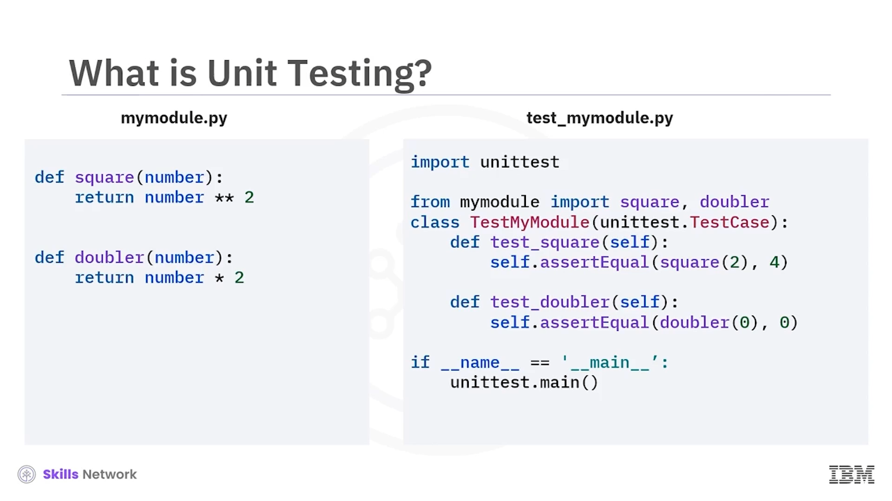

# 🧪 Unit Testing

Unit Testing'e hoş geldiniz.

Bu videoyu izledikten sonra şunları yapabileceksiniz:

* Unit testing'i tanımlamak
* Unit test sürecini açıklamak
* Unit testleri oluşturmak ve çalıştırmak
* Bir unit testin çıktısını incelemek

---

## 🧩 Unit testing ve *unit* kavramı

Unit testing, kod birimlerinin tasarlandığı gibi çalışıp çalışmadığını doğrulama yöntemidir.

Bir  *unit* , bir uygulamanın daha küçük, test edilebilir bir parçasıdır.

Bir *unit* örneği olarak, `mymodule.py` dosyasında `square` ve `doubler` adlı iki fonksiyon bulunur.

`square` fonksiyonu şu şekilde yazılmıştır:

`def square(number):return number ** 2`

Benzer şekilde, `doubler` fonksiyonunun kodu `def doubler(number):return number * 2` olarak yazılır.

Unit testleri geliştirmek için, test işlevselliği içeren bir çerçeve sağlayan, yüklü bir Python modülü olan *unit test* kütüphanesini kullanacaksınız.

---

## 🔁 Uçtan uca unit test süreci

Unit testing'den, üretim ( *production* ) kod tabanına yayınlamaya kadar uçtan uca test sürecini kısaca gözden geçirelim.

Kod geliştirme sırasında her bir *unit* test edilir. Test iki aşamada gerçekleştirilir.

İlk aşamada, *unit* yerel ( *local* ) sisteminizde test edilir. Test başarısız olursa, hatanın nedenini belirlersiniz ve sorunu düzeltirsiniz. Sonra, *unit*i tekrar test edersiniz.

Unit test başarılı olduktan sonra, *unit*i Sürekli Entegrasyon Sürekli Teslim (*Continuous Integration Continuous Delivery* veya  *CICD* ) test sunucusu gibi bir sunucu ortamında test etmeniz gerekir.

Eğer  *unit* , sunucu testinde başarısız olursa, hata ayrıntılarını alırsınız. Sorunu belirlemeniz ve düzeltmeniz gerekir.

*Unit* sunucu testinden geçtiğinde, son kod tabanına entegre edilir.

---

## 🗂️ Modül ve test dosyalarının adlandırılması

Unit test sürecine genel bir bakış yaptıktan sonra, unit testlerin nasıl oluşturulacağını anlamak için bazı test fonksiyonlarını inceleyelim.

*Unit* ve unit test için yazılan koda dikkat edin. *Unit* dosyasının adının `mymodule.py` olduğuna dikkat edin.

Unit test dosyasına `test` sözcüğü ya başına eklenir ya sonuna eklenir. Bu, unit dosyasını unit test dosyasından açıkça ayırt etmeye yardımcı olduğu için iyi bir adlandırma kuralıdır.

---

## 🏗️ Unit test dosyası ve sınıfı oluşturma

Bir unit test dosyası oluşturmanın adımlarına bakalım.

İlk adım, Python *unit test* kütüphanesini içe aktarmaktır.

`import unit test` yazın.

Sonra, test edilecek fonksiyonları içe aktarın.

Örneğin, `mymodule` *unit*inden `square` ve `doubler` fonksiyonlarını unit test'e içe aktarmak için

`from mymodule import square, doubler` yazın.

Daha sonra, unit testi tek bir sınıf nesnesinden ( *class object* ) çağırmak için unit testing sınıfını oluşturun.

Örneğin, `TestMyModule` adlı bir sınıf oluşturmak için, ilk geçtiği yerde büyük T ile  *test* , büyük M ile  *my* , büyük M ile  *module* ,  *unit test* , nokta ve T ve C büyük olacak şekilde *test case* yazın.

Örnekte, sınıf adında *unit* adının önüne `test` eklendiğine dikkat edin. Unit sınıfı ile unit test sınıfını ayırt etmeye yardımcı olması için sınıf adının başına `test` eklemek iyi bir adlandırma kuralıdır.

Sonra, sınıfın unit test kütüphanesinin *test case* sınıfından kalıtım almasını sağlayın. Örneğin,  *test case* , unit test kütüphanesinin *test case* sınıfıdır.

Bu sınıftan kalıtım almak, *test case* sınıfındaki mevcut metotlardan yararlanmanızı sağlar.

Ardından, test edilmesi gereken her bir fonksiyona karşılık gelen fonksiyonları unit testing sınıfı içinde oluşturun.

Örneğin, `TestMyModule` sınıfında `test square` ve `test doubler` adlı iki fonksiyon, `mymodule` *unit*indeki `square` ve `doubler` fonksiyonlarına karşılık gelir.

Dikkat edin, unit test modülünde fonksiyonların başına `test` eklendiğinden emin olun, çünkü yalnızca `test` ile başlayan fonksiyonlar çalıştırılır.

---

## ✅ Test case'ler ve `assertEqual` kullanımı

Son olarak, test *case*lerini oluşturabilirsiniz.

Test *case*lerini oluştururken, unit test koşulunun sağlandığından emin olmak için bir veya daha fazla *assertion* metodu ekleyin.

Bu *assertion* fonksiyonlarından biri `assertEqual`'dır. Bu metodun, kodda *test case* sınıfına eklendiğine dikkat edin.

`assertEqual` fonksiyonu iki değeri veya varlığı karşılaştırır ve eşit olup olmadıklarını belirler. Bu metod, fonksiyonların doğru değerleri döndürüp döndürmediğini kontrol etmek için kullanılır.

`assertEqual` fonksiyonunun aldığı parametrelerden biri  *actual value* 'dur. *Actual value* için, test etmek istediğiniz fonksiyonu çağırırsınız.

İkinci parametre ise fonksiyonun döndürmesinin beklendiği değeri eklediğiniz  *expected value* 'dur.

Örnekte, ilk test `square` fonksiyonu içindir ve 2 sayısı kullanılır; fonksiyon doğru çalışırsa 4 değerini döndürmelidir.

Testin bir parçası olarak, önce fonksiyon değerlendirilir. Sonra, iki değerin eşit olup olmadığını görmek için karşılaştırılır.

Karşılaştırmanın çıktısına bağlı olarak test geçer ya da kalır.

---

## 📄 Test çıktıları: başarılı ve başarısız örnekler

Test dosyasını çalıştırdıktan sonra bir çıktı üretilir. Çıktı, test sonuçlarını bazı ek ayrıntılarla birlikte gösterir.

Örneğin, çıktı 0 saniyede iki testin çalıştırıldığını gösteriyorsa, `OK` ifadesi testin geçtiğini ve iki fonksiyonun da doğru şekilde uygulandığını belirtir.

Peki, fonksiyon doğru şekilde uygulanmamışsa ne olur?

Bir sayının karesini almak yerine küpünü hesaplayan kodu yazdığınız `square` fonksiyonunu düşünün. Fonksiyon başarısız olur ve bir çıktı üretilir.

Başarısız bir unit testin örnek çıktısını inceleyelim. Çıktı, unit testin başarısız olduğunu açıkça gösterir.

Örneğin, çıktı `Fail:test_square(_main_.TestMyModule)` der.

Ayrıca unit testin hangi fonksiyonda başarısız olduğunu da görebilirsiniz. Örneğin, `test_square` fonksiyonunda `self.assertEqual(square(2), 4)`  *assertion* 'ı başarısız olmuştur.

8, 4'e eşit olmadığı için bir *assertion error* meydana gelmiştir.

Ayrıntılı çıktı, çözümünüzü gerçekten dağıtmadan ( *deployment* ) önce bir hatayı düzeltmenizi sağlar.

---

## 📚 Videodaki ana noktalar

Bu videoda şunları öğrendiniz:

* Unit testing, kod birimlerinin tasarlandığı gibi çalışıp çalışmadığını doğrulama yöntemidir.
* Kod geliştirme sırasında her bir *unit* test edilir.
* *Unit* iki aşamada test edilir.
* *Unit* sunucu testini geçtikten sonra, son kod tabanına birleştirilir ( *merge edilir* ).
* Test dosyalarının, modül dosyasından açıkça ayırt edilebilmeleri için başına ya da sonuna `test` sözcüğünün eklendiğinden emin olun.
* Unit testler oluşturmak için farklı test fonksiyonları kullanabilirsiniz.
* `assertEqual` fonksiyonu, iki değeri karşılaştırmak için yaygın olarak kullanılan bir *assertion* metodudur.
* Unit test çıktısını inceleyerek testin geçip geçmediğini belirleyebilirsiniz.
